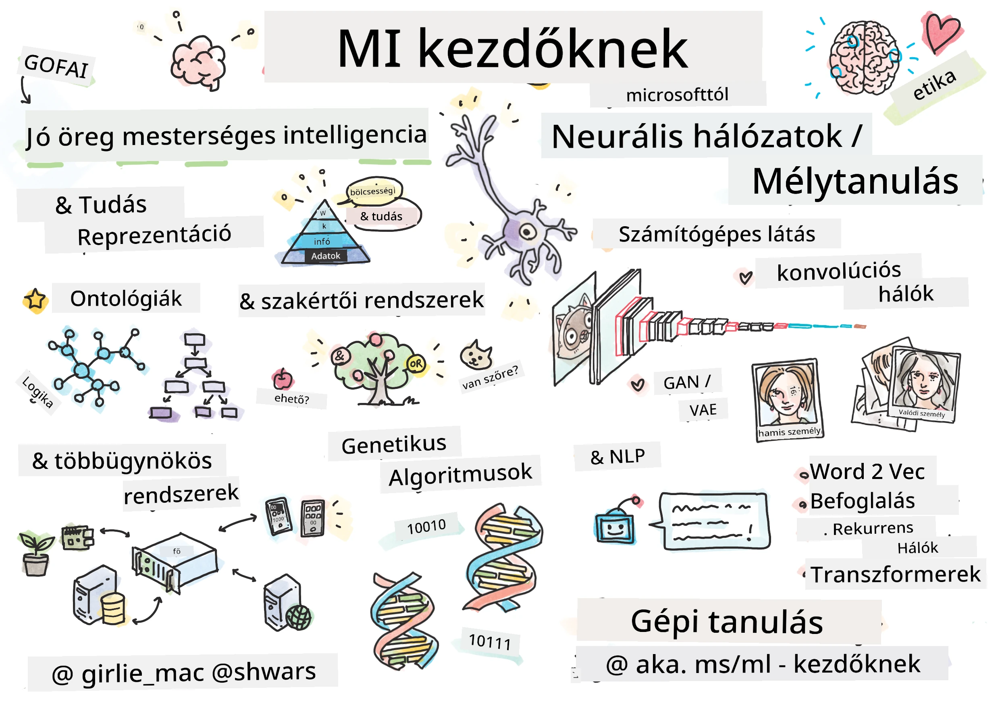

[](https://github.com/microsoft/AI-For-Beginners/blob/main/LICENSE)
[](https://GitHub.com/microsoft/AI-For-Beginners/graphs/contributors/)
[](https://GitHub.com/microsoft/AI-For-Beginners/issues/)
[](https://GitHub.com/microsoft/AI-For-Beginners/pulls/)
[](http://makeapullrequest.com)

[](https://GitHub.com/microsoft/AI-For-Beginners/watchers/)
[](https://GitHub.com/microsoft/AI-For-Beginners/network/)
[](https://GitHub.com/microsoft/AI-For-Beginners/stargazers/)
[](https://mybinder.org/v2/gh/microsoft/ai-for-beginners/HEAD)
[](https://gitter.im/Microsoft/ai-for-beginners?utm_source=badge&utm_medium=badge&utm_campaign=pr-badge)

[](https://discord.gg/nTYy5BXMWG)

# Mesterséges intelligencia kezdőknek - Egy tananyag

||
|:---:|
| AI kezdőknek - _Sketchnote [@girlie_mac](https://twitter.com/girlie_mac) tollából_ |

Fedezd fel a **Mesterséges Intelligencia** (AI) világát 12 hetes, 24 leckéből álló tananyagunkkal! Gyakorlati leckéket, kvízeket és laborokat tartalmaz. A tananyag kezdők számára is barátságos, és lefedi a TensorFlow és PyTorch eszközök használatát, valamint az AI etikai kérdéseit.

### 🌐 Többnyelvű támogatás

#### GitHub Action segítségével támogatott (Automatizált és mindig naprakész)

<!-- CO-OP TRANSLATOR LANGUAGES TABLE START -->
[Arab](../ar/README.md) | [Bengáli](../bn/README.md) | [Bolgár](../bg/README.md) | [Burmai (Myanmar)](../my/README.md) | [Kínai (egyszerűsített)](../zh-CN/README.md) | [Kínai (hagyományos, Hongkong)](../zh-HK/README.md) | [Kínai (hagyományos, Makaó)](../zh-MO/README.md) | [Kínai (hagyományos, Tajvan)](../zh-TW/README.md) | [Horvát](../hr/README.md) | [Cseh](../cs/README.md) | [Dán](../da/README.md) | [Holland](../nl/README.md) | [Észt](../et/README.md) | [Finn](../fi/README.md) | [Francia](../fr/README.md) | [Német](../de/README.md) | [Görög](../el/README.md) | [Héber](../he/README.md) | [Hindi](../hi/README.md) | [Magyar](./README.md) | [Indonéz](../id/README.md) | [Olasz](../it/README.md) | [Japán](../ja/README.md) | [Kannada](../kn/README.md) | [Koreai](../ko/README.md) | [Litván](../lt/README.md) | [Maláj](../ms/README.md) | [Malayalam](../ml/README.md) | [Marathi](../mr/README.md) | [Nepáli](../ne/README.md) | [Nigériai Pidgin](../pcm/README.md) | [Norvég](../no/README.md) | [Perzsa (Farsi)](../fa/README.md) | [Lengyel](../pl/README.md) | [Portugál (Brazília)](../pt-BR/README.md) | [Portugál (Portugália)](../pt-PT/README.md) | [Pandzsábi (Gurmukhi)](../pa/README.md) | [Román](../ro/README.md) | [Orosz](../ru/README.md) | [Szerb (cirill)](../sr/README.md) | [Szlovák](../sk/README.md) | [Szlovén](../sl/README.md) | [Spanyol](../es/README.md) | [Szuahéli](../sw/README.md) | [Svéd](../sv/README.md) | [Tagalog (Filippínó)](../tl/README.md) | [Tamil](../ta/README.md) | [Telugu](../te/README.md) | [Thai](../th/README.md) | [Török](../tr/README.md) | [Ukrán](../uk/README.md) | [Urdu](../ur/README.md) | [Vietnami](../vi/README.md)

> **Inkább helyileg klónozza?**

> Ez a tároló több mint 50 nyelvű fordítást tartalmaz, ami jelentősen megnöveli a letöltési méretet. Ha fordítások nélkül szeretnéd klónozni, használd a sparse checkout-ot:
> ```bash
> git clone --filter=blob:none --sparse https://github.com/microsoft/AI-For-Beginners.git
> cd AI-For-Beginners
> git sparse-checkout set --no-cone '/*' '!translations' '!translated_images'
> ```
> Így mindent megkapsz a tananyag elvégzéséhez, gyorsabb letöltéssel.
<!-- CO-OP TRANSLATOR LANGUAGES TABLE END -->

**Ha további fordítási nyelvek támogatását szeretnéd, azok itt találhatóak: [itt](https://github.com/Azure/co-op-translator/blob/main/getting_started/supported-languages.md)**

## Csatlakozz a közösséghez
[](https://discord.gg/nTYy5BXMWG)

## Mit fogsz megtanulni

**[A tanfolyam gondolattérképe](http://soshnikov.com/courses/ai-for-beginners/mindmap.html)**

Ebben a tananyagban megtanulod:

* A mesterséges intelligencia különböző megközelítéseit, beleértve a "régi jó" szimbolikus megközelítést **tudásreprezentációval** és következtetéssel ([GOFAI](https://en.wikipedia.org/wiki/Symbolic_artificial_intelligence)).
* A **neurális hálózatok** és a **mélytanulás** alapjait, amelyek a modern AI magját képezik. Ezeket a fontos témákat kettő, legnépszerűbb keretrendszerben, a [TensorFlow](http://Tensorflow.org) és [PyTorch](http://pytorch.org) segítségével illusztráljuk.
* A képek és szövegek kezelésére alkalmas **neurális architektúrákat**. Lefedjük a legfrissebb modelleket, de lehet, hogy egy kicsit elmaradunk a legfrissebb állapotoktól.
* Kevésbé népszerű AI megközelítéseket, mint például a **genetikus algoritmusok** és a **többügynökös rendszerek**.

Amit ebben a tananyagban nem fogunk érinteni:

> [Minden további anyagot megtalálsz a tanfolyam Microsoft Learn kollekciójában](https://learn.microsoft.com/en-us/collections/7w28iy2xrqzdj0?WT.mc_id=academic-77998-bethanycheum)

* Az **AI üzleti felhasználását** érintő üzleti eseteket. Érdemes lehet megnézni a [Bevezetés az üzleti felhasználóknak szóló AI-ba](https://docs.microsoft.com/learn/paths/introduction-ai-for-business-users/?WT.mc_id=academic-77998-bethanycheum) tanulási útvonalat a Microsoft Learn-en, vagy az [AI Business School](https://www.microsoft.com/ai/ai-business-school/?WT.mc_id=academic-77998-bethanycheum) programot, amelyet az [INSEAD](https://www.insead.edu/) közreműködésével fejlesztettek ki.
* A **klasszikus gépi tanulást**, amelyet részletesen leírunk a [Gépi tanulás kezdőknek tananyagunkban](http://github.com/Microsoft/ML-for-Beginners).
* Gyakorlati AI alkalmazásokat, melyeket a **[Kognitív Szolgáltatások](https://azure.microsoft.com/services/cognitive-services/?WT.mc_id=academic-77998-bethanycheum)** segítségével készítettek. Ehhez ajánljuk a Microsoft Learn modulokat, például a [személyfelismerés](https://docs.microsoft.com/learn/paths/create-computer-vision-solutions-azure-cognitive-services/?WT.mc_id=academic-77998-bethanycheum), [természetes nyelvfeldolgozás](https://docs.microsoft.com/learn/paths/explore-natural-language-processing/?WT.mc_id=academic-77998-bethanycheum), **[generatív AI az Azure OpenAI szolgáltatással](https://learn.microsoft.com/en-us/training/paths/develop-ai-solutions-azure-openai/?WT.mc_id=academic-77998-bethanycheum)** és egyéb területeken.
* Specifikus ML **felhőalapú keretrendszereket**, mint például az [Azure Machine Learning](https://azure.microsoft.com/services/machine-learning/?WT.mc_id=academic-77998-bethanycheum), [Microsoft Fabric](https://learn.microsoft.com/en-us/training/paths/get-started-fabric/?WT.mc_id=academic-77998-bethanycheum), vagy az [Azure Databricks](https://docs.microsoft.com/learn/paths/data-engineer-azure-databricks?WT.mc_id=academic-77998-bethanycheum). Érdemes használni a [Gépi tanulási megoldások építése és üzemeltetése Azure Machine Learninggel](https://docs.microsoft.com/learn/paths/build-ai-solutions-with-azure-ml-service/?WT.mc_id=academic-77998-bethanycheum) és [Gépi tanulási megoldások építése és üzemeltetése Azure Databricks segítségével](https://docs.microsoft.com/learn/paths/build-operate-machine-learning-solutions-azure-databricks/?WT.mc_id=academic-77998-bethanycheum) tanulási útvonalakat.
* **Konverzációs AI-t** és **chatbotokat**. Van egy különálló [Konverzációs AI megoldások létrehozása](https://docs.microsoft.com/learn/paths/create-conversational-ai-solutions/?WT.mc_id=academic-77998-bethanycheum) tanulási útvonal, és további részletekért ajánlott ez a [blogbejegyzés](https://soshnikov.com/azure/hello-bot-conversational-ai-on-microsoft-platform/).
* A mélytanulás mögötti **mély matematikát**. Ehhez ajánljuk Ian Goodfellow, Yoshua Bengio és Aaron Courville [Deep Learning](https://www.amazon.com/Deep-Learning-Adaptive-Computation-Machine/dp/0262035618) című könyvét, amely online is elérhető a [https://www.deeplearningbook.org/](https://www.deeplearningbook.org/) oldalon.

Az _AI a felhőben_ témakörből lágy bevezetőként érdemes a [Mesterséges intelligencia kezdőknek az Azure-on](https://docs.microsoft.com/learn/paths/get-started-with-artificial-intelligence-on-azure/?WT.mc_id=academic-77998-bethanycheum) tanulási útvonalat választani.

# Tartalom

|     |                                                                 Lecke link                                                                  |                                           PyTorch/Keras/TensorFlow                                          | Labor                                                          |
| :-: | :-------------------------------------------------------------------------------------------------------------------------------------------: | :------------------------------------------------------------------------------------------------------: | ------------------------------------------------------------------ |
| 0  |                                 [Tanfolyam Beállítása](./lessons/0-course-setup/setup.md)                                 |                      [Fejlesztői környezet beállítása](./lessons/0-course-setup/how-to-run.md)                       |   |
| I  |               [**Bevezetés az AI-ba**](./lessons/1-Intro/README.md)      | | |
| 01  |       [AI bevezetése és története](./lessons/1-Intro/README.md)       |           -                            | -  |
| II |              **Szimbolikus AI**              |
| 02  |       [Tudásreprezentáció és szakértői rendszerek](./lessons/2-Symbolic/README.md)       |            [Szakértői rendszerek](./lessons/2-Symbolic/Animals.ipynb) /  [Ontológia](./lessons/2-Symbolic/FamilyOntology.ipynb) /[Fogalomgráf](./lessons/2-Symbolic/MSConceptGraph.ipynb)                             |  |
| III |                        [**Bevezetés a neuronhálókba**](./lessons/3-NeuralNetworks/README.md) |||
| 03  |                [Perceptron](./lessons/3-NeuralNetworks/03-Perceptron/README.md)                 |                       [Jegyzetfüzet](./lessons/3-NeuralNetworks/03-Perceptron/Perceptron.ipynb)                      | [Labor](./lessons/3-NeuralNetworks/03-Perceptron/lab/README.md) |
| 04  |                   [Többrétegű perceptron és saját keretrendszer készítése](./lessons/3-NeuralNetworks/04-OwnFramework/README.md)                   |        [Jegyzetfüzet](./lessons/3-NeuralNetworks/04-OwnFramework/OwnFramework.ipynb)        | [Labor](./lessons/3-NeuralNetworks/04-OwnFramework/lab/README.md) |
| 05  |            [Bevezetés a keretrendszerekhez (PyTorch/TensorFlow) és túltanulás](./lessons/3-NeuralNetworks/05-Frameworks/README.md)             |           [PyTorch](./lessons/3-NeuralNetworks/05-Frameworks/IntroPyTorch.ipynb) / [Keras](./lessons/3-NeuralNetworks/05-Frameworks/IntroKeras.ipynb) / [TensorFlow](./lessons/3-NeuralNetworks/05-Frameworks/IntroKerasTF.ipynb)             | [Labor](./lessons/3-NeuralNetworks/05-Frameworks/lab/README.md) |
| IV  |            [**Számítógépes látás**](./lessons/4-ComputerVision/README.md)             | [PyTorch](https://docs.microsoft.com/learn/modules/intro-computer-vision-pytorch/?WT.mc_id=academic-77998-cacaste) / [TensorFlow](https://docs.microsoft.com/learn/modules/intro-computer-vision-TensorFlow/?WT.mc_id=academic-77998-cacaste)| [Fedezd fel a számítógépes látást a Microsoft Azure-en](https://learn.microsoft.com/en-us/collections/7w28iy2xrqzdj0?WT.mc_id=academic-77998-bethanycheum) |
| 06  |            [Bevezetés a számítógépes látásba. OpenCV](./lessons/4-ComputerVision/06-IntroCV/README.md)             |           [Jegyzetfüzet](./lessons/4-ComputerVision/06-IntroCV/OpenCV.ipynb)         | [Labor](./lessons/4-ComputerVision/06-IntroCV/lab/README.md) |
| 07  |            [Konvolúciós neuronhálók](./lessons/4-ComputerVision/07-ConvNets/README.md) &  [CNN architektúrák](./lessons/4-ComputerVision/07-ConvNets/CNN_Architectures.md)             |           [PyTorch](./lessons/4-ComputerVision/07-ConvNets/ConvNetsPyTorch.ipynb) /[TensorFlow](./lessons/4-ComputerVision/07-ConvNets/ConvNetsTF.ipynb)             | [Labor](./lessons/4-ComputerVision/07-ConvNets/lab/README.md) |
| 08  |            [Előre betanított hálók és átvivő tanulás](./lessons/4-ComputerVision/08-TransferLearning/README.md) és [Tanítási trükkök](./lessons/4-ComputerVision/08-TransferLearning/TrainingTricks.md)             |           [PyTorch](./lessons/4-ComputerVision/08-TransferLearning/TransferLearningPyTorch.ipynb) / [TensorFlow](./lessons/3-NeuralNetworks/05-Frameworks/IntroKerasTF.ipynb)             | [Labor](./lessons/4-ComputerVision/08-TransferLearning/lab/README.md) |
| 09  |            [Autoenkódolók és VAE-k](./lessons/4-ComputerVision/09-Autoencoders/README.md)             |           [PyTorch](./lessons/4-ComputerVision/09-Autoencoders/AutoEncodersPyTorch.ipynb) / [TensorFlow](./lessons/4-ComputerVision/09-Autoencoders/AutoencodersTF.ipynb)             |  |
| 10  |            [Generatív adversariális hálók és művészi stílusátvitel](./lessons/4-ComputerVision/10-GANs/README.md)             |           [PyTorch](./lessons/4-ComputerVision/10-GANs/GANPyTorch.ipynb) / [TensorFlow](./lessons/4-ComputerVision/10-GANs/GANTF.ipynb)             |  |
| 11  |            [Objektumfelismerés](./lessons/4-ComputerVision/11-ObjectDetection/README.md)             |         [TensorFlow](./lessons/4-ComputerVision/11-ObjectDetection/ObjectDetection.ipynb)             | [Labor](./lessons/4-ComputerVision/11-ObjectDetection/lab/README.md) |
| 12  |            [Szemantikus szegmentáció. U-Net](./lessons/4-ComputerVision/12-Segmentation/README.md)             |           [PyTorch](./lessons/4-ComputerVision/12-Segmentation/SemanticSegmentationPytorch.ipynb) / [TensorFlow](./lessons/4-ComputerVision/12-Segmentation/SemanticSegmentationTF.ipynb)             |  |
| V  |            [**Természetes nyelvfeldolgozás**](./lessons/5-NLP/README.md)             | [PyTorch](https://docs.microsoft.com/learn/modules/intro-natural-language-processing-pytorch/?WT.mc_id=academic-77998-cacaste) /[TensorFlow](https://docs.microsoft.com/learn/modules/intro-natural-language-processing-TensorFlow/?WT.mc_id=academic-77998-cacaste) | [Fedezd fel a természetes nyelvfeldolgozást a Microsoft Azure-en](https://learn.microsoft.com/en-us/collections/7w28iy2xrqzdj0?WT.mc_id=academic-77998-bethanycheum)|
| 13  |            [Szöveg reprezentációja. BoW/TF-IDF](./lessons/5-NLP/13-TextRep/README.md)             |           [PyTorch](https://github.com/microsoft/AI-For-Beginners/blob/main/lessons/5-NLP/13-TextRep/TextRepresentationPyTorch.ipynb) / [TensorFlow](https://github.com/microsoft/AI-For-Beginners/blob/main/lessons/5-NLP/13-TextRep/TextRepresentationTF.ipynb)             | |
| 14  |            [Szemantikus szóbeágyazások. Word2Vec és GloVe](./lessons/5-NLP/14-Embeddings/README.md)             |           [PyTorch](https://github.com/microsoft/AI-For-Beginners/blob/main/lessons/5-NLP/14-Embeddings/EmbeddingsPyTorch.ipynb) / [TensorFlow](https://github.com/microsoft/AI-For-Beginners/blob/main/lessons/5-NLP/14-Embeddings/EmbeddingsTF.ipynb)             |  |
| 15  |            [Nyelvi modellezés. Saját beágyazások tanítása](./lessons/5-NLP/15-LanguageModeling/README.md)             |           [PyTorch](https://github.com/microsoft/AI-For-Beginners/blob/main/lessons/5-NLP/15-LanguageModeling/CBoW-PyTorch.ipynb) / [TensorFlow](https://github.com/microsoft/AI-For-Beginners/blob/main/lessons/5-NLP/15-LanguageModeling/CBoW-TF.ipynb)             | [Labor](./lessons/5-NLP/15-LanguageModeling/lab/README.md) |
| 16  |            [Rekurzív neuronhálók](./lessons/5-NLP/16-RNN/README.md)             |           [PyTorch](https://github.com/microsoft/AI-For-Beginners/blob/main/lessons/5-NLP/16-RNN/RNNPyTorch.ipynb) / [TensorFlow](https://github.com/microsoft/AI-For-Beginners/blob/main/lessons/5-NLP/16-RNN/RNNTF.ipynb)             |  |
| 17  |            [Generatív rekurzív hálók](./lessons/5-NLP/17-GenerativeNetworks/README.md)             |           [PyTorch](https://github.com/microsoft/AI-For-Beginners/blob/main/lessons/5-NLP/17-GenerativeNetworks/GenerativePyTorch.ipynb) / [TensorFlow](https://github.com/microsoft/AI-For-Beginners/blob/main/lessons/5-NLP/17-GenerativeNetworks/GenerativeTF.ipynb)             | [Labor](./lessons/5-NLP/17-GenerativeNetworks/lab/README.md) |
| 18  |            [Transformerek. BERT.](./lessons/5-NLP/18-Transformers/README.md)             |           [PyTorch](https://github.com/microsoft/AI-For-Beginners/blob/main/lessons/5-NLP/18-Transformers/TransformersPyTorch.ipynb) /[TensorFlow](https://github.com/microsoft/AI-For-Beginners/blob/main/lessons/5-NLP/18-Transformers/TransformersTF.ipynb)             |  |
| 19  |            [Név szerinti entitásfelismerés](./lessons/5-NLP/19-NER/README.md)             |           [TensorFlow](https://microsoft.github.io/AI-For-Beginners/lessons/5-NLP/19-NER/NER-TF.ipynb)             | [Labor](./lessons/5-NLP/19-NER/lab/README.md) |
| 20  |            [Nagy nyelvi modellek, prompt programozás és kevés mintás feladatok](./lessons/5-NLP/20-LangModels/README.md)             |           [PyTorch](https://microsoft.github.io/AI-For-Beginners/lessons/5-NLP/20-LangModels/GPT-PyTorch.ipynb) | |
| VI |            **Egyéb MI technikák** || |
| 21  |            [Genetikus algoritmusok](./lessons/6-Other/21-GeneticAlgorithms/README.md)             |           [Jegyzetfüzet](./lessons/6-Other/21-GeneticAlgorithms/Genetic.ipynb) | |
| 22  |            [Mély megerősítéses tanulás](./lessons/6-Other/22-DeepRL/README.md)             |           [PyTorch](./lessons/6-Other/22-DeepRL/CartPole-RL-PyTorch.ipynb) /[TensorFlow](./lessons/6-Other/22-DeepRL/CartPole-RL-TF.ipynb)             | [Labor](./lessons/6-Other/22-DeepRL/lab/README.md) |
| 23  |            [Több ügynökös rendszerek](./lessons/6-Other/23-MultiagentSystems/README.md)             |  | |
| VII |            **MI etika** | | |
| 24  |            [MI etika és felelős MI](./lessons/7-Ethics/README.md)             |           [Microsoft Learn: Felelős MI alapelvek](https://docs.microsoft.com/learn/paths/responsible-ai-business-principles/?WT.mc_id=academic-77998-cacaste) | |
| IX  |            **Extrák** | | |
| 25  |            [Multimodális hálók, CLIP és VQGAN](./lessons/X-Extras/X1-MultiModal/README.md)             |           [Jegyzetfüzet](./lessons/X-Extras/X1-MultiModal/Clip.ipynb)    | |

## Minden leckében található

* Előolvasmány anyag
* Futtatható Jupyter jegyzetfüzetek, melyek gyakran a keretrendszerhez kötöttek (**PyTorch** vagy **TensorFlow**). A futtatható jegyzetfüzet sok elméleti anyagot is tartalmaz, így a téma megértéséhez legalább az egyik verziót végig kell járni (vagy PyTorch, vagy TensorFlow).
* Egyes témákhoz **Laboratóriumi gyakorlatok** is elérhetők, melyek lehetőséget adnak, hogy a tanultakat konkrét problémákra alkalmazd.
* Néhány szakaszban találsz hivatkozásokat [**MS Learn**](https://learn.microsoft.com/en-us/collections/7w28iy2xrqzdj0?WT.mc_id=academic-77998-bethanycheum) modulokra, melyek kapcsolódó témákat fednek le.

## Kezdjük el

### 🎯 Új vagy az MI-ben? Itt kezdj!

Ha teljesen új vagy az MI-ben és gyors, gyakorlati példákat keresel, nézd meg a [**Kezdőbarát példák**](./examples/README.md) gyűjteményünket! Ezek tartalmazzák:

- 🌟 **Hello MI Világ** - az első MI programod (minta felismerés)  
- 🧠 **Egyszerű neuronháló** - neurális háló felépítése a semmiből  

- 🖼️ **Kép Osztályozó** - Osztályozd a képeket részletes megjegyzésekkel
- 💬 **Szöveg Hangulat** - Elemezd a pozitív/negatív szöveget

Ezek a példák segítenek megérteni az MI koncepciókat, mielőtt belevágsz a teljes tananyagba.

### 📚 Teljes Tananyag Beállítása

- Létrehoztunk egy [beállító leckét](./lessons/0-course-setup/setup.md), hogy segítsünk a fejlesztési környezet beállításában. - Oktatóknak létrehoztunk egy [tananyag beállító leckét](./lessons/0-course-setup/for-teachers.md) is!
- Hogyan [futtasd a kódot VSCode-ban vagy Codespace-ben](./lessons/0-course-setup/how-to-run.md)

Kövesd ezeket a lépéseket:

Forkold a Tárolót: Kattints a "Fork" gombra ennek az oldalnak a jobb felső sarkában.

Klónozd a Tárolót: `git clone https://github.com/microsoft/AI-For-Beginners.git`

Ne felejtsd el megcsillagozni (🌟) ezt a repo-t, hogy könnyebben megtaláld később.

## Találkozz Más Tanulókkal

Csatlakozz hivatalos [AI Discord szerverünkhöz](https://aka.ms/genai-discord?WT.mc_id=academic-105485-bethanycheum), hogy találkozz és kapcsolatot építs a kurzust végző többi tanulóval, valamint segítséget kapj.

Ha visszajelzésed vagy kérdésed van a termékkel kapcsolatban tanulás közben, látogasd meg [Azure AI Foundry Fejlesztői Fórumunkat](https://aka.ms/foundry/forum)

## Kvízek

> **Megjegyzés a kvízekről**: Minden kvíz a Quiz-app mappában található az etc\quiz-app könyvtárban, vagy [Online Itt](https://ff-quizzes.netlify.app/) A leckékből hivatkozottak, a kvíz app helyben is futtatható, vagy Azure-ra telepíthető; kövesd a `quiz-app` mappában található utasításokat. Fokozatosan lokalizáljuk őket.

## Segítséget Kérünk

Van javaslatod, vagy találtál helyesírási vagy kód hibákat? Nyiss egy issue-t vagy hozz létre egy pull request-et.

## Külön Köszönet

* **✍️ Fő Szerző:** [Dmitry Soshnikov](http://soshnikov.com), PhD
* **🔥 Szerkesztő:** [Jen Looper](https://twitter.com/jenlooper), PhD
* **🎨 Sketchnote illusztrátor:** [Tomomi Imura](https://twitter.com/girlie_mac)
* **✅ Kvíz Készítő:** [Lateefah Bello](https://github.com/CinnamonXI), [MLSA](https://studentambassadors.microsoft.com/)
* **🙏 Fő Közreműködők:** [Evgenii Pishchik](https://github.com/Pe4enIks)

## Egyéb Tananyagok

Csapatunk további tananyagokat is készít! Nézd meg:

<!-- CO-OP TRANSLATOR OTHER COURSES START -->
### LangChain
[](https://aka.ms/langchain4j-for-beginners)
[](https://aka.ms/langchainjs-for-beginners?WT.mc_id=m365-94501-dwahlin)
[](https://github.com/microsoft/langchain-for-beginners?WT.mc_id=m365-94501-dwahlin)
---

### Azure / Edge / MCP / Ügynökök
[](https://github.com/microsoft/AZD-for-beginners?WT.mc_id=academic-105485-koreyst)
[](https://github.com/microsoft/edgeai-for-beginners?WT.mc_id=academic-105485-koreyst)
[](https://github.com/microsoft/mcp-for-beginners?WT.mc_id=academic-105485-koreyst)
[](https://github.com/microsoft/ai-agents-for-beginners?WT.mc_id=academic-105485-koreyst)

---
 
### Generatív MI Sorozat
[](https://github.com/microsoft/generative-ai-for-beginners?WT.mc_id=academic-105485-koreyst)
[-9333EA?style=for-the-badge&labelColor=E5E7EB&color=9333EA)](https://github.com/microsoft/Generative-AI-for-beginners-dotnet?WT.mc_id=academic-105485-koreyst)
[-C084FC?style=for-the-badge&labelColor=E5E7EB&color=C084FC)](https://github.com/microsoft/generative-ai-for-beginners-java?WT.mc_id=academic-105485-koreyst)
[-E879F9?style=for-the-badge&labelColor=E5E7EB&color=E879F9)](https://github.com/microsoft/generative-ai-with-javascript?WT.mc_id=academic-105485-koreyst)

---
 
### Alap Tanulás
[](https://aka.ms/ml-beginners?WT.mc_id=academic-105485-koreyst)
[](https://aka.ms/datascience-beginners?WT.mc_id=academic-105485-koreyst)
[](https://aka.ms/ai-beginners?WT.mc_id=academic-105485-koreyst)
[](https://github.com/microsoft/Security-101?WT.mc_id=academic-96948-sayoung)
[](https://aka.ms/webdev-beginners?WT.mc_id=academic-105485-koreyst)
[](https://aka.ms/iot-beginners?WT.mc_id=academic-105485-koreyst)
[](https://github.com/microsoft/xr-development-for-beginners?WT.mc_id=academic-105485-koreyst)

---
 
### Copilot Sorozat
[](https://aka.ms/GitHubCopilotAI?WT.mc_id=academic-105485-koreyst)
[](https://github.com/microsoft/mastering-github-copilot-for-dotnet-csharp-developers?WT.mc_id=academic-105485-koreyst)
[](https://github.com/microsoft/CopilotAdventures?WT.mc_id=academic-105485-koreyst)
<!-- CO-OP TRANSLATOR OTHER COURSES END -->

## Segítség Kérése

Ha elakadsz vagy kérdésed van az MI alkalmazások fejlesztésével kapcsolatban, csatlakozz más tanulókhoz és tapasztalt fejlesztőkhöz MCP témájú beszélgetésekben. Ez egy támogató közösség, ahol a kérdések szívesen látottak és a tudás szabadon megosztott.

[](https://discord.gg/nTYy5BXMWG)

Ha visszajelzést vagy hibákat találsz fejlesztés közben, látogasd meg:

[](https://aka.ms/foundry/forum)

---

<!-- CO-OP TRANSLATOR DISCLAIMER START -->
**Jognyilatkozat**:
Ezt a dokumentumot a [Co-op Translator](https://github.com/Azure/co-op-translator) AI fordító szolgáltatás segítségével fordítottuk le. Bár a pontosságra törekszünk, kérjük, vegye figyelembe, hogy az automatikus fordítások hibákat vagy pontatlanságokat tartalmazhatnak. Az eredeti, anyanyelvi dokumentum tekinthető hiteles forrásnak. Kritikus információk esetén professzionális emberi fordítást javaslunk. Nem vállalunk felelősséget az ebből a fordításból eredő félreértésekért vagy félreinformálásokért.
<!-- CO-OP TRANSLATOR DISCLAIMER END -->