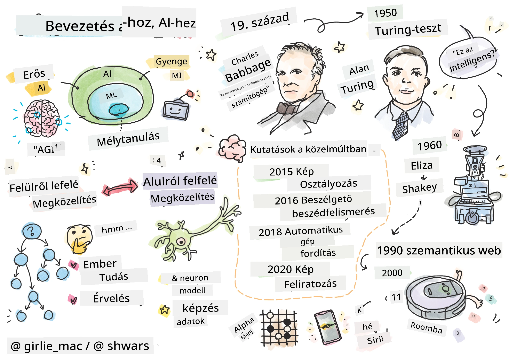
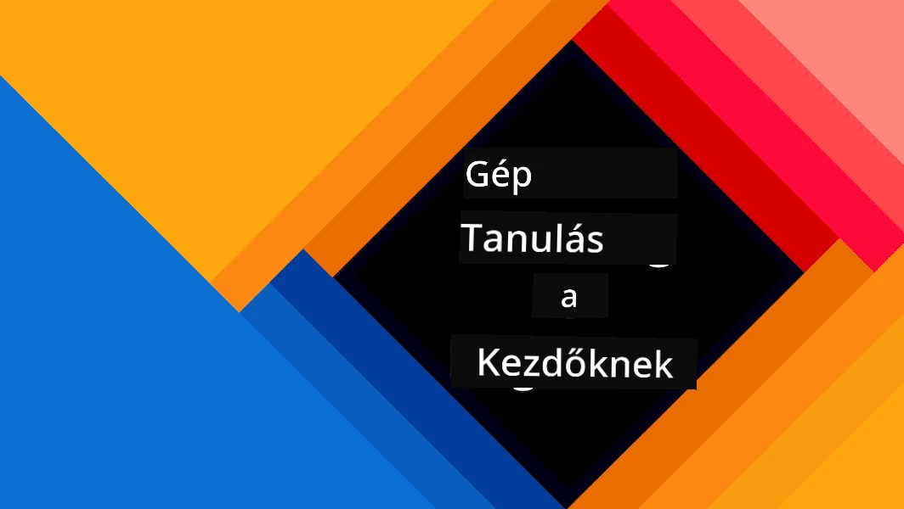
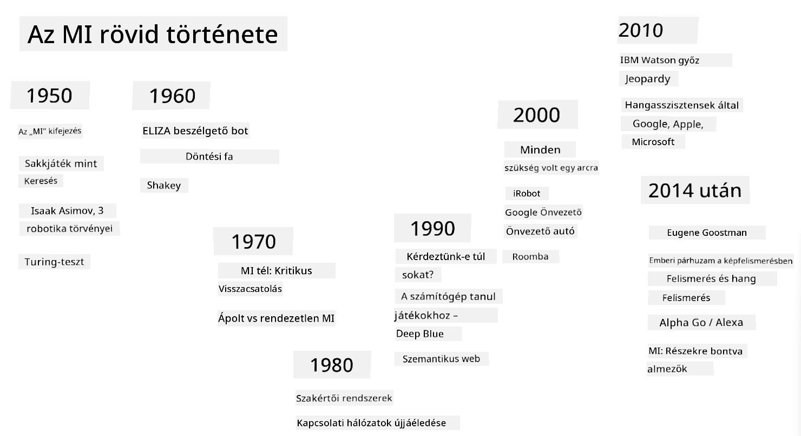

# Bevezetés a mesterséges intelligenciába

> Rajz: [Tomomi Imura](https://twitter.com/girlie_mac)

## [Előadás előtti kvíz](https://ff-quizzes.netlify.app/en/ai/quiz/1)

**Mesterséges intelligencia** egy izgalmas tudományos terület, amely azt vizsgálja, hogyan lehet számítógépeket intelligens viselkedésre bírni, például olyan dolgokra, amelyekben az emberek jók.

Eredetileg a számítógépeket [Charles Babbage](https://en.wikipedia.org/wiki/Charles_Babbage) találta fel, hogy számokkal dolgozzanak egy jól meghatározott eljárás – algoritmus – alapján. A modern számítógépek, bár jelentősen fejlettebbek, mint a 19. században javasolt eredeti modell, még mindig ugyanazt az irányított számítási elvet követik. Ezért lehetséges egy számítógépet programozni, hogy valamit elvégezzen, ha pontosan ismerjük a cél eléréséhez szükséges lépések sorrendjét.

> Fotó: [Vickie Soshnikova](http://twitter.com/vickievalerie)

> ✅ Egy személy életkorának meghatározása a fényképe alapján olyan feladat, amelyet nem lehet kifejezetten programozni, mert nem tudjuk pontosan, hogyan jutunk el egy számhoz a fejünkben, amikor ezt tesszük.

---

Vannak azonban olyan feladatok, amelyeket nem tudunk kifejezetten megoldani. Vegyük például egy személy életkorának meghatározását a fényképe alapján. Valahogy megtanuljuk ezt, mert sok példát láttunk különböző korú emberekről, de nem tudjuk pontosan megmagyarázni, hogyan csináljuk, és nem tudjuk programozni a számítógépet, hogy megtegye. Pontosan az ilyen típusú feladatok érdeklik a **mesterséges intelligenciát** (röviden MI).

✅ Gondolj néhány feladatra, amelyet számítógépre bízhatnál, és amely hasznot húzna az MI-ből. Fontold meg a pénzügyek, az orvostudomány és a művészetek területét – hogyan profitálnak ezek a területek ma az MI-ből?

## Gyenge MI vs. Erős MI

Gyenge MI | Erős MI
---------------------------------------|-------------------------------------
A gyenge MI olyan rendszerekre utal, amelyeket egy adott feladatra vagy szűk feladatkörre terveztek és képeztek ki.|Az erős MI, vagy mesterséges általános intelligencia (AGI), olyan rendszerekre utal, amelyek emberi szintű intelligenciával és megértéssel rendelkeznek.
Ezek a rendszerek nem általánosan intelligensek; kiválóan teljesítenek egy előre meghatározott feladatban, de hiányzik belőlük a valódi megértés vagy tudatosság.|Ezek a rendszerek képesek bármilyen intellektuális feladatot elvégezni, amit egy ember meg tud tenni, alkalmazkodni különböző területekhez, és rendelkeznek egyfajta tudatossággal vagy önismerettel.
A gyenge MI példái közé tartoznak a virtuális asszisztensek, mint Siri vagy Alexa, a streaming szolgáltatások ajánló algoritmusai, és az ügyfélszolgálati chatbotok.|Az erős MI elérése az MI kutatás hosszú távú célja, amelyhez olyan rendszerek fejlesztése szükséges, amelyek képesek érvelni, tanulni, megérteni és alkalmazkodni széles körű feladatokhoz és kontextusokhoz.
A gyenge MI erősen specializált, és nem rendelkezik emberi szintű kognitív képességekkel vagy általános problémamegoldó képességekkel a szűk területén kívül.|Az erős MI jelenleg elméleti koncepció, és egyetlen MI rendszer sem érte el ezt az általános intelligencia szintet.

További információért lásd **[Mesterséges általános intelligencia](https://en.wikipedia.org/wiki/Artificial_general_intelligence)** (AGI).

## Az intelligencia definíciója és a Turing-teszt

Az egyik probléma az **[intelligencia](https://en.wikipedia.org/wiki/Intelligence)** kifejezéssel kapcsolatban az, hogy nincs egyértelmű definíciója. Egyesek szerint az intelligencia kapcsolódik az **absztrakt gondolkodáshoz**, vagy az **önismerethez**, de nem tudjuk megfelelően meghatározni.

> [Fotó](https://unsplash.com/photos/75715CVEJhI) készítette [Amber Kipp](https://unsplash.com/@sadmax) az Unsplash-en

Az *intelligencia* kifejezés kétértelműségét szemléltetve próbálj meg válaszolni egy kérdésre: "Intelligens-e egy macska?". Különböző emberek hajlamosak különböző válaszokat adni erre a kérdésre, mivel nincs univerzálisan elfogadott teszt, amely bizonyítaná az állítás igazságát vagy hamisságát. És ha úgy gondolod, hogy van – próbáld meg lefuttatni a macskádat egy IQ-teszten...

✅ Gondolkodj el egy percig arról, hogyan határozod meg az intelligenciát. Intelligens-e egy varjú, amely képes megoldani egy labirintust, hogy elérje az ételt? Intelligens-e egy gyermek?

---

Amikor az AGI-ról beszélünk, szükségünk van egy módszerre, hogy megállapítsuk, valóban intelligens rendszert hoztunk-e létre. [Alan Turing](https://en.wikipedia.org/wiki/Alan_Turing) javasolt egy módszert, amelyet **[Turing-teszt](https://en.wikipedia.org/wiki/Turing_test)** néven ismerünk, és amely egyben az intelligencia definíciójaként is szolgál. A teszt összehasonlítja az adott rendszert valami eredendően intelligens dologgal – egy valódi emberrel, és mivel bármilyen automatikus összehasonlítást megkerülhet egy számítógépes program, emberi kérdezőt használunk. Tehát, ha egy ember nem képes megkülönböztetni egy valódi személyt és egy számítógépes rendszert szöveges párbeszédben – a rendszert intelligensnek tekintjük.

> Egy [Eugene Goostman](https://en.wikipedia.org/wiki/Eugene_Goostman) nevű chatbot, amelyet Szentpéterváron fejlesztettek, 2014-ben közel került a Turing-teszt teljesítéséhez egy ügyes személyiségtrükk segítségével. Előre bejelentette, hogy egy 13 éves ukrán fiú, ami megmagyarázta a tudás hiányát és néhány szövegbeli eltérést. A bot meggyőzte a bírák 30%-át arról, hogy ember, egy 5 perces párbeszéd után, egy olyan mérőszámot, amelyet Turing szerint egy gép képes lenne teljesíteni 2000-re. Azonban meg kell érteni, hogy ez nem jelenti azt, hogy intelligens rendszert hoztunk létre, vagy hogy egy számítógépes rendszer becsapta az emberi kérdezőt – nem a rendszer csapta be az embereket, hanem a bot készítői!

✅ Téged valaha becsapott egy chatbot, hogy azt hidd, emberrel beszélsz? Hogyan győzött meg?

## Különböző megközelítések az MI-hez

Ha azt akarjuk, hogy egy számítógép úgy viselkedjen, mint egy ember, valahogy modelleznünk kell a gondolkodásmódunkat a számítógépen belül. Következésképpen meg kell próbálnunk megérteni, mi teszi az embert intelligenssé.

> Ahhoz, hogy intelligenciát programozzunk egy gépbe, meg kell értenünk, hogyan működnek a saját döntéshozatali folyamataink. Ha egy kicsit önvizsgálatot végzel, rájössz, hogy vannak olyan folyamatok, amelyek tudat alatt történnek – például meg tudjuk különböztetni a macskát a kutyától anélkül, hogy gondolkodnánk rajta –, míg mások érvelést igényelnek.

Két lehetséges megközelítés létezik erre a problémára:

Felülről lefelé irányuló megközelítés (Szimbolikus érvelés) | Alulról felfelé irányuló megközelítés (Neurális hálózatok)
---------------------------------------|-------------------------------------
A felülről lefelé irányuló megközelítés modellezi, hogyan érvel egy ember egy probléma megoldásához. Ez magában foglalja az **ismeretek** kinyerését egy emberből, és számítógéppel olvasható formában történő ábrázolását. Emellett ki kell fejlesztenünk egy módot az **érvelés** modellezésére a számítógépen belül. | Az alulról felfelé irányuló megközelítés modellezi az emberi agy szerkezetét, amely hatalmas számú egyszerű egységből, úgynevezett **neuronokból** áll. Minden neuron úgy működik, mint a bemeneteinek súlyozott átlaga, és egy neuronhálózatot hasznos problémák megoldására taníthatunk **tanulási adatok** biztosításával.

Vannak más lehetséges megközelítések is az intelligenciához:

* Az **Emergens**, **Szinergikus** vagy **multi-ügynök megközelítés** azon az elven alapul, hogy az intelligens viselkedés komplexitása elérhető sok egyszerű ügynök interakciójával. Az [evolúciós kibernetika](https://en.wikipedia.org/wiki/Global_brain#Evolutionary_cybernetics) szerint az intelligencia *kialakulhat* egyszerűbb, reaktív viselkedésből a *metarendszer átmenet* folyamatában.

* Az **Evolúciós megközelítés**, vagy **genetikus algoritmus** egy optimalizációs folyamat, amely az evolúció elvein alapul.

Ezeket a megközelítéseket később tárgyaljuk a kurzus során, de most két fő irányra összpontosítunk: felülről lefelé és alulról felfelé.

### Felülről lefelé irányuló megközelítés

A **felülről lefelé irányuló megközelítésben** megpróbáljuk modellezni az érvelésünket. Mivel követni tudjuk a gondolatainkat, amikor érvelünk, megpróbálhatjuk formalizálni ezt a folyamatot, és programozni a számítógépen belül. Ezt **szimbolikus érvelésnek** nevezzük.

Az emberek hajlamosak bizonyos szabályokat tartani a fejükben, amelyek irányítják döntéshozatali folyamataikat. Például, amikor egy orvos diagnosztizál egy beteget, rájöhet, hogy az illetőnek láza van, és így valószínűleg valamilyen gyulladás zajlik a testben. Egy nagy szabályhalmaz alkalmazásával egy adott problémára az orvos képes lehet végső diagnózist felállítani.

Ez a megközelítés erősen támaszkodik a **tudásábrázolásra** és az **érvelésre**. Az emberi szakértőtől való tudás kinyerése lehet a legnehezebb rész, mert az orvos sok esetben nem tudja pontosan, miért jut egy adott diagnózishoz. Néha a megoldás egyszerűen megjelenik a fejében anélkül, hogy kifejezetten gondolkodna. Néhány feladat, például egy személy életkorának meghatározása egy fényképről, egyáltalán nem redukálható a tudás manipulálására.

### Alulról felfelé irányuló megközelítés

Alternatívaként megpróbálhatjuk modellezni az agyunk legegyszerűbb elemeit – egy neuront. Létrehozhatunk egy úgynevezett **mesterséges neurális hálózatot** a számítógépen belül, majd megpróbálhatjuk megtanítani problémák megoldására példák bemutatásával. Ez a folyamat hasonló ahhoz, ahogyan egy újszülött gyermek tanul a környezetéről megfigyelések révén.

✅ Végezz egy kis kutatást arról, hogyan tanulnak a csecsemők. Mik az alapvető elemei egy csecsemő agyának?

> | Mi a helyzet az ML-lel?         |      |
> |--------------|-----------|
> | A mesterséges intelligencia azon része, amely a számítógép tanulásán alapul, hogy egy problémát megoldjon bizonyos adatok alapján, **gépi tanulásnak** nevezzük. Ebben a kurzusban nem foglalkozunk a klasszikus gépi tanulással – erre külön [Gépi tanulás kezdőknek](http://aka.ms/ml-beginners) tananyagot ajánlunk. |       |

## A mesterséges intelligencia rövid története

A mesterséges intelligencia mint terület a huszadik század közepén indult. Kezdetben a szimbolikus érvelés volt az uralkodó megközelítés, és számos fontos sikert eredményezett, például szakértői rendszereket – számítógépes programokat, amelyek képesek voltak szakértőként működni bizonyos korlátozott problématerületeken. Azonban hamar világossá vált, hogy ez a megközelítés nem skálázható jól. A tudás kinyerése egy szakértőtől, annak számítógépes ábrázolása és a tudásbázis pontosan tartása rendkívül összetett feladatnak bizonyult, és sok esetben túl drága volt ahhoz, hogy gyakorlati legyen. Ez az úgynevezett [MI télhez](https://en.wikipedia.org/wiki/AI_winter) vezetett az 1970-es években.

> Kép: [Dmitry Soshnikov](http://soshnikov.com)

Ahogy telt az idő, a számítástechnikai erőforrások olcsóbbá váltak, és több adat vált elérhetővé, így a neurális hálózati megközelítések nagy teljesítményt kezdtek mutatni az emberi lényekkel való versenyben számos területen, például a számítógépes látásban vagy a beszédértésben. Az elmúlt évtizedben a mesterséges intelligencia kifejezést leginkább a neurális hálózatok szinonimájaként használták, mivel az MI sikerei, amelyeket hallunk, többnyire ezekre épülnek.

Megfigyelhetjük, hogyan változtak a megközelítések például egy sakkprogram létrehozásában:

* A korai sakkprogramok keresésen alapultak – a program kifejezetten megpróbálta megbecsülni az ellenfél lehetséges lépéseit egy adott számú következő lépésre, és kiválasztotta az optimális lépést az alapján, hogy milyen optimális pozíció érhető el néhány lépésben. Ez vezetett az úgynevezett [alfa-béta metszés](https://en.wikipedia.org/wiki/Alpha%E2%80%93beta_pruning) keresési algoritmus kifejlesztéséhez.
* A keresési stratégiák jól működnek a játék végén, ahol a keresési tér korlátozott a lehetséges lépések kis számával. Azonban a játék elején a keresési tér hatalmas, és az algoritmus javítható az emberi játékosok közötti meglévő mérkőzésekből való tanulással. Későbbi kísérletek alkalmazták az úgynevezett [esetalapú érvelést](https://en.wikipedia.org/wiki/Case-based_reasoning), ahol a program hasonló eseteket keresett a tudásbázisban, mint a játék aktuális pozíciója.
* A modern programok, amelyek legyőzik az emberi játékosokat, neurális hálózatokon és [megerősítéses tanuláson](https://en.wikipedia.org/wiki/Reinforcement_learning) alapulnak, ahol a
> Kép Dmitry Soshnikovtól, [fotó](https://unsplash.com/photos/r8LmVbUKgns) Marina Abrosimovától, [Unsplash](https://unsplash.com/@abrosimova_marina_foto)

## Legújabb AI Kutatások

A neurális hálózatok kutatásának hatalmas növekedése körülbelül 2010-ben kezdődött, amikor nagy nyilvános adatbázisok váltak elérhetővé. Egy hatalmas képgyűjtemény, az [ImageNet](https://en.wikipedia.org/wiki/ImageNet), amely körülbelül 14 millió annotált képet tartalmaz, életre hívta az [ImageNet Large Scale Visual Recognition Challenge](https://image-net.org/challenges/LSVRC/) versenyt.

> Kép [Dmitry Soshnikovtól](http://soshnikov.com)

2012-ben először használták a [Konvolúciós Neurális Hálózatokat](../4-ComputerVision/07-ConvNets/README.md) képosztályozásra, ami jelentős csökkenést eredményezett az osztályozási hibákban (majdnem 30%-ról 16,4%-ra). 2015-ben a Microsoft Research ResNet architektúrája [emberi szintű pontosságot ért el](https://doi.org/10.1109/ICCV.2015.123).

Azóta a neurális hálózatok számos feladatban rendkívül sikeresek voltak:

---

Év | Emberi szintű teljesítmény elérése
-----|--------
2015 | [Képosztályozás](https://doi.org/10.1109/ICCV.2015.123)
2016 | [Beszédfelismerés](https://arxiv.org/abs/1610.05256)
2018 | [Automatikus gépi fordítás](https://arxiv.org/abs/1803.05567) (Kínai-angol)
2020 | [Képaláírás generálás](https://arxiv.org/abs/2009.13682)

Az elmúlt néhány évben hatalmas sikereket láthattunk a nagy nyelvi modellekkel, mint például a BERT és a GPT-3. Ez főként annak köszönhető, hogy rengeteg általános szöveges adat áll rendelkezésre, amely lehetővé teszi, hogy modelleket képezzünk a szövegek szerkezetének és jelentésének megragadására, általános szöveggyűjteményeken előképzést végezzünk, majd ezeket a modelleket specifikusabb feladatokra specializáljuk. A [Természetes Nyelvfeldolgozásról](../5-NLP/README.md) később többet fogunk tanulni ebben a kurzusban.

## 🚀 Kihívás

Tegyél egy körutat az interneten, hogy meghatározd, véleményed szerint hol használják az AI-t a leghatékonyabban. Egy térképező alkalmazásban, egy beszéd-szöveg szolgáltatásban vagy egy videojátékban? Kutasd fel, hogyan építették fel a rendszert.

## [Előadás utáni kvíz](https://ff-quizzes.netlify.app/en/ai/quiz/2)

## Áttekintés és Önálló Tanulás

Tekintsd át az AI és ML történetét, olvasd el [ezt a leckét](https://github.com/microsoft/ML-For-Beginners/tree/main/1-Introduction/2-history-of-ML). Válassz ki egy elemet a sketchnote-ból ennek a leckének az elején vagy ebből, és kutasd mélyebben, hogy megértsd a kulturális kontextust, amely befolyásolta annak fejlődését.

**Feladat**: [Game Jam](assignment.md)

---

<!-- CO-OP TRANSLATOR DISCLAIMER START -->
**Felelősség kizárása**:  
Ez a dokumentum az [Co-op Translator](https://github.com/Azure/co-op-translator) AI fordítási szolgáltatás segítségével lett lefordítva. Bár törekszünk a pontosságra, kérjük, vegye figyelembe, hogy az automatikus fordítások hibákat vagy pontatlanságokat tartalmazhatnak. Az eredeti dokumentum az eredeti nyelvén tekintendő hiteles forrásnak. Kritikus információk esetén javasolt professzionális emberi fordítást igénybe venni. Nem vállalunk felelősséget semmilyen félreértésért vagy téves értelmezésért, amely a fordítás használatából eredhet.
<!-- CO-OP TRANSLATOR DISCLAIMER END -->