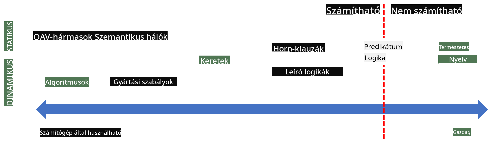

<!--
CO_OP_TRANSLATOR_METADATA:
{
  "original_hash": "7d097f7fda9166ead615e4c34552381b",
  "translation_date": "2025-09-23T11:13:48+00:00",
  "source_file": "lessons/2-Symbolic/README.md",
  "language_code": "hu"
}
-->
# Tudásábrázolás és szakértői rendszerek


> Sketchnote készítette: [Tomomi Imura](https://twitter.com/girlie_mac)

Az emberi intelligencia mesterséges megvalósításának célja a világ megértése, hasonlóan ahhoz, ahogyan az emberek teszik. De hogyan lehet ezt elérni?

## [Előadás előtti kvíz](https://ff-quizzes.netlify.app/en/ai/quiz/3)

Az AI korai időszakában népszerű volt az intelligens rendszerek létrehozásának felülről lefelé irányuló megközelítése (az előző leckében tárgyaltak szerint). Az ötlet az volt, hogy az emberek tudását gép által olvasható formába kell átültetni, majd ezt automatikusan problémák megoldására használni. Ez a megközelítés két nagy elképzelésen alapult:

* Tudásábrázolás
* Következtetés

## Tudásábrázolás

A szimbolikus AI egyik fontos fogalma a **tudás**. Fontos megkülönböztetni a tudást az *információtól* vagy az *adattól*. Például mondhatjuk, hogy a könyvek tudást tartalmaznak, mert tanulmányozva őket szakértővé válhatunk. Azonban amit a könyvek tartalmaznak, valójában *adat*, és amikor elolvassuk őket, majd integráljuk ezt az adatot a világmodellünkbe, az adatot tudássá alakítjuk.

> ✅ **Tudás** az, ami a fejünkben van, és a világ megértését képviseli. Aktív **tanulási** folyamat révén szerezzük meg, amely integrálja az általunk kapott információkat a világ aktív modelljébe.

Leggyakrabban nem határozzuk meg szigorúan a tudást, hanem más kapcsolódó fogalmakkal hozzuk összefüggésbe a [DIKW piramis](https://en.wikipedia.org/wiki/DIKW_pyramid) segítségével. Ez a következő fogalmakat tartalmazza:

* **Adat**: Fizikai médiában ábrázolt információ, például írott szöveg vagy beszélt szavak. Az adat függetlenül létezik az emberektől, és átadható közöttük.
* **Információ**: Az adat értelmezése a fejünkben. Például, amikor meghalljuk a *számítógép* szót, van valamilyen elképzelésünk arról, hogy mi az.
* **Tudás**: Az információ integrálása a világmodellünkbe. Például, ha megtanuljuk, mi az a számítógép, elkezdünk ötleteket alkotni arról, hogyan működik, mennyibe kerül, és mire használható. Ez az összefüggő fogalmak hálózata alkotja a tudásunkat.
* **Bölcsesség**: Egy további szint a világ megértésében, amely a *meta-tudást* képviseli, például azt, hogy hogyan és mikor kell használni a tudást.


*Kép [a Wikipédiáról](https://commons.wikimedia.org/w/index.php?curid=37705247), Longlivetheux saját munkája, CC BY-SA 4.0*

Így a **tudásábrázolás** problémája az, hogy hatékony módot találjunk a tudás számítógépen belüli adatként való ábrázolására, hogy automatikusan használható legyen. Ez egy spektrumként értelmezhető:



> Kép készítette: [Dmitry Soshnikov](http://soshnikov.com)

* A bal oldalon nagyon egyszerű tudásábrázolási típusok találhatók, amelyeket a számítógépek hatékonyan használhatnak. A legegyszerűbb az algoritmikus ábrázolás, amikor a tudást egy számítógépes program képviseli. Ez azonban nem a legjobb módja a tudás ábrázolásának, mert nem rugalmas. A fejünkben lévő tudás gyakran nem algoritmikus.
* A jobb oldalon olyan ábrázolások találhatók, mint a természetes szöveg. Ez a legerősebb, de nem használható automatikus következtetésre.

> ✅ Gondolkodj el egy percre azon, hogyan ábrázolod a tudást a fejedben, és hogyan alakítod jegyzetekké. Van-e olyan formátum, amely segíti a megjegyzést?

## Számítógépes tudásábrázolások osztályozása

A számítógépes tudásábrázolási módszereket a következő kategóriákba sorolhatjuk:

* **Hálózati ábrázolások**: Azon az elven alapulnak, hogy a fejünkben összefüggő fogalmak hálózata van. Megpróbálhatjuk ugyanazokat a hálózatokat reprodukálni egy gráfként a számítógépen belül - egy úgynevezett **szemantikus hálózatként**.

1. **Objektum-Attribútum-Érték hármasok** vagy **attribútum-érték párok**. Mivel egy gráf számítógépen belül ábrázolható csomópontok és élek listájaként, egy szemantikus hálózatot hármasok listájaként ábrázolhatunk, amelyek objektumokat, attribútumokat és értékeket tartalmaznak. Például a következő hármasokat építjük fel a programozási nyelvekről:

Objektum | Attribútum | Érték
---------|-----------|------
Python   | is        | Untyped-Language
Python   | invented-by | Guido van Rossum
Python   | block-syntax | indentation
Untyped-Language | doesn't have | type definitions

> ✅ Gondold át, hogyan lehet hármasokat használni más típusú tudás ábrázolására.

2. **Hierarchikus ábrázolások**: Kiemelik azt a tényt, hogy gyakran hierarchiát hozunk létre az objektumok között a fejünkben. Például tudjuk, hogy a kanári egy madár, és minden madárnak van szárnya. Van elképzelésünk arról is, hogy milyen színű egy kanári általában, és milyen a repülési sebessége.

   - **Keretrendszer ábrázolás**: Minden objektumot vagy objektumosztályt egy **keretként** ábrázol, amely **helyeket** tartalmaz. A helyeknek lehetnek alapértelmezett értékei, értékmegkötései vagy tárolt eljárásai, amelyeket a hely értékének megszerzéséhez lehet hívni. Az összes keret hierarchiát alkot, hasonlóan az objektumorientált programozási nyelvek objektumhierarchiájához.
   - **Forgatókönyvek**: Olyan speciális keretek, amelyek összetett helyzeteket ábrázolnak, amelyek időben kibontakozhatnak.

**Python**

Hely | Érték | Alapértelmezett érték | Intervallum |
-----|-------|-----------------------|-------------|
Név  | Python |                       |             |
Is-A | Untyped-Language |             |             |
Változó formátum | | CamelCase         |             |
Program hossza | |                     | 5-5000 sor  |
Blokk szintaxis | Indent |             |             |

3. **Procedurális ábrázolások**: A tudást olyan cselekvések listájaként ábrázolják, amelyeket bizonyos feltételek bekövetkezésekor lehet végrehajtani.
   - Produkciós szabályok: Ha-akkor állítások, amelyek lehetővé teszik következtetések levonását. Például egy orvosnak lehet olyan szabálya, amely szerint **HA** a betegnek magas láza **VAGY** magas C-reaktív fehérje szintje van a vérvizsgálatban, **AKKOR** gyulladása van. Ha találkozunk valamelyik feltétellel, következtetést vonhatunk le a gyulladásról, majd ezt további következtetésekhez használhatjuk.
   - Algoritmusok: Egy másik formája a procedurális ábrázolásnak, bár szinte soha nem használják őket közvetlenül tudásalapú rendszerekben.

4. **Logika**: Eredetileg Arisztotelész javasolta, mint az emberi tudás univerzális ábrázolásának módját.
   - Predikátum logika: Matematikai elméletként túl gazdag ahhoz, hogy számítható legyen, ezért általában annak egy részhalmazát használják, például a Prologban használt Horn-klauzulákat.
   - Leíró logika: Logikai rendszerek családja, amelyeket objektumok hierarchiájának ábrázolására és következtetésére használnak, például a *szemantikus web* elosztott tudásábrázolásában.

## Szakértői rendszerek

A szimbolikus AI korai sikerei közé tartoztak az úgynevezett **szakértői rendszerek** - olyan számítógépes rendszerek, amelyeket arra terveztek, hogy egy korlátozott problématerületen szakértőként működjenek. Ezek egy **tudásbázison** alapultak, amelyet egy vagy több emberi szakértőtől nyertek ki, és tartalmaztak egy **következtető motort**, amely ezen tudás alapján végzett következtetéseket.

 | 
---------------------------------------------|------------------------------------------------
Az emberi idegrendszer egyszerűsített szerkezete | Tudásalapú rendszer architektúrája

A szakértői rendszerek felépítése hasonló az emberi következtetési rendszerhez, amely tartalmaz **rövid távú memóriát** és **hosszú távú memóriát**. Hasonlóképpen, a tudásalapú rendszerekben megkülönböztetjük a következő komponenseket:

* **Problémamemória**: Tartalmazza az aktuálisan megoldott problémával kapcsolatos tudást, például a beteg hőmérsékletét vagy vérnyomását, hogy van-e gyulladása, stb. Ezt a tudást **statikus tudásnak** is nevezik, mert az aktuális problémáról szóló pillanatképet tartalmazza - az úgynevezett *problémaállapotot*.
* **Tudásbázis**: A problématerületről szóló hosszú távú tudást képviseli. Ezt manuálisan nyerik ki emberi szakértőktől, és nem változik konzultációról konzultációra. Mivel lehetővé teszi, hogy egyik problémaállapotból a másikba navigáljunk, **dinamikus tudásnak** is nevezik.
* **Következtető motor**: Az egész folyamatot irányítja, amely során a problématerület állapotában keres, és szükség esetén kérdéseket tesz fel a felhasználónak. Felelős továbbá a megfelelő szabályok megtalálásáért, amelyeket az egyes állapotokra alkalmazni kell.

Példaként vegyük a következő szakértői rendszert, amely egy állatot határoz meg fizikai jellemzői alapján:


> Kép készítette: [Dmitry Soshnikov](http://soshnikov.com)

Ez a diagram egy **AND-OR fa**, amely a produkciós szabályok grafikus ábrázolása. A fa rajzolása hasznos az elején, amikor a tudást kinyerjük a szakértőtől. A tudás számítógépen belüli ábrázolásához azonban kényelmesebb szabályokat használni:

```
IF the animal eats meat
OR (animal has sharp teeth
    AND animal has claws
    AND animal has forward-looking eyes
) 
THEN the animal is a carnivore
```

Észreveheted, hogy minden feltétel a szabály bal oldalán és az akció lényegében objektum-attribútum-érték (OAV) hármas. A **munkamemória** tartalmazza az OAV hármasok halmazát, amelyek az aktuálisan megoldott problémának felelnek meg. A **szabálymotor** olyan szabályokat keres, amelyek feltételei teljesülnek, és alkalmazza őket, új hármasokat adva a munkamemóriához.

> ✅ Készíts saját AND-OR fát egy általad kedvelt témában!

### Előre- és visszafelé következtetés

A fent leírt folyamatot **előre következtetésnek** nevezzük. Ez azzal kezdődik, hogy a munkamemóriában rendelkezésre áll némi kezdeti adat a problémáról, majd a következő következtetési ciklust hajtja végre:

1. Ha a célattribútum jelen van a munkamemóriában - állj meg, és add meg az eredményt
2. Keress minden szabályt, amelynek feltételei jelenleg teljesülnek - hozz létre **konfliktushalmazt**.
3. Végez **konfliktusfeloldást** - válassz egy szabályt, amelyet ebben a lépésben végrehajtasz. Különböző konfliktusfeloldási stratégiák lehetnek:
   - Válaszd ki az első alkalmazható szabályt a tudásbázisban
   - Válassz véletlenszerű szabályt
   - Válassz egy *specifikusabb* szabályt, azaz azt, amely a legtöbb feltételt teljesíti a "bal oldalon" (LHS)
4. Alkalmazd a kiválasztott szabályt, és adj hozzá új tudáselemet a problémaállapothoz
5. Ismételd meg az 1. lépéstől.

Bizonyos esetekben azonban előfordulhat, hogy üres tudással szeretnénk kezdeni a problémáról, és kérdéseket feltenni, amelyek segítenek eljutni a következtetéshez. Például orvosi diagnózis során általában nem végezzük el az összes orvosi elemzést előre, mielőtt elkezdenénk diagnosztizálni a beteget. Inkább akkor végezzük el az elemzéseket, amikor döntést kell hozni.

Ez a folyamat **visszafelé következtetéssel** modellezhető. Ez a **cél** által vezérelt - az attribútumérték, amelyet keresünk:

1. Válassz ki minden szabályt, amely megadhatja a cél értékét (azaz amelynek a cél a jobb oldalon (RHS) van) - konfliktushalmaz
1. Ha nincs szabály erre az attribútumra, vagy van olyan szabály, amely szerint az értéket a felhasználótól kell kérni - kérdezd meg, különben:
1. Használj konfliktusfeloldási stratégiát, hogy kiválassz egy szabályt, amelyet *hipotézisként* fogsz használni - megpróbáljuk bizonyítani
1. Ismételten ismételd meg a folyamatot a szabály bal oldalán (LHS) lévő összes attribútumra, megpróbálva bizonyítani őket célként
1. Ha bármelyik ponton a folyamat meghiúsul - használj másik szabályt a 3. lépésben.

> ✅ Milyen helyzetekben megfelelőbb az előre következtetés? És a visszafelé következtetés?

### Szakértői rendszerek megvalósítása

A szakértői rendszerek különböző eszközökkel valósíthatók meg:

* Közvetlen programozás valamilyen magas szintű programozási nyelven. Ez nem a legjobb ötlet, mert a tudásalapú rendszer fő előnye, hogy a tudás elkülönül a következtetéstől, és potenciálisan a problématerület szakértője képesnek kell lennie szabályokat írni anélkül, hogy megértené a következtetési folyamat részleteit.
* **Szakértői rendszermag** használata, azaz olyan rendszer, amelyet kifejezetten arra terveztek, hogy tudással töltsék fel valamilyen tudásábrázolási nyelv segítségével.

## ✍️ Gyakorlat: Állati következtetés

Lásd [Animals.ipynb](https://github.com/microsoft/AI-For-Beginners/blob/main/lessons/2-Symbolic/Animals.ipynb) példát az előre és visszafelé követ
- XML-alapú nyelvek családja a tudás leírására: RDF (Resource Description Framework), RDFS (RDF Schema), OWL (Ontology Web Language).

A Szemantikus Web egyik alapfogalma az **Ontológia**. Ez egy probléma területének formális tudásreprezentációval történő explicit specifikációjára utal. A legegyszerűbb ontológia lehet egy objektumok hierarchiája a probléma területén, de a bonyolultabb ontológiák szabályokat is tartalmaznak, amelyek következtetésekhez használhatók.

A szemantikus webben minden reprezentáció tripleteken alapul. Minden objektumot és minden kapcsolatot egyedi URI-val azonosítanak. Például, ha azt szeretnénk kijelenteni, hogy ezt az AI Curriculumot Dmitry Soshnikov fejlesztette ki 2022. január 1-jén, akkor az alábbi tripleteket használhatjuk:


```
http://github.com/microsoft/ai-for-beginners http://www.example.com/terms/creation-date “Jan 13, 2007”
http://github.com/microsoft/ai-for-beginners http://purl.org/dc/elements/1.1/creator http://soshnikov.com
```

> ✅ Itt a `http://www.example.com/terms/creation-date` és a `http://purl.org/dc/elements/1.1/creator` néhány jól ismert és univerzálisan elfogadott URI, amelyek a *készítő* és a *létrehozás dátuma* fogalmakat fejezik ki.

Egy összetettebb esetben, ha egy készítők listáját szeretnénk meghatározni, akkor az RDF-ben definiált adatstruktúrákat használhatjuk.


> A fenti diagramok Dmitry Soshnikovtól származnak ([Dmitry Soshnikov](http://soshnikov.com)).

A Szemantikus Web építésének előrehaladását némileg lassította a keresőmotorok és a természetes nyelvi feldolgozási technikák sikere, amelyek lehetővé teszik a strukturált adatok kinyerését szövegből. Azonban bizonyos területeken még mindig jelentős erőfeszítések történnek ontológiák és tudásbázisok fenntartására. Néhány figyelemre méltó projekt:

* [WikiData](https://wikidata.org/) egy géppel olvasható tudásbázisok gyűjteménye, amely a Wikipédiához kapcsolódik. Az adatok nagy része a Wikipédia *InfoBoxokból* származik, amelyek strukturált tartalomdarabok a Wikipédia oldalain. A WikiData-t SPARQL-ban, a Szemantikus Web speciális lekérdező nyelvében lehet [lekérdezni](https://query.wikidata.org/). Íme egy példa lekérdezés, amely megjeleníti az emberek körében leggyakoribb szemszíneket:

```sparql
#defaultView:BubbleChart
SELECT ?eyeColorLabel (COUNT(?human) AS ?count)
WHERE
{
  ?human wdt:P31 wd:Q5.       # human instance-of homo sapiens
  ?human wdt:P1340 ?eyeColor. # human eye-color ?eyeColor
  SERVICE wikibase:label { bd:serviceParam wikibase:language "en". }
}
GROUP BY ?eyeColorLabel
```

* [DBpedia](https://www.dbpedia.org/) egy másik, a WikiData-hoz hasonló kezdeményezés.

> ✅ Ha szeretnél kísérletezni saját ontológiák létrehozásával vagy meglévők megnyitásával, van egy nagyszerű vizuális ontológia szerkesztő, a [Protégé](https://protege.stanford.edu/). Töltsd le, vagy használd online.


*Web Protégé szerkesztő megnyitva a Romanov család ontológiájával. Képernyőkép Dmitry Soshnikovtól*

## ✍️ Gyakorlat: Egy családi ontológia

Nézd meg a [FamilyOntology.ipynb](https://github.com/Ezana135/AI-For-Beginners/blob/main/lessons/2-Symbolic/FamilyOntology.ipynb) fájlt, amely példát mutat a Szemantikus Web technikák használatára családi kapcsolatok elemzéséhez. Egy közös GEDCOM formátumban ábrázolt családfát és egy családi kapcsolatok ontológiáját fogjuk használni, hogy egy adott személyek halmazára vonatkozóan felépítsük az összes családi kapcsolat gráfját.

## Microsoft Concept Graph

A legtöbb esetben az ontológiákat gondosan kézzel készítik. Azonban lehetséges ontológiákat **kinyerni** strukturálatlan adatokból, például természetes nyelvi szövegekből.

Egy ilyen próbálkozást a Microsoft Research végezte, amelynek eredménye a [Microsoft Concept Graph](https://blogs.microsoft.com/ai/microsoft-researchers-release-graph-that-helps-machines-conceptualize/?WT.mc_id=academic-77998-cacaste).

Ez egy nagy gyűjteménye az entitásoknak, amelyek `is-a` öröklődési kapcsolat alapján vannak csoportosítva. Lehetővé teszi olyan kérdések megválaszolását, mint például "Mi a Microsoft?" - a válasz valami olyasmi, mint "egy vállalat 0,87 valószínűséggel, és egy márka 0,75 valószínűséggel".

A Graph elérhető REST API-n keresztül, vagy egy nagy letölthető szövegfájlként, amely az összes entitáspárt felsorolja.

## ✍️ Gyakorlat: Egy fogalom gráf

Próbáld ki az [MSConceptGraph.ipynb](https://github.com/microsoft/AI-For-Beginners/blob/main/lessons/2-Symbolic/MSConceptGraph.ipynb) notebookot, hogy láthasd, hogyan használhatjuk a Microsoft Concept Graph-ot hírcikkek több kategóriába történő csoportosítására.

## Összegzés

Manapság az AI-t gyakran a *gépi tanulás* vagy *neurális hálók* szinonimájaként emlegetik. Azonban az emberi lények explicit érvelést is mutatnak, ami olyasmi, amit jelenleg a neurális hálók nem kezelnek. Valós projektekben az explicit érvelést továbbra is használják olyan feladatok elvégzésére, amelyek magyarázatokat igényelnek, vagy amelyeknél a rendszer viselkedését kontrollált módon kell módosítani.

## 🚀 Kihívás

A leckéhez kapcsolódó Family Ontology notebookban lehetőség van más családi kapcsolatokkal kísérletezni. Próbálj meg új kapcsolatokat felfedezni az emberek között a családfában.

## [Utólagos kvíz](https://ff-quizzes.netlify.app/en/ai/quiz/4)

## Áttekintés és önálló tanulás

Végezz kutatást az interneten, hogy felfedezd azokat a területeket, ahol az emberek megpróbálták kvantifikálni és kódolni a tudást. Nézd meg Bloom taxonómiáját, és menj vissza a történelemben, hogy megtudd, hogyan próbálták az emberek értelmezni a világukat. Fedezd fel Linnaeus munkáját az organizmusok taxonómiájának létrehozására, és figyeld meg, hogyan hozott létre Dmitrij Mengyelejev egy rendszert a kémiai elemek leírására és csoportosítására. Milyen más érdekes példákat találsz?

**Feladat**: [Ontológia létrehozása](assignment.md)

---

