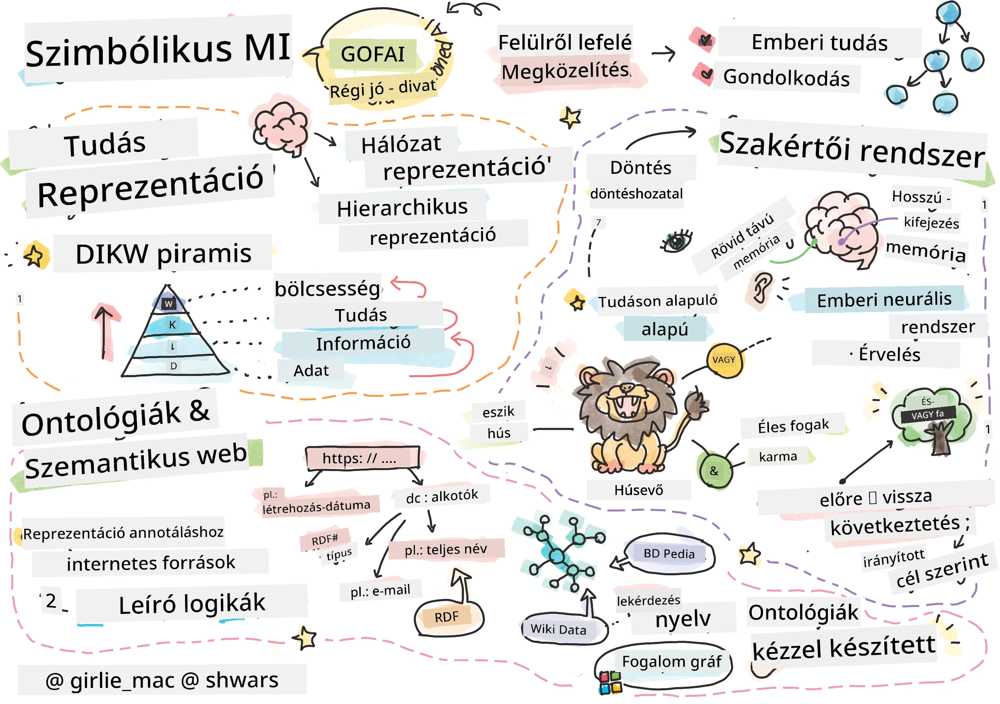
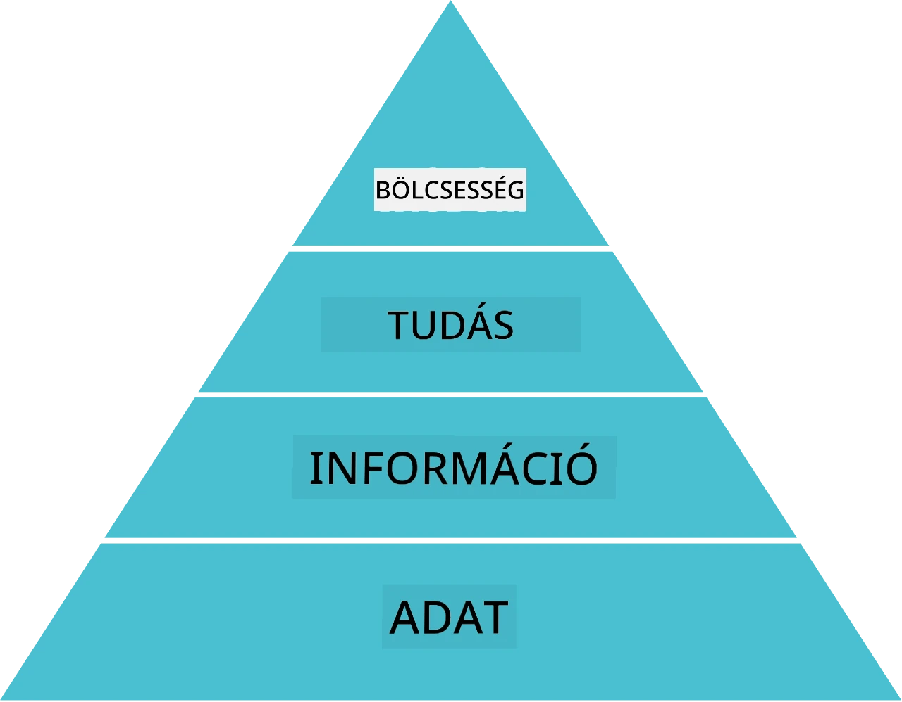
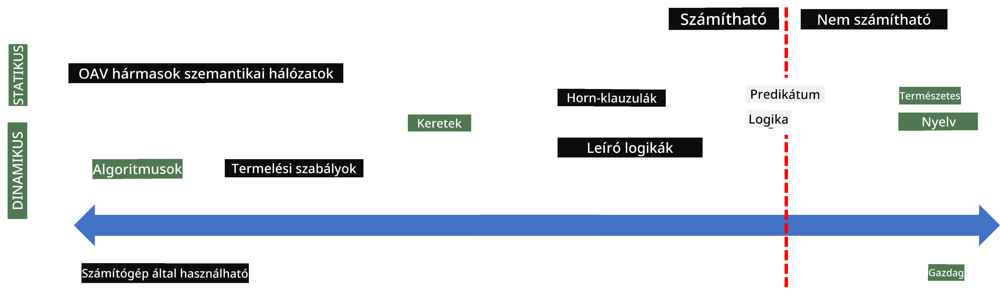
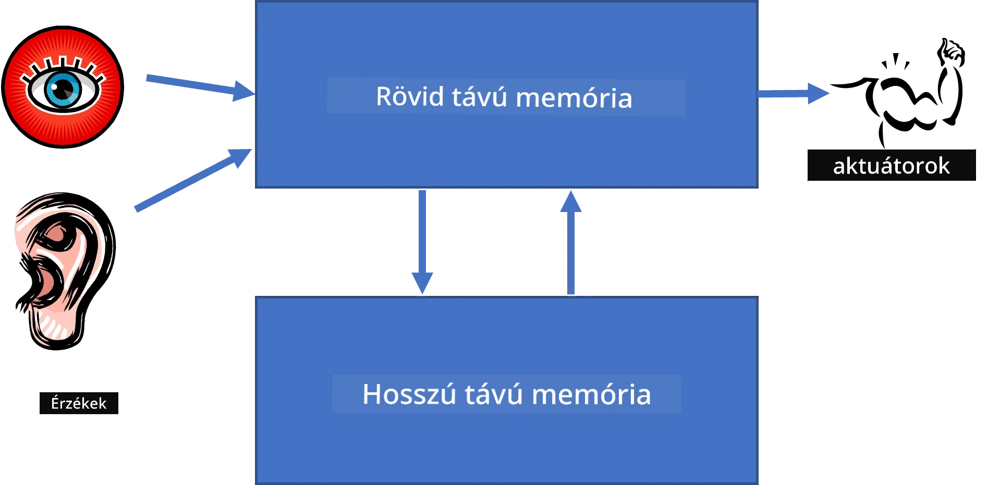
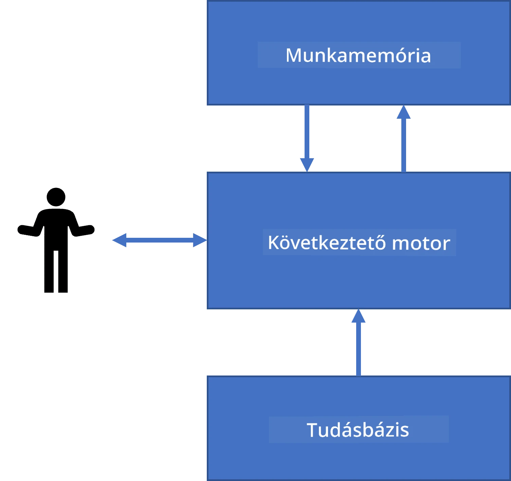
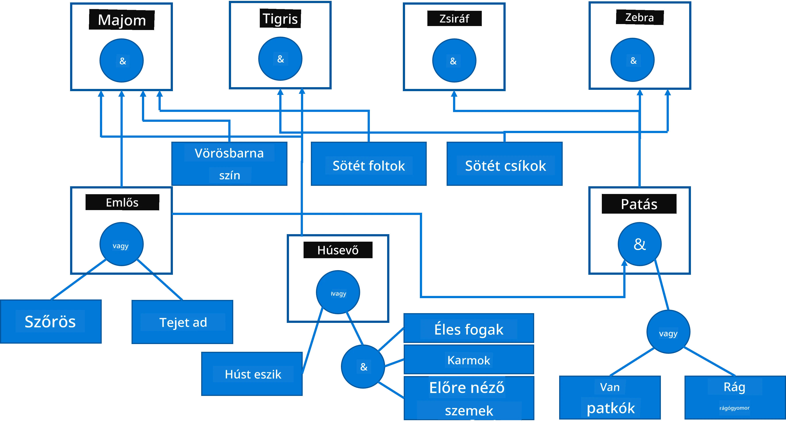
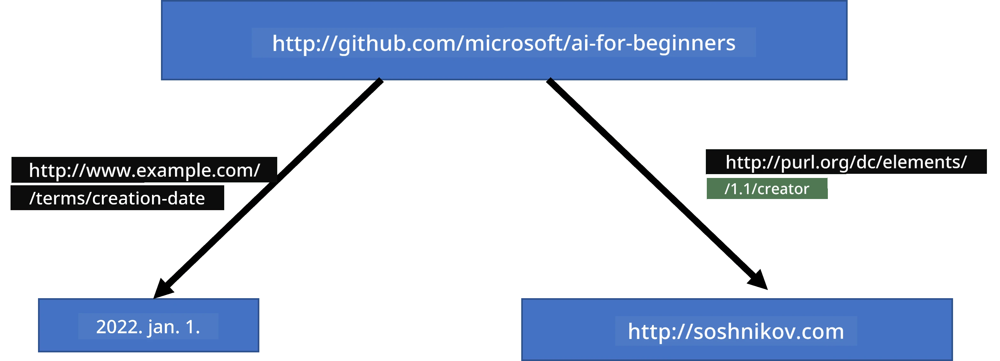
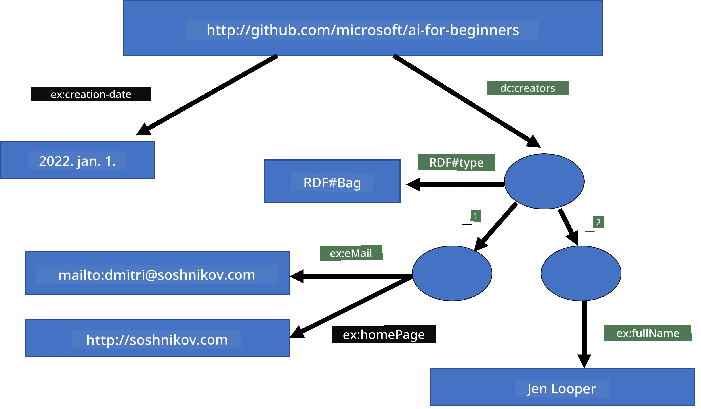
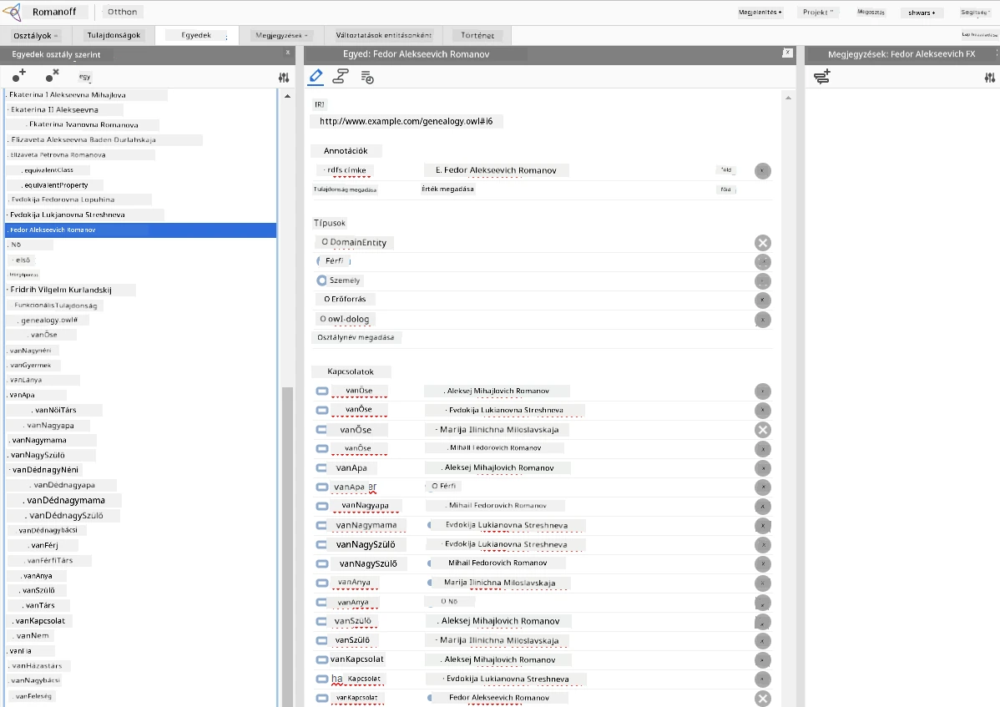

# Tudásreprezentáció és szakértői rendszerek



> Vázlatrajz készítője: [Tomomi Imura](https://twitter.com/girlie_mac)

A mesterséges intelligencia keresése a tudás utáni kutatáson alapul, hogy hasonló módon értsük meg a világot, mint az emberek. De hogyan lehet ezt megvalósítani?

## [Előadás előtti kvíz](https://ff-quizzes.netlify.app/en/ai/quiz/3)

A MI korai napjaiban népszerű volt az intelligens rendszerek létrehozásának top-down (felülről lefelé) megközelítése (amelyet az előző órán tárgyaltunk). Az elképzelés az volt, hogy az emberektől kinyerjük a tudást egy gép által olvasható formába, majd azt automatikusan problémamegoldásra használjuk. Ez a megközelítés két nagy ötletre épült:

* Tudásreprezentáció
* Következtetés

## Tudásreprezentáció

A Szimbolikus MI egyik fontos fogalma a **tudás**. Fontos elkülöníteni a tudást az *információtól* vagy az *adatoktól*. Például azt mondhatjuk, hogy a könyvek tudást tartalmaznak, mert tanulmányozhatók és szakértővé válhatunk általuk. Valójában azonban a könyvekben található valójában *adat*, és az olvasásuk és e adatok integrálása a világmodellünkbe konvertálja ezt az adatot tudássá.

> ✅ **A tudás** olyan valami, ami a fejünkben van és a világ megértését képviseli. Egy aktív **tanulási** folyamat révén szerezhető meg, amely az általunk kapott információkat beépíti a világ aktív modelljébe.

Leggyakrabban nem határozzuk meg szigorúan a tudást, hanem a kapcsolódó fogalmakkal igazítjuk a [DIKW Piramis](https://en.wikipedia.org/wiki/DIKW_pyramid) segítségével. Ez a következő fogalmakat tartalmazza:

* **Adat** valami, ami fizikai közegen van ábrázolva, például írott szöveg vagy beszélt szavak. Az adatok függetlenül léteznek az emberektől és átadhatók egymás között.
* **Információ** az, ahogyan fejben értelmezzük az adatokat. Például amikor meghalljuk a *számítógép* szót, van valamilyen fogalmunk arról, hogy mi az.
* **Tudás** amikor az információt beépítjük a világmodellünkbe. Például amikor megtanuljuk, mi a számítógép, elkezdünk ötleteket formálni arról, hogyan működik, mennyibe kerül, és mire használható. Ez az összefüggő fogalmak hálózata alkotja a tudásunkat.
* **Bölcsesség** még egy magasabb szint a világ megértésében, és ez *meta-tudást* jelent, pl. egyfajta ismeretet arról, hogy hogy és mikor kell használni a tudást.



*Kép [a Wikipédiáról](https://commons.wikimedia.org/w/index.php?curid=37705247), készítő: Longlivetheux - Saját munka, CC BY-SA 4.0*

Így a **tudásreprezentáció** problémája az, hogy valamilyen hatékony módon ábrázoljuk a tudást a számítógépben adat formájában, hogy az automatikusan felhasználható legyen. Ezt egy spektrumnak tekinthetjük:



> Kép készítője: [Dmitry Soshnikov](http://soshnikov.com)

* Bal oldalon nagyon egyszerű tudásreprezentációs típusok vannak, amelyeket a számítógépek hatékonyan tudnak használni. A legegyszerűbb az algoritmikus, amikor a tudást egy számítógépes program képviseli. Ez azonban nem a legjobb mód a tudás ábrázolására, mert nem rugalmas. A fejünkben lévő tudás gyakran nem algoritmikus.
* Jobb oldalon vannak az olyan ábrázolások, mint a természetes szöveg. Ez a legerősebb, de nem használható automatikus érveléshez.

> ✅ Gondolkozz egy percet arról, hogy te hogyan reprezentálod a tudást a fejedben, és hogyan alakítod át jegyzetekké. Van-e nálad hatékony formátum a jobb megtartás érdekében?

## A számítógépes tudásreprezentációk osztályozása

A különböző számítógépes tudásreprezentációs módszereket az alábbi kategóriákba sorolhatjuk:

* **Hálózati reprezentációk** az alapján, hogy van egy összekapcsolt fogalomhálózat a fejünkben. Ezt megpróbálhatjuk ugyanazt a hálózatot gráfként reprodukálni a számítógépben - egy úgynevezett **szemantikus hálózatot**.

1. **Objektum-Attribútum-Érték hármasok** vagy **attribútum-érték párok**. Mivel a gráfot a számítógép listaként tárolhatja csúcsokból és élekből, egy szemantikus hálózatot hármasok listájaként ábrázolhatunk, amelyek a következőket tartalmazzák: objektumok, attribútumok és értékek. Például a következő hármasokat építjük a programozási nyelvekről:

Objektum | Attribútum | Érték
---------|------------|------
Python   | is         | Untyped-Language
Python   | invented-by| Guido van Rossum
Python   | block-syntax| indentation
Untyped-Language | doesn't have | type definitions

> ✅ Gondold át, hogyan lehetne a hármasokat más típusú tudás reprezentálására használni.

2. **Hierarchikus reprezentációk** hangsúlyozzák, hogy gyakran hozunk létre hierarchiát a fejünkben lévő objektumokról. Például tudjuk, hogy a kanári madár, és minden madárnak vannak szárnyai. Van némi fogalmunk arról is, hogy a kanári általában milyen színű, és milyen a repülési sebessége.

   - **Keretrendszer (frame) reprezentáció** azon alapul, hogy az egyes objektumokat vagy objektumosztályokat **keretként (frame)** ábrázoljuk, amelyek **helyeket (slot)** tartalmaznak. A helyeknek lehetnek alapértelmezett értékei, érték megkötései vagy eljárások, amelyeket hívhatunk a hely értékének megszerzésére. Minden keret hierarchiát alkot, amely hasonló az objektum-orientált programozási nyelvek objektumhierarchiájához.
   - **Forgatókönyvek (scenarios)** olyan speciális keretek, amelyek komplex helyzeteket ábrázolnak, amelyek időben kibontakozhatnak.

**Python**

Hely | Érték | Alapértelmezett érték | Intervallum |
-----|-------|------------------------|-------------|
Név  | Python | | |
Is-A | Untyped-Language | | |
Változó név forma | | CamelCase | |
Program hossza | | | 5-5000 sor |
Blokk szintaxis | Behúzás | | |

3. **Procedurális reprezentációk** azon alapulnak, hogy a tudást egy cselekvési lista formájában ábrázolják, amely végrehajtható, ha egy bizonyos feltétel teljesül.
   - A termelési szabályok (production rules) ha-akkor állítások, amelyek lehetővé teszik a következtetés levonását. Például egy orvosnak lehet egy szabálya, amely így szól: **HA** a páciensnek magas láza **VAGY** magas a C-reaktív fehérje szint a vérvizsgálatban, **AKKOR** gyulladása van. Ha találkozunk az egyik feltétellel, megállapíthatjuk a gyulladást, majd ezt tovább felhasználhatjuk érvelésben.
   - Az algoritmusok tekinthetők a procedurális reprezentáció egy másik formájának, bár szinte soha nem használják őket közvetlenül tudásalapú rendszerekben.

4. **Logika** eredetileg Arisztotelész által javasolt módszer az egyetemes emberi tudás ábrázolására.
   - A predikátumlogika matematikai elméletként túl gazdag ahhoz, hogy számítható legyen, ezért általában csak részhalmazát használják, például Horn-klauszulákat, amelyeket Prologban is használnak.
   - A Deskriptív logika egy logikai rendszerek családja, amelyeket hierarchiák és elosztott tudás-reprezentációk, például a *szemantikus web* ábrázolására és következtetéshez használnak.

## Szakértői rendszerek

A szimbolikus MI korai sikerei közé tartoztak az úgynevezett **szakértői rendszerek** - olyan számítógépes rendszerek, amelyeket úgy terveztek, hogy egy szűk problématerületen szakértőként működjenek. Ezek egy vagy több emberi szakértőtől kinyert **tudásbázison** alapultak, és tartalmaztak egy **következtető motort**, amely érvelést végzett.

 | 
--------------------------------------------|---------------------------------------------
Az emberi idegrendszer egyszerűsített szerkezete | Tudásalapú rendszer felépítése

A szakértői rendszerek úgy épülnek fel, mint az emberi érvelési rendszer, amely tartalmaz **rövid távú memóriát** és **hosszú távú memóriát**. Hasonlóképpen, a tudásalapú rendszerekben az alábbi komponenseket különböztetjük meg:

* **Probléma memória**: tartalmazza az éppen megoldandó problémával kapcsolatos tudást, például a beteg hőmérsékletét, vérnyomását, gyulladását vagy sem. Ezt a tudást nevezzük **statikus tudásnak**, mert a probléma aktuális állapotának "pillanatképét" tartalmazza - az úgynevezett *probléma állapotot*.
* **Tudásbázis**: egy probléma terület hosszú távú tudását képviseli. Manuálisan származik emberi szakértőktől, és nem változik konzultációról konzultációra. Mivel lehetővé teszi az egyik probléma állapotból a másikra való navigálást, ezért ezt **dinamikus tudásnak** is nevezik.
* **Következtető motor**: összehangolja a problématérben való keresést, szükség esetén kérdéseket tesz fel a felhasználónak. Felelős a megfelelő szabályok megtalálásáért, amelyek minden állapotra alkalmazhatók.

Példaként tekintsük a következő szakértői rendszert, amely egy állat meghatározását végzi fizikai jellemzői alapján:



> Kép készítője: [Dmitry Soshnikov](http://soshnikov.com)

Ezt az ábrát **ÉS-VAGY fának** hívják, és egy termelési szabályrendszer grafikus ábrázolása. Egy fa rajzolása hasznos a tudás kinyerésének kezdetén a szakértőtől. A tudás számítógépes reprezentálásához azonban kényelmesebb szabályokat használni:

```
IF the animal eats meat
OR (animal has sharp teeth
    AND animal has claws
    AND animal has forward-looking eyes
) 
THEN the animal is a carnivore
```

Észreveheted, hogy a szabály bal oldalán lévő feltétel és a cselekvés lényegében objektum-attribútum-érték (OAV) hármasok. A **munkamemória** tartalmazza a jelenleg megoldandó problémának megfelelő OAV hármasok halmazát. Egy **szabálymotort** keres minden olyan szabályt, amelynek a feltétele teljesül, és alkalmazza azokat, új hármast adva a munkamemóriához.

> ✅ Írj saját ÉS-VAGY fát egy számodra érdekes témáról!

### Előre- és Visszakövetkeztetés

A fenti folyamatot **előrekövetkeztetésnek** nevezik. Kezd egy kezdeti adattal a munkamemóriában, majd az alábbi érvelési ciklust hajtja végre:

1. Ha a cél attribútum megtalálható a munkamemóriában – állj meg és add meg az eredményt
2. Keresd meg az összes olyan szabályt, amelynek a feltétele jelenleg teljesül – kapj egy **konfliktus halmazt**.
3. Végezz **konfliktusmegoldást** – válassz egy szabályt, amely végrehajtásra kerül ezen a lépésen. Különféle konfliktusmegoldási stratégiák létezhetnek:
   - Válaszd az első alkalmazható szabályt a tudásbázisból
   - Válassz véletlenszerű szabályt
   - Válassz *specifikusabb* szabályt, azaz olyat, amely a legtöbb feltételnek megfelel a jobb oldalon (LHS)
4. Alkalmazd a kiválasztott szabályt, és illessz be egy új tudásegységet a probléma állapotába
5. Ismételd az 1. lépéstől.

Bizonyos esetekben azonban előfordulhat, hogy a probléma ismeretlen, és kérdéseket kell feltennünk, hogy következtetésekhez jussunk. Például orvosi diagnosztika során nem végezzük el előre az összes vizsgálatot, hanem inkább akkor kérünk vizsgálatokat, ha döntést kell hozni.

Ezt a folyamatot **visszakövetkeztetéssel** modellezhetjük. Ezt a **céltól** indítjuk – az attribútum értékét keressük:

1. Válaszd ki az összes olyan szabályt, amely megadhatja a cél értékét (azaz a szabály jobb oldalán, RHS, ez a cél) – egy konfliktus halmaz.
2. Ha nincs ilyen szabály, vagy van olyan szabály, amely azt mondja, hogy kérdezd meg a felhasználót, akkor kérdezd meg, különben:
3. Konfliktusmegoldó stratégiával válassz egy szabályt, amelyet *feltételezésként* használunk – megpróbáljuk igazolni.
4. Rekurzívan ismételd meg a folyamatot a szabály bal oldalán (LHS) lévő összes attribútumra, mint célokra.
5. Ha bármikor a folyamat meghiúsul – lépj a 3. lépésben egy másik szabályra.

> ✅ Milyen helyzetekben megfelelőbb az előrekövetkeztetés? És mikor a visszakövetkeztetés?

### Szakértői rendszerek implementálása

A szakértői rendszerek különböző eszközökkel valósíthatók meg:

* Közvetlen programozás magas szintű programozási nyelven. Ez nem a legjobb ötlet, mert a tudásalapú rendszer fő előnye az, hogy a tudás szétválasztott a következtetéstől, és egy problématerület szakértője potenciálisan tud szabályokat írni anélkül, hogy értené a következtetési folyamat részleteit
* **Szakértői rendszer héj** használata, vagyis egy olyan rendszer, amelyet kifejezetten arra terveztek, hogy tudásábrázolási nyelv segítségével könnyen tölthető legyen tudással.

## ✍️ Gyakorlat: Állati következtetés

Lásd [Animals.ipynb](https://github.com/microsoft/AI-For-Beginners/blob/main/lessons/2-Symbolic/Animals.ipynb) példát az előre- és visszakövetkeztetéses szakértői rendszer implementálására.

> **Megjegyzés**: Ez a példa egyszerű, és csak bemutatja, hogyan néz ki egy szakértői rendszer. Ha elkezdesz egy ilyen rendszert létrehozni, akkor 200+ szabály körül kezded csak *intelligens* viselkedését észrevenni. Egy idő után a szabályok túl összetettek lesznek ahhoz, hogy fejben tartsd őket, és ebben a pontban felmerülhet a kérdés, hogy a rendszer miért hoz egyes döntéseket. Azonban a tudásalapú rendszerek fontos jellemzője, hogy mindig meg tudod magyarázni pontosan, hogyan hozott bármely döntést.

## Ontológiák és a Szemantikus Web

A 20. század végén indult egy kezdeményezés, hogy a tudásreprezentációt használják az internetes erőforrások annotálására, hogy nagyon speciális lekérdezéseknek megfelelő erőforrásokat lehessen találni. Ezt a kezdeményezést **Szemantikus Webnek** nevezték, amely több fogalomra épült:

- Egy speciális tudás-reprezentáció, amely a **[leíró logikákra](https://en.wikipedia.org/wiki/Description_logic)** (DL) alapul. Ez hasonló a keretrendszeres tudásreprezentációhoz, mert objektumhierarchiát épít tulajdonságokkal, de formális logikai szemantikája és következtetése van. Egy egész családja van DL-eknek, amelyek az expresszivitás és az algoritmikus következtetés komplexitása között egyensúlyoznak.
- Elosztott tudás-reprezentáció, ahol minden fogalom globális URI azonosítóval rendelkezik, lehetővé téve hálózati tudáshierarchiák létrehozását, amelyek az interneten átnyúlnak.
- Egy XML-alapú tudásleíró nyelvcsalád: RDF (Resource Description Framework), RDFS (RDF Schema), OWL (Ontology Web Language).

A szemantikus web egyik alapvető fogalma az **ontológia**. Ez egy probléma-domainek kifejezett specifikációjára utal valamilyen formális tudás-reprezentáció használatával. A legegyszerűbb ontológia lehet csupán egy hierarchia az adott probléma-domén objektumaiból, de bonyolultabb ontológiák szabályokat is tartalmaznak, amelyeket következtetésre lehet alkalmazni.

A szemantikus web esetén minden reprezentáció tripleteken alapul. Minden objektumot és minden relációt egyértelműen az URI azonosít. Például, ha közölni szeretnénk, hogy ezt az AI tananyagot Dmitry Soshnikov fejlesztette ki 2022. január 1-jén – itt vannak a használható tripletek:



```
http://github.com/microsoft/ai-for-beginners http://www.example.com/terms/creation-date “Jan 1, 2022”
http://github.com/microsoft/ai-for-beginners http://purl.org/dc/elements/1.1/creator http://soshnikov.com
```

> ✅ Itt a `http://www.example.com/terms/creation-date` és a `http://purl.org/dc/elements/1.1/creator` jól ismert és általánosan elfogadott URI-k arra, hogy kifejezzük a *létrehozó* és a *létrehozás dátuma* fogalmát.

Bonyolultabb esetben, ha létrehozók listáját akarjuk definiálni, RDF-ben definiált adatstruktúrákat használhatunk.



> A fenti ábrák [Dmitry Soshnikov](http://soshnikov.com) munkái

A szemantikus web kiépítésének előrehaladását némileg lassította a keresőmotorok és természetes nyelvfeldolgozó technikák sikere, amelyek lehetővé teszik a strukturált adatok kinyerését szövegből. Ugyanakkor bizonyos területeken még mindig jelentős erőfeszítések folynak az ontológiák és tudásbázisok karbantartására. Néhány figyelemre méltó projekt:

* A [WikiData](https://wikidata.org/) egy géppel olvasható tudásbázis gyűjtemény, amely a Wikipédiához kapcsolódik. Az adatok többsége a Wikipedia *Infó dobozaiból* származik, amelyek struktúrált tartalmi részek a Wikipédia oldalain. A wikidata lekérdezhető SPARQL nyelven a [query.wikidata.org](https://query.wikidata.org/) címen. Íme egy példa lekérdezés, ami az emberek leggyakoribb szemszínét mutatja:

```sparql
#defaultView:BubbleChart
SELECT ?eyeColorLabel (COUNT(?human) AS ?count)
WHERE
{
  ?human wdt:P31 wd:Q5.       # human instance-of homo sapiens
  ?human wdt:P1340 ?eyeColor. # human eye-color ?eyeColor
  SERVICE wikibase:label { bd:serviceParam wikibase:language "en". }
}
GROUP BY ?eyeColorLabel
```

* A [DBpedia](https://www.dbpedia.org/) egy másik, a WikiData-hoz hasonló kezdeményezés.

> ✅ Ha szeretnéd kipróbálni saját ontológiák építését vagy meglévők megnyitását, van egy remek vizuális ontológia szerkesztő, a [Protégé](https://protege.stanford.edu/). Töltsd le, vagy használd online.



*Web Protégé szerkesztő megnyitva a Romanov Család ontológiájával. Képernyőkép Dmitry Soshnikovtól*

## ✍️ Gyakorlat: Családi Ontológia

Nézd meg a [FamilyOntology.ipynb](https://github.com/Ezana135/AI-For-Beginners/blob/main/lessons/2-Symbolic/FamilyOntology.ipynb) példáját, amely bemutatja, hogyan használhatók a szemantikus web technikák családi kapcsolatok következtetésére. Egy közönséges GEDCOM formátumban ábrázolt családfa és egy családi kapcsolatokra vonatkozó ontológia alapján felépítünk egy gráfot az adott egyének összes családi kapcsolatáról.

## Microsoft Fogalomgráf

A legtöbb esetben az ontológiákat kézzel, gondosan hozzák létre. Ugyanakkor lehetséges ontológiák **kitermelése** is strukturálatlan adatokból, például természetes nyelvű szövegekből.

Erre való kísérlet történt a Microsoft Research részéről, ennek eredménye a [Microsoft Concept Graph](https://blogs.microsoft.com/ai/microsoft-researchers-release-graph-that-helps-machines-conceptualize/?WT.mc_id=academic-77998-cacaste).

Ez egy nagy gyűjteménye az entitásoknak, amelyeket `is-a` öröklődési kapcsolat használatával csoportosítottak össze. Lehetővé teszi olyan kérdések megválaszolását, mint például "Mi a Microsoft?" - amire a válasz valami olyasmi, hogy "egy vállalat 0,87 valószínűséggel, és egy márka 0,75 valószínűséggel".

A gráf elérhető REST API-ként vagy letölthető nagy méretű szöveges fájlként, amely minden entitáspárt felsorol.

## ✍️ Gyakorlat: Fogalomgráf

Próbáld ki a [MSConceptGraph.ipynb](https://github.com/microsoft/AI-For-Beginners/blob/main/lessons/2-Symbolic/MSConceptGraph.ipynb) jegyzetfüzetet, hogy láthasd, miként használhatjuk a Microsoft Concept Graph-ot hírek cikkek kategorizálására.

## Összegzés

Napjainkban az MI gyakran szinonimaként jelenik meg a *Gépi tanulásra* vagy a *Neuronhálókra*. Azonban az emberi lény explicit következtetéseket is végez, amit a neuronhálók jelenleg nem kezelnek. Valós projektekben az explicit következtetés továbbra is alkalmazásra kerül olyan feladatoknál, amelyek magyarázatot igényelnek, vagy amelyeknél kontrollált módon kell módosítani a rendszer viselkedését.

## 🚀 Kihívás

A Családi Ontológia jegyzetfüzetben lehetőség van kísérletezni további családi viszonyokkal. Próbálj meg új kapcsolatokat felfedezni az adott családfában lévő személyek között.

## [Óra utáni kvíz](https://ff-quizzes.netlify.app/en/ai/quiz/4)

## Áttekintés & Önkéntes tanulás

Kutatásszerűen járj utána az interneten, hogy hol és hogyan próbálták az emberek mennyiségileg kifejezni és rendszerezni a tudást. Nézd meg Bloom Taxonómiáját, és utazz vissza a történelemben, hogy megismerd, miként próbálták az emberek megérteni világukat. Fedezd fel Linnaeus munkásságát az élőlények taxonómiájának megalkotásában, és figyeld meg, miként alkotta meg Dmitri Mendeleev a kémiai elemek leírásának és csoportosításának módszerét. Milyen más érdekes példákat találsz még?

**Feladat**: [Ontológia építése](assignment.md)

---

<!-- CO-OP TRANSLATOR DISCLAIMER START -->
**Jogi Nyilatkozat**:
Ezt a dokumentumot az AI fordítószolgáltatás, a [Co-op Translator](https://github.com/Azure/co-op-translator) segítségével fordítottuk le. Habár törekszünk a pontosságra, kérjük, vegye figyelembe, hogy az automatikus fordítások hibákat vagy pontatlanságokat tartalmazhatnak. Az eredeti, anyanyelvi dokumentum tekintendő hiteles forrásnak. Fontos információk esetén javasolt professzionális, emberi fordítás igénybevétele. Semmilyen felelősséget nem vállalunk a fordítás használatából eredő félreértésekért vagy téves értelmezésekért.
<!-- CO-OP TRANSLATOR DISCLAIMER END -->