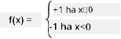

# Bevezetés a neurális hálózatokba: Perceptron

## [Előadás előtti kvíz](https://ff-quizzes.netlify.app/en/ai/quiz/5)

Az egyik első próbálkozás, amely hasonlított a modern neurális hálózatokhoz, Frank Rosenblatt nevéhez fűződik, aki 1957-ben a Cornell Aeronautical Laboratory-nál dolgozott. Ez egy hardveres megvalósítás volt, amelyet "Mark-1"-nek neveztek, és primitív geometriai alakzatok, például háromszögek, négyzetek és körök felismerésére tervezték.

|      |      |
|--------------|-----------|
| | |

> Képek [a Wikipédiáról](https://en.wikipedia.org/wiki/Perceptron)

A bemeneti képet egy 20x20-as fotocella mátrix képviselte, így a neurális hálózatnak 400 bemenete és egy bináris kimenete volt. Egy egyszerű hálózat egyetlen neuront tartalmazott, amelyet **küszöblogikai egységnek** is neveztek. A neurális hálózat súlyai potenciométerként működtek, amelyeket a tanítási fázis során manuálisan kellett beállítani.

> ✅ A potenciométer egy olyan eszköz, amely lehetővé teszi az áramkör ellenállásának beállítását.

> A New York Times akkoriban így írt a perceptronról: *az elektronikus számítógép embriója, amelyről [a haditengerészet] azt várja, hogy képes lesz járni, beszélni, látni, írni, önmagát reprodukálni és tudatában lenni saját létezésének.*

## Perceptron modell

Tegyük fel, hogy a modellünkben N jellemző van, ebben az esetben a bemeneti vektor N méretű vektor lesz. A perceptron egy **bináris osztályozási** modell, azaz képes megkülönböztetni két osztályba tartozó bemeneti adatokat. Feltételezzük, hogy minden bemeneti vektor x esetében a perceptron kimenete +1 vagy -1 lesz, az osztálytól függően. A kimenetet az alábbi képlet segítségével számítjuk ki:

y(x) = f(w<sup>T</sup>x)

ahol f egy lépés aktivációs függvény

<!-- img src="http://www.sciweavers.org/tex2img.php?eq=f%28x%29%20%3D%20%5Cbegin%7Bcases%7D%0A%20%20%20%20%20%20%20%20%20%2B1%20%26%20x%20%5Cgeq%200%20%5C%5C%0A%20%20%20%20%20%20%20%20%20-1%20%26%20x%20%3C%200%0A%20%20%20%20%20%20%20%5Cend%7Bcases%7D%20%5C%5C%0A&bc=White&fc=Black&im=jpg&fs=12&ff=arev&edit=0" align="center" border="0" alt="f(x) = \begin{cases} +1 & x \geq 0 \\ -1 & x < 0 \end{cases} \\" width="154" height="50" / -->


## A perceptron tanítása

Ahhoz, hogy egy perceptront megtanítsunk, meg kell találnunk egy súlyvektort w, amely a legtöbb értéket helyesen osztályozza, azaz a legkisebb **hibát** eredményezi. Ez a hiba E a **perceptron kritérium** alapján az alábbi módon van definiálva:

E(w) = -&sum;w<sup>T</sup>x<sub>i</sub>t<sub>i</sub>

ahol:

* az összeg azon i-edik tanítási adatpontokra vonatkozik, amelyek helytelen osztályozást eredményeznek
* x<sub>i</sub> a bemeneti adat, és t<sub>i</sub> -1 vagy +1 a negatív és pozitív példák esetében.

Ezt a kritériumot a súlyok w függvényeként tekintjük, és minimalizálnunk kell. Gyakran egy **gradiens csökkenés** nevű módszert alkalmaznak, amelyben kezdeti súlyokkal w<sup>(0)</sup> indulunk, majd minden lépésben az alábbi képlet szerint frissítjük a súlyokat:

w<sup>(t+1)</sup> = w<sup>(t)</sup> - &eta;&nabla;E(w)

Itt &eta; az úgynevezett **tanulási ráta**, és &nabla;E(w) az E **gradiensét** jelöli. Miután kiszámítottuk a gradienset, a következőképpen kapjuk meg:

w<sup>(t+1)</sup> = w<sup>(t)</sup> + &sum;&eta;x<sub>i</sub>t<sub>i</sub>

Az algoritmus Pythonban így néz ki:

```python
def train(positive_examples, negative_examples, num_iterations = 100, eta = 1):

    weights = [0,0,0] # Initialize weights (almost randomly :)
        
    for i in range(num_iterations):
        pos = random.choice(positive_examples)
        neg = random.choice(negative_examples)

        z = np.dot(pos, weights) # compute perceptron output
        if z < 0: # positive example classified as negative
            weights = weights + eta*weights.shape

        z  = np.dot(neg, weights)
        if z >= 0: # negative example classified as positive
            weights = weights - eta*weights.shape

    return weights
```

## Összegzés

Ebben a leckében megismerkedtél a perceptronnal, amely egy bináris osztályozási modell, és megtanultad, hogyan lehet tanítani egy súlyvektor segítségével.

## 🚀 Kihívás

Ha szeretnéd kipróbálni, hogyan építhetsz saját perceptront, próbáld ki [ezt a labort a Microsoft Learn oldalon](https://docs.microsoft.com/en-us/azure/machine-learning/component-reference/two-class-averaged-perceptron?WT.mc_id=academic-77998-cacaste), amely az [Azure ML designer](https://docs.microsoft.com/en-us/azure/machine-learning/concept-designer?WT.mc_id=academic-77998-cacaste) használatát igényli.

## [Előadás utáni kvíz](https://ff-quizzes.netlify.app/en/ai/quiz/6)

## Áttekintés és önálló tanulás

Ha szeretnéd látni, hogyan használhatjuk a perceptront egy egyszerű probléma, valamint valós problémák megoldására, és folytatni szeretnéd a tanulást, látogass el a [Perceptron](Perceptron.ipynb) jegyzetfüzethez.

Egy érdekes [cikk a perceptronokról](https://towardsdatascience.com/what-is-a-perceptron-basics-of-neural-networks-c4cfea20c590
) is elérhető.

## [Feladat](lab/README.md)

Ebben a leckében egy perceptront valósítottunk meg bináris osztályozási feladathoz, és használtuk két kézzel írt számjegy közötti osztályozásra. Ebben a laborban az a feladatod, hogy teljesen megoldj egy számjegy osztályozási problémát, azaz határozd meg, melyik számjegy valószínűleg megfelel egy adott képnek.

* [Útmutató](lab/README.md)
* [Jegyzetfüzet](lab/PerceptronMultiClass.ipynb)

---

