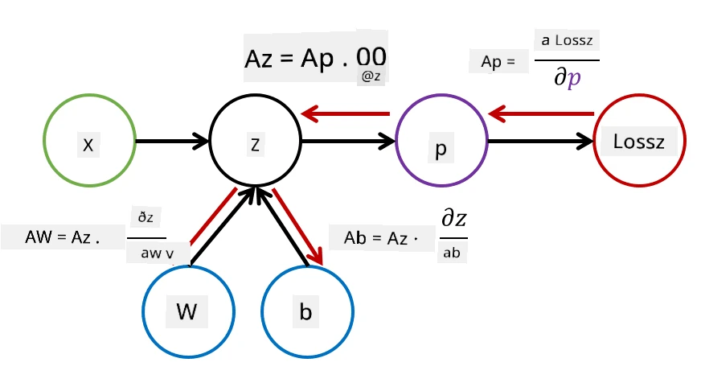

# Bevezetés a Neurális Hálózatokba. Többrétegű Perceptron

Az előző részben megismerkedtél a legegyszerűbb neurális hálózati modellel - az egyrétegű perceptronnal, amely egy lineáris kétosztályos osztályozási modell.

Ebben a részben kiterjesztjük ezt a modellt egy rugalmasabb keretrendszerre, amely lehetővé teszi számunkra:

* **többosztályos osztályozás** végrehajtását a kétosztályos osztályozás mellett
* **regressziós problémák** megoldását az osztályozás mellett
* nem lineárisan szeparálható osztályok elkülönítését

Ezenkívül saját moduláris keretrendszert fejlesztünk Pythonban, amely lehetővé teszi különböző neurális hálózati architektúrák létrehozását.

## [Előadás előtti kvíz](https://ff-quizzes.netlify.app/en/ai/quiz/7)

## Gépi Tanulás Formalizálása

Kezdjük a gépi tanulási probléma formalizálásával. Tegyük fel, hogy van egy **X** tanító adathalmazunk címkékkel **Y**, és egy olyan modellt kell építenünk (*f*), amely a lehető legpontosabb előrejelzéseket adja. Az előrejelzések minőségét a **veszteségfüggvény** (&lagran;) méri. Gyakran használt veszteségfüggvények:

* Regressziós problémák esetén, amikor egy számot kell előre jeleznünk, használhatjuk az **abszolút hibát** &sum;i|f(x(i))-y(i)|, vagy a **négyzetes hibát** &sum;i(f(x(i))-y(i))2.
* Osztályozás esetén használjuk a **0-1 veszteséget** (ami lényegében a modell **pontossága**), vagy a **logisztikus veszteséget**.

Az egyszintű perceptron esetében az *f* függvényt lineáris függvényként definiáltuk: *f(x)=wx+b* (ahol *w* a súlymátrix, *x* a bemeneti jellemzők vektora, és *b* az eltolási vektor). Különböző neurális hálózati architektúrák esetén ez a függvény bonyolultabb formát ölthet.

> Osztályozás esetén gyakran kívánatos, hogy a hálózat kimenete az adott osztályok valószínűségeit adja meg. Az értékek valószínűségekké történő átalakításához (pl. a kimenet normalizálásához) gyakran használjuk a **softmax** függvényt (&sigma;), így az *f* függvény *f(x)=&sigma;(wx+b)* formát ölt.

Az *f* definíciójában *w* és *b* az úgynevezett **paraméterek** (&theta;=⟨*w,b*⟩). Az ⟨**X**,**Y**⟩ adathalmaz alapján kiszámíthatjuk az egész adathalmazra vonatkozó összesített hibát a paraméterek (&theta;) függvényében.

> ✅ **A neurális hálózat tanításának célja a hiba minimalizálása a paraméterek (&theta;) változtatásával.**

## Gradiens Descent Optimalizálás

Van egy jól ismert függvényoptimalizálási módszer, az úgynevezett **gradiens descent**. Az ötlet az, hogy kiszámíthatjuk a veszteségfüggvény deriváltját (többdimenziós esetben **gradiensnek** nevezzük) a paraméterekre vonatkozóan, és úgy változtathatjuk a paramétereket, hogy a hiba csökkenjen. Ez a következőképpen formalizálható:

* Inicializáljuk a paramétereket véletlenszerű értékekkel: w(0), b(0).
* Ismételjük meg az alábbi lépést sokszor:
    - w(i+1) = w(i)-&eta;&part;&lagran;/&part;w
    - b(i+1) = b(i)-&eta;&part;&lagran;/&part;b

A tanítás során az optimalizálási lépéseket az egész adathalmaz figyelembevételével kellene kiszámítani (emlékezzünk, hogy a veszteséget az összes tanító minta összegzésével számítjuk). Azonban a valóságban az adathalmaz kis részeit, úgynevezett **minibatch-eket** használunk, és a gradienseket az adatok egy részhalmazán alapulva számítjuk ki. Mivel a részhalmazt minden alkalommal véletlenszerűen választjuk ki, ezt a módszert **stochasztikus gradiens descentnek** (SGD) nevezzük.

## Többrétegű Perceptronok és Backpropagation

Az egyrétegű hálózat, ahogy fentebb láttuk, képes lineárisan szeparálható osztályok osztályozására. Gazdagabb modellt építhetünk, ha több réteget kombinálunk a hálózatban. Matematikailag ez azt jelenti, hogy az *f* függvény bonyolultabb formát ölt, és több lépésben számítjuk ki:
* z1=w1x+b1
* z2=w2&alpha;(z1)+b2
* f = &sigma;(z2)

Itt &alpha; egy **nemlineáris aktivációs függvény**, &sigma; egy softmax függvény, és a paraméterek &theta;=<*w1,b1,w2,b2*>.

A gradiens descent algoritmus ugyanaz marad, de a gradiensek kiszámítása bonyolultabbá válik. A láncszabály alapján a deriváltakat a következőképpen számíthatjuk ki:

* &part;&lagran;/&part;w2 = (&part;&lagran;/&part;&sigma;)(&part;&sigma;/&part;z2)(&part;z2/&part;w2)
* &part;&lagran;/&part;w1 = (&part;&lagran;/&part;&sigma;)(&part;&sigma;/&part;z2)(&part;z2/&part;&alpha;)(&part;&alpha;/&part;z1)(&part;z1/&part;w1)

> ✅ A láncszabályt használjuk a veszteségfüggvény paraméterekre vonatkozó deriváltjainak kiszámításához.

Figyeljük meg, hogy ezeknek a kifejezéseknek a bal szélső része ugyanaz, így hatékonyan kiszámíthatjuk a deriváltakat a veszteségfüggvénytől kiindulva, "visszafelé" haladva a számítási gráfon. Ezért a többrétegű perceptron tanításának módszerét **backpropagationnek**, vagy röviden 'backprop'-nak nevezzük.

> TODO: kép forrásmegjelölés

> ✅ A backpropagation-t sokkal részletesebben fogjuk tárgyalni a notebook példánkban.  

## Összegzés

Ebben a leckében saját neurális hálózati könyvtárat építettünk, és egy egyszerű kétdimenziós osztályozási feladatra használtuk.

## 🚀 Kihívás

A mellékelt notebookban saját keretrendszert fogsz megvalósítani többrétegű perceptronok építésére és tanítására. Részletesen megismerheted, hogyan működnek a modern neurális hálózatok.

Lépj tovább az [OwnFramework](OwnFramework.ipynb) notebookra, és dolgozd ki.

## [Előadás utáni kvíz](https://ff-quizzes.netlify.app/en/ai/quiz/8)

## Áttekintés és Önálló Tanulás

A backpropagation egy gyakori algoritmus az AI és ML területén, érdemes [részletesebben tanulmányozni](https://wikipedia.org/wiki/Backpropagation).

## [Feladat](lab/README.md)

Ebben a laborban arra kérünk, hogy használd az ebben a leckében megépített keretrendszert az MNIST kézzel írott számjegyek osztályozásának megoldására.

* [Útmutató](lab/README.md)
* [Notebook](lab/MyFW_MNIST.ipynb)

---

