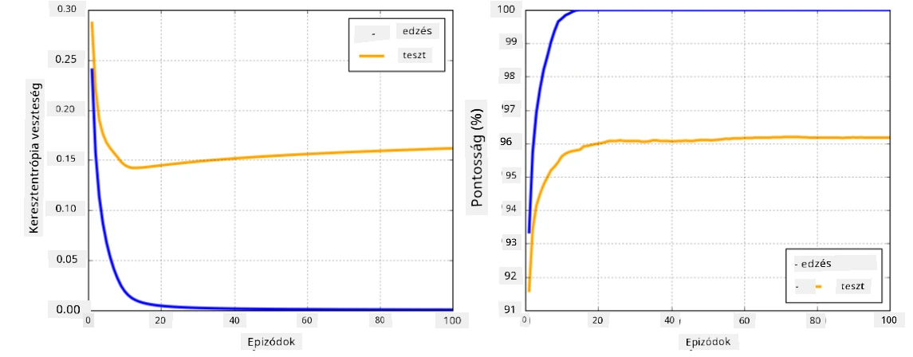

# Neurális hálózati keretrendszerek

Ahogy már megtanultuk, a neurális hálózatok hatékony tanításához két dolgot kell megtennünk:

* Tensorokon kell műveleteket végezni, például szorzás, összeadás, valamint bizonyos függvények, mint a sigmoid vagy softmax kiszámítása.
* Az összes kifejezés gradiensét ki kell számítani, hogy gradient descent optimalizációt végezhessünk.

## [Előadás előtti kvíz](https://ff-quizzes.netlify.app/en/ai/quiz/9)

Míg a `numpy` könyvtár képes az első feladatot elvégezni, szükségünk van egy mechanizmusra a gradiens számításához. Az [általunk fejlesztett keretrendszerben](../04-OwnFramework/OwnFramework.ipynb), amelyet az előző szakaszban készítettünk, manuálisan kellett programoznunk az összes derivált függvényt a `backward` metódusban, amely a visszaterjesztést végzi. Ideális esetben egy keretrendszer lehetőséget kell adjon arra, hogy *bármilyen kifejezés* gradiensét kiszámítsuk, amelyet definiálni tudunk.

Egy másik fontos dolog, hogy képesek legyünk számításokat végezni GPU-n vagy más speciális számítási egységeken, mint például [TPU](https://en.wikipedia.org/wiki/Tensor_Processing_Unit). A mély neurális hálózatok tanítása *rengeteg* számítást igényel, és nagyon fontos, hogy ezeket a számításokat párhuzamosítsuk GPU-kon.

> ✅ A 'párhuzamosítás' kifejezés azt jelenti, hogy a számításokat több eszköz között osztjuk el.

Jelenleg a két legnépszerűbb neurális keretrendszer: [TensorFlow](http://TensorFlow.org) és [PyTorch](https://pytorch.org/). Mindkettő alacsony szintű API-t biztosít a tensorokkal való műveletekhez, mind CPU-n, mind GPU-n. Az alacsony szintű API mellett van egy magasabb szintű API is, amelyet [Keras](https://keras.io/) és [PyTorch Lightning](https://pytorchlightning.ai/) néven ismerünk.

Alacsony szintű API | [TensorFlow](http://TensorFlow.org) | [PyTorch](https://pytorch.org/)
--------------------|-------------------------------------|--------------------------------
Magas szintű API   | [Keras](https://keras.io/)         | [PyTorch Lightning](https://pytorchlightning.ai/)

**Az alacsony szintű API-k** mindkét keretrendszerben lehetővé teszik úgynevezett **számítási gráfok** létrehozását. Ez a gráf meghatározza, hogyan kell kiszámítani a kimenetet (általában a veszteségfüggvényt) adott bemeneti paraméterekkel, és GPU-ra is küldhető számításra, ha elérhető. Vannak funkciók, amelyekkel differenciálhatjuk ezt a számítási gráfot, és kiszámíthatjuk a gradiens értékeket, amelyeket aztán a modell paramétereinek optimalizálására használhatunk.

**A magas szintű API-k** a neurális hálózatokat gyakorlatilag **rétegek sorozataként** kezelik, és a legtöbb neurális hálózat felépítését jelentősen leegyszerűsítik. A modell tanítása általában az adatok előkészítését és egy `fit` függvény meghívását igényli.

A magas szintű API lehetővé teszi, hogy tipikus neurális hálózatokat nagyon gyorsan felépítsünk anélkül, hogy sok részlettel kellene foglalkoznunk. Ugyanakkor az alacsony szintű API sokkal nagyobb kontrollt biztosít a tanítási folyamat felett, ezért gyakran használják kutatások során, amikor új neurális hálózati architektúrákkal dolgozunk.

Fontos megérteni, hogy mindkét API együtt is használható, például saját hálózati rétegarchitektúrát fejleszthetünk alacsony szintű API-val, majd használhatjuk azt egy nagyobb hálózatban, amelyet magas szintű API-val építettünk és tanítottunk. Vagy definiálhatunk egy hálózatot magas szintű API-val rétegek sorozataként, majd saját alacsony szintű tanítási ciklust használhatunk az optimalizációhoz. Mindkét API ugyanazokat az alapvető koncepciókat használja, és úgy tervezték őket, hogy jól működjenek együtt.

## Tanulás

Ebben a kurzusban a legtöbb tartalmat mind PyTorch, mind TensorFlow keretrendszerhez kínáljuk. Választhatod a preferált keretrendszert, és csak a megfelelő jegyzetfüzeteket tanulmányozhatod. Ha nem vagy biztos benne, melyik keretrendszert válaszd, olvass el néhány vitát az interneten a **PyTorch vs. TensorFlow** témában. Megnézheted mindkét keretrendszert is, hogy jobban megértsd őket.

Ahol lehetséges, magas szintű API-kat fogunk használni az egyszerűség kedvéért. Ugyanakkor fontosnak tartjuk, hogy megértsük, hogyan működnek a neurális hálózatok az alapoktól kezdve, ezért az elején alacsony szintű API-val és tensorokkal kezdünk dolgozni. Ha azonban gyorsan szeretnél haladni, és nem akarsz sok időt tölteni ezeknek a részleteknek a tanulásával, kihagyhatod ezeket, és közvetlenül a magas szintű API jegyzetfüzetekbe léphetsz.

## ✍️ Gyakorlatok: Keretrendszerek

Folytasd a tanulást az alábbi jegyzetfüzetekben:

Alacsony szintű API | [TensorFlow+Keras Jegyzetfüzet](IntroKerasTF.ipynb) | [PyTorch](IntroPyTorch.ipynb)
--------------------|-------------------------------------|--------------------------------
Magas szintű API   | [Keras](IntroKeras.ipynb)         | *PyTorch Lightning*

Miután elsajátítottad a keretrendszereket, tekintsük át az overfitting fogalmát.

# Overfitting

Az overfitting rendkívül fontos fogalom a gépi tanulásban, és nagyon fontos, hogy helyesen értsük meg!

Vegyük például az alábbi problémát, amelyben 5 pontot próbálunk közelíteni (a grafikonokon `x` jelöli a pontokat):

 | 
-------------------------|--------------------------
**Lineáris modell, 2 paraméter** | **Nemlineáris modell, 7 paraméter**
Tanítási hiba = 5.3 | Tanítási hiba = 0
Validációs hiba = 5.1 | Validációs hiba = 20

* A bal oldalon egy jó egyenes vonal közelítést látunk. Mivel a paraméterek száma megfelelő, a modell helyesen érti a pontok eloszlásának lényegét.
* A jobb oldalon a modell túl erős. Mivel csak 5 pontunk van, és a modellnek 7 paramétere van, úgy tudja beállítani magát, hogy minden ponton áthaladjon, így a tanítási hiba 0 lesz. Ez azonban megakadályozza, hogy a modell megértse az adatok mögötti helyes mintázatot, így a validációs hiba nagyon magas.

Nagyon fontos megtalálni a megfelelő egyensúlyt a modell gazdagsága (paraméterek száma) és a tanítási minták száma között.

## Miért fordul elő overfitting?

  * Nem elég tanítási adat
  * Túl erős modell
  * Túl sok zaj a bemeneti adatokban

## Hogyan észlelhető az overfitting?

Ahogy a fenti grafikonon látható, az overfittinget nagyon alacsony tanítási hiba és magas validációs hiba jelezheti. Általában a tanítás során mind a tanítási, mind a validációs hibák csökkenni kezdenek, majd egy ponton a validációs hiba megállhat a csökkenésben, és növekedni kezdhet. Ez az overfitting jele, és annak indikátora, hogy valószínűleg abba kell hagynunk a tanítást (vagy legalábbis készítenünk kell egy pillanatképet a modellről).

## Hogyan előzhető meg az overfitting?

Ha látod, hogy overfitting történik, az alábbiakat teheted:

 * Növeld a tanítási adatok mennyiségét
 * Csökkentsd a modell komplexitását
 * Használj valamilyen [regularizációs technikát](../../4-ComputerVision/08-TransferLearning/TrainingTricks.md), például [Dropout](../../4-ComputerVision/08-TransferLearning/TrainingTricks.md#Dropout), amelyet később megvizsgálunk.

## Overfitting és Bias-Variance Tradeoff

Az overfitting valójában egy általánosabb statisztikai probléma, amelyet [Bias-Variance Tradeoff](https://en.wikipedia.org/wiki/Bias%E2%80%93variance_tradeoff) néven ismerünk. Ha megvizsgáljuk a modellünk hibáinak lehetséges forrásait, kétféle hibát láthatunk:

* **Bias hibák**, amelyeket az algoritmusunk okoz, mert nem képes helyesen megragadni a tanítási adatok közötti kapcsolatot. Ez abból adódhat, hogy a modellünk nem elég erős (**underfitting**).
* **Variance hibák**, amelyeket az okoz, hogy a modell a bemeneti adatok zaját közelíti, ahelyett, hogy a jelentős kapcsolatot ragadná meg (**overfitting**).

A tanítás során a bias hiba csökken (ahogy a modell megtanulja közelíteni az adatokat), míg a variance hiba növekszik. Fontos, hogy megállítsuk a tanítást - akár manuálisan (amikor észleljük az overfittinget), akár automatikusan (regularizáció bevezetésével) -, hogy megelőzzük az overfittinget.

## Összegzés

Ebben a leckében megtanultad a különbségeket a két legnépszerűbb AI keretrendszer, a TensorFlow és a PyTorch különböző API-i között. Emellett megismerkedtél egy nagyon fontos témával, az overfittinggel.

## 🚀 Kihívás

Az ehhez kapcsolódó jegyzetfüzetek alján 'feladatokat' találsz; dolgozd át a jegyzetfüzeteket, és végezd el a feladatokat.

## [Előadás utáni kvíz](https://ff-quizzes.netlify.app/en/ai/quiz/10)

## Áttekintés és önálló tanulás

Végezz kutatást az alábbi témákban:

- TensorFlow
- PyTorch
- Overfitting

Tedd fel magadnak az alábbi kérdéseket:

- Mi a különbség a TensorFlow és a PyTorch között?
- Mi a különbség az overfitting és az underfitting között?

## [Feladat](lab/README.md)

Ebben a laborban két osztályozási problémát kell megoldanod egy- és többrétegű teljesen összekapcsolt hálózatokkal, PyTorch vagy TensorFlow használatával.

* [Útmutató](lab/README.md)
* [Jegyzetfüzet](lab/LabFrameworks.ipynb)

---

