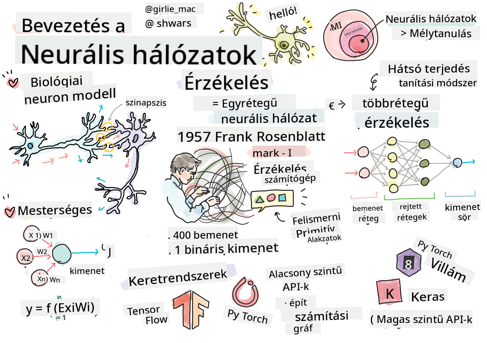

<!--
CO_OP_TRANSLATOR_METADATA:
{
  "original_hash": "f862a99d88088163df12270e2f2ad6c3",
  "translation_date": "2025-10-03T12:52:09+00:00",
  "source_file": "lessons/3-NeuralNetworks/README.md",
  "language_code": "hu"
}
-->
# Bevezetés a neurális hálózatokba

Ahogy a bevezetőben tárgyaltuk, az intelligencia egyik elérési módja egy **számítógépes modell** vagy egy **mesterséges agy** tanítása. A 20. század közepe óta a kutatók különböző matematikai modelleket próbáltak ki, míg az utóbbi években ez az irány rendkívül sikeresnek bizonyult. Az agy ilyen matematikai modelljeit **neurális hálózatoknak** nevezzük.

> Néha a neurális hálózatokat *Mesterséges Neurális Hálózatoknak* (Artificial Neural Networks, ANNs) nevezik, hogy jelezzék, modellekről van szó, nem valódi neuronhálózatokról.

## Gépi tanulás

A neurális hálózatok egy nagyobb tudományterület, a **gépi tanulás** részét képezik, amelynek célja, hogy adatokat használva olyan számítógépes modelleket tanítsunk, amelyek képesek problémák megoldására. A gépi tanulás az egyik fő része a mesterséges intelligenciának, azonban ebben a tananyagban nem foglalkozunk a klasszikus gépi tanulással.

> Látogasd meg különálló **[Gépi tanulás kezdőknek](http://github.com/microsoft/ml-for-beginners)** tananyagunkat, hogy többet megtudj a klasszikus gépi tanulásról.

A gépi tanulásban feltételezzük, hogy van egy példákból álló **X** adathalmazunk és a hozzájuk tartozó kimeneti értékek **Y**. A példák gyakran N-dimenziós vektorok, amelyek **jellemzőkből** állnak, míg a kimeneteket **címkéknek** nevezzük.

A két leggyakoribb gépi tanulási problémát fogjuk megvizsgálni:

* **Osztályozás**, ahol egy bemeneti objektumot kell két vagy több osztályba sorolni.
* **Regresszió**, ahol minden bemeneti mintához egy numerikus értéket kell előre jelezni.

> Ha a bemeneteket és kimeneteket tenzorként ábrázoljuk, a bemeneti adathalmaz egy M&times;N méretű mátrix, ahol M a minták száma, N pedig a jellemzők száma. A kimeneti címkék Y egy M méretű vektor.

Ebben a tananyagban kizárólag neurális hálózati modellekre fogunk összpontosítani.

## Egy neuron modellje

A biológiából tudjuk, hogy az agyunk neurális sejtekből (neuronokból) áll, amelyek mindegyike több "bemenettel" (dendritek) és egyetlen "kimenettel" (axon) rendelkezik. Mind a dendritek, mind az axonok képesek elektromos jeleket vezetni, és a köztük lévő kapcsolatok — szinapszisok — különböző vezetőképességet mutathatnak, amelyeket neurotranszmitterek szabályoznak.

 | 
----|----
Valódi neuron *([Kép](https://en.wikipedia.org/wiki/Synapse#/media/File:SynapseSchematic_lines.svg) a Wikipédiáról)* | Mesterséges neuron *(Kép a szerzőtől)*

Így a neuron legegyszerűbb matematikai modellje több bemenetet tartalmaz X1, ..., XN, egy kimenetet Y, valamint egy sor súlyt W1, ..., WN. A kimenet a következőképpen számítható:

ahol f egy nemlineáris **aktivációs függvény**.

> A neuron korai modelljeit Warren McCullock és Walter Pitts 1943-as klasszikus cikkében [A logical calculus of the ideas immanent in nervous activity](https://www.cs.cmu.edu/~./epxing/Class/10715/reading/McCulloch.and.Pitts.pdf) írták le. Donald Hebb "[The Organization of Behavior: A Neuropsychological Theory](https://books.google.com/books?id=VNetYrB8EBoC)" című könyvében javasolta, hogyan lehet ezeket a hálózatokat tanítani.

## Ebben a szakaszban

Ebben a szakaszban a következőkről fogunk tanulni:
* [Perceptron](03-Perceptron/README.md), az egyik legkorábbi neurális hálózati modell kétosztályos osztályozáshoz
* [Többrétegű hálózatok](04-OwnFramework/README.md) egy párosított jegyzetfüzettel [hogyan építsünk saját keretrendszert](04-OwnFramework/OwnFramework.ipynb)
* [Neurális hálózati keretrendszerek](05-Frameworks/README.md), ezekkel a jegyzetfüzetekkel: [PyTorch](05-Frameworks/IntroPyTorch.ipynb) és [Keras/Tensorflow](05-Frameworks/IntroKerasTF.ipynb)
* [Túltanulás](../../../../lessons/3-NeuralNetworks/05-Frameworks)

---

**Felelősség kizárása**:  
Ez a dokumentum az [Co-op Translator](https://github.com/Azure/co-op-translator) AI fordítási szolgáltatás segítségével lett lefordítva. Bár törekszünk a pontosságra, kérjük, vegye figyelembe, hogy az automatikus fordítások hibákat vagy pontatlanságokat tartalmazhatnak. Az eredeti dokumentum az eredeti nyelvén tekintendő hiteles forrásnak. Fontos információk esetén javasolt professzionális emberi fordítást igénybe venni. Nem vállalunk felelősséget semmilyen félreértésért vagy téves értelmezésért, amely a fordítás használatából eredhet.