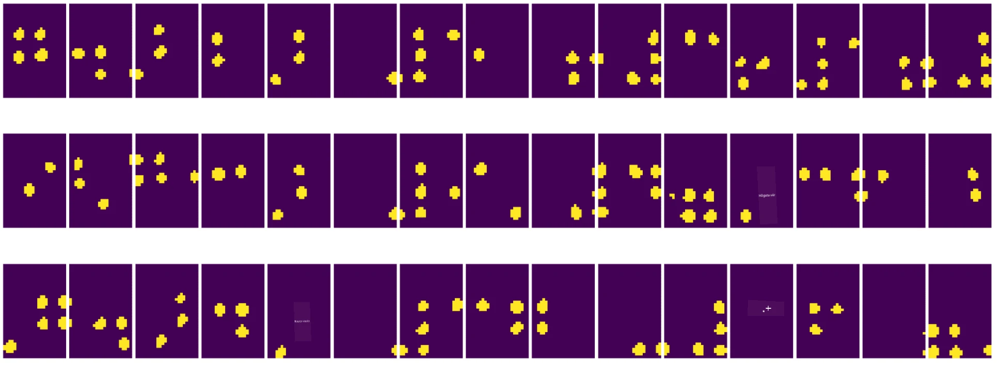

# Bevezetés a Számítógépes Látásba

A [Számítógépes Látás](https://wikipedia.org/wiki/Computer_vision) egy olyan tudományág, amelynek célja, hogy a számítógépek magas szintű megértést szerezzenek digitális képekből. Ez egy meglehetősen tág definíció, mivel a *megértés* sokféle dolgot jelenthet, például egy objektum megtalálását egy képen (**objektumdetektálás**), annak megértését, hogy mi történik (**eseménydetektálás**), egy kép szöveges leírását, vagy egy jelenet 3D-s rekonstrukcióját. Vannak speciális feladatok is, amelyek az emberi képekkel kapcsolatosak: életkor- és érzelemfelismerés, arcfelismerés és azonosítás, valamint 3D testtartás becslés, hogy csak néhányat említsünk.

## [Előadás előtti kvíz](https://ff-quizzes.netlify.app/en/ai/quiz/11)

A számítógépes látás egyik legegyszerűbb feladata a **képosztályozás**.

A számítógépes látást gyakran az AI egyik ágának tekintik. Manapság a számítógépes látás feladatainak többségét neurális hálózatokkal oldják meg. Ebben a szakaszban többet fogunk tanulni a számítógépes látásra használt speciális neurális hálózatokról, a [konvolúciós neurális hálózatokról](../07-ConvNets/README.md).

Azonban mielőtt egy képet neurális hálózatnak adnánk, sok esetben érdemes algoritmikus technikákat alkalmazni a kép javítására.

Számos Python könyvtár érhető el képfeldolgozáshoz:

* **[imageio](https://imageio.readthedocs.io/en/stable/)** különböző képformátumok olvasására/írására használható. Támogatja az ffmpeg-et is, amely hasznos eszköz a videókeretek képekké alakításához.
* **[Pillow](https://pillow.readthedocs.io/en/stable/index.html)** (más néven PIL) valamivel erősebb, és támogat néhány képmódosítást, például morfolást, paletta beállításokat és egyebeket.
* **[OpenCV](https://opencv.org/)** egy erőteljes képfeldolgozó könyvtár, amely C++-ban íródott, és a képfeldolgozás *de facto* szabványává vált. Kényelmes Python interfésszel rendelkezik.
* **[dlib](http://dlib.net/)** egy C++ könyvtár, amely számos gépi tanulási algoritmust valósít meg, beleértve néhány számítógépes látás algoritmust is. Python interfésszel is rendelkezik, és kihívást jelentő feladatokra, például arcfelismerésre és arcvonás detektálásra használható.

## OpenCV

Az [OpenCV](https://opencv.org/) a képfeldolgozás *de facto* szabványának számít. Számos hasznos algoritmust tartalmaz, amelyek C++-ban vannak implementálva. Az OpenCV-t Pythonból is hívhatjuk.

Az OpenCV tanulásához jó kiindulópont [ez az OpenCV tanfolyam](https://learnopencv.com/getting-started-with-opencv/). A tananyagunkban nem az OpenCV megtanulása a cél, hanem néhány példa bemutatása arra, hogy mikor és hogyan használható.

### Képek betöltése

A képek Pythonban kényelmesen ábrázolhatók NumPy tömbök segítségével. Például egy 320x200 pixeles szürkeárnyalatos kép egy 200x320-as tömbben tárolódik, míg egy ugyanolyan méretű színes kép alakja 200x320x3 (a 3 színcsatorna miatt). Egy kép betöltéséhez az alábbi kódot használhatjuk:

```python
import cv2
import matplotlib.pyplot as plt

im = cv2.imread('image.jpeg')
plt.imshow(im)
```

Hagyományosan az OpenCV a BGR (Kék-Zöld-Piros) kódolást használja színes képekhez, míg a többi Python eszköz a hagyományosabb RGB (Piros-Zöld-Kék) kódolást. Ahhoz, hogy a kép helyesen jelenjen meg, át kell alakítani az RGB színtérbe, akár a NumPy tömb dimenzióinak cseréjével, akár egy OpenCV függvény hívásával:

```python
im = cv2.cvtColor(im,cv2.COLOR_BGR2RGB)
```

Ugyanaz a `cvtColor` függvény használható más színtér átalakításokhoz is, például egy kép szürkeárnyalatossá vagy HSV (Színárnyalat-Telítettség-Érték) színtérré alakításához.

Az OpenCV segítségével videókat is betölthetünk képkockánként - erre példa található az [OpenCV Notebook](OpenCV.ipynb) gyakorlatban.

### Képfeldolgozás

Mielőtt egy képet neurális hálózatnak adnánk, érdemes lehet több előfeldolgozási lépést alkalmazni. Az OpenCV számos dolgot tud, például:

* **Átméretezés** a képen `im = cv2.resize(im, (320,200),interpolation=cv2.INTER_LANCZOS)` használatával
* **Homályosítás** a képen `im = cv2.medianBlur(im,3)` vagy `im = cv2.GaussianBlur(im, (3,3), 0)` használatával
* A kép **fényességének és kontrasztjának** megváltoztatása NumPy tömb manipulációkkal végezhető, ahogy [ebben a Stackoverflow bejegyzésben](https://stackoverflow.com/questions/39308030/how-do-i-increase-the-contrast-of-an-image-in-python-opencv) le van írva.
* [Küszöbérték alkalmazása](https://docs.opencv.org/4.x/d7/d4d/tutorial_py_thresholding.html) a `cv2.threshold`/`cv2.adaptiveThreshold` függvények hívásával, amely gyakran előnyösebb, mint a fényesség vagy kontraszt beállítása.
* Különböző [transzformációk](https://docs.opencv.org/4.5.5/da/d6e/tutorial_py_geometric_transformations.html) alkalmazása a képen:
    - **[Affin transzformációk](https://docs.opencv.org/4.5.5/d4/d61/tutorial_warp_affine.html)** hasznosak lehetnek, ha forgatást, átméretezést és torzítást kell kombinálni a képen, és ismerjük három pont forrás- és célhelyzetét a képen. Az affin transzformációk párhuzamos vonalakat párhuzamosan tartanak.
    - **[Perspektíva transzformációk](https://medium.com/analytics-vidhya/opencv-perspective-transformation-9edffefb2143)** hasznosak lehetnek, ha ismerjük négy pont forrás- és célhelyzetét a képen. Például, ha egy téglalap alakú dokumentumot okostelefon kamerájával valamilyen szögből fényképezünk, és a dokumentum téglalap alakú képét szeretnénk elkészíteni.
* Mozgás megértése a képen belül **[optikai áramlás](https://docs.opencv.org/4.5.5/d4/dee/tutorial_optical_flow.html)** használatával.

## Számítógépes Látás használati példák

Az [OpenCV Notebook](OpenCV.ipynb) példákban bemutatjuk, hogy a számítógépes látás hogyan használható konkrét feladatok elvégzésére:

* **Egy Braille könyv fényképének előfeldolgozása**. Arra összpontosítunk, hogyan használhatjuk a küszöbérték alkalmazást, jellemzők detektálását, perspektíva transzformációt és NumPy manipulációkat az egyes Braille szimbólumok elkülönítésére, hogy azokat később neurális hálózat osztályozza.

 |  | 
----|-----|-----

> Kép az [OpenCV.ipynb](OpenCV.ipynb)-ből

* **Mozgás detektálása videóban képkocka különbséggel**. Ha a kamera fix, akkor a kamera képkockái elég hasonlóak kell legyenek egymáshoz. Mivel a képkockák tömbként vannak ábrázolva, egyszerűen a két egymást követő képkocka tömbjeinek kivonásával megkapjuk a pixelkülönbséget, amely alacsony lesz statikus képkockák esetén, és magasabb lesz, ha jelentős mozgás van a képen.


> Kép az [OpenCV.ipynb](OpenCV.ipynb)-ből

* **Mozgás detektálása optikai áramlás használatával**. Az [optikai áramlás](https://docs.opencv.org/3.4/d4/dee/tutorial_optical_flow.html) lehetővé teszi, hogy megértsük, hogyan mozognak az egyes pixelek a videó képkockáin. Az optikai áramlásnak két típusa van:

   - **Sűrű optikai áramlás** kiszámítja a vektormezőt, amely megmutatja, hogy minden pixel hova mozog
   - **Ritka optikai áramlás** az alapján működik, hogy néhány jellegzetes jellemzőt vesz a képen (pl. élek), és ezek pályáját építi fel képkockáról képkockára.


> Kép az [OpenCV.ipynb](OpenCV.ipynb)-ből

## ✍️ Példa Notebookok: OpenCV [próbáld ki az OpenCV-t akcióban](OpenCV.ipynb)

Kísérletezzünk az OpenCV-vel az [OpenCV Notebook](OpenCV.ipynb) felfedezésével.

## Összegzés

Néha viszonylag összetett feladatok, mint például mozgásdetektálás vagy ujjhegy detektálás, tisztán számítógépes látással is megoldhatók. Ezért nagyon hasznos ismerni a számítógépes látás alapvető technikáit, és hogy mit tudnak az olyan könyvtárak, mint az OpenCV.

## 🚀 Kihívás

Nézd meg [ezt a videót](https://docs.microsoft.com/shows/ai-show/ai-show--2021-opencv-ai-competition--grand-prize-winners--cortic-tigers--episode-32?WT.mc_id=academic-77998-cacaste) az AI Show-ból, hogy megismerd a Cortic Tigers projektet, és hogyan építettek egy blokk-alapú megoldást a számítógépes látási feladatok demokratizálására egy robot segítségével. Kutass más hasonló projekteket, amelyek segítenek új tanulók bevonásában a területre.

## [Előadás utáni kvíz](https://ff-quizzes.netlify.app/en/ai/quiz/12)

## Áttekintés és önálló tanulás

Olvass többet az optikai áramlásról [ebben a remek útmutatóban](https://learnopencv.com/optical-flow-in-opencv/).

## [Feladat](lab/README.md)

Ebben a laborban egy egyszerű gesztusokat tartalmazó videót fogsz készíteni, és a célod az optikai áramlás segítségével fel/le/balra/jobbra mozgások kinyerése.


---

