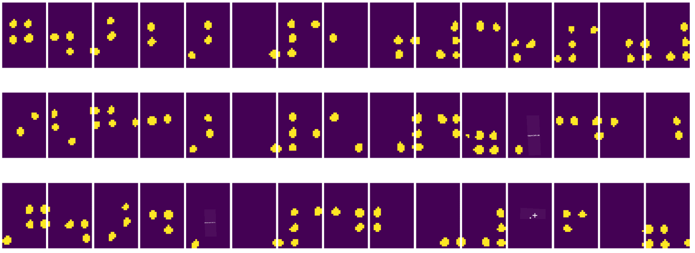

<!--
CO_OP_TRANSLATOR_METADATA:
{
  "original_hash": "4bedc8e702db17260cfe824d58b6cfd4",
  "translation_date": "2025-08-25T22:59:25+00:00",
  "source_file": "lessons/4-ComputerVision/06-IntroCV/README.md",
  "language_code": "hu"
}
-->
# Bevezetés a Számítógépes Látásba

A [Számítógépes Látás](https://wikipedia.org/wiki/Computer_vision) egy olyan tudományág, amelynek célja, hogy a számítógépek magas szintű megértést szerezzenek digitális képekből. Ez egy meglehetősen tág meghatározás, mivel a *megértés* sok mindent jelenthet, például egy objektum megtalálását egy képen (**objektumdetektálás**), annak megértését, hogy mi történik (**eseménydetektálás**), egy kép szöveges leírását, vagy egy jelenet 3D-s rekonstrukcióját. Vannak speciális feladatok is, amelyek az emberi képekkel kapcsolatosak: életkor- és érzelemfelismerés, arcfelismerés és azonosítás, valamint 3D testtartás becslés, hogy csak néhányat említsünk.

## [Előadás előtti kvíz](https://red-field-0a6ddfd03.1.azurestaticapps.net/quiz/106)

A számítógépes látás egyik legegyszerűbb feladata a **képosztályozás**.

A számítógépes látást gyakran az MI egyik ágának tekintik. Manapság a legtöbb számítógépes látási feladatot neurális hálózatokkal oldják meg. Ebben a részben többet fogunk tanulni a számítógépes látásra használt speciális neurális hálózatokról, a [konvolúciós neurális hálózatokról](../07-ConvNets/README.md).

Azonban mielőtt egy képet neurális hálózatba küldenénk, sok esetben érdemes algoritmikus technikákat alkalmazni a kép javítására.

Számos Python könyvtár érhető el képfeldolgozáshoz:

* **[imageio](https://imageio.readthedocs.io/en/stable/)** különböző képformátumok olvasására/írására használható. Támogatja az ffmpeg-et is, amely hasznos eszköz videókeretek képekké alakításához.
* **[Pillow](https://pillow.readthedocs.io/en/stable/index.html)** (más néven PIL) valamivel erősebb, és támogat néhány képmódosítást, például morfológiai műveleteket, paletta beállításokat és még sok mást.
* **[OpenCV](https://opencv.org/)** egy erőteljes képfeldolgozó könyvtár, amely C++-ban íródott, és a képfeldolgozás *de facto* szabványává vált. Kényelmes Python interfésszel rendelkezik.
* **[dlib](http://dlib.net/)** egy C++ könyvtár, amely számos gépi tanulási algoritmust valósít meg, beleértve néhány számítógépes látási algoritmust is. Python interfésszel is rendelkezik, és kihívást jelentő feladatokhoz, például arcfelismeréshez és arcvonás detektáláshoz használható.

## OpenCV

Az [OpenCV](https://opencv.org/) a képfeldolgozás *de facto* szabványának számít. Számos hasznos algoritmust tartalmaz, amelyek C++-ban vannak implementálva. Az OpenCV-t Pythonból is meghívhatjuk.

Egy jó hely az OpenCV tanulásához a [Learn OpenCV kurzus](https://learnopencv.com/getting-started-with-opencv/). A tananyagunkban nem az OpenCV megtanulása a cél, hanem az, hogy bemutassunk néhány példát arra, mikor és hogyan használható.

### Képek betöltése

A Pythonban a képek kényelmesen ábrázolhatók NumPy tömbökkel. Például egy 320x200 pixeles szürkeárnyalatos kép egy 200x320-as tömbben tárolódik, míg egy ugyanolyan méretű színes kép alakja 200x320x3 (a 3 színcsatorna miatt). Egy kép betöltéséhez az alábbi kódot használhatjuk:

```python
import cv2
import matplotlib.pyplot as plt

im = cv2.imread('image.jpeg')
plt.imshow(im)
```

Hagyományosan az OpenCV a színes képekhez BGR (Kék-Zöld-Piros) kódolást használ, míg a Python többi eszköze a hagyományosabb RGB (Piros-Zöld-Kék) kódolást alkalmazza. Ahhoz, hogy a kép helyesen jelenjen meg, át kell alakítani az RGB színtérbe, akár a NumPy tömb dimenzióinak felcserélésével, akár egy OpenCV függvény meghívásával:

```python
im = cv2.cvtColor(im,cv2.COLOR_BGR2RGB)
```

Ugyanez a `cvtColor` függvény más színtér-átalakításokhoz is használható, például egy kép szürkeárnyalatossá vagy HSV (Színárnyalat-Telítettség-Érték) színtérbe történő átalakításához.

Az OpenCV segítségével videókat is betölthetünk képkockánként – erre példa található a [OpenCV Notebook](../../../../../lessons/4-ComputerVision/06-IntroCV/OpenCV.ipynb) gyakorlatban.

### Képfeldolgozás

Mielőtt egy képet neurális hálózatba küldenénk, érdemes lehet több előfeldolgozási lépést alkalmazni. Az OpenCV számos dolgot képes elvégezni, például:

* A kép **átméretezése** `im = cv2.resize(im, (320,200),interpolation=cv2.INTER_LANCZOS)` használatával
* A kép **elmosása** `im = cv2.medianBlur(im,3)` vagy `im = cv2.GaussianBlur(im, (3,3), 0)` segítségével
* A kép **fényességének és kontrasztjának** megváltoztatása NumPy tömbműveletekkel, ahogy azt [ebben a Stackoverflow bejegyzésben](https://stackoverflow.com/questions/39308030/how-do-i-increase-the-contrast-of-an-image-in-python-opencv) leírják.
* [Küszöbölés](https://docs.opencv.org/4.x/d7/d4d/tutorial_py_thresholding.html) alkalmazása `cv2.threshold`/`cv2.adaptiveThreshold` függvényekkel, amely gyakran előnyösebb, mint a fényesség vagy kontraszt beállítása.
* Különböző [transzformációk](https://docs.opencv.org/4.5.5/da/d6e/tutorial_py_geometric_transformations.html) alkalmazása a képre:
    - **[Affin transzformációk](https://docs.opencv.org/4.5.5/d4/d61/tutorial_warp_affine.html)** hasznosak lehetnek, ha forgatást, átméretezést és torzítást kell kombinálni a képen, és ismerjük a kép három pontjának forrás- és célhelyzetét. Az affin transzformációk párhuzamos vonalakat párhuzamosan tartanak.
    - **[Perspektíva transzformációk](https://medium.com/analytics-vidhya/opencv-perspective-transformation-9edffefb2143)** hasznosak lehetnek, ha ismerjük a kép négy pontjának forrás- és célhelyzetét. Például, ha egy téglalap alakú dokumentumot okostelefon kamerájával szögből fényképezünk, és a dokumentumról magáról téglalap alakú képet szeretnénk készíteni.
* Mozgás megértése a képen belül **[optikai áramlás](https://docs.opencv.org/4.5.5/d4/dee/tutorial_optical_flow.html)** segítségével.

## Számítógépes Látás Alkalmazási Példák

A [OpenCV Notebook](../../../../../lessons/4-ComputerVision/06-IntroCV/OpenCV.ipynb) példákban bemutatjuk, hogy a számítógépes látás hogyan használható konkrét feladatok elvégzésére:

* **Egy Braille könyv fényképének előfeldolgozása**. Arra összpontosítunk, hogyan használhatjuk a küszöbölést, jellemződetektálást, perspektíva transzformációt és NumPy manipulációkat az egyes Braille szimbólumok elkülönítésére, hogy azokat egy neurális hálózat tovább osztályozhassa.

 |  | 
----|-----|-----

> Kép a [OpenCV.ipynb](../../../../../lessons/4-ComputerVision/06-IntroCV/OpenCV.ipynb) fájlból

* **Mozgás detektálása videóban képkocka-különbséggel**. Ha a kamera rögzített, akkor a kamera képkockái általában nagyon hasonlóak egymáshoz. Mivel a képkockák tömbökként vannak ábrázolva, egyszerűen a két egymást követő képkocka tömbjeinek kivonásával megkapjuk a pixelek különbségét, amely alacsony lesz statikus képkockák esetén, és magasabbá válik, ha jelentős mozgás van a képen.


> Kép a [OpenCV.ipynb](../../../../../lessons/4-ComputerVision/06-IntroCV/OpenCV.ipynb) fájlból

* **Mozgás detektálása optikai áramlással**. Az [optikai áramlás](https://docs.opencv.org/3.4/d4/dee/tutorial_optical_flow.html) lehetővé teszi, hogy megértsük, hogyan mozognak az egyes pixelek a videó képkockáin. Az optikai áramlásnak két típusa van:

   - **Sűrű optikai áramlás**, amely vektormezőt számít ki, amely megmutatja, hogy az egyes pixelek hová mozognak
   - **Ritka optikai áramlás**, amely a kép néhány jellegzetes elemére (pl. élek) épül, és ezek pályáját építi fel képkockáról képkockára.


> Kép a [OpenCV.ipynb](../../../../../lessons/4-ComputerVision/06-IntroCV/OpenCV.ipynb) fájlból

## ✍️ Példa Jegyzetfüzetek: OpenCV [próbáld ki az OpenCV-t működés közben](../../../../../lessons/4-ComputerVision/06-IntroCV/OpenCV.ipynb)

Kísérletezzünk az OpenCV-vel a [OpenCV Notebook](../../../../../lessons/4-ComputerVision/06-IntroCV/OpenCV.ipynb) felfedezésével.

## Összegzés

Néha viszonylag összetett feladatok, mint például mozgásérzékelés vagy ujjhegyek detektálása, tisztán számítógépes látással is megoldhatók. Ezért nagyon hasznos ismerni a számítógépes látás alapvető technikáit, és hogy mit tudnak az olyan könyvtárak, mint az OpenCV.

## 🚀 Kihívás

Nézd meg [ezt a videót](https://docs.microsoft.com/shows/ai-show/ai-show--2021-opencv-ai-competition--grand-prize-winners--cortic-tigers--episode-32?WT.mc_id=academic-77998-cacaste) az AI Show-ból, hogy megismerd a Cortic Tigers projektet, és hogyan építettek egy blokk-alapú megoldást a számítógépes látási feladatok demokratizálására egy robot segítségével. Kutass más hasonló projekteket, amelyek segítenek az új tanulók bevonásában a területre.

## [Előadás utáni kvíz](https://red-field-0a6ddfd03.1.azurestaticapps.net/quiz/206)

## Áttekintés és Önálló Tanulás

Olvass többet az optikai áramlásról [ebben a remek útmutatóban](https://learnopencv.com/optical-flow-in-opencv/).

## [Feladat](lab/README.md)

Ebben a laborban egy egyszerű gesztusokat tartalmazó videót fogsz elemezni, és a célod az, hogy optikai áramlás segítségével kinyerd a fel/le/balra/jobbra mozgásokat.


**Felelősség kizárása**:  
Ez a dokumentum az AI fordítási szolgáltatás [Co-op Translator](https://github.com/Azure/co-op-translator) segítségével lett lefordítva. Bár igyekszünk pontosságra törekedni, kérjük, vegye figyelembe, hogy az automatikus fordítások hibákat vagy pontatlanságokat tartalmazhatnak. Az eredeti dokumentum az eredeti nyelvén tekintendő hiteles forrásnak. Fontos információk esetén javasolt professzionális emberi fordítást igénybe venni. Nem vállalunk felelősséget semmilyen félreértésért vagy téves értelmezésért, amely a fordítás használatából eredhet.