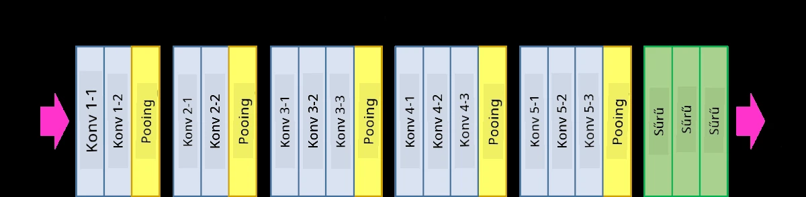
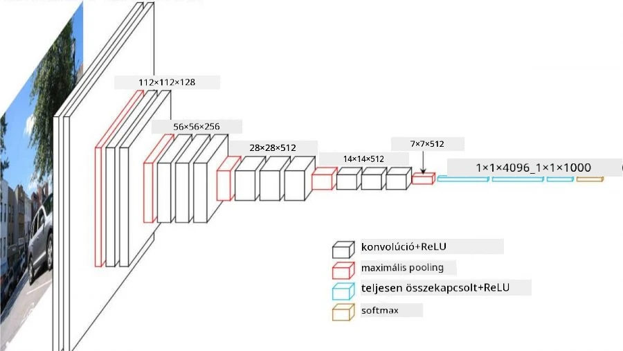
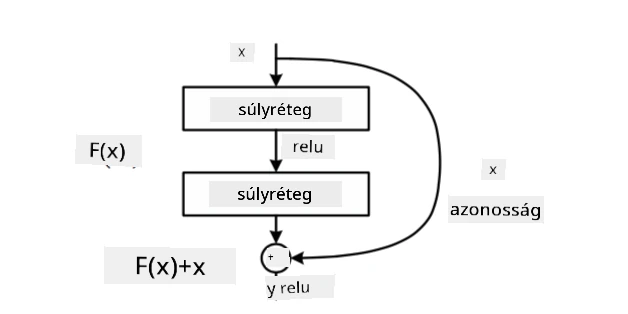
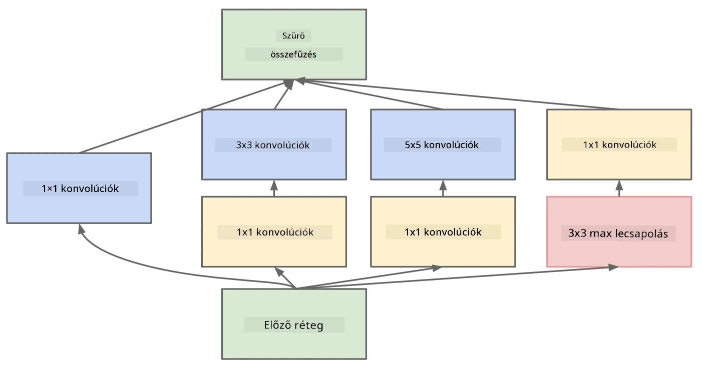

# Jól ismert CNN architektúrák

### VGG-16

A VGG-16 egy hálózat, amely 2014-ben 92,7%-os pontosságot ért el az ImageNet top-5 osztályozásban. Az alábbi rétegstruktúrával rendelkezik:

Ahogy látható, a VGG egy hagyományos piramis architektúrát követ, amely egy konvolúciós és pooling rétegek sorozata.

> Kép forrása: [Researchgate](https://www.researchgate.net/figure/Vgg16-model-structure-To-get-the-VGG-NIN-model-we-replace-the-2-nd-4-th-6-th-7-th_fig2_335194493)

### ResNet

A ResNet egy modellekből álló család, amelyet a Microsoft Research javasolt 2015-ben. A ResNet fő ötlete az **reziduális blokkok** használata:

> Kép forrása: [ez a tanulmány](https://arxiv.org/pdf/1512.03385.pdf)

Az identitás-átvezetés használatának oka, hogy a rétegünk **a különbséget** jósolja meg az előző réteg eredménye és a reziduális blokk kimenete között - innen ered a *reziduális* elnevezés. Ezeket a blokkokat sokkal könnyebb tanítani, és akár több száz ilyen blokkból álló hálózatokat is lehet építeni (a leggyakoribb változatok: ResNet-52, ResNet-101 és ResNet-152).

Ezt a hálózatot úgy is elképzelhetjük, mint amely képes a komplexitását a datasethez igazítani. Kezdetben, amikor elkezdjük tanítani a hálózatot, a súlyok értékei kicsik, és a legtöbb jel az identitás-átvezetési rétegeken keresztül halad. Ahogy a tanítás halad előre és a súlyok nagyobbak lesznek, a hálózati paraméterek jelentősége nő, és a hálózat alkalmazkodik ahhoz, hogy megfelelő kifejezőerőt biztosítson a tanítási képek helyes osztályozásához.

### Google Inception

A Google Inception architektúra ezt az ötletet egy lépéssel tovább viszi, és minden hálózati réteget több különböző útvonal kombinációjaként épít fel:

> Kép forrása: [Researchgate](https://www.researchgate.net/figure/Inception-module-with-dimension-reductions-left-and-schema-for-Inception-ResNet-v1_fig2_355547454)

Itt ki kell emelnünk az 1x1 konvolúciók szerepét, mert elsőre nem tűnnek logikusnak. Miért lenne szükségünk arra, hogy 1x1 szűrővel végigmenjünk a képen? Azonban emlékeznünk kell arra, hogy a konvolúciós szűrők több mélységi csatornával is dolgoznak (eredetileg - RGB színek, későbbi rétegekben - különböző szűrők csatornái), és az 1x1 konvolúciót arra használják, hogy ezeket a bemeneti csatornákat különböző tanítható súlyokkal összekeverjék. Ez úgy is tekinthető, mint csatorna dimenzióban történő mintavételezés (pooling).

Itt van [egy jó blogbejegyzés](https://medium.com/analytics-vidhya/talented-mr-1x1-comprehensive-look-at-1x1-convolution-in-deep-learning-f6b355825578) a témáról, és [az eredeti tanulmány](https://arxiv.org/pdf/1312.4400.pdf).

### MobileNet

A MobileNet egy modellekből álló család, amely csökkentett méretű, mobil eszközökre alkalmas. Használja őket, ha korlátozottak az erőforrásai, és hajlandó egy kis pontosságot feláldozni. A fő ötlet mögöttük az úgynevezett **mélységi szeparálható konvolúció**, amely lehetővé teszi, hogy a konvolúciós szűrőket térbeli konvolúciók és mélységi csatornákon végzett 1x1 konvolúció összetételével ábrázolják. Ez jelentősen csökkenti a paraméterek számát, így a hálózat kisebb méretű lesz, és kevesebb adattal is könnyebben tanítható.

Itt van [egy jó blogbejegyzés a MobileNetről](https://medium.com/analytics-vidhya/image-classification-with-mobilenet-cc6fbb2cd470).

## Következtetés

Ebben az egységben megismerte a számítógépes látás neurális hálózatainak fő koncepcióját - a konvolúciós hálózatokat. A valós életben használt architektúrák, amelyek képosztályozást, objektumfelismerést és akár képgenerálást is végeznek, mind CNN-ekre épülnek, csak több réteggel és néhány további tanítási trükkel.

## 🚀 Kihívás

A mellékelt jegyzetfüzetekben vannak megjegyzések az alján arról, hogyan lehet nagyobb pontosságot elérni. Végezzen kísérleteket, hogy megnézze, el tud-e érni nagyobb pontosságot.

## [Előadás utáni kvíz](https://ff-quizzes.netlify.app/en/ai/quiz/14)

## Áttekintés és önálló tanulás

Bár a CNN-eket leggyakrabban számítógépes látási feladatokhoz használják, általában jók fix méretű minták kinyerésére. Például, ha hangokkal dolgozunk, akkor is használhatunk CNN-eket, hogy bizonyos mintákat keressünk az audió jelben - ebben az esetben a szűrők 1-dimenziósak lennének (és ezt a CNN-t 1D-CNN-nek neveznénk). Néha 3D-CNN-t is használnak, hogy jellemzőket nyerjenek ki többdimenziós térben, például bizonyos események előfordulását videón - a CNN képes bizonyos mintákat megragadni a jellemzők időbeli változásában. Végezzen áttekintést és önálló tanulást arról, hogy milyen más feladatokat lehet elvégezni CNN-ekkel.

## [Feladat](lab/README.md)

Ebben a laborban különböző macska- és kutyafajták osztályozása a feladat. Ezek a képek összetettebbek, mint az MNIST adatállomány, nagyobb dimenziójúak, és több mint 10 osztály van.

---

