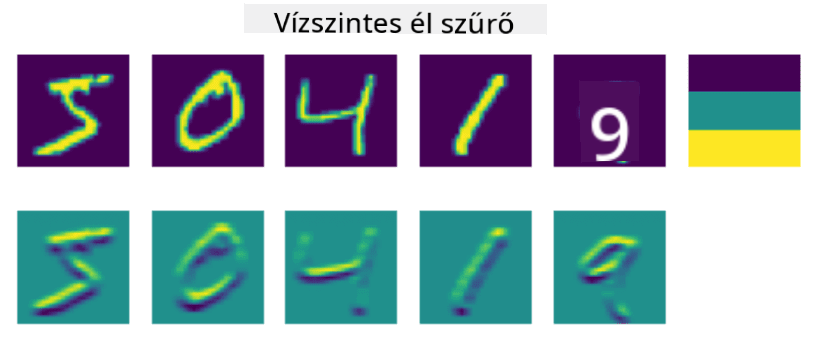
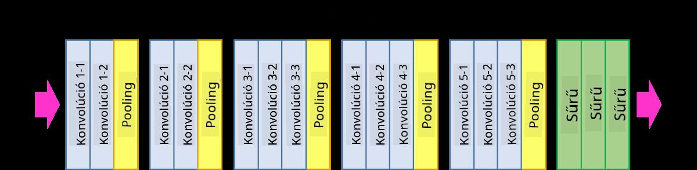

<!--
CO_OP_TRANSLATOR_METADATA:
{
  "original_hash": "a560d5b845962cf33dc102266e409568",
  "translation_date": "2025-09-23T11:10:10+00:00",
  "source_file": "lessons/4-ComputerVision/07-ConvNets/README.md",
  "language_code": "hu"
}
-->
# Konvolúciós Neurális Hálózatok

Korábban láttuk, hogy a neurális hálózatok elég jól kezelik a képeket, és még egy egyrétegű perceptron is képes az MNIST adathalmaz kézzel írt számjegyeit elfogadható pontossággal felismerni. Azonban az MNIST adathalmaz különleges, mivel az összes számjegy középre van igazítva a képen, ami egyszerűbbé teszi a feladatot.

## [Előadás előtti kvíz](https://ff-quizzes.netlify.app/en/ai/quiz/13)

A valóságban azt szeretnénk, hogy képesek legyünk felismerni tárgyakat egy képen, függetlenül azok pontos helyzetétől. A számítógépes látás különbözik az általános osztályozástól, mert amikor egy bizonyos tárgyat keresünk a képen, akkor a képet vizsgálva specifikus **mintázatokat** és azok kombinációit keressük. Például, ha egy macskát keresünk, először vízszintes vonalakat kereshetünk, amelyek bajuszokat alkothatnak, majd bizonyos bajusz-kombinációk alapján megállapíthatjuk, hogy valóban egy macska képe látható. A mintázatok relatív helyzete és jelenléte fontos, nem pedig azok pontos helyzete a képen.

A mintázatok kinyeréséhez a **konvolúciós szűrők** fogalmát használjuk. Mint tudjuk, egy kép egy 2D-mátrixként vagy egy színes mélységgel rendelkező 3D-tenzorként van ábrázolva. Egy szűrő alkalmazása azt jelenti, hogy veszünk egy viszonylag kicsi **szűrőmag** mátrixot, és az eredeti kép minden egyes pixelénél kiszámítjuk a súlyozott átlagot a szomszédos pontokkal. Ezt úgy képzelhetjük el, mint egy kis ablakot, amely végigcsúszik az egész képen, és az összes pixelt az ablakban lévő súlyok szerint átlagolja.

 | 
----|----

> Kép: Dmitry Soshnikov

Például, ha 3x3-as függőleges és vízszintes él szűrőket alkalmazunk az MNIST számjegyekre, kiemeléseket (pl. magas értékeket) kapunk ott, ahol az eredeti képen függőleges és vízszintes élek találhatók. Így ezek a szűrők használhatók az élek "keresésére". Hasonlóan, különböző szűrőket tervezhetünk más alacsony szintű mintázatok keresésére:

> Kép a [Leung-Malik szűrőbankról](https://www.robots.ox.ac.uk/~vgg/research/texclass/filters.html)

Bár manuálisan is tervezhetünk szűrőket bizonyos mintázatok kinyerésére, a hálózatot úgy is megtervezhetjük, hogy automatikusan megtanulja a mintázatokat. Ez az egyik fő ötlet a CNN mögött.

## A CNN fő ötletei

A CNN-ek működése a következő fontos ötleteken alapul:

* A konvolúciós szűrők képesek mintázatokat kinyerni.
* A hálózatot úgy tervezhetjük meg, hogy a szűrők automatikusan tanuljanak.
* Ugyanezt a megközelítést használhatjuk magas szintű jellemzők mintázatainak megtalálására is, nem csak az eredeti képen. Így a CNN jellemzők kinyerése egy hierarchikus folyamatban működik, az alacsony szintű pixelkombinációktól kezdve a kép részeinek magasabb szintű kombinációjáig.

> Kép a [Hislop-Lynch tanulmányból](https://www.semanticscholar.org/paper/Computer-vision-based-pedestrian-trajectory-Hislop-Lynch/26e6f74853fc9bbb7487b06dc2cf095d36c9021d), az [ő kutatásuk alapján](https://dl.acm.org/doi/abs/10.1145/1553374.1553453)

## ✍️ Gyakorlatok: Konvolúciós Neurális Hálózatok

Folytassuk a konvolúciós neurális hálózatok működésének felfedezését, és nézzük meg, hogyan érhetünk el tanítható szűrőket az alábbi notebookok segítségével:

* [Konvolúciós Neurális Hálózatok - PyTorch](ConvNetsPyTorch.ipynb)
* [Konvolúciós Neurális Hálózatok - TensorFlow](ConvNetsTF.ipynb)

## Piramis Architektúra

A legtöbb képfeldolgozásra használt CNN az úgynevezett piramis architektúrát követi. Az eredeti képekre alkalmazott első konvolúciós réteg általában viszonylag kevés szűrőt tartalmaz (8-16), amelyek különböző pixelkombinációknak felelnek meg, például vízszintes/függőleges vonalaknak vagy vonásoknak. A következő szinten csökkentjük a hálózat térbeli dimenzióját, és növeljük a szűrők számát, ami több egyszerű jellemző kombinációját teszi lehetővé. Minden réteggel, ahogy haladunk a végső osztályozó felé, a kép térbeli dimenziói csökkennek, míg a szűrők száma növekszik.

Példaként nézzük meg a VGG-16 architektúráját, amely 92,7%-os pontosságot ért el az ImageNet top-5 osztályozásában 2014-ben:

> Kép a [Researchgate](https://www.researchgate.net/figure/Vgg16-model-structure-To-get-the-VGG-NIN-model-we-replace-the-2-nd-4-th-6-th-7-th_fig2_335194493) oldalról

## Legismertebb CNN Architektúrák

[Folytasd a legismertebb CNN architektúrák tanulmányozását](CNN_Architectures.md)

---

