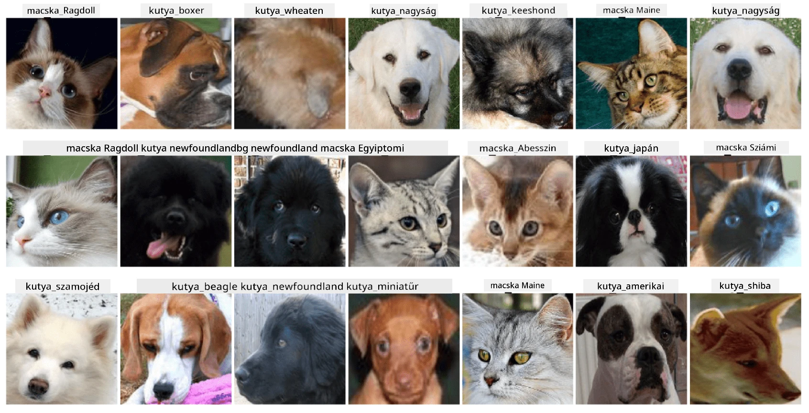

# Háziállatok arcainak osztályozása

Laborfeladat az [AI for Beginners Curriculum](https://github.com/microsoft/ai-for-beginners) alapján.

## Feladat

Képzeld el, hogy egy alkalmazást kell fejlesztened egy kisállat óvoda számára, amely katalogizálja az összes háziállatot. Az alkalmazás egyik nagyszerű funkciója az lenne, hogy automatikusan felismeri a fajtát egy fénykép alapján. Ez sikeresen megvalósítható neurális hálózatok segítségével.

Egy konvolúciós neurális hálózatot kell betanítanod, amely képes különböző macska- és kutyafajták osztályozására a **Pet Faces** adathalmaz segítségével.

## Az adathalmaz

Az [Oxford-IIIT Pet Dataset](https://www.robots.ox.ac.uk/~vgg/data/pets/) adathalmazt fogjuk használni, amely 37 különböző kutya- és macskafajta képeit tartalmazza.



Az adathalmaz letöltéséhez használd az alábbi kódrészletet:

```python
!wget https://thor.robots.ox.ac.uk/~vgg/data/pets/images.tar.gz
!tar xfz images.tar.gz
!rm images.tar.gz
```

**Megjegyzés:** Az Oxford-IIIT Pet Dataset képei fájlnév szerint vannak rendezve (pl. `Abyssinian_1.jpg`, `Bengal_2.jpg`). A notebook tartalmaz kódot, amely segít ezeket a képeket fajtaspecifikus alkönyvtárakba rendezni az egyszerűbb osztályozás érdekében.

## Induló notebook

Kezdd el a labort a [PetFaces.ipynb](PetFaces.ipynb) megnyitásával.

## Tanulság

Egy viszonylag összetett problémát oldottál meg, amely a képosztályozásról szól, teljesen az alapoktól! Rengeteg osztály volt, és mégis sikerült elfogadható pontosságot elérned! Érdemes lehet a top-k pontosságot is mérni, mivel könnyű összekeverni néhány osztályt, amelyek még az emberek számára sem különböztethetők meg egyértelműen.

---

**Felelősségi nyilatkozat**:  
Ez a dokumentum az [Co-op Translator](https://github.com/Azure/co-op-translator) AI fordítási szolgáltatás segítségével került lefordításra. Bár törekszünk a pontosságra, kérjük, vegye figyelembe, hogy az automatikus fordítások hibákat vagy pontatlanságokat tartalmazhatnak. Az eredeti dokumentum az eredeti nyelvén tekintendő hiteles forrásnak. Fontos információk esetén javasolt professzionális emberi fordítást igénybe venni. Nem vállalunk felelősséget semmilyen félreértésért vagy téves értelmezésért, amely a fordítás használatából eredhet.