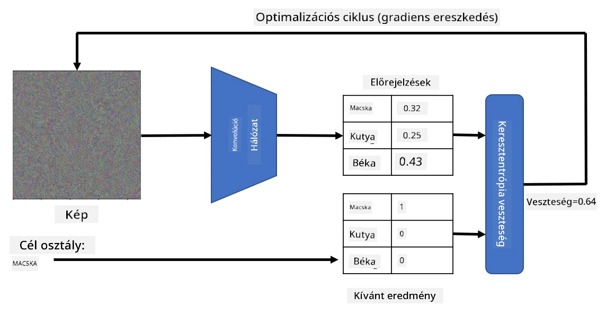

# Előre betanított hálózatok és transzfer tanulás

A CNN-ek (konvolúciós neurális hálózatok) betanítása sok időt vehet igénybe, és ehhez rengeteg adat szükséges. Az idő nagy részét azonban az alacsony szintű szűrők megtanulása teszi ki, amelyek segítségével a hálózat mintákat tud kinyerni a képekből. Felmerül a természetes kérdés: használhatunk-e egy másik adathalmazon betanított neurális hálózatot, és adaptálhatjuk-e azt más képek osztályozására anélkül, hogy teljes betanítási folyamatra lenne szükség?

## [Előadás előtti kvíz](https://ff-quizzes.netlify.app/en/ai/quiz/15)

Ezt a megközelítést **transzfer tanulásnak** nevezzük, mivel egy neurális hálózati modellből származó tudást átviszünk egy másikba. A transzfer tanulás során általában egy előre betanított modellel kezdünk, amelyet egy nagy képadathalmazon, például az **ImageNet**-en tanítottak be. Ezek a modellek már képesek különböző jellemzőket kinyerni általános képekből, és sok esetben elegendő egy osztályozót építeni ezekre a kinyert jellemzőkre, hogy jó eredményt érjünk el.

> ✅ A transzfer tanulás kifejezés más tudományterületeken is előfordul, például az oktatásban. Arra a folyamatra utal, amikor egy területen szerzett tudást egy másik területen alkalmazunk.

## Előre betanított modellek mint jellemzőkivonók

Az előző szakaszban tárgyalt konvolúciós hálózatok több rétegből álltak, amelyek mindegyike bizonyos jellemzőket hivatott kinyerni a képből, kezdve az alacsony szintű pixelkombinációktól (például vízszintes/függőleges vonalak vagy vonások), egészen a magasabb szintű jellemzőkombinációkig, amelyek például egy láng szemeinek felelnek meg. Ha egy CNN-t elég nagy és változatos képadathalmazon tanítunk be, a hálózatnak meg kell tanulnia ezeket a közös jellemzőket kinyerni.

Mind a Keras, mind a PyTorch tartalmaz funkciókat, amelyekkel könnyen betölthetők előre betanított neurális hálózati súlyok néhány gyakori architektúrához, amelyek többségét ImageNet képeken tanították be. A leggyakrabban használtakat a [CNN Architektúrák](../07-ConvNets/CNN_Architectures.md) oldalon ismertettük az előző leckében. Különösen érdemes megfontolni az alábbiak használatát:

* **VGG-16/VGG-19**, amelyek viszonylag egyszerű modellek, de mégis jó pontosságot nyújtanak. Gyakran jó választás a VGG használata első próbálkozásként, hogy lássuk, hogyan működik a transzfer tanulás.
* **ResNet**, amelyet a Microsoft Research javasolt 2015-ben. Ezek a modellek több réteggel rendelkeznek, így több erőforrást igényelnek.
* **MobileNet**, amely egy kisebb méretű modellcsalád, mobil eszközökre optimalizálva. Használja őket, ha kevés az erőforrás, és hajlandó egy kis pontosságot feláldozni.

Íme egy példa a VGG-16 hálózat által egy macska képéből kinyert jellemzőkre:

## Macskák és kutyák adathalmaz

Ebben a példában a [Macskák és Kutyák](https://www.microsoft.com/download/details.aspx?id=54765&WT.mc_id=academic-77998-cacaste) adathalmazt fogjuk használni, amely nagyon közel áll egy valós életbeli képosztályozási feladathoz.

## ✍️ Gyakorlat: Transzfer tanulás

Nézzük meg a transzfer tanulást működés közben a megfelelő jegyzetfüzetekben:

* [Transzfer tanulás - PyTorch](TransferLearningPyTorch.ipynb)
* [Transzfer tanulás - TensorFlow](TransferLearningTF.ipynb)

## Az "ideális macska" vizualizálása

Egy előre betanított neurális hálózat különböző mintákat tartalmaz az *agyában*, beleértve az **ideális macska** (valamint az ideális kutya, ideális zebra stb.) fogalmát. Érdekes lenne valahogy **vizualizálni ezt a képet**. Ez azonban nem egyszerű, mert a minták a hálózat súlyaiban szétszórva találhatók, és hierarchikus struktúrában vannak szervezve.

Egy megközelítés az lehet, hogy egy véletlenszerű képpel kezdünk, majd a **gradiens-deszcendens optimalizációs** technikát alkalmazzuk, hogy úgy módosítsuk a képet, hogy a hálózat elkezdje azt macskának gondolni.

Ha azonban ezt tesszük, akkor valami nagyon hasonlót kapunk, mint egy véletlenszerű zaj. Ennek oka, hogy *sokféleképpen lehet a hálózatot rávenni arra, hogy a bemeneti képet macskának gondolja*, beleértve olyanokat is, amelyek vizuálisan nem értelmezhetők. Bár ezek a képek sok, a macskákra jellemző mintát tartalmaznak, semmi sem kényszeríti őket arra, hogy vizuálisan megkülönböztethetők legyenek.

Az eredmény javítása érdekében hozzáadhatunk egy másik tagot a veszteségfüggvényhez, amelyet **variációs veszteségnek** nevezünk. Ez egy olyan metrika, amely megmutatja, mennyire hasonlóak a kép szomszédos pixelei. A variációs veszteség minimalizálása simábbá teszi a képet, és megszabadítja a zajtól – így vizuálisan vonzóbb mintákat tár fel. Íme egy példa az ilyen "ideális" képekre, amelyeket nagy valószínűséggel macskának és zebrának osztályoznak:

 | 
-----|-----
*Ideális macska* | *Ideális zebra*

Hasonló megközelítést lehet alkalmazni úgynevezett **adverzális támadások** végrehajtására egy neurális hálózaton. Tegyük fel, hogy szeretnénk megtéveszteni egy neurális hálózatot, és egy kutyát macskának láttatni. Ha veszünk egy kutya képét, amelyet a hálózat kutyaként ismer fel, akkor azt egy kicsit módosíthatjuk a gradiens-deszcendens optimalizáció segítségével, amíg a hálózat macskaként nem kezdi osztályozni:

 | 
-----|-----
*Eredeti kép egy kutyáról* | *Kép egy kutyáról, amelyet macskának osztályoznak*

Az eredmények reprodukálásához szükséges kódot az alábbi jegyzetfüzetben találja:

* [Ideális és adverzális macska - TensorFlow](AdversarialCat_TF.ipynb)

## Következtetés

A transzfer tanulás segítségével gyorsan összeállíthat egy osztályozót egyedi objektumok osztályozási feladatához, és magas pontosságot érhet el. Látható, hogy az egyre összetettebb feladatok, amelyeket most megoldunk, nagyobb számítási teljesítményt igényelnek, és nem oldhatók meg könnyen CPU-n. A következő egységben egy könnyebb implementációt próbálunk ki, hogy ugyanazt a modellt alacsonyabb számítási erőforrásokkal tanítsuk, ami csak kissé alacsonyabb pontosságot eredményez.

## 🚀 Kihívás

A mellékelt jegyzetfüzetekben megjegyzések találhatók arról, hogy a transzfer tudás legjobban hasonló edzési adatokkal működik (például egy új állatfajta). Kísérletezzen teljesen új típusú képekkel, hogy lássa, mennyire jól vagy rosszul teljesítenek a transzfer tudás modellek.

## [Előadás utáni kvíz](https://ff-quizzes.netlify.app/en/ai/quiz/16)

## Áttekintés és önálló tanulás

Olvassa el a [TrainingTricks.md](TrainingTricks.md) fájlt, hogy elmélyítse tudását a modellek betanításának egyéb módjairól.

## [Feladat](lab/README.md)

Ebben a laborban a valós életből vett [Oxford-IIIT](https://www.robots.ox.ac.uk/~vgg/data/pets/) háziállat-adathalmazt fogjuk használni, amely 35 macska- és kutyafajtát tartalmaz, és egy transzfer tanulási osztályozót fogunk építeni.

---

