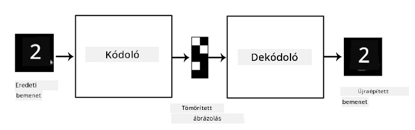
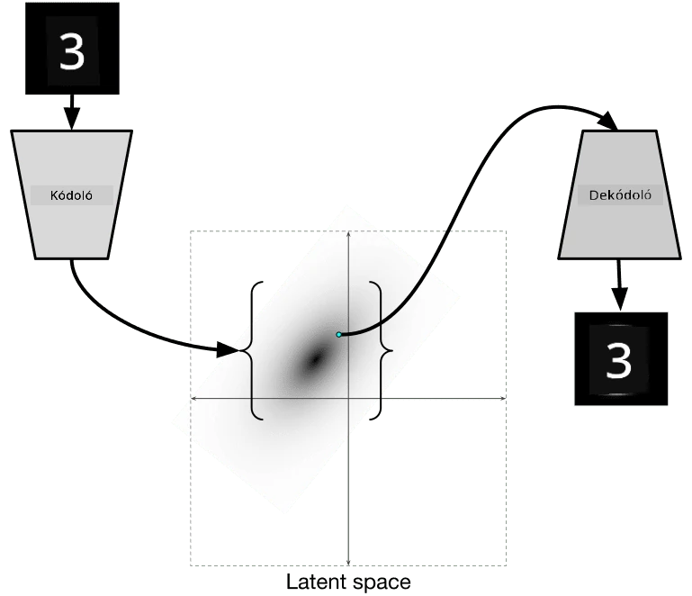

# Autoenkóderek

Amikor CNN-eket (konvolúciós neurális hálózatokat) tanítunk, az egyik probléma az, hogy sok címkézett adatra van szükségünk. Képklasszifikáció esetén például manuálisan kell azonosítani és különböző osztályokba sorolni a képeket.

## [Előadás előtti kvíz](https://ff-quizzes.netlify.app/en/ai/quiz/17)

Azonban előfordulhat, hogy nyers (címkézetlen) adatokat szeretnénk használni a CNN-ek jellemzőkivonóinak tanításához, amit **önfelügyelt tanulásnak** nevezünk. Címkék helyett a tanítóképeket használjuk a hálózat bemeneteként és kimeneteként. Az **autoenkóder** fő ötlete az, hogy lesz egy **enkóder hálózat**, amely a bemeneti képet valamilyen **latens térbe** (általában egy kisebb méretű vektorba) alakítja, majd egy **dekóder hálózat**, amelynek célja az eredeti kép rekonstruálása.

> ✅ Az [autoenkóder](https://wikipedia.org/wiki/Autoencoder) "egy mesterséges neurális hálózat típus, amelyet címkézetlen adatok hatékony kódolásának megtanulására használnak."

Mivel az autoenkódert arra tanítjuk, hogy minél több információt megőrizzen az eredeti képből a pontos rekonstrukció érdekében, a hálózat megpróbálja megtalálni a legjobb **beágyazást** a bemeneti képek jelentésének megragadásához.

> Kép a [Keras blogból](https://blog.keras.io/building-autoencoders-in-keras.html)

## Autoenkóderek használati forgatókönyvei

Bár az eredeti képek rekonstruálása önmagában nem tűnik hasznosnak, vannak olyan forgatókönyvek, ahol az autoenkóderek különösen hasznosak:

* **Dimenziócsökkentés vizualizációhoz** vagy **képbeágyazások tanítása**. Az autoenkóderek általában jobb eredményeket adnak, mint a PCA, mivel figyelembe veszik a képek térbeli jellegét és hierarchikus jellemzőit.
* **Zajcsökkentés**, azaz a zaj eltávolítása a képről. Mivel a zaj sok haszontalan információt hordoz, az autoenkóder nem tudja mindezt beilleszteni a viszonylag kis latens térbe, így csak a kép fontos részét ragadja meg. Zajcsökkentő tanításkor az eredeti képekkel kezdünk, és mesterségesen zajt adunk hozzájuk, hogy bemenetként szolgáljanak az autoenkóder számára.
* **Szuperfelbontás**, azaz a kép felbontásának növelése. Magas felbontású képekkel kezdünk, és az alacsonyabb felbontású képet használjuk az autoenkóder bemeneteként.
* **Generatív modellek**. Miután az autoenkódert betanítottuk, a dekóder részt új objektumok létrehozására használhatjuk véletlenszerű latens vektorokból kiindulva.

## Variációs Autoenkóderek (VAE)

A hagyományos autoenkóderek valamilyen módon csökkentik a bemeneti adatok dimenzióját, és megpróbálják azonosítani a bemeneti képek fontos jellemzőit. Azonban a latens vektorok gyakran nem értelmezhetők. Más szóval, ha például az MNIST adathalmazt vesszük, nem könnyű meghatározni, hogy mely számjegyek felelnek meg különböző latens vektoroknak, mivel a közeli latens vektorok nem feltétlenül ugyanazokat a számjegyeket jelentik.

Ezzel szemben, ha *generatív* modelleket szeretnénk tanítani, jobb, ha van némi megértésünk a latens térről. Ez az ötlet vezet el minket a **variációs autoenkóderhez** (VAE).

A VAE egy olyan autoenkóder, amely megtanulja a latens paraméterek **statisztikai eloszlását** előre jelezni, az úgynevezett **latens eloszlást**. Például azt szeretnénk, hogy a latens vektorok normálisan legyenek elosztva egy zmean átlaggal és zsigma szórással (mind az átlag, mind a szórás egy d dimenziós vektor). A VAE enkóder megtanulja ezeket a paramétereket előre jelezni, majd a dekóder egy véletlenszerű vektort vesz ebből az eloszlásból, hogy rekonstruálja az objektumot.

Összefoglalva:

 * A bemeneti vektorból előre jelezzük `z_mean`-t és `z_log_sigma`-t (a szórás helyett annak logaritmusát jelezzük előre)
 * Egy `sample` vektort mintázunk az N(zmean,exp(zlog\_sigma)) eloszlásból
 * A dekóder megpróbálja dekódolni az eredeti képet a `sample` vektort bemenetként használva

 

> Kép [Isaak Dykeman blogbejegyzéséből](https://ijdykeman.github.io/ml/2016/12/21/cvae.html)

A variációs autoenkóderek egy összetett veszteségfüggvényt használnak, amely két részből áll:

* **Rekonstrukciós veszteség**, amely azt mutatja, hogy a rekonstruált kép mennyire közel áll a célhoz (ez lehet például a Mean Squared Error, vagy MSE). Ez ugyanaz a veszteségfüggvény, mint a normál autoenkódereknél.
* **KL veszteség**, amely biztosítja, hogy a latens változó eloszlása közel maradjon a normál eloszláshoz. Ez a [Kullback-Leibler divergencia](https://www.countbayesie.com/blog/2017/5/9/kullback-leibler-divergence-explained) fogalmán alapul - egy metrika, amely két statisztikai eloszlás hasonlóságát becsüli.

A VAE-k egyik fontos előnye, hogy viszonylag könnyen lehet új képeket generálni, mivel tudjuk, mely eloszlásból kell mintázni a latens vektorokat. Például, ha egy VAE-t tanítunk 2D latens vektorral az MNIST adathalmazon, akkor a latens vektor komponenseit változtatva különböző számjegyeket kapunk:

> Kép [Dmitry Soshnikovtól](http://soshnikov.com)

Figyeljük meg, hogyan olvadnak össze a képek, ahogy a latens paramétertér különböző részeiből kezdünk latens vektorokat venni. Ezt a teret 2D-ben is vizualizálhatjuk:

 

> Kép [Dmitry Soshnikovtól](http://soshnikov.com)

## ✍️ Gyakorlatok: Autoenkóderek

További információkat az autoenkóderekről az alábbi notebookokban találhatsz:

* [Autoenkóderek TensorFlow-ban](AutoencodersTF.ipynb)
* [Autoenkóderek PyTorch-ban](AutoEncodersPyTorch.ipynb)

## Az autoenkóderek tulajdonságai

* **Adatspecifikusak** - csak azon képtípusokkal működnek jól, amelyeken tanították őket. Például, ha egy szuperfelbontású hálózatot virágokon tanítunk, nem fog jól működni portrékon. Ennek oka, hogy a hálózat a magasabb felbontású képet úgy állítja elő, hogy finom részleteket vesz a tanító adathalmazból tanult jellemzőkből.
* **Veszteségesek** - a rekonstruált kép nem ugyanaz, mint az eredeti kép. A veszteség jellege a tanítás során használt *veszteségfüggvénytől* függ.
* **Címkézetlen adatokkal működik**

## [Előadás utáni kvíz](https://ff-quizzes.netlify.app/en/ai/quiz/18)

## Következtetés

Ebben a leckében megismerkedtél az autoenkóderek különböző típusaival, amelyek az AI kutatók rendelkezésére állnak. Megtanultad, hogyan építsd fel őket, és hogyan használd őket képek rekonstruálására. Emellett megismerkedtél a VAE-vel, és megtanultad, hogyan használhatod új képek generálására.

## 🚀 Kihívás

Ebben a leckében megtanultad, hogyan használhatók az autoenkóderek képekhez. De zenéhez is használhatók! Nézd meg a Magenta projekt [MusicVAE](https://magenta.tensorflow.org/music-vae) projektjét, amely autoenkódereket használ a zene rekonstruálásának megtanulására. Végezzen néhány [kísérletet](https://colab.research.google.com/github/magenta/magenta-demos/blob/master/colab-notebooks/Multitrack_MusicVAE.ipynb) ezzel a könyvtárral, hogy lássa, mit tud létrehozni.

## [Előadás utáni kvíz](https://ff-quizzes.netlify.app/en/ai/quiz/16)

## Áttekintés és önálló tanulás

További információkért olvass az autoenkóderekről az alábbi forrásokban:

* [Autoenkóderek építése Kerasban](https://blog.keras.io/building-autoencoders-in-keras.html)
* [Blogbejegyzés a NeuroHive-on](https://neurohive.io/ru/osnovy-data-science/variacionnyj-avtojenkoder-vae/)
* [Variációs autoenkóderek magyarázata](https://kvfrans.com/variational-autoencoders-explained/)
* [Feltételes variációs autoenkóderek](https://ijdykeman.github.io/ml/2016/12/21/cvae.html)

## Feladat

A [TensorFlow-t használó notebook](AutoencodersTF.ipynb) végén található egy "feladat" - használd ezt a házi feladatként.

---

