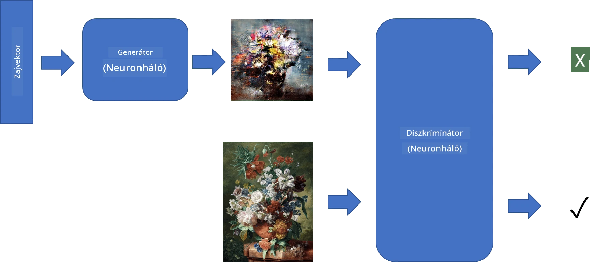
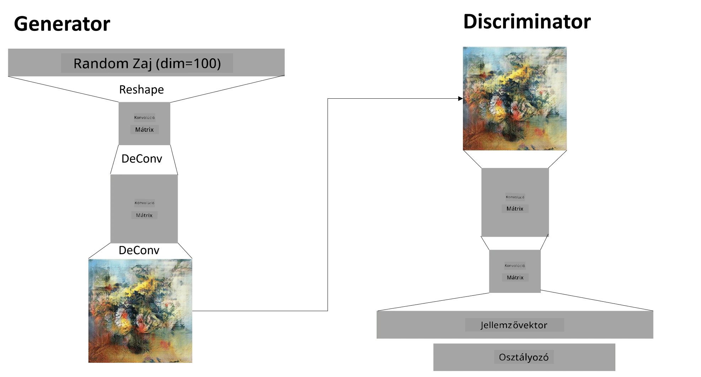

# Generatív Adverzális Hálózatok

Az előző részben megismerkedtünk a **generatív modellekkel**: olyan modellekkel, amelyek képesek új képeket generálni, hasonlóan a tanító adathalmazban lévőkhöz. A VAE jó példája volt egy generatív modellnek.

## [Előadás előtti kvíz](https://ff-quizzes.netlify.app/en/ai/quiz/19)

Azonban, ha valami igazán jelentős dolgot szeretnénk generálni, például egy festményt megfelelő felbontásban, a VAE-vel azt tapasztaljuk, hogy a tanítás nem konvergál jól. Ehhez az esethez egy másik architektúrát kell megismernünk, amely kifejezetten generatív modellekre irányul - **Generatív Adverzális Hálózatok**, vagy GAN-ek.

A GAN fő ötlete, hogy két neurális hálózatot tanítunk egymás ellen:

> Kép: [Dmitry Soshnikov](http://soshnikov.com)

> ✅ Egy kis szószedet:
> * **Generátor**: egy hálózat, amely egy véletlenszerű vektort vesz, és eredményként képet állít elő.
> * **Diszkriminátor**: egy hálózat, amely egy képet vesz, és meg kell mondania, hogy az valódi kép-e (a tanító adathalmazból), vagy a generátor által létrehozott. Lényegében egy képosztályozó.

### Diszkriminátor

A diszkriminátor architektúrája nem különbözik egy szokásos képosztályozó hálózattól. A legegyszerűbb esetben lehet egy teljesen összekapcsolt osztályozó, de valószínűleg egy [konvolúciós hálózat](../07-ConvNets/README.md) lesz.

> ✅ A konvolúciós hálózatokon alapuló GAN-t [DCGAN](https://arxiv.org/pdf/1511.06434.pdf)-nek hívják.

Egy CNN diszkriminátor a következő rétegekből áll: több konvolúció+pooling (csökkenő térbeli mérettel), és egy vagy több teljesen összekapcsolt réteg, hogy "jellemző vektort" kapjunk, végül egy bináris osztályozó.

> ✅ A 'pooling' ebben az összefüggésben egy olyan technika, amely csökkenti a kép méretét. "A pooling rétegek csökkentik az adatok dimenzióit azáltal, hogy az egyik réteg neuronklasztereinek kimeneteit egyetlen neuronba kombinálják a következő rétegben." - [forrás](https://wikipedia.org/wiki/Convolutional_neural_network#Pooling_layers)

### Generátor

A generátor valamivel bonyolultabb. Úgy tekinthetjük, mint egy fordított diszkriminátort. Egy látens vektorból kiindulva (a jellemző vektor helyett) van egy teljesen összekapcsolt rétege, amely átalakítja a szükséges méretre/alakra, majd dekonvolúció+felbontás növelés következik. Ez hasonló az [autoencoder](../09-Autoencoders/README.md) *dekóder* részéhez.

> ✅ Mivel a konvolúciós réteg lineáris szűrőként működik, amely végighalad a képen, a dekonvolúció lényegében hasonló a konvolúcióhoz, és ugyanazzal a réteglogikával megvalósítható.

> Kép: [Dmitry Soshnikov](http://soshnikov.com)

### A GAN tanítása

A GAN-eket **adverzálisnak** nevezik, mert folyamatos verseny zajlik a generátor és a diszkriminátor között. E verseny során mind a generátor, mind a diszkriminátor javul, így a hálózat egyre jobb képek előállítását tanulja meg.

A tanítás két szakaszban történik:

* **A diszkriminátor tanítása**. Ez a feladat viszonylag egyszerű: generálunk egy képcsomagot a generátorral, 0-val címkézve őket, ami hamis képet jelent, és veszünk egy képcsomagot a bemeneti adathalmazból (1-es címkével, valódi kép). Kapunk egy *diszkriminátor veszteséget*, és végrehajtjuk a backpropot.
* **A generátor tanítása**. Ez valamivel bonyolultabb, mert nem ismerjük közvetlenül a generátor várt kimenetét. Az egész GAN hálózatot, amely egy generátorból és egy diszkriminátorból áll, véletlenszerű vektorokkal tápláljuk, és azt várjuk, hogy az eredmény 1 legyen (ami a valódi képeknek felel meg). Ezután befagyasztjuk a diszkriminátor paramétereit (nem akarjuk, hogy ebben a lépésben tanuljon), és végrehajtjuk a backpropot.

E folyamat során a generátor és a diszkriminátor veszteségei nem csökkennek jelentősen. Ideális esetben oszcillálniuk kellene, ami azt jelzi, hogy mindkét hálózat javítja teljesítményét.

## ✍️ Feladatok: GAN-ek

* [GAN Notebook TensorFlow/Keras-ban](GANTF.ipynb)
* [GAN Notebook PyTorch-ban](GANPyTorch.ipynb)

### Problémák a GAN-ek tanításával

A GAN-ekről ismert, hogy különösen nehéz őket tanítani. Íme néhány probléma:

* **Módus összeomlás**. Ez azt jelenti, hogy a generátor megtanul egy sikeres képet előállítani, amely becsapja a diszkriminátort, de nem képes különböző képek sokaságát létrehozni.
* **Érzékenység a hiperparaméterekre**. Gyakran előfordul, hogy egy GAN egyáltalán nem konvergál, majd hirtelen a tanulási ráta csökkentése konvergenciát eredményez.
* **Egyensúly fenntartása** a generátor és a diszkriminátor között. Sok esetben a diszkriminátor vesztesége viszonylag gyorsan nullára csökkenhet, ami azt eredményezi, hogy a generátor nem képes tovább tanulni. Ennek leküzdésére megpróbálhatunk különböző tanulási rátákat beállítani a generátor és a diszkriminátor számára, vagy kihagyhatjuk a diszkriminátor tanítását, ha a veszteség már túl alacsony.
* **Magas felbontású tanítás**. Ugyanaz a probléma, mint az autoencoder-eknél, ez a probléma akkor jelentkezik, amikor túl sok konvolúciós hálózati réteget kell rekonstruálni, ami artefaktumokat eredményez. Ezt a problémát általában úgynevezett **progresszív növekedéssel** oldják meg, amikor először néhány réteget alacsony felbontású képeken tanítanak, majd a rétegeket "feloldják" vagy hozzáadják. Egy másik megoldás az lenne, ha extra kapcsolatokat adnánk a rétegek között, és egyszerre több felbontást tanítanánk - részletekért lásd ezt a [Multi-Scale Gradient GANs tanulmányt](https://arxiv.org/abs/1903.06048).

## Stílusátvitel

A GAN-ek nagyszerű módja művészi képek generálásának. Egy másik érdekes technika az úgynevezett **stílusátvitel**, amely egy **tartalomképet** vesz, és egy másik stílusban újrarajzolja, alkalmazva a **stíluskép** szűrőit.

A működése a következő:
* Véletlenszerű zajképpel kezdünk (vagy egy tartalomképpel, de a megértés kedvéért egyszerűbb zajképpel kezdeni).
* Célunk egy olyan kép létrehozása, amely közel áll mind a tartalomképhez, mind a stílusképhez. Ezt két veszteségfüggvény határozza meg:
   - **Tartalomveszteség**, amelyet a CNN által bizonyos rétegeken kinyert jellemzők alapján számítunk ki az aktuális kép és a tartalomkép között.
   - **Stílusveszteség**, amelyet az aktuális kép és a stíluskép között számítunk ki egy okos módszerrel Gram-mátrixok segítségével (további részletek az [példa notebookban](StyleTransfer.ipynb)).
* A kép simábbá tétele és a zaj eltávolítása érdekében bevezetjük a **Variációs veszteséget**, amely a szomszédos pixelek közötti átlagos távolságot számítja ki.
* A fő optimalizációs ciklus az aktuális képet gradient descent (vagy más optimalizációs algoritmus) segítségével módosítja, hogy minimalizálja a teljes veszteséget, amely az összes veszteség súlyozott összege.

## ✍️ Példa: [Stílusátvitel](StyleTransfer.ipynb)

## [Előadás utáni kvíz](https://ff-quizzes.netlify.app/en/ai/quiz/20)

## Összegzés

Ebben a leckében megismerkedtél a GAN-ekkel és azok tanításával. Megtanultad azokat a különleges kihívásokat is, amelyekkel ez a neurális hálózat típus szembesülhet, valamint néhány stratégiát ezek leküzdésére.

## 🚀 Kihívás

Futtasd végig a [Stílusátvitel notebookot](StyleTransfer.ipynb) saját képeiddel.

## Áttekintés és önálló tanulás

További információért olvass a GAN-ekről az alábbi forrásokban:

* Marco Pasini, [10 tanulság, amit egy év alatt GAN-ek tanításából tanultam](https://towardsdatascience.com/10-lessons-i-learned-training-generative-adversarial-networks-gans-for-a-year-c9071159628)
* [StyleGAN](https://en.wikipedia.org/wiki/StyleGAN), egy *de facto* GAN architektúra, amit érdemes megfontolni
* [Generatív művészet létrehozása GAN-ekkel az Azure ML-en](https://soshnikov.com/scienceart/creating-generative-art-using-gan-on-azureml/)

## Feladat

Nézd át a leckéhez kapcsolódó két notebook egyikét, és tanítsd újra a GAN-t saját képeiden. Mit tudsz létrehozni?

---

