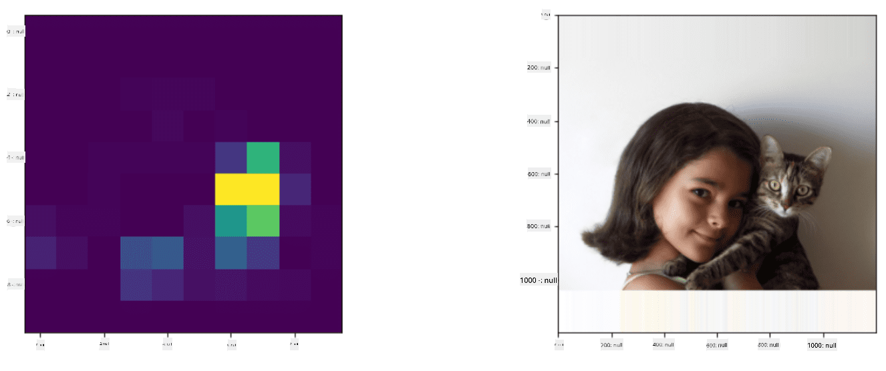
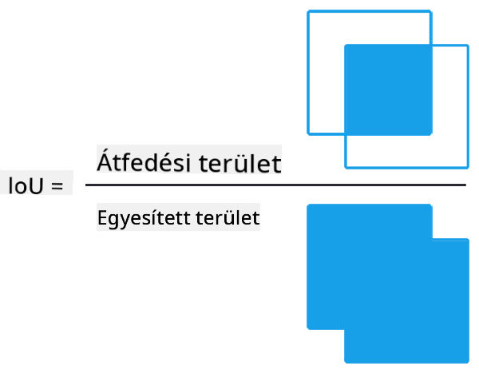
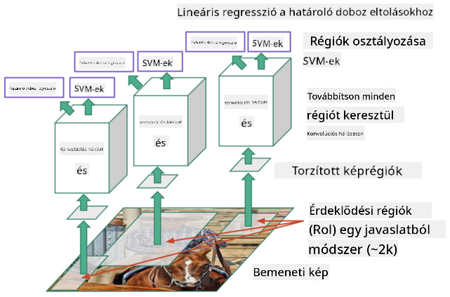
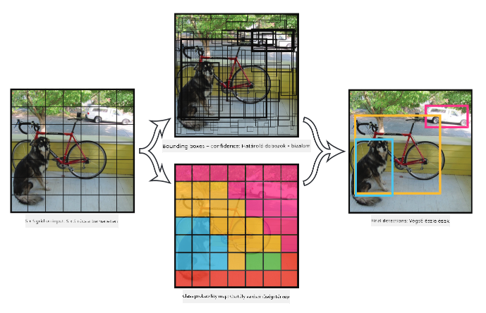

<!--
CO_OP_TRANSLATOR_METADATA:
{
  "original_hash": "d85c8b08f6d1b48fd7f35b99f93c1138",
  "translation_date": "2025-08-25T22:43:06+00:00",
  "source_file": "lessons/4-ComputerVision/11-ObjectDetection/README.md",
  "language_code": "hu"
}
-->
# Objektumfelismerés

Az eddig tárgyalt képosztályozási modellek egy képet vettek alapul, és egy kategóriát eredményeztek, például az 'szám' osztályt egy MNIST problémában. Azonban sok esetben nem elég tudni, hogy egy kép tárgyakat ábrázol - szeretnénk meghatározni azok pontos helyét is. Ez az **objektumfelismerés** lényege.

## [Előadás előtti kvíz](https://ff-quizzes.netlify.app/en/ai/quiz/21)

> Kép a [YOLO v2 weboldaláról](https://pjreddie.com/darknet/yolov2/)

## Egy naiv megközelítés az objektumfelismeréshez

Tegyük fel, hogy egy képen szeretnénk megtalálni egy macskát. Egy nagyon egyszerű megközelítés az alábbi lenne:

1. A képet felosztjuk több csempére.
2. Képosztályozást futtatunk minden csempén.
3. Azok a csempék, amelyeknél elég magas aktivációt kapunk, tartalmazhatják a keresett objektumot.

> *Kép az [Exercise Notebook](../../../../../lessons/4-ComputerVision/11-ObjectDetection/ObjectDetection-TF.ipynb) fájlból*

Ez a megközelítés azonban messze nem ideális, mivel az algoritmus csak nagyon pontatlanul tudja meghatározni az objektum határoló dobozát. A pontosabb helymeghatározáshoz valamilyen **regressziót** kell futtatnunk a határoló doboz koordinátáinak előrejelzésére - ehhez pedig speciális adatállományokra van szükség.

## Regresszió az objektumfelismeréshez

[Ez a blogbejegyzés](https://towardsdatascience.com/object-detection-with-neural-networks-a4e2c46b4491) remek bevezetőt nyújt az alakzatok felismeréséhez.

## Adatállományok objektumfelismeréshez

Az alábbi adatállományokkal találkozhatsz ebben a feladatban:

* [PASCAL VOC](http://host.robots.ox.ac.uk/pascal/VOC/) - 20 osztály
* [COCO](http://cocodataset.org/#home) - Közönséges tárgyak kontextusban. 80 osztály, határoló dobozok és szegmentációs maszkok

## Objektumfelismerési metrikák

### Metszet az unió felett

Míg a képosztályozásnál könnyű mérni az algoritmus teljesítményét, az objektumfelismerésnél nemcsak az osztály helyességét kell mérni, hanem a határoló doboz helyének pontosságát is. Ehhez az úgynevezett **Metszet az unió felett** (IoU) metrikát használjuk, amely azt méri, hogy két doboz (vagy két tetszőleges terület) mennyire fedik egymást.

> *2. ábra [ebből a kiváló blogbejegyzésből az IoU-ról](https://pyimagesearch.com/2016/11/07/intersection-over-union-iou-for-object-detection/)*

Az ötlet egyszerű - a két alakzat metszetének területét elosztjuk az uniójuk területével. Két azonos terület esetén az IoU értéke 1, míg teljesen különálló területeknél 0. Egyébként 0 és 1 között változik. Általában csak azokat a határoló dobozokat vesszük figyelembe, amelyek IoU értéke egy bizonyos érték felett van.

### Átlagos pontosság

Tegyük fel, hogy egy adott $C$ osztályú objektum felismerésének hatékonyságát szeretnénk mérni. Ehhez az **Átlagos Pontosság** metrikát használjuk, amelyet az alábbiak szerint számítunk ki:

1. Vegyük a Pontosság-Visszahívás görbét, amely az érzékenységet mutatja a detektálási küszöbérték függvényében (0-tól 1-ig).
2. A küszöbértéktől függően több vagy kevesebb objektumot detektálunk a képen, és különböző pontosság- és visszahívásértékeket kapunk.
3. A görbe így néz ki:

> *Kép a [NeuroWorkshop](http://github.com/shwars/NeuroWorkshop) oldalról*

Az adott $C$ osztály átlagos pontossága a görbe alatti terület. Pontosabban, a Visszahívás tengelyt általában 10 részre osztjuk, és a Pontosságot átlagoljuk ezeken a pontokon:

$$
AP = {1\over11}\sum_{i=0}^{10}\mbox{Precision}(\mbox{Recall}={i\over10})
$$

### AP és IoU

Csak azokat a detektálásokat vesszük figyelembe, amelyek IoU értéke egy bizonyos küszöbérték felett van. Például a PASCAL VOC adatállományban általában $\mbox{IoU Threshold} = 0.5$ értéket feltételezünk, míg a COCO esetében az AP-t különböző $\mbox{IoU Threshold}$ értékekre mérjük.

> *Kép a [NeuroWorkshop](http://github.com/shwars/NeuroWorkshop) oldalról*

### Átlagos Pontosság - mAP

Az objektumfelismerés fő metrikája az **Átlagos Pontosság**, vagy **mAP**. Ez az Átlagos Pontosság értéke, amelyet az összes objektumosztályra átlagolunk, és néha az $\mbox{IoU Threshold}$ értékekre is. Az **mAP** számításának részleteit
[ebben a blogbejegyzésben](https://medium.com/@timothycarlen/understanding-the-map-evaluation-metric-for-object-detection-a07fe6962cf3)), valamint [itt kóddal](https://gist.github.com/tarlen5/008809c3decf19313de216b9208f3734) találod.

## Különböző objektumfelismerési megközelítések

Az objektumfelismerési algoritmusoknak két fő típusa van:

* **Régiójavasló hálózatok** (R-CNN, Fast R-CNN, Faster R-CNN). Az alapötlet az, hogy **érdeklődési régiókat** (ROI) generálunk, és CNN-t futtatunk rajtuk, keresve a maximális aktivációt. Ez kissé hasonlít a naiv megközelítéshez, azzal a különbséggel, hogy az ROI-kat okosabb módon generáljuk. Az egyik fő hátránya ezeknek a módszereknek, hogy lassúak, mivel sok CNN osztályozót kell futtatni a képen.
* **Egyszeri futtatású** (YOLO, SSD, RetinaNet) módszerek. Ezekben az architektúrákban a hálózatot úgy tervezzük, hogy egyszerre előrejelezze az osztályokat és az ROI-kat.

### R-CNN: Régióalapú CNN

Az [R-CNN](http://islab.ulsan.ac.kr/files/announcement/513/rcnn_pami.pdf) [Szelektív Keresést](http://www.huppelen.nl/publications/selectiveSearchDraft.pdf) használ az ROI régiók hierarchikus struktúrájának generálására, amelyeket ezután CNN jellemzőkivonók és SVM-osztályozók dolgoznak fel az objektumosztály meghatározására, valamint lineáris regresszióval a *határoló doboz* koordinátáinak meghatározására. [Hivatalos tanulmány](https://arxiv.org/pdf/1506.01497v1.pdf)

> *Kép van de Sande et al. ICCV’11*

> *Képek [ebből a blogból](https://towardsdatascience.com/r-cnn-fast-r-cnn-faster-r-cnn-yolo-object-detection-algorithms-36d53571365e)*

### F-RCNN - Gyors R-CNN

Ez a megközelítés hasonló az R-CNN-hez, de a régiókat a konvolúciós rétegek alkalmazása után határozzák meg.

> Kép a [hivatalos tanulmányból](https://www.cv-foundation.org/openaccess/content_iccv_2015/papers/Girshick_Fast_R-CNN_ICCV_2015_paper.pdf), [arXiv](https://arxiv.org/pdf/1504.08083.pdf), 2015

### Gyorsabb R-CNN

Ennek a megközelítésnek az alapötlete, hogy neurális hálózatot használunk az ROI-k előrejelzésére - az úgynevezett *Régiójavasló Hálózat*. [Tanulmány](https://arxiv.org/pdf/1506.01497.pdf), 2016

> Kép a [hivatalos tanulmányból](https://arxiv.org/pdf/1506.01497.pdf)

### R-FCN: Régióalapú Teljesen Konvolúciós Hálózat

Ez az algoritmus még gyorsabb, mint a Gyorsabb R-CNN. Az alapötlet a következő:

1. Jellemzőket vonunk ki ResNet-101 segítségével.
2. A jellemzőket **Pozícióérzékeny Pontszám Térképek** dolgozzák fel. Minden objektumot $C$ osztályból $k\times k$ régiókra osztunk, és az objektumok részeinek előrejelzésére tanítjuk a hálózatot.
3. Minden részre a $k\times k$ régiókból a hálózatok szavaznak az objektumosztályokra, és a maximális szavazatot kapó osztályt választjuk.

> Kép a [hivatalos tanulmányból](https://arxiv.org/abs/1605.06409)

### YOLO - You Only Look Once

A YOLO egy valós idejű egyszeri futtatású algoritmus. Az alapötlet a következő:

 * A képet $S\times S$ régiókra osztjuk.
 * Minden régióra **CNN** előrejelzi $n$ lehetséges objektumot, *határoló doboz* koordinátákat és *bizalom*=*valószínűség* * IoU.

 

> Kép a [hivatalos tanulmányból](https://arxiv.org/abs/1506.02640)

### Egyéb algoritmusok

* RetinaNet: [hivatalos tanulmány](https://arxiv.org/abs/1708.02002)
   - [PyTorch Implementáció Torchvisionben](https://pytorch.org/vision/stable/_modules/torchvision/models/detection/retinanet.html)
   - [Keras Implementáció](https://github.com/fizyr/keras-retinanet)
   - [Objektumfelismerés RetinaNet segítségével](https://keras.io/examples/vision/retinanet/) Keras példákban
* SSD (Single Shot Detector): [hivatalos tanulmány](https://arxiv.org/abs/1512.02325)

## ✍️ Gyakorlatok: Objektumfelismerés

Folytasd a tanulást az alábbi jegyzetfüzetben:

[ObjectDetection.ipynb](../../../../../lessons/4-ComputerVision/11-ObjectDetection/ObjectDetection.ipynb)

## Összegzés

Ebben a leckében gyors áttekintést kaptál az objektumfelismerés különböző megközelítéseiről!

## 🚀 Kihívás

Olvasd el ezeket a cikkeket és jegyzetfüzeteket a YOLO-ról, és próbáld ki őket magad:

* [Jó blogbejegyzés](https://www.analyticsvidhya.com/blog/2018/12/practical-guide-object-detection-yolo-framewor-python/) a YOLO-ról
 * [Hivatalos oldal](https://pjreddie.com/darknet/yolo/)
 * Yolo: [Keras implementáció](https://github.com/experiencor/keras-yolo2), [lépésről lépésre jegyzetfüzet](https://github.com/experiencor/basic-yolo-keras/blob/master/Yolo%20Step-by-Step.ipynb)
 * Yolo v2: [Keras implementáció](https://github.com/experiencor/keras-yolo2), [lépésről lépésre jegyzetfüzet](https://github.com/experiencor/keras-yolo2/blob/master/Yolo%20Step-by-Step.ipynb)

## [Előadás utáni kvíz](https://ff-quizzes.netlify.app/en/ai/quiz/22)

## Áttekintés és önálló tanulás

* [Objektumfelismerés](https://tjmachinelearning.com/lectures/1718/obj/) Nikhil Sardana által
* [Jó összehasonlítás az objektumfelismerési algoritmusokról](https://lilianweng.github.io/lil-log/2018/12/27/object-detection-part-4.html)
* [Áttekintés a mély tanulási algoritmusokról objektumfelismeréshez](https://medium.com/comet-app/review-of-deep-learning-algorithms-for-object-detection-c1f3d437b852)
* [Lépésről lépésre bevezetés az alapvető objektumfelismerési algoritmusokba](https://www.analyticsvidhya.com/blog/2018/10/a-step-by-step-introduction-to-the-basic-object-detection-algorithms-part-1/)
* [Gyorsabb R-CNN implementáció Pythonban objektumfelismeréshez](https://www.analyticsvidhya.com/blog/2018/11/implementation-faster-r-cnn-python-object-detection/)

## [Feladat: Objektumfelismerés](lab/README.md)

**Felelősség kizárása**:  
Ez a dokumentum az AI fordítási szolgáltatás [Co-op Translator](https://github.com/Azure/co-op-translator) segítségével lett lefordítva. Bár törekszünk a pontosságra, kérjük, vegye figyelembe, hogy az automatikus fordítások hibákat vagy pontatlanságokat tartalmazhatnak. Az eredeti dokumentum az eredeti nyelvén tekintendő hiteles forrásnak. Kritikus információk esetén javasolt professzionális emberi fordítást igénybe venni. Nem vállalunk felelősséget semmilyen félreértésért vagy téves értelmezésért, amely a fordítás használatából eredhet.