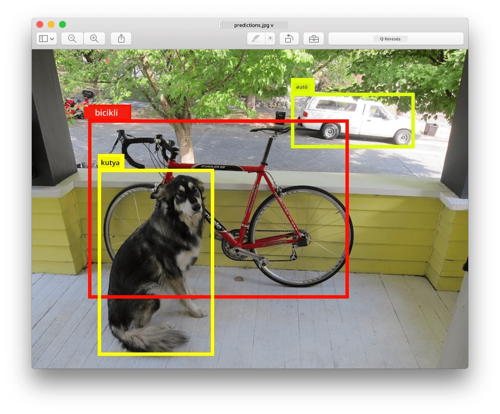
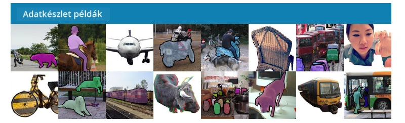
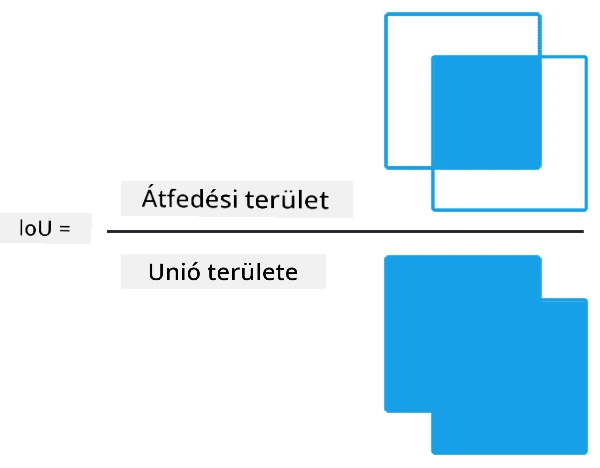
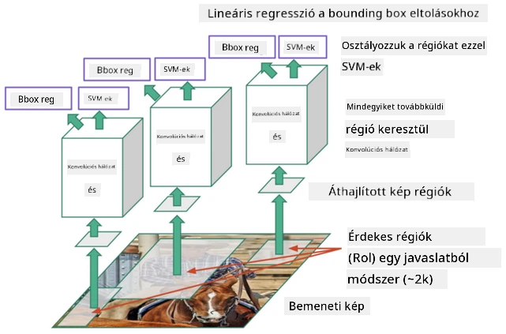
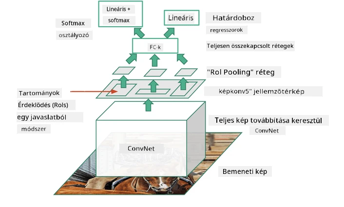
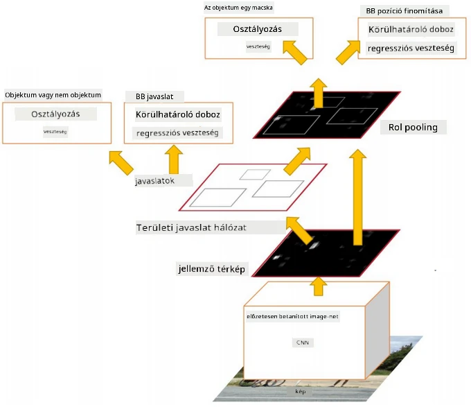
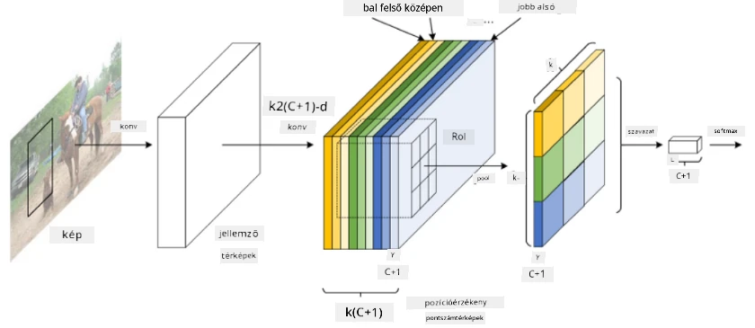

# Objektumfelismerés

Az eddig tárgyalt képosztályozási modellek egy képet vettek bemenetként, és egy kategóriát adtak eredményül, például az 'szám' osztályt az MNIST problémában. Azonban sok esetben nem elég, hogy tudjuk, egy kép tárgyakat ábrázol - szeretnénk meghatározni azok pontos helyét is. Ez az **objektumfelismerés** célja.

## [Előadás előtti kvíz](https://ff-quizzes.netlify.app/en/ai/quiz/21)

> Kép a [YOLO v2 weboldaláról](https://pjreddie.com/darknet/yolov2/)

## Egy naiv megközelítés az objektumfelismeréshez

Tegyük fel, hogy egy képen szeretnénk megtalálni egy macskát. Egy nagyon egyszerű megközelítés az objektumfelismeréshez a következő lenne:

1. Felosztjuk a képet több csempére.
2. Képosztályozást futtatunk minden csempén.
3. Azok a csempék, amelyeknél elég magas aktivációt kapunk, tartalmazhatják a keresett objektumot.

> *Kép az [Exercise Notebook](ObjectDetection-TF.ipynb)-ból*

Ez a megközelítés azonban messze nem ideális, mivel az algoritmus csak nagyon pontatlanul tudja meghatározni az objektum körvonalát. A pontosabb helymeghatározáshoz valamilyen **regressziót** kell futtatnunk, hogy előre jelezzük a körvonalak koordinátáit - ehhez pedig speciális adatállományokra van szükség.

## Regresszió az objektumfelismeréshez

[Ez a blogbejegyzés](https://towardsdatascience.com/object-detection-with-neural-networks-a4e2c46b4491) remek bevezetést nyújt az alakzatok felismeréséhez.

## Adatállományok objektumfelismeréshez

Az alábbi adatállományokkal találkozhatsz ezen a területen:

* [PASCAL VOC](http://host.robots.ox.ac.uk/pascal/VOC/) - 20 osztály
* [COCO](http://cocodataset.org/#home) - Közönséges tárgyak kontextusban. 80 osztály, körvonalak és szegmentációs maszkok

## Objektumfelismerési metrikák

### Metszet az unióhoz viszonyítva

Míg a képosztályozásnál könnyű mérni az algoritmus teljesítményét, az objektumfelismerésnél nemcsak az osztály helyességét kell mérni, hanem az előre jelzett körvonal helyének pontosságát is. Ehhez az úgynevezett **Metszet az unióhoz viszonyítva** (IoU) metrikát használjuk, amely azt méri, hogy két doboz (vagy két tetszőleges terület) mennyire fedik egymást.

> *2. ábra [ebből a kiváló blogbejegyzésből az IoU-ról](https://pyimagesearch.com/2016/11/07/intersection-over-union-iou-for-object-detection/)*

Az ötlet egyszerű - elosztjuk a két alakzat metszetének területét az uniójuk területével. Két azonos terület esetén az IoU értéke 1, míg teljesen különálló területeknél 0. Egyébként 0 és 1 között változik. Általában csak azokat a körvonalakat vesszük figyelembe, amelyeknél az IoU egy bizonyos érték felett van.

### Átlagos pontosság

Tegyük fel, hogy egy adott $C$ osztályú objektum felismerésének hatékonyságát szeretnénk mérni. Ehhez az **Átlagos Pontosság** metrikát használjuk, amelyet az alábbiak szerint számítunk ki:

1. Vegyük a Pontosság-Visszahívás görbét, amely a pontosságot mutatja a detektálási küszöbérték függvényében (0-tól 1-ig).
2. A küszöbértéktől függően több vagy kevesebb objektumot detektálunk a képen, és különböző pontosság- és visszahívásértékeket kapunk.
3. A görbe így fog kinézni:

> *Kép a [NeuroWorkshop](http://github.com/shwars/NeuroWorkshop)-ból*

Az adott $C$ osztályú objektum Átlagos Pontossága a görbe alatti terület. Pontosabban, a visszahívás tengelyt általában 10 részre osztjuk, és a pontosságot átlagoljuk ezeken a pontokon:

$$
AP = {1\over11}\sum_{i=0}^{10}\mbox{Pontosság}(\mbox{Visszahívás}={i\over10})
$$

### AP és IoU

Csak azokat a detektálásokat vesszük figyelembe, amelyeknél az IoU egy bizonyos érték felett van. Például a PASCAL VOC adatállományban általában $\mbox{IoU Küszöbérték} = 0.5$ az alapértelmezett, míg a COCO esetében az AP-t különböző $\mbox{IoU Küszöbérték}$ értékekre mérik.

> *Kép a [NeuroWorkshop](http://github.com/shwars/NeuroWorkshop)-ból*

### Átlagos Pontosság Átlaga - mAP

Az objektumfelismerés fő metrikája az **Átlagos Pontosság Átlaga**, vagy **mAP**. Ez az Átlagos Pontosság értéke, amelyet az összes objektumosztályra átlagolunk, és néha az $\mbox{IoU Küszöbérték}$ értékére is. Az **mAP** számításának részleteit
[ebben a blogbejegyzésben](https://medium.com/@timothycarlen/understanding-the-map-evaluation-metric-for-object-detection-a07fe6962cf3)) találod, valamint [itt kóddal](https://gist.github.com/tarlen5/008809c3decf19313de216b9208f3734).

## Különböző objektumfelismerési megközelítések

Az objektumfelismerési algoritmusoknak két fő típusa van:

* **Régiójavasló hálózatok** (R-CNN, Fast R-CNN, Faster R-CNN). Az alapötlet az, hogy **érdekes régiókat** (ROI) generálunk, és CNN-t futtatunk rajtuk, keresve a maximális aktivációt. Ez némileg hasonlít a naiv megközelítéshez, azzal a különbséggel, hogy az ROI-kat okosabb módon generáljuk. Az ilyen módszerek egyik fő hátránya, hogy lassúak, mivel sok CNN osztályozót kell futtatni a képen.
* **Egyszeri futtatású** (YOLO, SSD, RetinaNet) módszerek. Ezekben az architektúrákban a hálózatot úgy tervezzük, hogy egyszerre jósolja meg az osztályokat és az ROI-kat.

### R-CNN: Régióalapú CNN

Az [R-CNN](http://islab.ulsan.ac.kr/files/announcement/513/rcnn_pami.pdf) a [Szelektív Keresést](http://www.huppelen.nl/publications/selectiveSearchDraft.pdf) használja, hogy hierarchikus ROI régiókat generáljon, amelyeket aztán CNN jellemzőkivonókon és SVM-osztályozókon futtatunk, hogy meghatározzuk az objektum osztályát, valamint lineáris regresszióval a *körvonal* koordinátáit. [Hivatalos tanulmány](https://arxiv.org/pdf/1506.01497v1.pdf)

> *Kép van de Sande et al. ICCV’11*

> *Képek [ebből a blogból](https://towardsdatascience.com/r-cnn-fast-r-cnn-faster-r-cnn-yolo-object-detection-algorithms-36d53571365e)*

### F-RCNN - Gyors R-CNN

Ez a megközelítés hasonló az R-CNN-hez, de a régiókat a konvolúciós rétegek alkalmazása után határozzuk meg.

> Kép a [Hivatalos tanulmányból](https://www.cv-foundation.org/openaccess/content_iccv_2015/papers/Girshick_Fast_R-CNN_ICCV_2015_paper.pdf), [arXiv](https://arxiv.org/pdf/1504.08083.pdf), 2015

### Gyorsabb R-CNN

Ennek a megközelítésnek az alapötlete, hogy neurális hálózatot használunk az ROI-k előrejelzésére - az úgynevezett *Régiójavasló Hálózat*. [Tanulmány](https://arxiv.org/pdf/1506.01497.pdf), 2016

> Kép a [hivatalos tanulmányból](https://arxiv.org/pdf/1506.01497.pdf)

### R-FCN: Régióalapú Teljesen Konvolúciós Hálózat

Ez az algoritmus még gyorsabb, mint a Gyorsabb R-CNN. Az alapötlet a következő:

1. Jellemzőket vonunk ki ResNet-101 segítségével.
2. A jellemzőket **Pozíció-Érzékeny Pontszám Térképen** dolgozzuk fel. Minden objektumot $C$ osztályból $k\times k$ régiókra osztunk, és az objektumok részeinek előrejelzésére tanítjuk a hálózatot.
3. Minden részre a $k\times k$ régiókból a hálózatok szavaznak az objektumosztályokra, és a maximális szavazatot kapó osztályt választjuk.

> Kép a [hivatalos tanulmányból](https://arxiv.org/abs/1605.06409)

### YOLO - You Only Look Once

A YOLO egy valós idejű egyszeri futtatású algoritmus. Az alapötlet a következő:

 * A képet $S\times S$ régiókra osztjuk.
 * Minden régióra **CNN** előrejelzi $n$ lehetséges objektumot, *körvonal* koordinátákat és *bizalmi szintet*=*valószínűség* * IoU.

 

> Kép a [hivatalos tanulmányból](https://arxiv.org/abs/1506.02640)

### Egyéb algoritmusok

* RetinaNet: [hivatalos tanulmány](https://arxiv.org/abs/1708.02002)
   - [PyTorch Implementáció Torchvisionben](https://pytorch.org/vision/stable/_modules/torchvision/models/detection/retinanet.html)
   - [Keras Implementáció](https://github.com/fizyr/keras-retinanet)
   - [Objektumfelismerés RetinaNet-tel](https://keras.io/examples/vision/retinanet/) Keras mintákban
* SSD (Single Shot Detector): [hivatalos tanulmány](https://arxiv.org/abs/1512.02325)

## ✍️ Gyakorlatok: Objektumfelismerés

Folytasd a tanulást az alábbi jegyzetfüzetben:

[ObjectDetection.ipynb](ObjectDetection.ipynb)

## Összegzés

Ebben a leckében gyors áttekintést kaptál az objektumfelismerés különböző megközelítéseiről!

## 🚀 Kihívás

Olvasd el ezeket a cikkeket és jegyzetfüzeteket a YOLO-ról, és próbáld ki őket magad:

* [Jó blogbejegyzés](https://www.analyticsvidhya.com/blog/2018/12/practical-guide-object-detection-yolo-framewor-python/) a YOLO-ról
 * [Hivatalos oldal](https://pjreddie.com/darknet/yolo/)
 * Yolo: [Keras implementáció](https://github.com/experiencor/keras-yolo2), [lépésről-lépésre jegyzetfüzet](https://github.com/experiencor/basic-yolo-keras/blob/master/Yolo%20Step-by-Step.ipynb)
 * Yolo v2: [Keras implementáció](https://github.com/experiencor/keras-yolo2), [lépésről-lépésre jegyzetfüzet](https://github.com/experiencor/keras-yolo2/blob/master/Yolo%20Step-by-Step.ipynb)

## [Előadás utáni kvíz](https://ff-quizzes.netlify.app/en/ai/quiz/22)

## Áttekintés és önálló tanulás

* [Objektumfelismerés](https://tjmachinelearning.com/lectures/1718/obj/) Nikhil Sardana által
* [Jó összehasonlítás az objektumfelismerési algoritmusokról](https://lilianweng.github.io/lil-log/2018/12/27/object-detection-part-4.html)
* [Mélytanulási algoritmusok áttekintése objektumfelismeréshez](https://medium.com/comet-app/review-of-deep-learning-algorithms-for-object-detection-c1f3d437b852)
* [Lépésről-lépésre bevezetés az alapvető objektumfelismerési algoritmusokba](https://www.analyticsvidhya.com/blog/2018/10/a-step-by-step-introduction-to-the-basic-object-detection-algorithms-part-1/)
* [Gyorsabb R-CNN implementáció Pythonban objektumfelismeréshez](https://www.analyticsvidhya.com/blog/2018/11/implementation-faster-r-cnn-python-object-detection/)

## [Feladat: Objektumfelismerés](lab/README.md)

---

