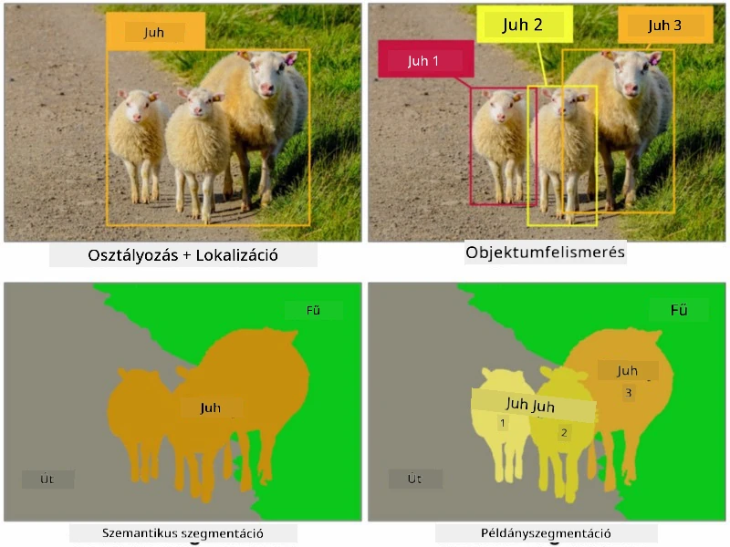
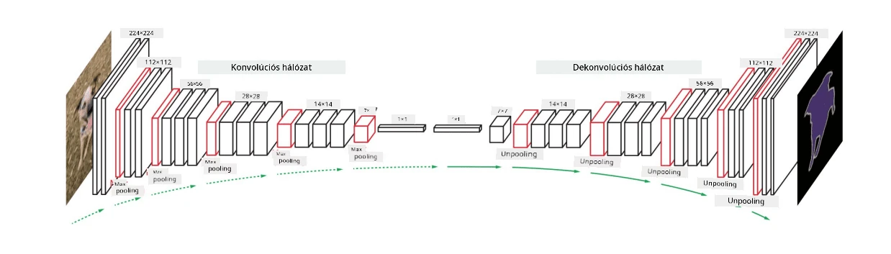

# Szegmentáció

Korábban már tanultunk az objektumfelismerésről, amely lehetővé teszi számunkra, hogy azonosítsuk az objektumok helyét a képen az *határoló dobozok* előrejelzésével. Azonban bizonyos feladatokhoz nemcsak határoló dobozokra van szükségünk, hanem pontosabb objektumlokalizációra is. Ezt a feladatot **szegmentációnak** nevezzük.

## [Előadás előtti kvíz](https://ff-quizzes.netlify.app/en/ai/quiz/23)

A szegmentációt tekinthetjük **pixelek osztályozásának**, ahol a kép **minden egyes** pixeléről meg kell jósolnunk az osztályát (*háttér* is egy osztály). Két fő szegmentációs algoritmus létezik:

* **Szemantikus szegmentáció**, amely csak a pixel osztályát határozza meg, és nem különbözteti meg az azonos osztályba tartozó különböző objektumokat.
* **Instance szegmentáció**, amely az osztályokat különböző példányokra bontja.

Például az instance szegmentáció esetében ezek a juhok különböző objektumok, míg a szemantikus szegmentáció esetében az összes juh egy osztályba tartozik.

> Kép ebből a [blogbejegyzésből](https://nirmalamurali.medium.com/image-classification-vs-semantic-segmentation-vs-instance-segmentation-625c33a08d50)

Különböző neurális architektúrák léteznek a szegmentációhoz, de mindegyiknek ugyanaz a felépítése. Bizonyos értelemben hasonlít az autoenkóderhez, amelyről korábban tanultál, de az eredeti kép rekonstruálása helyett a célunk egy **maszk** rekonstruálása. Így egy szegmentációs hálózat a következő részekből áll:

* **Kódoló**: kivonja a jellemzőket a bemeneti képből.
* **Dekódoló**: ezeket a jellemzőket átalakítja a **maszk képpé**, amelynek mérete és csatornaszáma megegyezik az osztályok számával.

> Kép ebből a [publikációból](https://arxiv.org/pdf/2001.05566.pdf)

Különösen meg kell említenünk a szegmentációhoz használt veszteségfüggvényt. Klasszikus autoenkóderek használatakor mérnünk kell a hasonlóságot két kép között, és ehhez használhatjuk a négyzetes hibaátlagot (MSE). A szegmentációban a célmaszk kép minden egyes pixele az osztályszámot képviseli (egy-egy forró kódolással a harmadik dimenzió mentén), ezért osztályozás-specifikus veszteségfüggvényeket kell használnunk - keresztentrópia-veszteséget, amelyet az összes pixelre átlagolunk. Ha a maszk bináris, akkor **bináris keresztentrópia-veszteséget** (BCE) használunk.

> ✅ Az egy-egy forró kódolás egy olyan módszer, amely egy osztálycímkét egy olyan vektorrá alakít, amelynek hossza megegyezik az osztályok számával. Nézd meg [ezt a cikket](https://datagy.io/sklearn-one-hot-encode/) erről a technikáról.

## Szegmentáció az orvosi képalkotásban

Ebben a leckében a szegmentációt gyakorlatban is megfigyelhetjük, amikor a hálózatot arra tanítjuk, hogy felismerje az emberi anyajegyeket (más néven nevi) orvosi képeken. A képek forrásaként a <a href="https://www.fc.up.pt/addi/ph2%20database.html">PH2 adatbázist</a> fogjuk használni. Ez az adatbázis 200 képet tartalmaz három osztályból: tipikus anyajegy, atipikus anyajegy és melanoma. Minden képhez tartozik egy **maszk**, amely körvonalazza az anyajegyet.

> ✅ Ez a technika különösen alkalmas az ilyen típusú orvosi képalkotásra, de milyen más valós alkalmazásokat tudnál elképzelni?

> Kép a PH2 adatbázisból

Egy modellt fogunk betanítani arra, hogy bármilyen anyajegyet elkülönítsen a háttértől.

## ✍️ Gyakorlatok: Szemantikus szegmentáció

Nyisd meg az alábbi jegyzetfüzeteket, hogy többet megtudj a különböző szemantikus szegmentációs architektúrákról, gyakorold a velük való munkát, és lásd őket működés közben.

* [Szemantikus szegmentáció Pytorch](SemanticSegmentationPytorch.ipynb)
* [Szemantikus szegmentáció TensorFlow](SemanticSegmentationTF.ipynb)

## [Előadás utáni kvíz](https://ff-quizzes.netlify.app/en/ai/quiz/24)

## Összegzés

A szegmentáció egy nagyon erőteljes technika a képosztályozásban, amely túlmutat a határoló dobozokon, és pixel szintű osztályozást tesz lehetővé. Ez a technika az orvosi képalkotásban és más alkalmazásokban is használatos.

## 🚀 Kihívás

A test szegmentációja csak egy a gyakori feladatok közül, amelyeket emberekről készült képekkel végezhetünk. Más fontos feladatok közé tartozik a **csontváz-felismerés** és a **testtartás-felismerés**. Próbáld ki az [OpenPose](https://github.com/CMU-Perceptual-Computing-Lab/openpose) könyvtárat, hogy lásd, hogyan használható a testtartás-felismerés.

## Áttekintés és önálló tanulás

Ez a [wikipedia cikk](https://wikipedia.org/wiki/Image_segmentation) jó áttekintést nyújt ennek a technikának a különböző alkalmazásairól. Tanulj többet önállóan az Instance szegmentáció és a Panoptikus szegmentáció alágazatairól ezen a területen.

## [Feladat](lab/README.md)

Ebben a laborban próbáld ki az **emberi test szegmentációját** a [Segmentation Full Body MADS Dataset](https://www.kaggle.com/datasets/tapakah68/segmentation-full-body-mads-dataset) adathalmazzal a Kaggle-ről.

---

