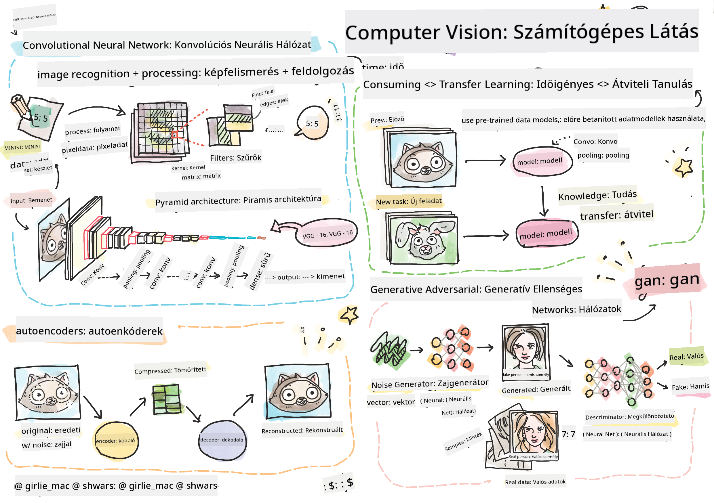

<!--
CO_OP_TRANSLATOR_METADATA:
{
  "original_hash": "58a52f000089c1d8906a4daa4ab1169b",
  "translation_date": "2025-08-25T22:27:32+00:00",
  "source_file": "lessons/4-ComputerVision/README.md",
  "language_code": "hu"
}
-->
# Számítógépes látás

Ebben a részben megtanuljuk:

* [Bevezetés a számítógépes látásba és az OpenCV-be](06-IntroCV/README.md)
* [Konvolúciós neurális hálók](07-ConvNets/README.md)
* [Előre betanított hálók és transzfer tanulás](08-TransferLearning/README.md) 
* [Autoenkóderek](09-Autoencoders/README.md)
* [Generatív adverszális hálók](10-GANs/README.md)
* [Objektumfelismerés](11-ObjectDetection/README.md)
* [Szemantikus szegmentáció](12-Segmentation/README.md)

**Felelősség kizárása**:  
Ez a dokumentum az AI fordítási szolgáltatás [Co-op Translator](https://github.com/Azure/co-op-translator) segítségével lett lefordítva. Bár törekszünk a pontosságra, kérjük, vegye figyelembe, hogy az automatikus fordítások hibákat vagy pontatlanságokat tartalmazhatnak. Az eredeti dokumentum az eredeti nyelvén tekintendő hiteles forrásnak. Kritikus információk esetén javasolt professzionális emberi fordítást igénybe venni. Nem vállalunk felelősséget semmilyen félreértésért vagy téves értelmezésért, amely a fordítás használatából eredhet.