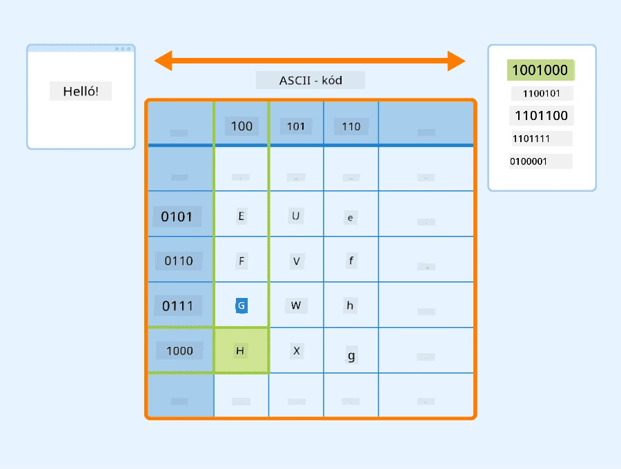
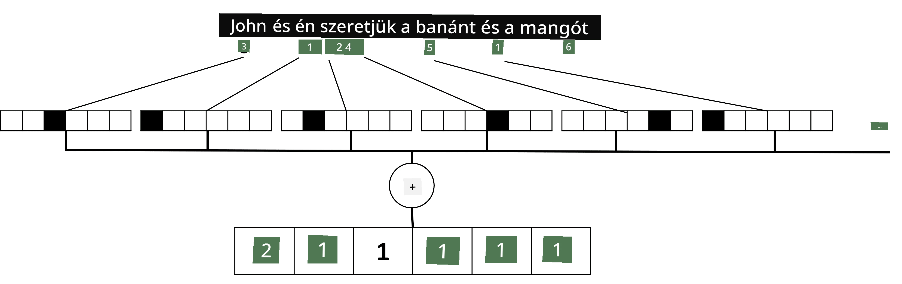

# Szöveg ábrázolása tenzorokként

## [Előadás előtti kvíz](https://ff-quizzes.netlify.app/en/ai/quiz/25)

## Szöveg osztályozása

A szakasz első részében a **szöveg osztályozására** fogunk összpontosítani. Az [AG News](https://www.kaggle.com/amananandrai/ag-news-classification-dataset) adathalmazt fogjuk használni, amely olyan hírcikkeket tartalmaz, mint például:

* Kategória: Tudomány/Technológia
* Cím: Ky. cég támogatást nyert peptidek tanulmányozására (AP)
* Szöveg: AP - Egy, a Louisville-i Egyetem kémiai kutatója által alapított cég támogatást nyert egy fejlesztéshez...

Célunk az lesz, hogy a híreket a szöveg alapján az egyik kategóriába soroljuk.

## Szöveg ábrázolása

Ha neurális hálózatokkal szeretnénk megoldani természetes nyelvfeldolgozási (NLP) feladatokat, valamilyen módon a szöveget tenzorokként kell ábrázolnunk. A számítógépek már most is számokként ábrázolják a szöveges karaktereket, amelyek a képernyőn megjelenő betűtípusokhoz vannak hozzárendelve, például ASCII vagy UTF-8 kódolás segítségével.

> [Kép forrása](https://www.seobility.net/en/wiki/ASCII)

Mi, emberek, megértjük, hogy mit **jelent** egy-egy betű, és hogyan állnak össze a karakterek egy mondat szavaivá. A számítógépek azonban önmagukban nem rendelkeznek ilyen megértéssel, és a neurális hálózatnak a tanulás során kell elsajátítania a jelentést.

Ezért különböző megközelítéseket alkalmazhatunk a szöveg ábrázolására:

* **Karakter szintű ábrázolás**, amikor a szöveget úgy ábrázoljuk, hogy minden karaktert egy számként kezelünk. Ha a szövegkorpuszunkban *C* különböző karakter van, akkor a *Hello* szó egy 5x*C* méretű tenzorként lenne ábrázolva. Minden betű egy-egy oszlopnak felelne meg a one-hot kódolásban.
* **Szó szintű ábrázolás**, amelyben egy **szókincset** hozunk létre a szöveg összes szavából, majd a szavakat one-hot kódolással ábrázoljuk. Ez a megközelítés valamivel jobb, mert egy-egy betű önmagában nem sok jelentéssel bír, így magasabb szintű szemantikai fogalmak - szavak - használatával egyszerűsítjük a neurális hálózat feladatát. Azonban a nagy szótárméret miatt magas dimenziójú ritka tenzorokkal kell dolgoznunk.

Bármelyik ábrázolást is választjuk, először a szöveget **tokenek** sorozatává kell alakítanunk, ahol egy token lehet egy karakter, egy szó, vagy néha akár egy szó része is. Ezután a tokent egy számmá alakítjuk, általában **szókincs** segítségével, és ezt a számot one-hot kódolással táplálhatjuk be a neurális hálózatba.

## N-gramok

A természetes nyelvben a szavak pontos jelentése csak a kontextusban határozható meg. Például a *neurális hálózat* és a *halászháló* jelentése teljesen eltérő. Az egyik módja annak, hogy ezt figyelembe vegyük, ha a modellünket szópárokra építjük, és a szópárokat külön szókincsbeli tokenekként kezeljük. Így a *Szeretek horgászni menni* mondat a következő tokenek sorozataként lenne ábrázolva: *Szeretek horgászni*, *horgászni menni*. Az ezzel a megközelítéssel járó probléma az, hogy a szótár mérete jelentősen megnő, és az olyan kombinációk, mint *horgászni menni* és *vásárolni menni* külön tokenekként jelennek meg, amelyek nem osztoznak semmilyen szemantikai hasonlóságon, annak ellenére, hogy ugyanaz az ige szerepel bennük.

Bizonyos esetekben érdemes lehet tri-gramokat - három szóból álló kombinációkat - is használni. Ezért ezt a megközelítést gyakran **n-gramoknak** nevezik. Értelme lehet n-gramokat karakter szintű ábrázolással is használni, ebben az esetben az n-gramok nagyjából különböző szótagoknak felelnének meg.

## Bag-of-Words és TF/IDF

Amikor olyan feladatokat oldunk meg, mint a szöveg osztályozása, képesnek kell lennünk a szöveget egy fix méretű vektorral ábrázolni, amelyet bemenetként használunk a végső sűrű osztályozóhoz. Az egyik legegyszerűbb módja ennek az, ha az egyes szavak ábrázolásait kombináljuk, például összeadjuk őket. Ha minden szó one-hot kódolását összeadjuk, egy gyakorisági vektort kapunk, amely megmutatja, hogy egy-egy szó hányszor fordul elő a szövegben. Az ilyen szövegábrázolást **bag-of-words**-nek (BoW) nevezzük.

> Kép a szerzőtől

A BoW lényegében azt mutatja meg, hogy mely szavak jelennek meg a szövegben és milyen mennyiségben, ami valóban jó jelzője lehet annak, hogy miről szól a szöveg. Például egy politikai hírcikk valószínűleg olyan szavakat tartalmaz, mint *elnök* és *ország*, míg egy tudományos publikációban olyan szavak szerepelhetnek, mint *ütköztető*, *felfedezett*, stb. Így a szavak gyakorisága sok esetben jó indikátora lehet a szöveg tartalmának.

A BoW problémája, hogy bizonyos gyakori szavak, mint például *és*, *van*, stb. a legtöbb szövegben előfordulnak, és a legmagasabb gyakorisággal rendelkeznek, elnyomva az igazán fontos szavakat. Csökkenthetjük ezeknek a szavaknak a fontosságát, ha figyelembe vesszük, hogy milyen gyakran fordulnak elő az egész dokumentumgyűjteményben. Ez a fő ötlete a TF/IDF megközelítésnek, amelyet részletesebben tárgyalunk az ehhez a leckéhez csatolt jegyzetfüzetekben.

Azonban egyik megközelítés sem képes teljes mértékben figyelembe venni a szöveg **szemantikáját**. Ehhez erősebb neurális hálózati modellekre van szükségünk, amelyeket később tárgyalunk ebben a szakaszban.

## ✍️ Gyakorlatok: Szöveg ábrázolása

Folytasd a tanulást a következő jegyzetfüzetekben:

* [Szöveg ábrázolása PyTorch segítségével](TextRepresentationPyTorch.ipynb)
* [Szöveg ábrázolása TensorFlow segítségével](TextRepresentationTF.ipynb)

## Összegzés

Eddig olyan technikákat tanulmányoztunk, amelyek súlyt adnak a különböző szavak gyakoriságának. Ezek azonban nem képesek a jelentést vagy a sorrendet ábrázolni. Ahogy a híres nyelvész, J. R. Firth 1935-ben mondta: "Egy szó teljes jelentése mindig kontextuális, és a jelentés kontextus nélküli tanulmányozása nem vehető komolyan." A kurzus későbbi részében megtanuljuk, hogyan ragadhatjuk meg a szöveg kontextuális információit nyelvi modellezés segítségével.

## 🚀 Kihívás

Próbálj ki más gyakorlatokat a bag-of-words és különböző adatmodellek használatával. Inspirációt meríthetsz ebből a [Kaggle versenyből](https://www.kaggle.com/competitions/word2vec-nlp-tutorial/overview/part-1-for-beginners-bag-of-words).

## [Előadás utáni kvíz](https://ff-quizzes.netlify.app/en/ai/quiz/26)

## Áttekintés és önálló tanulás

Gyakorold a szövegbeágyazások és a bag-of-words technikák használatát a [Microsoft Learn](https://docs.microsoft.com/learn/modules/intro-natural-language-processing-pytorch/?WT.mc_id=academic-77998-cacaste) oldalon.

## [Feladat: Jegyzetfüzetek](assignment.md)

---

