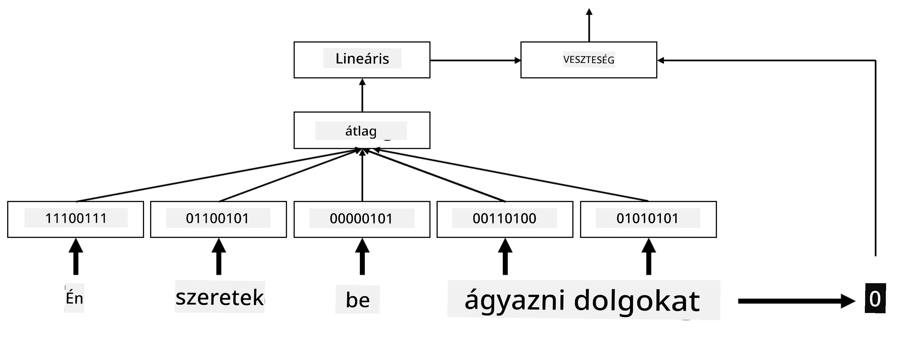

# Beágyazások

## [Előadás előtti kvíz](https://ff-quizzes.netlify.app/en/ai/quiz/27)

Amikor BoW vagy TF/IDF alapú osztályozókat tanítottunk, magas dimenziójú szavak zsákja vektorokkal dolgoztunk, amelyek hossza `vocab_size`, és kifejezetten alacsony dimenziójú pozíciós reprezentációs vektorokat alakítottunk át ritka egyforró (one-hot) reprezentációvá. Ez az egyforró reprezentáció azonban nem memóriahatékony. Ezenkívül minden szót egymástól függetlenül kezelünk, azaz az egyforró kódolt vektorok nem fejeznek ki semmilyen szemantikai hasonlóságot a szavak között.

A **beágyazás** ötlete az, hogy a szavakat alacsonyabb dimenziójú, sűrű vektorokkal reprezentáljuk, amelyek valamilyen módon tükrözik a szó szemantikai jelentését. Később megbeszéljük, hogyan lehet értelmes szóbeágyazásokat létrehozni, de egyelőre gondoljunk a beágyazásokra úgy, mint egy módra, hogy csökkentsük a szóvektorok dimenzióját.

A beágyazási réteg tehát egy szót vesz bemenetként, és egy meghatározott `embedding_size` méretű kimeneti vektort állít elő. Bizonyos értelemben nagyon hasonló egy `Linear` réteghez, de az egyforró kódolt vektor helyett képes egy szó számát bemenetként fogadni, így elkerülhetjük a nagy egyforró kódolt vektorok létrehozását.

Ha a beágyazási réteget használjuk osztályozó hálózatunk első rétegeként, akkor a szavak zsákja modellről áttérhetünk az **embedding bag** modellre, ahol először minden szót a megfelelő beágyazásra alakítunk, majd valamilyen aggregált függvényt számítunk ki az összes beágyazás felett, például `sum`, `average` vagy `max`.

> Kép a szerzőtől

## ✍️ Gyakorlatok: Beágyazások

Folytasd a tanulást az alábbi jegyzetfüzetekben:
* [Beágyazások PyTorch segítségével](EmbeddingsPyTorch.ipynb)
* [Beágyazások TensorFlow-val](EmbeddingsTF.ipynb)

## Szemantikai beágyazások: Word2Vec

Míg a beágyazási réteg megtanulta a szavakat vektorreprezentációra leképezni, ez a reprezentáció nem feltétlenül hordozott sok szemantikai jelentést. Jó lenne olyan vektorreprezentációt tanulni, amelyben a hasonló szavak vagy szinonimák olyan vektoroknak felelnek meg, amelyek közel vannak egymáshoz valamilyen vektortávolság (pl. euklideszi távolság) szempontjából.

Ehhez elő kell tanítanunk a beágyazási modellünket egy nagy szöveggyűjteményen egy speciális módon. Az egyik módszer a szemantikai beágyazások tanítására a [Word2Vec](https://en.wikipedia.org/wiki/Word2vec). Ez két fő architektúrán alapul, amelyek a szavak elosztott reprezentációját állítják elő:

 - **Folytonos szavak zsákja** (CBoW) — ebben az architektúrában a modellt arra tanítjuk, hogy egy szót a környező kontextusból jósoljon meg. Az ngram $(W_{-2},W_{-1},W_0,W_1,W_2)$ esetén a modell célja, hogy $W_0$-t megjósolja $(W_{-2},W_{-1},W_1,W_2)$ alapján.
 - **Folytonos skip-gram** — ez a CBoW ellentéte. A modell a környező kontextusszavak ablakát használja a jelenlegi szó megjóslására.

A CBoW gyorsabb, míg a skip-gram lassabb, de jobban reprezentálja a ritka szavakat.

> Kép ebből a [tanulmányból](https://arxiv.org/pdf/1301.3781.pdf)

A Word2Vec előtanított beágyazások (és más hasonló modellek, mint például a GloVe) szintén használhatók a neurális hálózatok beágyazási rétege helyett. Azonban foglalkoznunk kell a szókészletekkel, mivel a Word2Vec/GloVe előtanításához használt szókészlet valószínűleg eltér a szövegkorpuszunk szókészletétől. Nézd meg a fenti jegyzetfüzeteket, hogy lásd, hogyan oldható meg ez a probléma.

## Kontextuális beágyazások

A hagyományos előtanított beágyazási reprezentációk, mint például a Word2Vec, egyik kulcsfontosságú korlátja a szavak jelentésének egyértelműsítése. Bár az előtanított beágyazások képesek bizonyos mértékben megragadni a szavak jelentését a kontextusban, minden szó lehetséges jelentését ugyanabba a beágyazásba kódolják. Ez problémákat okozhat a későbbi modellekben, mivel sok szó, például a 'play', különböző jelentésekkel bír attól függően, hogy milyen kontextusban használják.

Például a 'play' szó az alábbi két mondatban egészen eltérő jelentéssel bír:

- Elmentem egy **színdarabra** a színházban.
- John játszani szeretne a barátaival.

A fent említett előtanított beágyazások mindkét jelentését ugyanabba a beágyazásba sűrítik. Ennek a korlátnak a leküzdéséhez olyan beágyazásokat kell építenünk, amelyek a **nyelvi modellre** alapoznak, amelyet egy nagy szövegkorpuszra tanítottak, és *tudja*, hogyan illeszkednek a szavak különböző kontextusokban. A kontextuális beágyazások tárgyalása túlmutat ennek az oktatóanyagnak a keretein, de később, a nyelvi modellekről szóló részben visszatérünk rájuk.

## Összegzés

Ebben a leckében megtanultad, hogyan építs és használj beágyazási rétegeket TensorFlow-ban és PyTorch-ban, hogy jobban tükrözd a szavak szemantikai jelentését.

## 🚀 Kihívás

A Word2Vec-et néhány érdekes alkalmazásra is használták, például dalszövegek és költészet generálására. Nézd meg [ezt a cikket](https://www.politetype.com/blog/word2vec-color-poems), amely bemutatja, hogyan használta a szerző a Word2Vec-et költészet generálására. Nézd meg [ezt a videót Dan Shiffmanntól](https://www.youtube.com/watch?v=LSS_bos_TPI&ab_channel=TheCodingTrain) is, hogy egy másik magyarázatot kapj erről a technikáról. Ezután próbáld meg alkalmazni ezeket a technikákat a saját szövegkorpuszodra, például a Kaggle-ről származó adatokra.

## [Előadás utáni kvíz](https://ff-quizzes.netlify.app/en/ai/quiz/28)

## Áttekintés és önálló tanulás

Olvasd el ezt a tanulmányt a Word2Vec-ről: [Efficient Estimation of Word Representations in Vector Space](https://arxiv.org/pdf/1301.3781.pdf)

## [Feladat: Jegyzetfüzetek](assignment.md)

---

