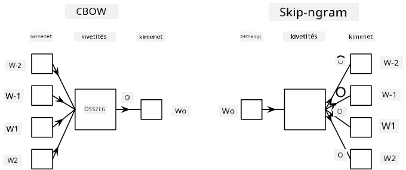

# Nyelvi Modellezés

A szemantikai beágyazások, mint például a Word2Vec és a GloVe, valójában az első lépést jelentik a **nyelvi modellezés** felé – olyan modellek létrehozása felé, amelyek valamilyen módon *megértik* (vagy *reprezentálják*) a nyelv természetét.

## [Előadás előtti kvíz](https://ff-quizzes.netlify.app/en/ai/quiz/29)

A nyelvi modellezés mögött álló fő ötlet az, hogy ezeket modelleket felcímkézetlen adathalmazokon tanítjuk, felügyelet nélküli módon. Ez azért fontos, mert hatalmas mennyiségű felcímkézetlen szöveg áll rendelkezésünkre, míg a felcímkézett szövegek mennyisége mindig korlátozott lesz azzal az erőfeszítéssel, amit a címkézésre fordítani tudunk. Leggyakrabban olyan nyelvi modelleket építhetünk, amelyek képesek **hiányzó szavakat megjósolni** a szövegben, mivel könnyű véletlenszerűen kitakarni egy szót a szövegben, és azt mint tanítási mintát használni.

## Beágyazások tanítása

Korábbi példáinkban előre betanított szemantikai beágyazásokat használtunk, de érdekes látni, hogyan lehet ezeket a beágyazásokat betanítani. Számos lehetséges ötlet létezik, amelyeket használhatunk:

* **N-Gram** nyelvi modellezés, amikor egy token-t jósolunk meg az N előző token alapján (N-gram).
* **Folytonos Szózsák** (CBoW), amikor a középső token-t $W_0$ jósoljuk meg egy token sorozatban $W_{-N}$, ..., $W_N$.
* **Skip-gram**, ahol a középső token $W_0$ alapján egy szomszédos tokenek halmazát {$W_{-N},\dots, W_{-1}, W_1,\dots, W_N$} jósoljuk meg.

> Kép [ebből a tanulmányból](https://arxiv.org/pdf/1301.3781.pdf)

## ✍️ Példa Jegyzetfüzetek: CBoW modell tanítása

Folytasd a tanulást az alábbi jegyzetfüzetekben:

* [CBoW Word2Vec tanítása TensorFlow-val](CBoW-TF.ipynb)
* [CBoW Word2Vec tanítása PyTorch-al](CBoW-PyTorch.ipynb)

## Következtetés

Az előző leckében láttuk, hogy a szavak beágyazásai szinte varázslatosan működnek! Most már tudjuk, hogy a szavak beágyazásainak tanítása nem egy nagyon bonyolult feladat, és képesek vagyunk saját beágyazásokat tanítani specifikus szakterületi szövegekhez, ha szükséges. 

## [Előadás utáni kvíz](https://ff-quizzes.netlify.app/en/ai/quiz/30)

## Áttekintés és Önálló Tanulás

* [Hivatalos PyTorch oktatóanyag a nyelvi modellezésről](https://pytorch.org/tutorials/beginner/nlp/word_embeddings_tutorial.html).
* [Hivatalos TensorFlow oktatóanyag a Word2Vec modell tanításáról](https://www.TensorFlow.org/tutorials/text/word2vec).
* A **gensim** keretrendszer használata a leggyakrabban használt beágyazások néhány sor kóddal történő tanításához [ebben a dokumentációban](https://pytorch.org/tutorials/beginner/nlp/word_embeddings_tutorial.html) van leírva.

## 🚀 [Feladat: Skip-Gram Modell Tanítása](lab/README.md)

A laborban arra hívunk ki, hogy módosítsd az ebben a leckében szereplő kódot, és taníts Skip-Gram modellt a CBoW helyett. [Olvasd el a részleteket](lab/README.md)

---

