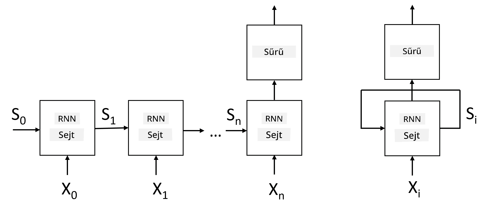
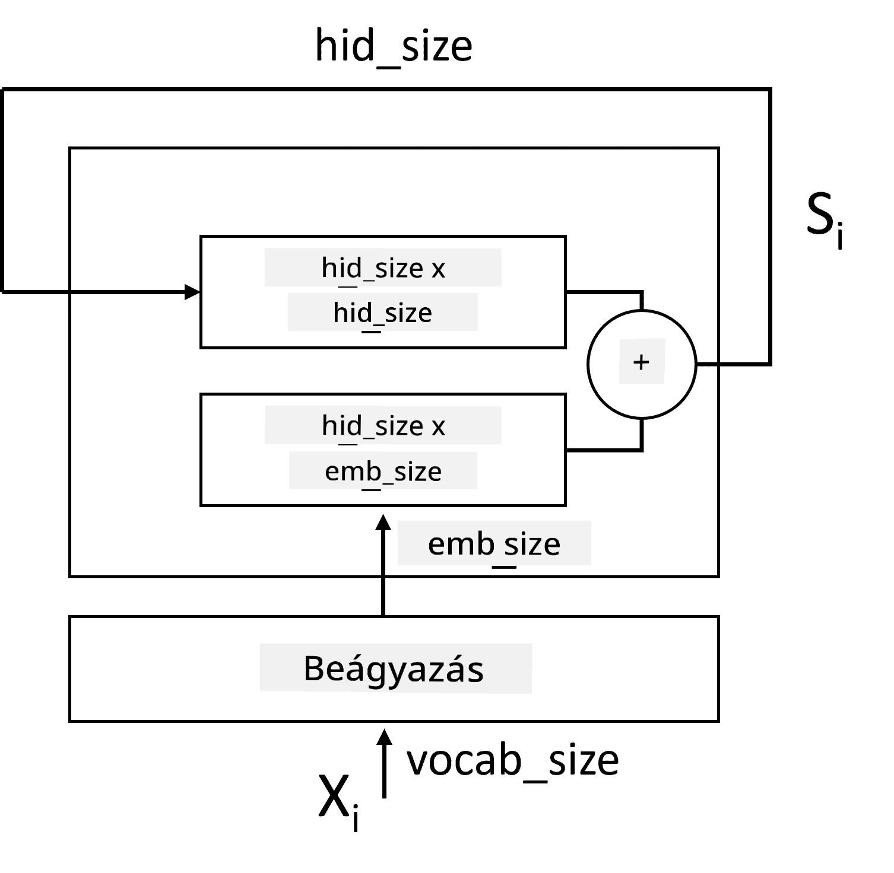
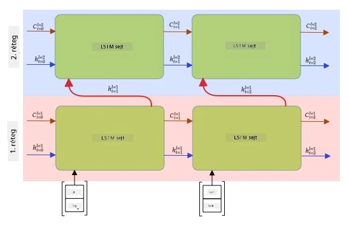

# Rekurrens Neurális Hálózatok

## [Előadás előtti kvíz](https://ff-quizzes.netlify.app/en/ai/quiz/31)

Az előző szekciókban gazdag szemantikai reprezentációkat használtunk a szövegekhez, és egy egyszerű lineáris osztályozót az embeddingek tetején. Ez az architektúra a mondatokban lévő szavak összesített jelentését ragadja meg, de nem veszi figyelembe a szavak **sorrendjét**, mivel az embeddingek tetején végzett aggregációs művelet eltávolította ezt az információt az eredeti szövegből. Mivel ezek a modellek nem képesek a szavak sorrendjét modellezni, nem tudnak megoldani összetettebb vagy kétértelmű feladatokat, mint például szövegalkotás vagy kérdés-válasz.

Ahhoz, hogy a szövegszekvencia jelentését megragadjuk, egy másik neurális hálózati architektúrát kell használnunk, amelyet **rekurrens neurális hálózatnak** (RNN) nevezünk. Az RNN-ben mondatunkat egy szimbólumonként adjuk át a hálózaton, és a hálózat egy **állapotot** hoz létre, amelyet aztán a következő szimbólummal együtt újra átadunk a hálózatnak.

> Kép a szerzőtől

Az X0,...,Xn bemeneti tokenek szekvenciáját tekintve az RNN egy neurális hálózati blokkok sorozatát hozza létre, és ezt a sorozatot végponttól végpontig tanítja visszaterjesztéssel. Minden hálózati blokk egy (Xi,Si) párt fogad bemenetként, és Si+1-et állít elő eredményként. A végső állapot Sn vagy (kimenet Yn) egy lineáris osztályozóba kerül, hogy előállítsa az eredményt. Az összes hálózati blokk ugyanazokat a súlyokat osztja meg, és egy visszaterjesztési lépésben végponttól végpontig tanítják.

Mivel az állapotvektorok S0,...,Sn átmennek a hálózaton, képes megtanulni a szavak közötti szekvenciális függőségeket. Például, amikor a *nem* szó megjelenik valahol a szekvenciában, megtanulhatja bizonyos elemek tagadását az állapotvektoron belül, ami tagadást eredményez.

> ✅ Mivel a fenti képen látható összes RNN blokk súlyai megosztottak, ugyanaz a kép egyetlen blokként is ábrázolható (a jobb oldalon) egy rekurrens visszacsatolási hurokkal, amely visszaviszi a hálózat kimeneti állapotát a bemenethez.

## Az RNN cella anatómiája

Nézzük meg, hogyan van felépítve egy egyszerű RNN cella. Elfogadja az előző állapotot Si-1 és az aktuális szimbólumot Xi bemenetként, és elő kell állítania a kimeneti állapotot Si (és néha érdekel minket egy másik kimenet Yi is, mint például generatív hálózatok esetében).

Egy egyszerű RNN cellának két súlymátrixa van: az egyik átalakítja a bemeneti szimbólumot (nevezzük W-nek), a másik pedig a bemeneti állapotot (H). Ebben az esetben a hálózat kimenete &sigma;(W&times;Xi+H&times;Si-1+b) formában számítódik ki, ahol &sigma; az aktivációs függvény, és b egy további bias.

> Kép a szerzőtől

Sok esetben a bemeneti tokeneket az embedding rétegen keresztül adják át az RNN-nek, hogy csökkentsék a dimenziót. Ebben az esetben, ha a bemeneti vektorok dimenziója *emb_size*, és az állapotvektor *hid_size* - akkor W mérete *emb_size*&times;*hid_size*, és H mérete *hid_size*&times;*hid_size*.

## Hosszú-rövid távú memória (LSTM)

A klasszikus RNN-ek egyik fő problémája az úgynevezett **eltűnő gradiens** probléma. Mivel az RNN-eket egy visszaterjesztési lépésben végponttól végpontig tanítják, nehézséget okoz a hiba propagálása a hálózat első rétegeihez, így a hálózat nem tudja megtanulni a távoli tokenek közötti kapcsolatokat. Ennek a problémának az elkerülésére az egyik mód az **explicit állapotkezelés** bevezetése úgynevezett **kapuk** segítségével. Két jól ismert architektúra létezik ebben a kategóriában: **Hosszú-rövid távú memória** (LSTM) és **Kapuzott relé egység** (GRU).

> Kép forrása TBD

Az LSTM hálózat hasonló módon van szervezve, mint az RNN, de két állapotot ad át rétegről rétegre: az aktuális állapotot C, és a rejtett vektort H. Minden egységnél a rejtett vektor Hi össze van kapcsolva a bemenettel Xi, és ezek irányítják, hogy mi történik az állapottal C **kapuk** segítségével. Minden kapu egy neurális hálózat szigmoid aktivációval (kimenet tartománya [0,1]), amely bitmaszkként értelmezhető, amikor az állapotvektorral szorozzuk. Az alábbi kapuk léteznek (balról jobbra a fenti képen):

* A **felejtő kapu** elfogad egy rejtett vektort, és meghatározza, hogy az állapotvektor C mely komponenseit kell elfelejteni, és melyeket kell továbbadni.
* A **bemeneti kapu** információt vesz a bemeneti és rejtett vektorokból, és beilleszti az állapotba.
* A **kimeneti kapu** lineáris rétegen keresztül átalakítja az állapotot *tanh* aktivációval, majd kiválasztja annak bizonyos komponenseit a rejtett vektor Hi segítségével, hogy új állapotot Ci+1 állítson elő.

Az állapot C komponensei bizonyos jelzőként értelmezhetők, amelyeket be- és kikapcsolhatunk. Például, amikor egy *Alice* nevű szót találunk a szekvenciában, feltételezhetjük, hogy egy női karakterre utal, és bekapcsolhatjuk az állapotban azt a jelzőt, hogy női főnév van a mondatban. Amikor később találkozunk az *és Tom* kifejezéssel, bekapcsolhatjuk azt a jelzőt, hogy többes számú főnév van. Így az állapot manipulálásával nyomon követhetjük a mondatrészek nyelvtani tulajdonságait.

> ✅ Egy kiváló forrás az LSTM belső működésének megértéséhez Christopher Olah [Understanding LSTM Networks](https://colah.github.io/posts/2015-08-Understanding-LSTMs/) című cikke.

## Irányított és többrétegű RNN-ek

Olyan rekurrens hálózatokat tárgyaltunk, amelyek egy irányban működnek, a szekvencia elejétől a végéig. Ez természetesnek tűnik, mivel hasonlít arra, ahogyan olvasunk és hallgatjuk a beszédet. Azonban mivel sok gyakorlati esetben véletlen hozzáférésünk van a bemeneti szekvenciához, érdemes lehet rekurrens számítást végezni mindkét irányban. Az ilyen hálózatokat **kétirányú** RNN-eknek nevezzük. Kétirányú hálózat esetén két rejtett állapotvektorra van szükségünk, egy-egy irányhoz.

Egy rekurrens hálózat, akár egyirányú, akár kétirányú, bizonyos mintákat ragad meg egy szekvenciában, és ezeket az állapotvektorba menti vagy a kimenetbe továbbítja. Akárcsak a konvolúciós hálózatok esetében, egy másik rekurrens réteget építhetünk az első fölé, hogy magasabb szintű mintákat ragadjunk meg, és az első réteg által kinyert alacsony szintű mintákból építkezzünk. Ez vezet minket a **többrétegű RNN** fogalmához, amely két vagy több rekurrens hálózatból áll, ahol az előző réteg kimenete bemenetként kerül a következő rétegbe.

*Kép Fernando López [ezen csodálatos bejegyzéséből](https://towardsdatascience.com/from-a-lstm-cell-to-a-multilayer-lstm-network-with-pytorch-2899eb5696f3)*

## ✍️ Gyakorlatok: Embeddingek

Folytasd a tanulást az alábbi notebookokban:

* [RNN-ek PyTorch segítségével](RNNPyTorch.ipynb)
* [RNN-ek TensorFlow segítségével](RNNTF.ipynb)

## Összegzés

Ebben az egységben láttuk, hogy az RNN-ek használhatók szekvencia osztályozásra, de valójában sok más feladatot is képesek kezelni, mint például szövegalkotás, gépi fordítás és még sok más. Ezeket a feladatokat a következő egységben fogjuk megvizsgálni.

## 🚀 Kihívás

Olvass el néhány irodalmat az LSTM-ekről, és gondold át az alkalmazásaikat:

- [Grid Long Short-Term Memory](https://arxiv.org/pdf/1507.01526v1.pdf)
- [Show, Attend and Tell: Neural Image Caption
Generation with Visual Attention](https://arxiv.org/pdf/1502.03044v2.pdf)

## [Előadás utáni kvíz](https://ff-quizzes.netlify.app/en/ai/quiz/32)

## Áttekintés és önálló tanulás

- [Understanding LSTM Networks](https://colah.github.io/posts/2015-08-Understanding-LSTMs/) Christopher Olah-tól.

## [Feladat: Notebookok](assignment.md)

---

