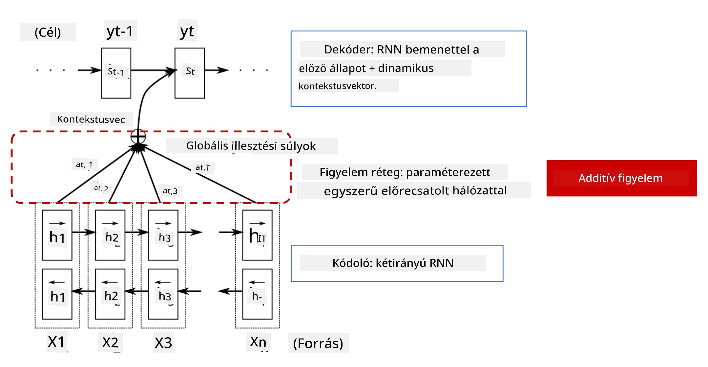
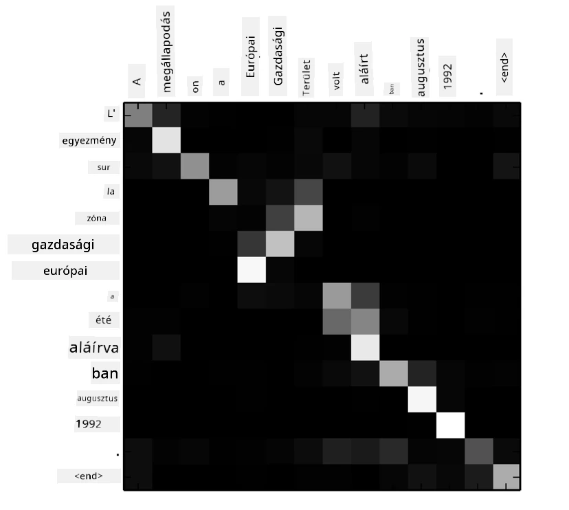
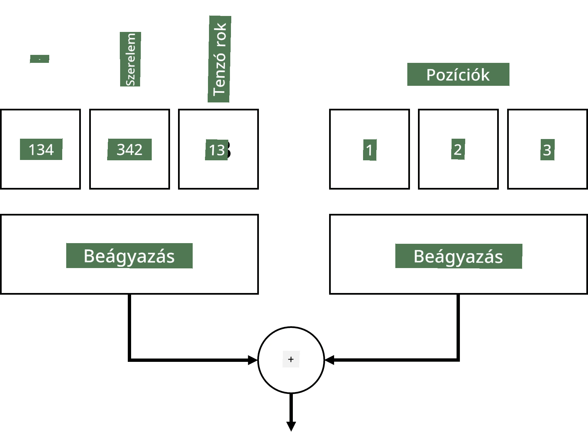
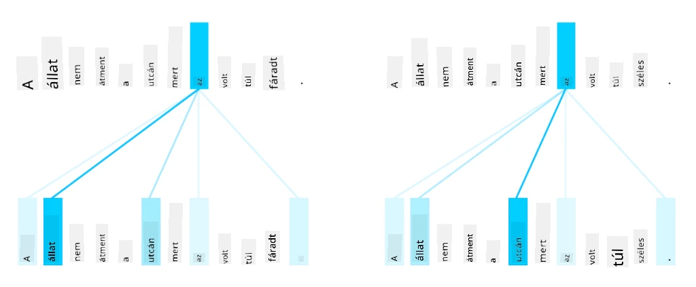
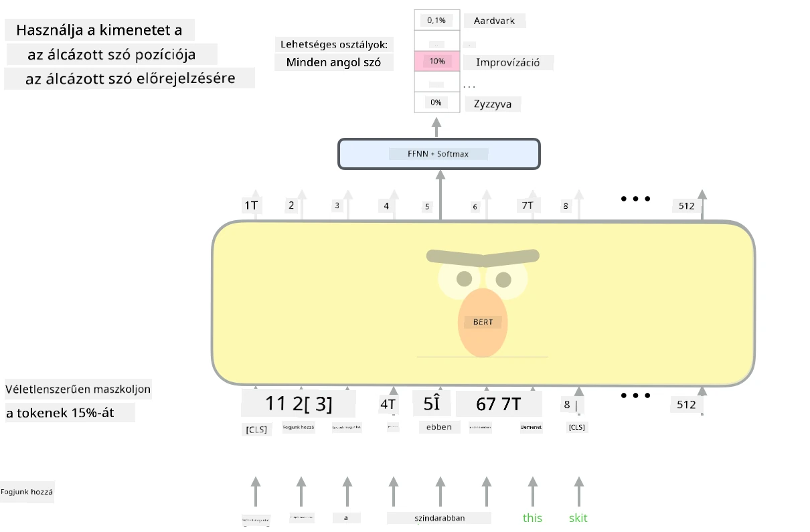

# Figyelem Mechanizmusok és Transzformerek

## [Előadás előtti kvíz](https://ff-quizzes.netlify.app/en/ai/quiz/35)

Az NLP terület egyik legfontosabb problémája a **gépi fordítás**, amely alapvető feladat olyan eszközök mögött, mint a Google Fordító. Ebben a részben a gépi fordításra, vagy általánosabban bármilyen *sorozat-sorozat* feladatra (amit **mondattranszdukciónak** is neveznek) fogunk összpontosítani.

Az RNN-ekkel a sorozat-sorozat feladatot két rekurzív hálózat valósítja meg, ahol az egyik hálózat, az **enkóder**, egy bemeneti sorozatot egy rejtett állapotba sűrít, míg a másik hálózat, a **dekóder**, ezt a rejtett állapotot egy lefordított eredménnyé bontja ki. Ezzel a megközelítéssel azonban van néhány probléma:

* Az enkóder hálózat végső állapota nehezen emlékszik a mondat elejére, ami gyenge modellminőséget eredményez hosszú mondatok esetén.
* A sorozat minden szava azonos hatással van az eredményre. A valóságban azonban a bemeneti sorozat bizonyos szavai gyakran nagyobb hatással vannak a kimeneti sorozatra, mint mások.

A **figyelem mechanizmusok** lehetőséget adnak arra, hogy súlyozzuk az egyes bemeneti vektorok kontextuális hatását az RNN kimeneti előrejelzéseire. Ez úgy valósul meg, hogy rövidítéseket hozunk létre a bemeneti RNN köztes állapotai és a kimeneti RNN között. Ily módon, amikor a yt kimeneti szimbólumot generáljuk, figyelembe vesszük az összes bemeneti rejtett állapotot hi, különböző súlyozási együtthatókkal &alpha;t,i.

> Az enkóder-dekóder modell additív figyelem mechanizmussal [Bahdanau et al., 2015](https://arxiv.org/pdf/1409.0473.pdf), idézve [ebből a blogbejegyzésből](https://lilianweng.github.io/lil-log/2018/06/24/attention-attention.html)

A figyelem mátrix {&alpha;i,j} azt mutatja, hogy a bemeneti szavak milyen mértékben játszanak szerepet egy adott szó generálásában a kimeneti sorozatban. Az alábbiakban egy ilyen mátrix példáját láthatjuk:

> Ábra [Bahdanau et al., 2015](https://arxiv.org/pdf/1409.0473.pdf) (3. ábra)

A figyelem mechanizmusok felelősek az NLP jelenlegi vagy közel jelenlegi csúcsteljesítményéért. A figyelem hozzáadása azonban jelentősen növeli a modell paramétereinek számát, ami méretezési problémákhoz vezetett az RNN-ekkel. Az RNN-ek méretezésének egyik kulcsfontosságú korlátja, hogy a modellek rekurzív jellege megnehezíti az edzés csoportosítását és párhuzamosítását. Egy RNN-ben a sorozat minden elemét sorrendben kell feldolgozni, ami azt jelenti, hogy nem lehet könnyen párhuzamosítani.

> Ábra a [Google Blogból](https://research.googleblog.com/2016/09/a-neural-network-for-machine.html)

A figyelem mechanizmusok elfogadása és ez a korlát vezetett a ma ismert és használt csúcstechnológiás transzformer modellek, például a BERT és az Open-GPT3 létrehozásához.

## Transzformer modellek

A transzformerek egyik fő ötlete az, hogy elkerüljék az RNN-ek szekvenciális jellegét, és olyan modellt hozzanak létre, amely az edzés során párhuzamosítható. Ezt két ötlet megvalósításával érik el:

* pozíciós kódolás
* önfigyelem mechanizmus használata minták megragadására RNN-ek (vagy CNN-ek) helyett (ezért hívják a transzformereket bemutató cikket *[Attention is all you need](https://arxiv.org/abs/1706.03762)* címmel)

### Pozíciós kódolás/beágyazás

A pozíciós kódolás ötlete a következő:
1. RNN-ek használatakor a tokenek relatív pozícióját a lépések száma képviseli, így azt nem kell kifejezetten ábrázolni.
2. Azonban, ha áttérünk a figyelem mechanizmusra, tudnunk kell a tokenek relatív pozícióját a sorozaton belül.
3. A pozíciós kódolás eléréséhez a tokenek sorozatát kiegészítjük a sorozatbeli tokenpozíciók sorozatával (azaz egy 0,1, ... számok sorozatával).
4. Ezután a token pozícióját összekeverjük egy token beágyazási vektorral. A pozíció (egész szám) vektorrá alakításához különböző megközelítéseket alkalmazhatunk:

* Tanítható beágyazás, hasonlóan a token beágyazáshoz. Ezt a megközelítést vesszük figyelembe itt. Beágyazási rétegeket alkalmazunk mind a tokenekre, mind azok pozícióira, amelyek azonos dimenziójú beágyazási vektorokat eredményeznek, amelyeket ezután összeadunk.
* Fix pozíciós kódoló függvény, ahogy azt az eredeti cikk javasolta.

> Kép a szerzőtől

Az eredmény, amelyet a pozíciós beágyazással kapunk, beágyazza mind az eredeti tokent, mind annak pozícióját a sorozaton belül.

### Többfejű önfigyelem

Ezután meg kell ragadnunk néhány mintát a sorozatunkon belül. Ehhez a transzformerek **önfigyelem** mechanizmust használnak, amely lényegében figyelem, amelyet ugyanarra a sorozatra alkalmazunk bemenetként és kimenetként. Az önfigyelem alkalmazása lehetővé teszi számunkra, hogy figyelembe vegyük a mondaton belüli **kontekztust**, és lássuk, mely szavak kapcsolódnak egymáshoz. Például lehetővé teszi számunkra, hogy lássuk, mely szavakra utalnak visszautalások, mint például *az*, és figyelembe vegyük a kontextust is:

> Kép a [Google Blogból](https://research.googleblog.com/2017/08/transformer-novel-neural-network.html)

A transzformerekben **többfejű figyelmet** használunk annak érdekében, hogy a hálózat képes legyen többféle függőséget megragadni, például hosszú távú és rövid távú szavak közötti kapcsolatokat, visszautalásokat és másokat.

A [TensorFlow Notebook](TransformersTF.ipynb) további részleteket tartalmaz a transzformer rétegek megvalósításáról.

### Enkóder-Dekóder Figyelem

A transzformerekben a figyelmet két helyen használjuk:

* Minták megragadására a bemeneti szövegen belül önfigyelem segítségével.
* Sorozatfordítás végrehajtására - ez az enkóder és dekóder közötti figyelemréteg.

Az enkóder-dekóder figyelem nagyon hasonló az RNN-ekben használt figyelem mechanizmushoz, ahogy azt ennek a résznek az elején leírtuk. Ez az animált diagram magyarázza az enkóder-dekóder figyelem szerepét.

Mivel minden bemeneti pozíciót függetlenül térképezünk a kimeneti pozíciókhoz, a transzformerek jobban párhuzamosíthatók, mint az RNN-ek, ami lehetővé teszi sokkal nagyobb és kifejezőbb nyelvi modellek létrehozását. Minden figyelemfej különböző kapcsolatok megtanulására használható a szavak között, ami javítja a természetes nyelvfeldolgozási feladatokat.

## BERT

A **BERT** (Bidirectional Encoder Representations from Transformers) egy nagyon nagy, többrétegű transzformer hálózat, amelynek 12 rétege van a *BERT-base* esetében, és 24 a *BERT-large* esetében. A modellt először egy nagy szövegkorpuszra (WikiPedia + könyvek) tanítják be felügyelet nélküli tanulással (maszkolt szavak előrejelzése egy mondatban). Az előképzés során a modell jelentős nyelvi megértést szerez, amelyet más adathalmazokkal finomhangolással lehet kihasználni. Ezt a folyamatot **transzfer tanulásnak** nevezzük.

> Kép [forrása](http://jalammar.github.io/illustrated-bert/)

## ✍️ Gyakorlatok: Transzformerek

Folytasd a tanulást az alábbi jegyzetfüzetekben:

* [Transzformerek PyTorch-ban](TransformersPyTorch.ipynb)
* [Transzformerek TensorFlow-ban](TransformersTF.ipynb)

## Összegzés

Ebben a leckében megismerkedtél a Transzformerekkel és a Figyelem Mechanizmusokkal, amelyek az NLP eszköztárának alapvető elemei. Számos transzformer architektúra létezik, például BERT, DistilBERT, BigBird, OpenGPT3 és még sok más, amelyek finomhangolhatók. A [HuggingFace csomag](https://github.com/huggingface/) lehetőséget nyújt ezeknek az architektúráknak a betanítására mind PyTorch, mind TensorFlow segítségével.

## 🚀 Kihívás

## [Előadás utáni kvíz](https://ff-quizzes.netlify.app/en/ai/quiz/36)

## Áttekintés és önálló tanulás

* [Blogbejegyzés](https://mchromiak.github.io/articles/2017/Sep/12/Transformer-Attention-is-all-you-need/), amely magyarázza a klasszikus [Attention is all you need](https://arxiv.org/abs/1706.03762) transzformer cikket.
* [Blogbejegyzés-sorozat](https://towardsdatascience.com/transformers-explained-visually-part-1-overview-of-functionality-95a6dd460452) a transzformerekről, amely részletesen magyarázza az architektúrát.

## [Feladat](assignment.md)

---

