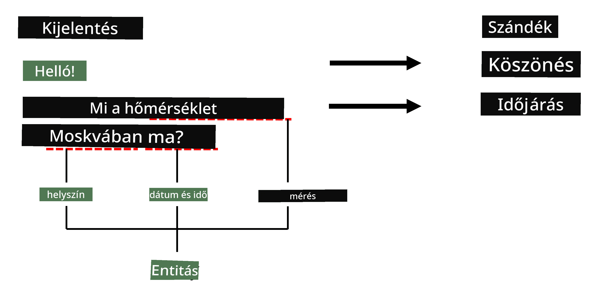
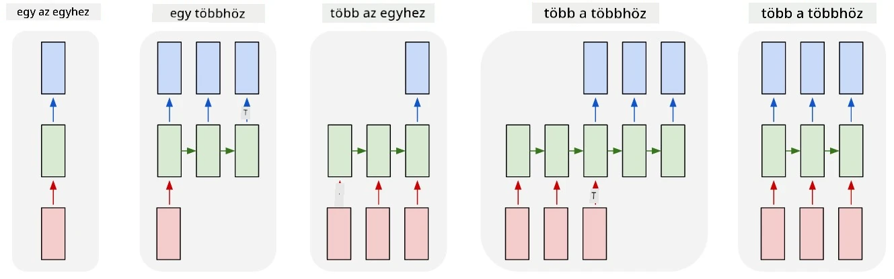

# Névelem Felismerés

Eddig főként egy NLP feladatra, a klasszifikációra koncentráltunk. Azonban vannak más NLP feladatok is, amelyeket neurális hálózatokkal meg lehet oldani. Az egyik ilyen feladat a **[Névelem Felismerés](https://wikipedia.org/wiki/Named-entity_recognition)** (NER), amely azzal foglalkozik, hogy azonosítsa a szövegben található konkrét entitásokat, például helyeket, személyneveket, dátum-idő intervallumokat, kémiai képleteket és így tovább.

## [Előadás előtti kvíz](https://ff-quizzes.netlify.app/en/ai/quiz/37)

## Példa a NER használatára

Tegyük fel, hogy egy természetes nyelvi chatbotot szeretnél fejleszteni, hasonlóan az Amazon Alexa vagy a Google Assistant megoldásaihoz. Az intelligens chatbotok úgy működnek, hogy *megértik*, mit szeretne a felhasználó, azáltal hogy szövegklasszifikációt végeznek a bemeneti mondaton. Ennek a klasszifikációnak az eredménye az úgynevezett **intenció**, amely meghatározza, mit kell tennie a chatbotnak.

> Kép a szerzőtől

Azonban a felhasználó megadhat bizonyos paramétereket a mondat részeként. Például, ha az időjárásról érdeklődik, megadhat egy helyszínt vagy dátumot. A chatbotnak képesnek kell lennie arra, hogy megértse ezeket az entitásokat, és kitöltse a paraméterhelyeket, mielőtt végrehajtja a műveletet. Pontosan itt jön képbe a NER.

> ✅ Egy másik példa lehet [tudományos orvosi cikkek elemzése](https://soshnikov.com/science/analyzing-medical-papers-with-azure-and-text-analytics-for-health/). Az egyik fő dolog, amit keresnünk kell, az a konkrét orvosi kifejezések, például betegségek és orvosi anyagok. Míg egy kis számú betegséget valószínűleg ki lehet nyerni szövegrészlet-kereséssel, összetettebb entitások, mint például kémiai vegyületek és gyógyszernevek, bonyolultabb megközelítést igényelnek.

## NER mint Token Klasszifikáció

A NER modellek lényegében **token klasszifikációs modellek**, mivel minden bemeneti tokenről el kell döntenünk, hogy egy entitáshoz tartozik-e vagy sem, és ha igen, akkor melyik entitásosztályhoz.

Vegyük például az alábbi cikkcímet:

**Tricuspidalis billentyű elégtelenség** és **lítium-karbonát** **toxicitás** egy újszülött csecsemőben.

Az entitások itt:

* A tricuspidalis billentyű elégtelenség egy betegség (`DIS`)
* A lítium-karbonát egy kémiai anyag (`CHEM`)
* A toxicitás szintén egy betegség (`DIS`)

Figyeld meg, hogy egy entitás több tokenből is állhat. És, ahogy ebben az esetben, meg kell különböztetnünk két egymást követő entitást. Ezért gyakori, hogy két osztályt használunk minden entitáshoz - az egyik az entitás első tokenjét jelöli (gyakran a `B-` előtagot használjuk, a **b**eginning, azaz kezdő token jelölésére), a másik pedig az entitás folytatását (`I-`, azaz **i**nner token). Az összes **o**ther, azaz egyéb tokenekhez az `O` osztályt használjuk. Az ilyen token címkézést [BIO címkézésnek](https://en.wikipedia.org/wiki/Inside%E2%80%93outside%E2%80%93beginning_(tagging)) (vagy IOB) nevezzük. Ha címkézzük, a címünk így fog kinézni:

Token | Címke
------|-----
Tricuspidalis | B-DIS
billentyű | I-DIS
elégtelenség | I-DIS
és | O
lítium | B-CHEM
karbonát | I-CHEM
toxicitás | B-DIS
egy | O
újszülött | O
csecsemőben | O
. | O

Mivel egy-egy megfeleltetést kell létrehoznunk a tokenek és osztályok között, egy **sok-sokhoz** neurális hálózati modellt tudunk tanítani az alábbi ábráról:

> *Kép [ebből a blogbejegyzésből](http://karpathy.github.io/2015/05/21/rnn-effectiveness/) [Andrej Karpathy](http://karpathy.github.io/) tollából. A NER token klasszifikációs modellek megfelelnek az ábra jobb szélső hálózati architektúrájának.*

## NER modellek tanítása

Mivel a NER modell lényegében egy token klasszifikációs modell, az általunk már ismert RNN-eket használhatjuk erre a feladatra. Ebben az esetben a rekurzív hálózat minden blokkja visszaadja a token ID-t. Az alábbi példa notebook bemutatja, hogyan lehet LSTM-et tanítani token klasszifikációra.

## ✍️ Példa Notebookok: NER

Folytasd a tanulást az alábbi notebookban:

* [NER TensorFlow-val](NER-TF.ipynb)

## Összegzés

A NER modell egy **token klasszifikációs modell**, ami azt jelenti, hogy token klasszifikációt tud végezni. Ez egy nagyon gyakori feladat az NLP-ben, amely segít azonosítani konkrét entitásokat a szövegben, például helyeket, neveket, dátumokat és még sok mást.

## 🚀 Kihívás

Teljesítsd az alábbi feladathoz kapcsolódó kihívást, amelyben egy névelem felismerő modellt kell tanítanod orvosi kifejezésekre, majd próbáld ki egy másik adathalmazon.

## [Előadás utáni kvíz](https://ff-quizzes.netlify.app/en/ai/quiz/38)

## Áttekintés és Önálló Tanulás

Olvasd el a blogot [A rekurzív neurális hálózatok ésszerűtlen hatékonysága](http://karpathy.github.io/2015/05/21/rnn-effectiveness/) címmel, és kövesd az ott található További Olvasmányok szekciót, hogy elmélyítsd tudásodat.

## [Feladat](lab/README.md)

Az ehhez a leckéhez kapcsolódó feladatban egy orvosi entitás felismerő modellt kell tanítanod. Kezdheted az LSTM modell tanításával, ahogy ebben a leckében bemutattuk, majd folytathatod a BERT transformer modell használatával. Olvasd el [az utasításokat](lab/README.md), hogy minden részletet megtudj.

---

