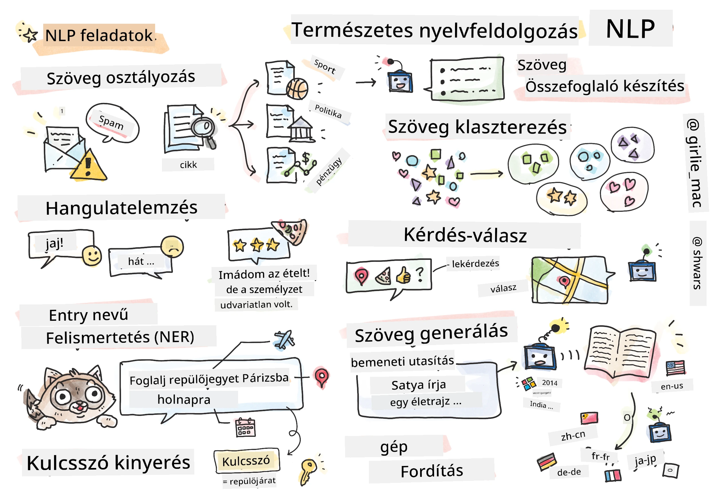

# Természetes Nyelvfeldolgozás



Ebben a részben a neurális hálózatok használatára összpontosítunk, hogy megoldjuk a **természetes nyelvfeldolgozással (NLP)** kapcsolatos feladatokat. Számos NLP probléma van, amelyeket szeretnénk, ha a számítógépek meg tudnának oldani:

* **Szöveg osztályozása** egy tipikus osztályozási probléma, amely szövegszekvenciákra vonatkozik. Példák: e-mailek osztályozása spam vagy nem spam kategóriába, vagy cikkek kategorizálása sport, üzlet, politika stb. témák szerint. Chatbotok fejlesztésekor gyakran meg kell értenünk, mit akart mondani a felhasználó – ebben az esetben **szándék osztályozásról** van szó. A szándék osztályozás során gyakran sok kategóriával kell dolgoznunk.
* **Érzelemelemzés** egy tipikus regressziós probléma, ahol egy számot (érzelmet) kell hozzárendelnünk, amely kifejezi, mennyire pozitív vagy negatív egy mondat jelentése. Az érzelemelemzés egy fejlettebb változata az **aspektus-alapú érzelemelemzés** (ABSA), ahol nem az egész mondathoz, hanem annak különböző részeihez (aspektusokhoz) rendelünk érzelmet, pl. *Ebben az étteremben tetszett a konyha, de a hangulat borzalmas volt*.
* **Név entitás felismerés** (NER) arra a problémára utal, hogy bizonyos entitásokat kell kinyerni a szövegből. Például meg kell értenünk, hogy a *Holnap Párizsba kell repülnöm* mondatban a *holnap* szó DÁTUM-ra utal, míg *Párizs* egy HELYSÉG.
* **Kulcsszó kinyerés** hasonló a NER-hez, de itt automatikusan kell kinyerni a mondat jelentéséhez fontos szavakat, anélkül, hogy előzetesen specifikus entitástípusokra tanítanánk.
* **Szöveg csoportosítása** hasznos lehet, ha hasonló mondatokat szeretnénk csoportosítani, például technikai támogatási beszélgetésekben hasonló kéréseket.
* **Kérdés megválaszolása** arra utal, hogy egy modell képes legyen egy adott kérdésre válaszolni. A modell egy szöveges részletet és egy kérdést kap bemenetként, és meg kell adnia a szöveg azon részét, ahol a válasz található (vagy néha generálnia kell a válasz szövegét).
* **Szöveg generálása** egy modell képessége új szöveg létrehozására. Ez tekinthető egy osztályozási feladatnak, amely előrejelzi a következő betűt/szót egy *szöveges indítás* alapján. Fejlett szöveg generáló modellek, mint például a GPT-3, képesek más NLP feladatokat is megoldani olyan technikák segítségével, mint a [prompt programozás](https://towardsdatascience.com/software-3-0-how-prompting-will-change-the-rules-of-the-game-a982fbfe1e0) vagy a [prompt mérnökség](https://medium.com/swlh/openai-gpt-3-and-prompt-engineering-dcdc2c5fcd29).
* **Szöveg összefoglalása** egy olyan technika, amikor azt szeretnénk, hogy a számítógép "elolvassa" a hosszú szöveget, és néhány mondatban összefoglalja.
* **Gépi fordítás** tekinthető egy nyelven történő szöveg megértésének és egy másik nyelven történő szöveg generálásának kombinációjaként.

Kezdetben a legtöbb NLP feladatot hagyományos módszerekkel oldották meg, például nyelvtanokkal. Például gépi fordítás esetén elemzőket használtak, hogy az eredeti mondatot szintaxisfává alakítsák, majd magasabb szintű szemantikai struktúrákat nyertek ki, hogy reprezentálják a mondat jelentését, és ezen jelentés és a célnyelv nyelvtana alapján generálták az eredményt. Manapság sok NLP feladatot hatékonyabban oldanak meg neurális hálózatokkal.

> Számos klasszikus NLP módszer megtalálható a [Natural Language Processing Toolkit (NLTK)](https://www.nltk.org) Python könyvtárban. Egy remek [NLTK könyv](https://www.nltk.org/book/) is elérhető online, amely bemutatja, hogyan lehet különböző NLP feladatokat megoldani az NLTK segítségével.

A kurzusunkban főként a neurális hálózatok használatára fogunk összpontosítani az NLP területén, és szükség esetén használni fogjuk az NLTK-t.

Már megtanultuk, hogyan használjunk neurális hálózatokat táblázatos adatok és képek feldolgozására. A fő különbség ezek között az adatok és a szöveg között az, hogy a szöveg változó hosszúságú szekvencia, míg a képek esetében a bemenet mérete előre ismert. Míg a konvolúciós hálózatok képesek mintákat kinyerni a bemeneti adatokból, a szövegben lévő minták összetettebbek. Például a tagadás elválasztható a tárgytól sok szóval (pl. *Nem szeretem a narancsot* vs. *Nem szeretem azokat a nagy színes ízletes narancsokat*), és ezt még mindig egy mintaként kell értelmezni. Ezért a nyelv kezeléséhez új neurális hálózattípusokat kell bevezetnünk, mint például *rekurzív hálózatok* és *transformerek*.

## Könyvtárak telepítése

Ha helyi Python telepítést használ a kurzus futtatásához, szükség lehet az NLP-hez szükséges összes könyvtár telepítésére az alábbi parancsokkal:

**PyTorch esetén**
```bash
pip install -r requirements-torch.txt
```
**TensorFlow esetén**
```bash
pip install -r requirements-tf.txt
```

> A TensorFlow-val való NLP-t kipróbálhatod a [Microsoft Learn](https://docs.microsoft.com/learn/modules/intro-natural-language-processing-tensorflow/?WT.mc_id=academic-77998-cacaste) oldalon.

## GPU Figyelmeztetés

Ebben a részben néhány példában meglehetősen nagy modelleket fogunk tanítani.
* **Használj GPU-val ellátott számítógépet**: Javasolt GPU-val ellátott számítógépen futtatni a jegyzetfüzeteket, hogy csökkentsük a várakozási időt nagy modellek esetén.
* **GPU memória korlátok**: GPU használata esetén előfordulhat, hogy kifogy a GPU memória, különösen nagy modellek tanítása során.
* **GPU memória fogyasztás**: A GPU memória fogyasztása a tanítás során számos tényezőtől függ, beleértve a minibatch méretét.
* **Minimális minibatch méret**: Ha GPU memória problémákba ütközöl, próbáld meg csökkenteni a minibatch méretét a kódban.
* **TensorFlow GPU memória felszabadítás**: A TensorFlow régebbi verziói nem mindig szabadítják fel megfelelően a GPU memóriát, ha több modellt tanítasz egy Python kernelben. A GPU memória hatékony kezeléséhez beállíthatod, hogy a TensorFlow csak szükség esetén foglaljon GPU memóriát.
* **Kód beillesztése**: A TensorFlow beállításához, hogy csak szükség esetén növelje a GPU memória foglalását, illeszd be az alábbi kódot a jegyzetfüzetedbe:

```python
physical_devices = tf.config.list_physical_devices('GPU') 
if len(physical_devices)>0:
    tf.config.experimental.set_memory_growth(physical_devices[0], True) 
```

Ha érdekel az NLP klasszikus gépi tanulási perspektívából, látogasd meg [ezt a leckesorozatot](https://github.com/microsoft/ML-For-Beginners/tree/main/6-NLP).

## Ebben a részben
Ebben a részben megtanuljuk:

* [Szöveg reprezentálása tensorokként](13-TextRep/README.md)
* [Szóbeágyazások](14-Emdeddings/README.md)
* [Nyelvi modellezés](15-LanguageModeling/README.md)
* [Rekurzív neurális hálózatok](16-RNN/README.md)
* [Generatív hálózatok](17-GenerativeNetworks/README.md)
* [Transformerek](18-Transformers/README.md)

**Felelősség kizárása**:  
Ez a dokumentum az AI fordítási szolgáltatás [Co-op Translator](https://github.com/Azure/co-op-translator) segítségével lett lefordítva. Bár törekszünk a pontosságra, kérjük, vegye figyelembe, hogy az automatikus fordítások hibákat vagy pontatlanságokat tartalmazhatnak. Az eredeti dokumentum az eredeti nyelvén tekintendő hiteles forrásnak. Kritikus információk esetén javasolt professzionális emberi fordítást igénybe venni. Nem vállalunk felelősséget semmilyen félreértésért vagy téves értelmezésért, amely a fordítás használatából eredhet.