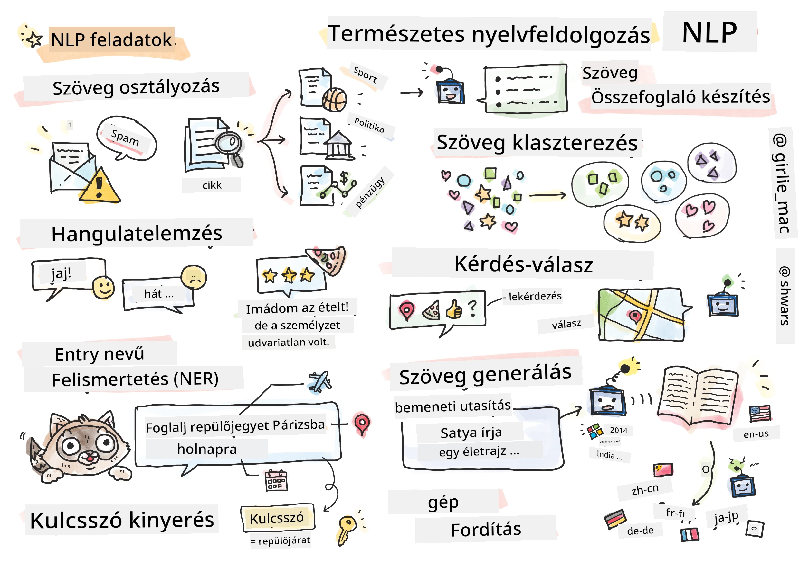

# Természetes Nyelv Feldolgozás



Ebben a szakaszban az ideghálózatok használatára fogunk koncentrálni a **természetes nyelv feldolgozással (NLP)** kapcsolatos feladatok kezelésére. Sok NLP probléma van, amelyet a számítógépek képesek legyenek megoldani:

* **Szöveg osztályozás** tipikus osztályozási probléma szöveges sorozatokkal kapcsolatban. Például az e-mail üzenetek spamból vagy nem spam kategóriába sorolása, vagy cikkek kategorizálása sport, üzlet, politika stb. szerint. Chatbot fejlesztésekor gyakran meg kell érteni, mit akart mondani a felhasználó — ebben az esetben **szándék osztályozással** foglalkozunk. Gyakran az szándék osztályozás során sok kategóriával kell dolgoznunk.
* **Hangulatelemzés** tipikus regressziós probléma, ahol egy számot (hangulatot) kell hozzárendelni egy mondat jelentésének pozitív vagy negatív értékeléséhez. Egy fejlettebb változata a hangulatelemzésnek az **aspektus-alapú hangulatelemzés** (ABSA), ahol nem az egész mondathoz, hanem annak különböző részeihez (aspektusokhoz) rendelünk hangulatot, pl. *Ebben az étteremben szerettem a konyhát, de a hangulat szörnyű volt*.
* **Nevesített entitásfelismerés** (NER) a szövegből bizonyos entitások kinyerésének problémája. Például meg kell értenünk, hogy a *Holnap Párizsba kell repülnöm* kifejezésben a *holnap* dátum, a *Párizs* pedig helyszín.
* **Kulcsszó-kivonás** hasonló a NER-hez, de ebben az esetben automatikusan kell kinyerni a mondat jelentéséhez fontos szavakat, anélkül, hogy specifikus entitástípusokra előre tréningeznénk.
* **Szöveg klaszterezés** hasznos lehet, amikor hasonló mondatokat kívánunk csoportosítani, például hasonló igényeket a műszaki támogatási beszélgetésekben.
* **Kérdés-válasz** az a képesség, hogy egy modell válaszoljon egy adott kérdésre. A modell bemenete egy szövegrészlet és egy kérdés, és meg kell határoznia a szöveg azon helyét, ahol a kérdésre a válasz található (vagy néha magát a válasz szöveget generálja).
* **Szöveggenerálás** az a képesség, hogy egy modell új szöveget generáljon. Ez tekinthető egy osztályozási feladatnak, amely a következő betűt/szót jósolja meg valamilyen *szöveges prompt* alapján. Fejlett szöveggeneráló modellek, például a GPT-3 képesek más NLP feladatokat is megoldani, mint például az osztályozás [prompt programozás](https://towardsdatascience.com/software-3-0-how-prompting-will-change-the-rules-of-the-game-a982fbfe1e0) vagy [prompt mérnökség](https://medium.com/swlh/openai-gpt-3-and-prompt-engineering-dcdc2c5fcd29) segítségével.
* **Szövegösszefoglalás** olyan technika, amikor a számítógépnek "el kell olvasnia" egy hosszú szöveget, és néhány mondatban összegeznie azt.
* **Gépi fordítás** tekinthető a szöveg értelmezésének egy nyelven és szöveggenerálásnak egy másik nyelven kombinációjaként.

Kezdetben az NLP feladatok nagy részét hagyományos módszerekkel, például nyelvtanokkal oldották meg. Például a gépi fordításban elemzőket használtak az kiinduló mondat szintaxis-fa-á alakítására, majd magasabb szintű szemantikai struktúrákat nyertek ki a mondat jelentésének reprezentálására, és az eredményt ezen jelentés és a célnyelv nyelvtana alapján generálták. Manapság sok NLP feladatot hatékonyabban oldanak meg ideghálózatokkal.

> Sok klasszikus NLP módszer elérhető a [Natural Language Processing Toolkit (NLTK)](https://www.nltk.org) Python könyvtárban. Van egy remek [NLTK könyv](https://www.nltk.org/book/) online, amely bemutatja, hogyan lehet különböző NLP feladatokat megoldani az NLTK-val.

Tanfolyamunk során főként az ideghálózatok NLP-ben való alkalmazására fogunk koncentrálni, és ahol szükséges, használjuk az NLTK-t.

Már tanultunk arról, hogyan lehet ideghálózatokat használni táblázatos adatok és képek kezelésére. Az ilyen adatok és a szöveg fő különbsége, hogy a szöveg változó hosszúságú sorozat, míg képek esetén a bemenet mérete előre ismert. Míg a konvolúciós hálózatok mintákat tudnak kinyerni a bemeneti adatokból, a minták a szövegben sokkal összetettebbek. Például lehet, hogy egy tagadás és a tárgy között számos szó lehet (pl. *Nem szeretem a narancsot*, illetve *Nem szeretem azokat a nagy színes finom narancsokat*), és ez mégis egy mintának számít. Ezért a nyelv kezeléséhez új típusú ideghálókat kell bevezetnünk, mint például *rekurzív hálózatok* és *transzformerek*.

## Könyvtárak Telepítése

Ha helyi Python telepítést használsz a tanfolyam futtatásához, szükség lehet az összes NLP-hez szükséges könyvtár telepítésére a következő parancsokkal:

**PyTorch esetén**
```bash
pip install -r requirements-pytorch.txt
```
**TensorFlow esetén**
```bash
pip install -r requirements-tf.txt
```

> Próbálhatod az NLP-t TensorFlow-val a [Microsoft Learn](https://docs.microsoft.com/learn/modules/intro-natural-language-processing-tensorflow/?WT.mc_id=academic-77998-cacaste) oldalán.

## GPU Figyelmeztetés

Ebben a szakaszban néhány példában elég nagy modelleket fogunk tanítani.
* **Használj GPU-támogatott számítógépet**: Ajánlott, hogy a jegyzeteket GPU-t támogató számítógépen futtasd a várakozási idők csökkentése érdekében nagy modellek esetén.
* **GPU memória korlátok**: GPU-n való futtatás esetén előfordulhat, hogy elfogy a GPU memória, különösen nagy modellek tanítása közben.
* **GPU memória fogyasztás**: A tanulás során fogyasztott GPU memória mennyisége több tényezőtől függ, beleértve a minibatch méretét is.
* **Minibatch méret csökkentése**: Ha problémát tapasztalsz a GPU memória miatt, próbáld csökkenteni a minibatch méretet a kódodban.
* **TensorFlow GPU memória felszabadítás**: Régebbi TensorFlow verziók nem mindig szabadítják fel megfelelően a GPU memóriát, ha több modellt tanítanak egy Python kernelben. A GPU memória hatékony kezeléséhez konfigurálhatod a TensorFlow-t úgy, hogy csak szükséges esetben foglaljon memóriát.
* **Kód beillesztése**: Ahhoz, hogy a TensorFlow csak szükség szerint bővítse a GPU memória lefoglalást, illeszd be a következő kódot a jegyzeteidbe:

```python
physical_devices = tf.config.list_physical_devices('GPU') 
if len(physical_devices)>0:
    tf.config.experimental.set_memory_growth(physical_devices[0], True) 
```

Ha érdekel az NLP klasszikus gépi tanulási nézőpontból, látogasd meg [ezt a tananyagot](https://github.com/microsoft/ML-For-Beginners/tree/main/6-NLP)

## Ebben a szakaszban
Ebben a szakaszban az alábbiakat tanuljuk meg:

* [Szöveg reprezentálása tenzorokként](13-TextRep/README.md)
* [Szóbeágyazások](14-Embeddings/README.md)
* [Nyelvmodellezés](15-LanguageModeling/README.md)
* [Rekurzív neurális hálózatok](16-RNN/README.md)
* [Generatív hálózatok](17-GenerativeNetworks/README.md)
* [Transzformerek](18-Transformers/README.md)

---

<!-- CO-OP TRANSLATOR DISCLAIMER START -->
**Jogi nyilatkozat**:
Ez a dokumentum az AI fordítási szolgáltatás, a [Co-op Translator](https://github.com/Azure/co-op-translator) segítségével készült. Bár az pontosságra törekszünk, kérjük, vegye figyelembe, hogy az automatikus fordítások hibákat vagy pontatlanságokat tartalmazhatnak. Az eredeti dokumentum az anyanyelvén tekintendő hiteles forrásnak. Fontos információk esetén professzionális emberi fordítást javasolunk. Nem vállalunk felelősséget semmilyen félreértésért vagy téves értelmezésért, amely ebből a fordításból ered.
<!-- CO-OP TRANSLATOR DISCLAIMER END -->