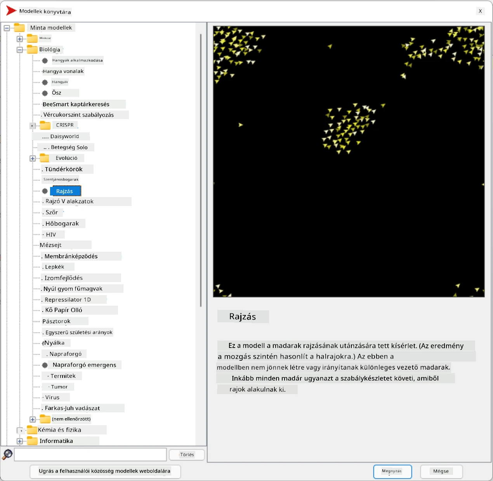
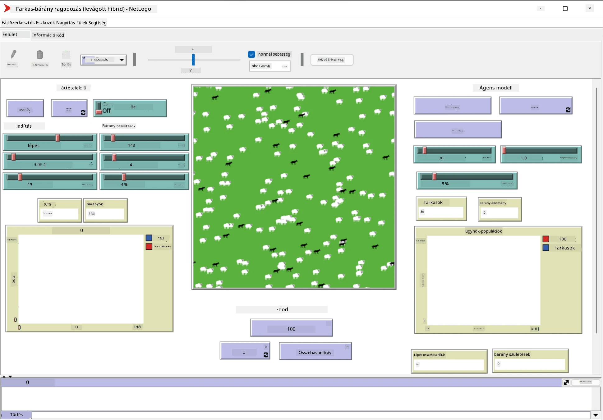

# Többügynökös rendszerek

Az intelligencia elérésének egyik lehetséges módja az úgynevezett **emergens** (vagy **szinergikus**) megközelítés, amely azon az elven alapul, hogy sok viszonylag egyszerű ügynök együttes viselkedése a rendszer egészének összetettebb (vagy intelligensebb) viselkedését eredményezheti. Elméletileg ez a [Kollektív intelligencia](https://en.wikipedia.org/wiki/Collective_intelligence), az [Emergentizmus](https://en.wikipedia.org/wiki/Global_brain) és az [Evolúciós kibernetika](https://en.wikipedia.org/wiki/Global_brain) elvein alapul, amelyek szerint a magasabb szintű rendszerek valamilyen hozzáadott értéket nyernek, ha megfelelően kombinálják őket alacsonyabb szintű rendszerekből (az úgynevezett *metarendszer-átmenet elve*).

## [Előadás előtti kvíz](https://ff-quizzes.netlify.app/en/ai/quiz/45)

A **többügynökös rendszerek** irányzata az 1990-es években jelent meg a mesterséges intelligenciában, válaszul az internet és az elosztott rendszerek növekedésére. Az egyik klasszikus mesterséges intelligencia tankönyv, az [Artificial Intelligence: A Modern Approach](https://en.wikipedia.org/wiki/Artificial_Intelligence:_A_Modern_Approach), a klasszikus mesterséges intelligenciát a többügynökös rendszerek szemszögéből vizsgálja.

A többügynökös megközelítés központi eleme az **ügynök** fogalma – egy entitás, amely egy bizonyos **környezetben** él, amelyet érzékelhet és amelyre hatással lehet. Ez egy nagyon tág definíció, és számos különböző típusú és osztályozású ügynök létezhet:

* Az érvelési képességük alapján:
   - **Reaktív** ügynökök általában egyszerű kérés-válasz típusú viselkedést mutatnak
   - **Deliberatív** ügynökök valamilyen logikai érvelést és/vagy tervezési képességeket alkalmaznak
* Az alapján, hogy hol futtatják a kódjukat:
   - **Statikus** ügynökök egy dedikált hálózati csomóponton működnek
   - **Mobil** ügynökök képesek a kódjukat hálózati csomópontok között mozgatni
* A viselkedésük alapján:
   - **Passzív ügynökök** nem rendelkeznek konkrét célokkal. Ezek az ügynökök reagálhatnak külső ingerekre, de maguktól nem kezdeményeznek cselekvéseket.
   - **Aktív ügynökök** rendelkeznek célokkal, amelyeket követnek
   - **Kognitív ügynökök** összetett tervezést és érvelést alkalmaznak

A többügynökös rendszereket manapság számos alkalmazásban használják:

* Játékokban sok nem játékos karakter (NPC) valamilyen mesterséges intelligenciát alkalmaz, és intelligens ügynöknek tekinthető
* Videógyártásban, összetett 3D jelenetek renderelése, amelyek tömegeket tartalmaznak, tipikusan többügynökös szimulációval történik
* Rendszermodellezésben a többügynökös megközelítést használják egy összetett modell viselkedésének szimulálására. Például a többügynökös megközelítést sikeresen alkalmazták a COVID-19 betegség globális terjedésének előrejelzésére. Hasonló megközelítést lehet használni egy város forgalmának modellezésére, és annak vizsgálatára, hogyan reagál a közlekedési szabályok változásaira.
* Összetett automatizálási rendszerekben minden eszköz független ügynökként működhet, ami a teljes rendszert kevésbé monolitikussá és robusztusabbá teszi.

Nem fogunk mélyen belemenni a többügynökös rendszerek részleteibe, de megvizsgálunk egy példát a **többügynökös modellezésre**.

## NetLogo

A [NetLogo](https://ccl.northwestern.edu/netlogo/) egy többügynökös modellezési környezet, amely a [Logo](https://en.wikipedia.org/wiki/Logo_(programming_language)) programozási nyelv módosított változatán alapul. Ezt a nyelvet a programozási fogalmak tanítására fejlesztették ki gyerekek számára, és lehetővé teszi egy **teknős** nevű ügynök irányítását, amely mozoghat, nyomot hagyva maga után. Ez lehetővé teszi összetett geometriai alakzatok létrehozását, ami nagyon vizuális módja az ügynök viselkedésének megértésének.

A NetLogo-ban sok teknőst hozhatunk létre a `create-turtles` parancs segítségével. Ezután utasíthatjuk az összes teknőst, hogy végezzen el bizonyos műveleteket (az alábbi példában - mozogjon előre 10 pontot):

```
create-turtles 10
ask turtles [
  forward 10
]
```

Természetesen nem érdekes, ha minden teknős ugyanazt csinálja, ezért `ask` parancs segítségével csoportokat is utasíthatunk, például azokat, amelyek egy bizonyos pont közelében vannak. Különböző *fajtájú* teknősöket is létrehozhatunk a `breed [cats cat]` paranccsal. Itt a `cat` a fajta neve, és meg kell adnunk az egyes és többes számú alakot is, mert a különböző parancsok az érthetőség érdekében különböző formákat használnak.

> ✅ Nem fogunk belemenni a NetLogo nyelv tanulásába – ha érdekel, látogasd meg a kiváló [Beginner's Interactive NetLogo Dictionary](https://ccl.northwestern.edu/netlogo/bind/) oldalt.

Letöltheted és telepítheted a NetLogo-t [innen](https://ccl.northwestern.edu/netlogo/download.shtml), hogy kipróbáld.

### Modellek könyvtára

A NetLogo egyik nagyszerű tulajdonsága, hogy tartalmaz egy működő modellekből álló könyvtárat, amelyeket kipróbálhatsz. Lépj a **File &rightarrow; Models Library** menüpontra, és számos modellkategóriából választhatsz.



> Dmitry Soshnikov által készített képernyőkép a modellek könyvtáráról

Megnyithatsz egy modellt, például **Biology &rightarrow; Flocking**.

### Főbb elvek

A modell megnyitása után a NetLogo fő képernyőjére kerülsz. Itt egy minta modell látható, amely a farkasok és juhok populációját írja le véges erőforrások (fű) mellett.



> Dmitry Soshnikov által készített képernyőkép

Ezen a képernyőn láthatod:

* Az **Interfész** szekciót, amely tartalmazza:
  - A fő mezőt, ahol az összes ügynök él
  - Különböző vezérlőelemeket: gombokat, csúszkákat stb.
  - Grafikonokat, amelyeken a szimuláció paramétereit jelenítheted meg
* A **Kód** fület, amely tartalmazza a szerkesztőt, ahol NetLogo programot írhatsz

A legtöbb esetben az interfész tartalmaz egy **Setup** gombot, amely inicializálja a szimuláció állapotát, és egy **Go** gombot, amely elindítja a végrehajtást. Ezeket a megfelelő kezelők kezelik a kódban, amelyek így néznek ki:

```
to go [
...
]
```

A NetLogo világa a következő objektumokból áll:

* **Ügynökök** (teknősök), amelyek mozoghatnak a mezőn és végezhetnek valamit. Az ügynököket a `ask turtles [...]` szintaxissal utasíthatod, és a zárójelek közötti kódot minden ügynök *teknős módban* hajtja végre.
* **Foltok** (patches), amelyek a mező négyzet alakú területei, ahol az ügynökök élnek. Hivatkozhatsz az ugyanazon a folton lévő összes ügynökre, vagy megváltoztathatod a foltok színeit és egyéb tulajdonságait. A foltokat is utasíthatod a `ask patches` paranccsal.
* **Megfigyelő** (observer), amely egy egyedi ügynök, és a világot irányítja. Az összes gombkezelő *megfigyelő módban* fut.

> ✅ A többügynökös környezet szépsége, hogy a teknős módban vagy folt módban futó kódot az összes ügynök párhuzamosan hajtja végre. Így kevés kód írásával és az egyes ügynökök viselkedésének programozásával összetett viselkedést hozhatsz létre a szimulációs rendszer egészében.

### Flocking

A többügynökös viselkedés példájaként vizsgáljuk meg a **[Flocking](https://en.wikipedia.org/wiki/Flocking_(behavior))** jelenséget. A flocking egy összetett minta, amely nagyon hasonlít arra, ahogyan a madárrajok repülnek. Amikor figyeled őket, azt gondolhatod, hogy valamilyen kollektív algoritmust követnek, vagy hogy rendelkeznek valamilyen *kollektív intelligenciával*. Azonban ez az összetett viselkedés akkor jön létre, amikor minden egyes ügynök (ebben az esetben egy *madár*) csak a közvetlen közelében lévő más ügynököket figyeli, és három egyszerű szabályt követ:

* **Igazodás** - az ügynök a szomszédos ügynökök átlagos irányába fordul
* **Kohézió** - az ügynök a szomszédok átlagos pozíciója felé próbál fordulni (*hosszú távú vonzás*)
* **Elkülönülés** - ha túl közel kerül más madarakhoz, távolodni próbál (*rövid távú taszítás*)

Futtathatod a flocking példát, és megfigyelheted a viselkedést. Állíthatod a paramétereket, például az *elkülönülés mértékét* vagy a *látótávolságot*, amely meghatározza, hogy a madarak milyen messzire látnak. Figyeld meg, hogy ha a látótávolságot 0-ra csökkented, minden madár megvakul, és a flocking leáll. Ha az elkülönülést 0-ra csökkented, minden madár egy egyenes vonalba gyűlik össze.

> ✅ Válts a **Kód** fülre, és nézd meg, hol vannak a flocking három szabálya (igazodás, kohézió és elkülönülés) megvalósítva a kódban. Figyeld meg, hogy csak azokra az ügynökökre hivatkozunk, amelyek a látótávolságon belül vannak.

### Egyéb modellek, amelyeket érdemes megnézni

Van néhány további érdekes modell, amelyeket kipróbálhatsz:

* **Art &rightarrow; Fireworks** bemutatja, hogyan tekinthető egy tűzijáték az egyes tűzfolyamok kollektív viselkedésének
* **Social Science &rightarrow; Traffic Basic** és **Social Science &rightarrow; Traffic Grid** bemutatja a városi forgalom modelljét 1D-ben és 2D rácsban, közlekedési lámpákkal vagy anélkül. Minden autó a következő szabályokat követi:
   - Ha az előtte lévő hely üres – gyorsít (egy bizonyos maximális sebességig)
   - Ha akadályt lát maga előtt – fékez (és állíthatod, hogy a sofőr milyen messzire lát)
* **Social Science &rightarrow; Party** bemutatja, hogyan csoportosulnak az emberek egy koktélpartin. Megtalálhatod azokat a paraméterkombinációkat, amelyek a csoport boldogságának leggyorsabb növekedéséhez vezetnek.

Ahogy ezekből a példákból láthatod, a többügynökös szimulációk hasznos eszközök lehetnek egy olyan összetett rendszer viselkedésének megértéséhez, amely egyénekből áll, akik ugyanazt vagy hasonló logikát követnek. Használhatók virtuális ügynökök, például [NPC-k](https://en.wikipedia.org/wiki/NPC) irányítására számítógépes játékokban, vagy ügynökök irányítására 3D animált világokban.

## Deliberatív ügynökök

A fent leírt ügynökök nagyon egyszerűek, és valamilyen algoritmus segítségével reagálnak a környezet változásaira. Ezek **reaktív ügynökök**. Azonban néha az ügynökök képesek érvelni és megtervezni a cselekvéseiket, ebben az esetben **deliberatív ügynököknek** nevezzük őket.

Egy tipikus példa lehet egy személyes ügynök, amely egy embertől kapott utasítást, hogy foglaljon le egy nyaralási utat. Tegyük fel, hogy az interneten sok ügynök él, akik segíthetnek neki. Kapcsolatba kell lépnie más ügynökökkel, hogy megnézze, milyen repülőjáratok érhetők el, milyen árakon kínálnak szállodákat különböző időpontokra, és meg kell próbálnia a legjobb árat kialkudni. Amikor a nyaralási terv elkészül és a tulajdonos megerősíti, folytathatja a foglalást.

Ehhez az ügynököknek **kommunikálniuk** kell. A sikeres kommunikációhoz szükségük van:

* Valamilyen **szabványos nyelvre a tudás cseréjéhez**, például [Knowledge Interchange Format](https://en.wikipedia.org/wiki/Knowledge_Interchange_Format) (KIF) és [Knowledge Query and Manipulation Language](https://en.wikipedia.org/wiki/Knowledge_Query_and_Manipulation_Language) (KQML). Ezeket a nyelveket a [beszédaktus-elmélet](https://en.wikipedia.org/wiki/Speech_act) alapján tervezték.
* Ezeknek a nyelveknek tartalmazniuk kell valamilyen **tárgyalási protokollokat**, amelyek különböző **aukciótípusokon** alapulnak.
* Egy **közös ontológiára**, hogy ugyanazokra a fogalmakra hivatkozzanak, ismerve azok szemantikáját
* Egy módra, hogy **felfedezzék**, mit tudnak tenni a különböző ügynökök, szintén valamilyen ontológia alapján

A deliberatív ügynökök sokkal összetettebbek, mint a reaktívak, mert nemcsak a környezet változásaira reagálnak, hanem képesek *kezdeményezni* is cselekvéseket. Az egyik javasolt architektúra a deliberatív ügynökökhöz az úgynevezett Hiedelem-Vágy-Szándék (Belief-Desire-Intention, BDI) ügynök:

* **Hiedelmek** alkotják az ügynök környezetéről szóló tudás halmazát. Ez lehet egy tudásbázis vagy szabályok halmaza, amelyeket az ügynök alkalmazhat egy adott helyzetre a környezetben.
* **Vágyak** határozzák meg, mit akar az ügynök elérni, azaz a céljait. Például a fent említett személyi asszisztens ügynök célja egy utazás lefoglalása, míg egy szállodai ügynök célja a profit maximalizálása.
* **Szándékok** azok a konkrét cselekvések, amelyeket az ügynök a céljai elérése érdekében tervez. A cselekvések általában megváltoztat

---

