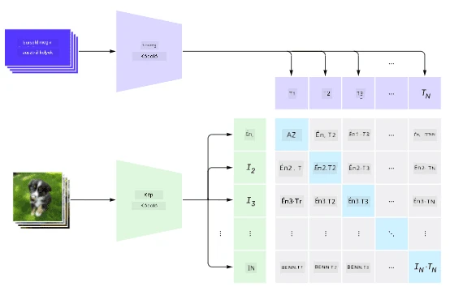
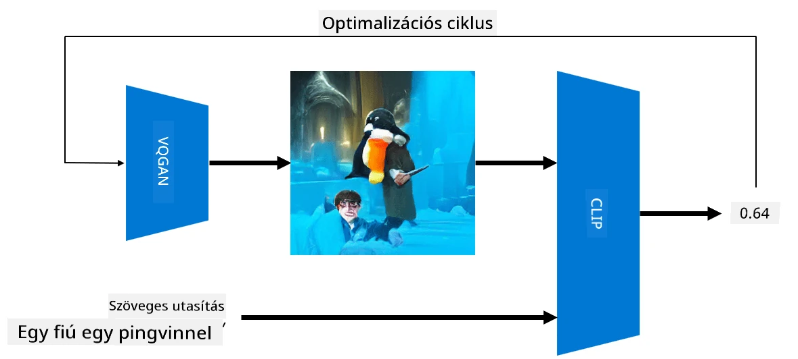

# Multi-Modális Hálózatok

A transzformer modellek sikerét követően az NLP feladatok megoldásában, hasonló architektúrákat kezdtek alkalmazni a számítógépes látás feladataira is. Egyre nagyobb az érdeklődés olyan modellek építése iránt, amelyek *kombinálják* a látás és a természetes nyelv feldolgozásának képességeit. Az egyik ilyen próbálkozás az OpenAI által készült CLIP és DALL.E.

## Kontrasztív Képelőtanulás (CLIP)

A CLIP fő ötlete, hogy képes legyen összehasonlítani szöveges utasításokat egy képpel, és meghatározni, mennyire felel meg a kép az utasításnak.

> *Kép [ebből a blogbejegyzésből](https://openai.com/blog/clip/)*

A modellt az internetről származó képeken és azok felirataival tanítják. Minden batch esetében N (kép, szöveg) párt veszünk, és ezeket valamilyen vektoriális reprezentációvá alakítjuk át I, ..., T formában. Ezeket a reprezentációkat ezután egymáshoz illesztjük. A veszteségfüggvény célja, hogy maximalizálja a koszinusz hasonlóságot az egy párhoz tartozó vektorok között (pl. I és T), és minimalizálja a koszinusz hasonlóságot az összes többi pár között. Ezért nevezik ezt a megközelítést **kontrasztívnak**.

A CLIP modell/könyvtár elérhető az [OpenAI GitHub](https://github.com/openai/CLIP) oldalán. A megközelítést [ebben a blogbejegyzésben](https://openai.com/blog/clip/) ismertetik, részletesebben pedig [ebben a tanulmányban](https://arxiv.org/pdf/2103.00020.pdf).

Miután a modellt betanították, megadhatunk neki egy batch képet és egy batch szöveges utasítást, és a kimenet egy valószínűségi tenzor lesz. A CLIP több feladatra is használható:

**Képosztályozás**

Tegyük fel, hogy képeket kell osztályoznunk például macskák, kutyák és emberek között. Ebben az esetben megadhatjuk a modellnek a képet, és egy sor szöveges utasítást: "*egy macska képe*", "*egy kutya képe*", "*egy ember képe*". A kapott 3 valószínűségi vektorban csak ki kell választanunk a legmagasabb értékű indexet.

> *Kép [ebből a blogbejegyzésből](https://openai.com/blog/clip/)*

**Szöveg-alapú Képkeresés**

Az ellenkezőjét is megtehetjük. Ha van egy képkollekciónk, átadhatjuk ezt a kollekciót a modellnek, valamint egy szöveges utasítást – ez megadja azt a képet, amely a legjobban hasonlít az adott utasításhoz.

## ✍️ Példa: [CLIP használata képosztályozáshoz és képkereséshez](../../../../../lessons/X-Extras/X1-MultiModal/Clip.ipynb)

Nyisd meg a [Clip.ipynb](../../../../../lessons/X-Extras/X1-MultiModal/Clip.ipynb) notebookot, hogy lásd a CLIP működését.

## Képalkotás VQGAN+CLIP segítségével

A CLIP **képalkotásra** is használható szöveges utasítás alapján. Ehhez szükség van egy **generátor modellre**, amely képes képeket generálni valamilyen vektoriális bemenet alapján. Az egyik ilyen modell a [VQGAN](https://compvis.github.io/taming-transformers/) (Vector-Quantized GAN).

A VQGAN főbb ötletei, amelyek megkülönböztetik a hagyományos [GAN](../../4-ComputerVision/10-GANs/README.md)-tól, a következők:
* Autoregresszív transzformer architektúra használata, amely kontextusban gazdag vizuális elemek sorozatát generálja, amelyek a képet alkotják. Ezeket a vizuális elemeket pedig [CNN](../../4-ComputerVision/07-ConvNets/README.md) tanulja meg.
* Alképrész-diszkriminátor használata, amely felismeri, hogy a kép részei "valósak" vagy "hamisak" (szemben a hagyományos GAN "mindent vagy semmit" megközelítésével).

További információ a VQGAN-ról a [Taming Transformers](https://compvis.github.io/taming-transformers/) weboldalon található.

A VQGAN és a hagyományos GAN egyik fontos különbsége, hogy az utóbbi bármilyen bemeneti vektorból képes elfogadható képet előállítani, míg a VQGAN valószínűleg nem koherens képet hoz létre. Ezért tovább kell irányítanunk a képalkotási folyamatot, amit a CLIP segítségével tehetünk meg.

Ahhoz, hogy egy szöveges utasításhoz illeszkedő képet generáljunk, egy véletlenszerű kódoló vektorral kezdünk, amelyet a VQGAN-on keresztül egy képpé alakítunk. Ezután a CLIP-et használjuk egy veszteségfüggvény előállítására, amely megmutatja, mennyire felel meg a kép a szöveges utasításnak. A cél ennek a veszteségnek a minimalizálása, a visszaterjesztés segítségével a bemeneti vektor paramétereinek módosításával.

Egy nagyszerű könyvtár, amely megvalósítja a VQGAN+CLIP-et, a [Pixray](http://github.com/pixray/pixray).

 |   | 
----|----|----
Kép generálva az *egy fiatal irodalomtanár akvarell portréja könyvvel* utasítás alapján | Kép generálva az *egy fiatal női informatikatanár olajportréja számítógéppel* utasítás alapján | Kép generálva az *egy idős matematikatanár olajportréja táblával* utasítás alapján

> Képek az **Artificial Teachers** gyűjteményből, [Dmitry Soshnikov](http://soshnikov.com) által

## DALL-E
### [DALL-E 1](https://openai.com/research/dall-e)
A DALL-E a GPT-3 egy változata, amelyet képek generálására tanítottak szöveges utasítások alapján. 12 milliárd paraméterrel lett betanítva.

A CLIP-től eltérően a DALL-E egyszerre kapja meg a szöveget és a képet egyetlen tokenfolyamként. Ezért több utasításból képeket generálhatunk a szöveg alapján.

### [DALL-E 2](https://openai.com/dall-e-2)
A DALL.E 1 és 2 közötti fő különbség, hogy a második verzió valósághűbb képeket és művészeti alkotásokat generál.

Példák a DALL-E által generált képekre:
 |   | 
----|----|----
Kép generálva az *egy fiatal irodalomtanár akvarell portréja könyvvel* utasítás alapján | Kép generálva az *egy fiatal női informatikatanár olajportréja számítógéppel* utasítás alapján | Kép generálva az *egy idős matematikatanár olajportréja táblával* utasítás alapján

## Hivatkozások

* VQGAN tanulmány: [Taming Transformers for High-Resolution Image Synthesis](https://compvis.github.io/taming-transformers/paper/paper.pdf)
* CLIP tanulmány: [Learning Transferable Visual Models From Natural Language Supervision](https://arxiv.org/pdf/2103.00020.pdf)

**Felelősség kizárása**:  
Ez a dokumentum az AI fordítási szolgáltatás, a [Co-op Translator](https://github.com/Azure/co-op-translator) segítségével lett lefordítva. Bár törekszünk a pontosságra, kérjük, vegye figyelembe, hogy az automatikus fordítások hibákat vagy pontatlanságokat tartalmazhatnak. Az eredeti dokumentum az eredeti nyelvén tekintendő hiteles forrásnak. Kritikus információk esetén javasolt professzionális emberi fordítást igénybe venni. Nem vállalunk felelősséget semmilyen félreértésért vagy téves értelmezésért, amely a fordítás használatából eredhet.