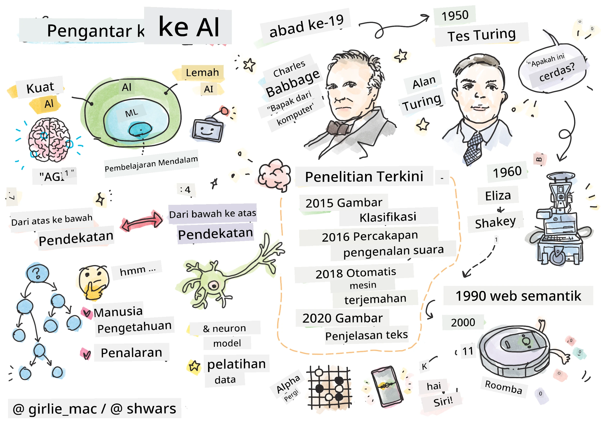
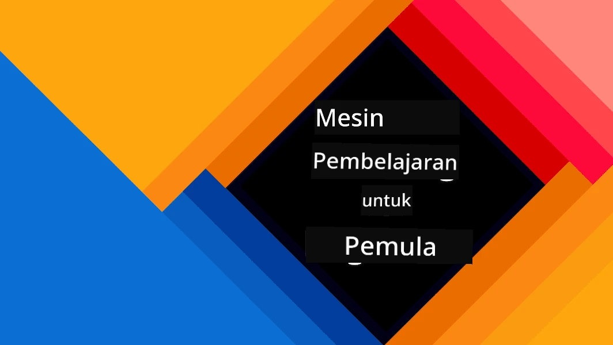
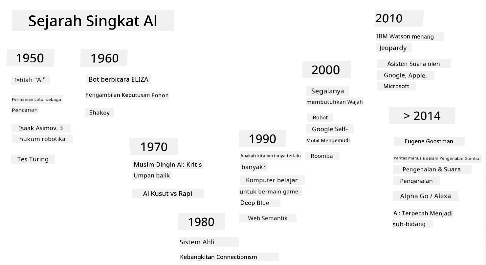
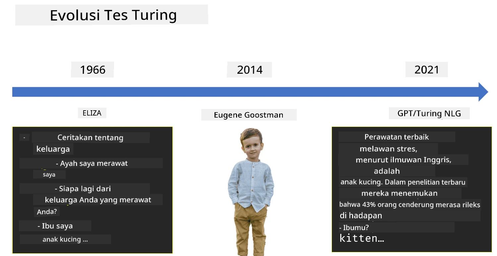

# Pengantar AI

> Sketchnote oleh [Tomomi Imura](https://twitter.com/girlie_mac)

## [Kuis sebelum kuliah](https://ff-quizzes.netlify.app/en/ai/quiz/1)

**Kecerdasan Buatan** adalah disiplin ilmu yang menarik yang mempelajari bagaimana kita dapat membuat komputer menunjukkan perilaku cerdas, misalnya melakukan hal-hal yang manusia pandai lakukan.

Awalnya, komputer ditemukan oleh [Charles Babbage](https://en.wikipedia.org/wiki/Charles_Babbage) untuk mengolah angka dengan mengikuti prosedur yang terdefinisi dengan baik - sebuah algoritma. Komputer modern, meskipun jauh lebih canggih daripada model awal yang diusulkan pada abad ke-19, masih mengikuti ide yang sama tentang perhitungan terkontrol. Oleh karena itu, kita dapat memprogram komputer untuk melakukan sesuatu jika kita mengetahui urutan langkah-langkah yang tepat yang perlu dilakukan untuk mencapai tujuan.

> Foto oleh [Vickie Soshnikova](http://twitter.com/vickievalerie)

> ✅ Menentukan usia seseorang dari fotonya adalah tugas yang tidak dapat diprogram secara eksplisit, karena kita tidak tahu bagaimana kita menghasilkan angka di kepala kita saat melakukannya.

---

Namun, ada beberapa tugas yang kita tidak tahu secara eksplisit bagaimana menyelesaikannya. Pertimbangkan menentukan usia seseorang dari fotonya. Kita entah bagaimana belajar melakukannya, karena kita telah melihat banyak contoh orang dengan berbagai usia, tetapi kita tidak dapat secara eksplisit menjelaskan bagaimana kita melakukannya, atau memprogram komputer untuk melakukannya. Inilah jenis tugas yang menjadi perhatian **Kecerdasan Buatan** (disingkat AI).

✅ Pikirkan beberapa tugas yang dapat Anda serahkan kepada komputer yang akan mendapat manfaat dari AI. Pertimbangkan bidang keuangan, kedokteran, dan seni - bagaimana bidang-bidang ini saat ini mendapat manfaat dari AI?

## AI Lemah vs. AI Kuat

AI Lemah | AI Kuat
---------------------------------------|-------------------------------------
AI Lemah mengacu pada sistem AI yang dirancang dan dilatih untuk tugas tertentu atau serangkaian tugas yang sempit.|AI Kuat, atau Kecerdasan Umum Buatan (AGI), mengacu pada sistem AI dengan kecerdasan dan pemahaman setara manusia.
Sistem AI ini tidak secara umum cerdas; mereka unggul dalam melakukan tugas yang telah ditentukan tetapi tidak memiliki pemahaman atau kesadaran sejati.|Sistem AI ini memiliki kemampuan untuk melakukan tugas intelektual apa pun yang dapat dilakukan manusia, beradaptasi dengan berbagai domain, dan memiliki bentuk kesadaran atau kesadaran diri.
Contoh AI lemah termasuk asisten virtual seperti Siri atau Alexa, algoritma rekomendasi yang digunakan oleh layanan streaming, dan chatbot yang dirancang untuk tugas layanan pelanggan tertentu.|Mencapai AI Kuat adalah tujuan jangka panjang penelitian AI dan akan membutuhkan pengembangan sistem AI yang dapat bernalar, belajar, memahami, dan beradaptasi di berbagai tugas dan konteks.
AI Lemah sangat terspesialisasi dan tidak memiliki kemampuan kognitif seperti manusia atau kemampuan pemecahan masalah umum di luar domain sempitnya.|AI Kuat saat ini adalah konsep teoretis, dan belum ada sistem AI yang mencapai tingkat kecerdasan umum ini.

Untuk informasi lebih lanjut, lihat **[Artificial General Intelligence](https://en.wikipedia.org/wiki/Artificial_general_intelligence)** (AGI).

## Definisi Kecerdasan dan Tes Turing

Salah satu masalah ketika membahas istilah **[Kecerdasan](https://en.wikipedia.org/wiki/Intelligence)** adalah tidak adanya definisi yang jelas untuk istilah ini. Seseorang dapat berargumen bahwa kecerdasan terkait dengan **pemikiran abstrak**, atau dengan **kesadaran diri**, tetapi kita tidak dapat mendefinisikannya dengan tepat.

> [Foto](https://unsplash.com/photos/75715CVEJhI) oleh [Amber Kipp](https://unsplash.com/@sadmax) dari Unsplash

Untuk melihat ambiguitas istilah *kecerdasan*, coba jawab pertanyaan: "Apakah kucing itu cerdas?". Orang yang berbeda cenderung memberikan jawaban yang berbeda untuk pertanyaan ini, karena tidak ada tes yang diterima secara universal untuk membuktikan apakah pernyataan itu benar atau tidak. Dan jika Anda berpikir ada - coba jalankan kucing Anda melalui tes IQ...

✅ Pikirkan sejenak bagaimana Anda mendefinisikan kecerdasan. Apakah burung gagak yang dapat memecahkan labirin untuk mendapatkan makanan itu cerdas? Apakah seorang anak cerdas?

---

Ketika berbicara tentang AGI, kita perlu memiliki cara untuk menentukan apakah kita telah menciptakan sistem yang benar-benar cerdas. [Alan Turing](https://en.wikipedia.org/wiki/Alan_Turing) mengusulkan sebuah cara yang disebut **[Tes Turing](https://en.wikipedia.org/wiki/Turing_test)**, yang juga berfungsi sebagai definisi kecerdasan. Tes ini membandingkan sistem tertentu dengan sesuatu yang secara inheren cerdas - seorang manusia nyata, dan karena perbandingan otomatis apa pun dapat dilewati oleh program komputer, kita menggunakan seorang interogator manusia. Jadi, jika seorang manusia tidak dapat membedakan antara orang nyata dan sistem komputer dalam dialog berbasis teks - sistem tersebut dianggap cerdas.

> Sebuah chatbot bernama [Eugene Goostman](https://en.wikipedia.org/wiki/Eugene_Goostman), yang dikembangkan di St. Petersburg, hampir berhasil melewati Tes Turing pada tahun 2014 dengan menggunakan trik kepribadian yang cerdik. Bot ini mengumumkan sejak awal bahwa ia adalah seorang anak laki-laki Ukraina berusia 13 tahun, yang akan menjelaskan kurangnya pengetahuan dan beberapa ketidaksesuaian dalam teks. Bot ini meyakinkan 30% juri bahwa ia adalah manusia setelah dialog selama 5 menit, sebuah metrik yang diyakini Turing dapat dicapai oleh mesin pada tahun 2000. Namun, perlu dipahami bahwa ini tidak menunjukkan bahwa kita telah menciptakan sistem cerdas, atau bahwa sistem komputer telah menipu interogator manusia - sistem tersebut tidak menipu manusia, melainkan pencipta bot yang melakukannya!

✅ Pernahkah Anda tertipu oleh chatbot sehingga berpikir bahwa Anda sedang berbicara dengan manusia? Bagaimana ia meyakinkan Anda?

## Pendekatan Berbeda terhadap AI

Jika kita ingin komputer berperilaku seperti manusia, kita perlu entah bagaimana memodelkan cara berpikir kita di dalam komputer. Akibatnya, kita perlu mencoba memahami apa yang membuat manusia menjadi cerdas.

> Untuk dapat memprogram kecerdasan ke dalam mesin, kita perlu memahami bagaimana proses pengambilan keputusan kita sendiri bekerja. Jika Anda melakukan sedikit introspeksi, Anda akan menyadari bahwa ada beberapa proses yang terjadi secara tidak sadar – misalnya, kita dapat membedakan kucing dari anjing tanpa memikirkannya - sementara yang lain melibatkan penalaran.

Ada dua pendekatan yang mungkin untuk masalah ini:

Pendekatan Top-Down (Penalaran Simbolik) | Pendekatan Bottom-Up (Jaringan Saraf)
---------------------------------------|-------------------------------------
Pendekatan top-down memodelkan cara seseorang bernalar untuk menyelesaikan masalah. Ini melibatkan ekstraksi **pengetahuan** dari manusia, dan merepresentasikannya dalam bentuk yang dapat dibaca komputer. Kita juga perlu mengembangkan cara untuk memodelkan **penalaran** di dalam komputer. | Pendekatan bottom-up memodelkan struktur otak manusia, yang terdiri dari sejumlah besar unit sederhana yang disebut **neuron**. Setiap neuron bertindak seperti rata-rata berbobot dari inputnya, dan kita dapat melatih jaringan neuron untuk menyelesaikan masalah berguna dengan memberikan **data pelatihan**.

Ada juga beberapa pendekatan lain terhadap kecerdasan:

* Pendekatan **Emergen**, **Sinergis**, atau **multi-agen** didasarkan pada fakta bahwa perilaku cerdas yang kompleks dapat diperoleh melalui interaksi sejumlah besar agen sederhana. Menurut [cybernetika evolusioner](https://en.wikipedia.org/wiki/Global_brain#Evolutionary_cybernetics), kecerdasan dapat *muncul* dari perilaku reaktif yang lebih sederhana dalam proses *transisi metasistem*.

* Pendekatan **Evolusioner**, atau **algoritma genetik** adalah proses optimasi berdasarkan prinsip evolusi.

Kita akan membahas pendekatan-pendekatan ini nanti dalam kursus, tetapi saat ini kita akan fokus pada dua arah utama: top-down dan bottom-up.

### Pendekatan Top-Down

Dalam **pendekatan top-down**, kita mencoba memodelkan penalaran kita. Karena kita dapat mengikuti pikiran kita saat bernalar, kita dapat mencoba memformalkan proses ini dan memprogramnya di dalam komputer. Ini disebut **penalaran simbolik**.

Orang cenderung memiliki beberapa aturan dalam pikiran mereka yang membimbing proses pengambilan keputusan mereka. Misalnya, ketika seorang dokter mendiagnosis pasien, ia mungkin menyadari bahwa seseorang mengalami demam, dan dengan demikian mungkin ada peradangan di dalam tubuh. Dengan menerapkan sejumlah besar aturan pada masalah tertentu, seorang dokter mungkin dapat menghasilkan diagnosis akhir.

Pendekatan ini sangat bergantung pada **representasi pengetahuan** dan **penalaran**. Mengekstraksi pengetahuan dari seorang ahli manusia mungkin menjadi bagian yang paling sulit, karena seorang dokter dalam banyak kasus tidak akan tahu persis mengapa ia menghasilkan diagnosis tertentu. Terkadang solusi hanya muncul di kepalanya tanpa pemikiran eksplisit. Beberapa tugas, seperti menentukan usia seseorang dari sebuah foto, sama sekali tidak dapat direduksi menjadi manipulasi pengetahuan.

### Pendekatan Bottom-Up

Sebaliknya, kita dapat mencoba memodelkan elemen-elemen paling sederhana di dalam otak kita – sebuah neuron. Kita dapat membangun apa yang disebut **jaringan saraf buatan** di dalam komputer, dan kemudian mencoba mengajarkannya untuk menyelesaikan masalah dengan memberinya contoh-contoh. Proses ini mirip dengan bagaimana seorang bayi baru lahir belajar tentang lingkungannya dengan melakukan pengamatan.

✅ Lakukan sedikit penelitian tentang bagaimana bayi belajar. Apa elemen dasar dari otak bayi?

> | Bagaimana dengan ML?         |      |
> |--------------|-----------|
> | Bagian dari Kecerdasan Buatan yang didasarkan pada komputer yang belajar menyelesaikan masalah berdasarkan beberapa data disebut **Machine Learning**. Kita tidak akan membahas pembelajaran mesin klasik dalam kursus ini - kami merujuk Anda ke kurikulum [Machine Learning for Beginners](http://aka.ms/ml-beginners). |       |

## Sejarah Singkat AI

Kecerdasan Buatan dimulai sebagai sebuah bidang pada pertengahan abad ke-20. Awalnya, penalaran simbolik adalah pendekatan yang dominan, dan ini menghasilkan sejumlah keberhasilan penting, seperti sistem pakar – program komputer yang mampu bertindak sebagai ahli dalam beberapa domain masalah terbatas. Namun, segera menjadi jelas bahwa pendekatan semacam itu tidak dapat berkembang dengan baik. Mengekstraksi pengetahuan dari seorang ahli, merepresentasikannya di dalam komputer, dan menjaga basis pengetahuan tersebut tetap akurat ternyata menjadi tugas yang sangat kompleks, dan terlalu mahal untuk praktis dalam banyak kasus. Hal ini menyebabkan apa yang disebut [AI Winter](https://en.wikipedia.org/wiki/AI_winter) pada tahun 1970-an.

> Gambar oleh [Dmitry Soshnikov](http://soshnikov.com)

Seiring waktu, sumber daya komputasi menjadi lebih murah, dan lebih banyak data tersedia, sehingga pendekatan jaringan saraf mulai menunjukkan kinerja yang luar biasa dalam bersaing dengan manusia di banyak bidang, seperti penglihatan komputer atau pemahaman ucapan. Dalam dekade terakhir, istilah Kecerdasan Buatan sebagian besar digunakan sebagai sinonim untuk Jaringan Saraf, karena sebagian besar keberhasilan AI yang kita dengar didasarkan pada mereka.

Kita dapat mengamati bagaimana pendekatan berubah, misalnya, dalam menciptakan program komputer yang bermain catur:

* Program catur awal didasarkan pada pencarian – sebuah program secara eksplisit mencoba memperkirakan kemungkinan langkah lawan untuk sejumlah langkah berikutnya, dan memilih langkah optimal berdasarkan posisi optimal yang dapat dicapai dalam beberapa langkah. Hal ini mengarah pada pengembangan algoritma pencarian yang disebut [alpha-beta pruning](https://en.wikipedia.org/wiki/Alpha%E2%80%93beta_pruning).
* Strategi pencarian bekerja dengan baik menjelang akhir permainan, di mana ruang pencarian dibatasi oleh sejumlah kecil langkah yang mungkin. Namun, pada awal permainan, ruang pencarian sangat besar, dan algoritma dapat ditingkatkan dengan belajar dari pertandingan yang ada antara pemain manusia. Eksperimen selanjutnya menggunakan apa yang disebut [case-based reasoning](https://en.wikipedia.org/wiki/Case-based_reasoning), di mana program mencari kasus dalam basis pengetahuan yang sangat mirip dengan posisi saat ini dalam permainan.
* Program modern yang mengalahkan pemain manusia didasarkan pada jaringan saraf dan [pembelajaran penguatan](https://en.wikipedia.org/wiki/Reinforcement_learning), di mana program belajar bermain semata-mata dengan bermain dalam waktu lama melawan dirinya sendiri dan belajar dari kesalahannya sendiri – mirip dengan cara manusia belajar bermain catur. Namun, program komputer dapat memainkan lebih banyak permainan dalam waktu yang jauh lebih singkat, dan dengan demikian dapat belajar jauh lebih cepat.

✅ Lakukan sedikit penelitian tentang permainan lain yang telah dimainkan oleh AI.

Demikian pula, kita dapat melihat bagaimana pendekatan terhadap pembuatan “program berbicara” (yang mungkin lulus Tes Turing) berubah:

* Program awal semacam ini seperti [Eliza](https://en.wikipedia.org/wiki/ELIZA), didasarkan pada aturan tata bahasa yang sangat sederhana dan reformulasi kalimat input menjadi sebuah pertanyaan.
* Asisten modern, seperti Cortana, Siri, atau Google Assistant semuanya adalah sistem hibrida yang menggunakan jaringan saraf untuk mengubah ucapan menjadi teks dan mengenali niat kita, lalu menggunakan beberapa penalaran atau algoritma eksplisit untuk melakukan tindakan yang diperlukan.
* Di masa depan, kita mungkin mengharapkan model berbasis jaringan sepenuhnya untuk menangani dialog secara mandiri. Keluarga jaringan saraf GPT dan [Turing-NLG](https://www.microsoft.com/research/blog/turing-nlg-a-17-billion-parameter-language-model-by-microsoft) baru-baru ini menunjukkan keberhasilan besar dalam hal ini.

> Gambar oleh Dmitry Soshnikov, [foto](https://unsplash.com/photos/r8LmVbUKgns) oleh [Marina Abrosimova](https://unsplash.com/@abrosimova_marina_foto), Unsplash

## Penelitian AI Terkini

Pertumbuhan besar dalam penelitian jaringan saraf dimulai sekitar tahun 2010, ketika dataset publik besar mulai tersedia. Koleksi besar gambar yang disebut [ImageNet](https://en.wikipedia.org/wiki/ImageNet), yang berisi sekitar 14 juta gambar yang telah diberi anotasi, melahirkan [ImageNet Large Scale Visual Recognition Challenge](https://image-net.org/challenges/LSVRC/).

> Gambar oleh [Dmitry Soshnikov](http://soshnikov.com)

Pada tahun 2012, [Convolutional Neural Networks](../4-ComputerVision/07-ConvNets/README.md) pertama kali digunakan dalam klasifikasi gambar, yang menyebabkan penurunan signifikan dalam kesalahan klasifikasi (dari hampir 30% menjadi 16,4%). Pada tahun 2015, arsitektur ResNet dari Microsoft Research [mencapai akurasi setara manusia](https://doi.org/10.1109/ICCV.2015.123).

Sejak saat itu, Jaringan Saraf menunjukkan keberhasilan yang sangat baik dalam banyak tugas:

---

Tahun | Paritas dengan manusia tercapai
-----|--------
2015 | [Klasifikasi Gambar](https://doi.org/10.1109/ICCV.2015.123)
2016 | [Pengakuan Ucapan Percakapan](https://arxiv.org/abs/1610.05256)
2018 | [Penerjemahan Mesin Otomatis](https://arxiv.org/abs/1803.05567) (Cina-ke-Inggris)
2020 | [Pembuatan Caption Gambar](https://arxiv.org/abs/2009.13682)

Selama beberapa tahun terakhir, kita telah menyaksikan kesuksesan besar dengan model bahasa besar, seperti BERT dan GPT-3. Hal ini terjadi terutama karena banyaknya data teks umum yang tersedia, yang memungkinkan kita melatih model untuk menangkap struktur dan makna teks, melakukan pra-pelatihan pada koleksi teks umum, dan kemudian mengkhususkan model tersebut untuk tugas yang lebih spesifik. Kita akan mempelajari lebih lanjut tentang [Pemrosesan Bahasa Alami](../5-NLP/README.md) nanti dalam kursus ini.

## 🚀 Tantangan

Lakukan penelusuran di internet untuk menentukan, menurut Anda, di mana AI paling efektif digunakan. Apakah itu di aplikasi pemetaan, layanan pengubah ucapan ke teks, atau video game? Teliti bagaimana sistem tersebut dibangun.

## [Kuis setelah kuliah](https://ff-quizzes.netlify.app/en/ai/quiz/2)

## Tinjauan & Studi Mandiri

Tinjau sejarah AI dan ML dengan membaca [pelajaran ini](https://github.com/microsoft/ML-For-Beginners/tree/main/1-Introduction/2-history-of-ML). Ambil satu elemen dari sketchnote di bagian atas pelajaran tersebut atau pelajaran ini dan teliti lebih dalam untuk memahami konteks budaya yang memengaruhi evolusinya.

**Tugas**: [Game Jam](assignment.md)

---

<!-- CO-OP TRANSLATOR DISCLAIMER START -->
**Penafian**:  
Dokumen ini telah diterjemahkan menggunakan layanan penerjemahan AI [Co-op Translator](https://github.com/Azure/co-op-translator). Meskipun kami berusaha untuk memberikan hasil yang akurat, harap diketahui bahwa terjemahan otomatis mungkin mengandung kesalahan atau ketidakakuratan. Dokumen asli dalam bahasa aslinya harus dianggap sebagai sumber yang otoritatif. Untuk informasi yang bersifat kritis, disarankan menggunakan jasa penerjemahan manusia profesional. Kami tidak bertanggung jawab atas kesalahpahaman atau interpretasi yang salah yang timbul dari penggunaan terjemahan ini.
<!-- CO-OP TRANSLATOR DISCLAIMER END -->