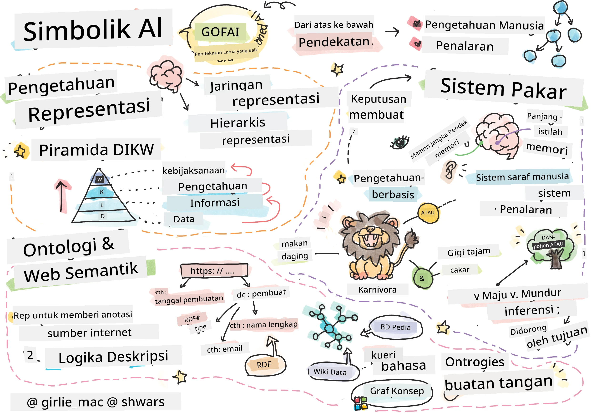
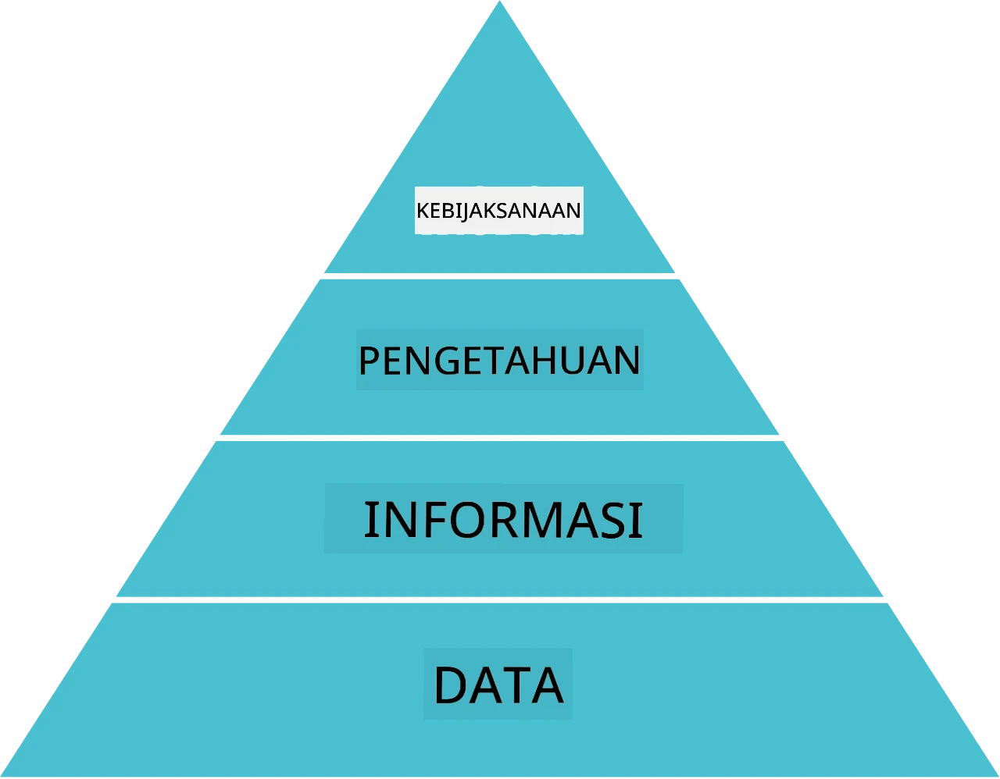
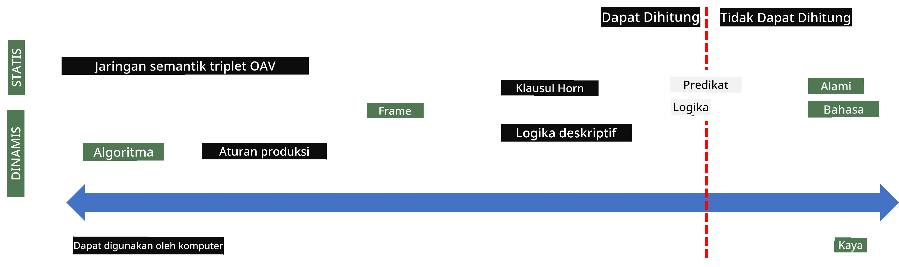
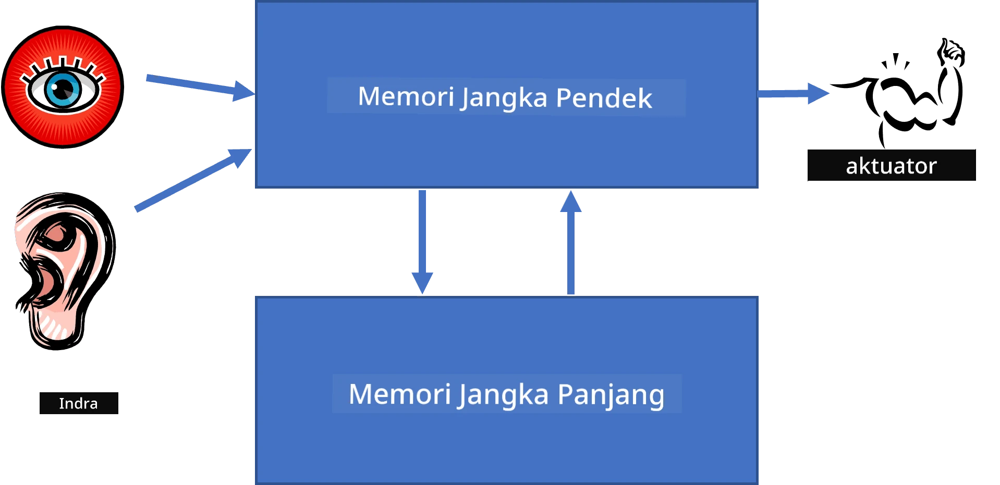
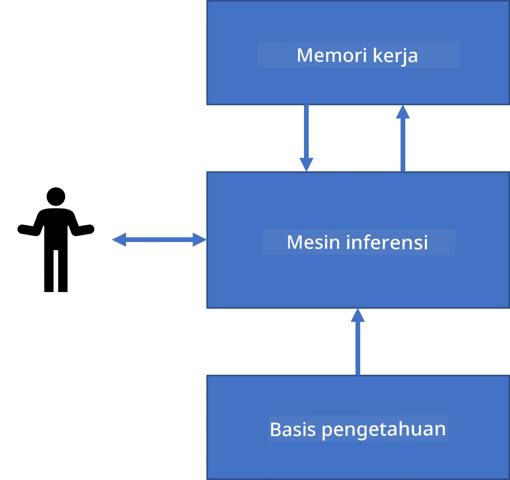
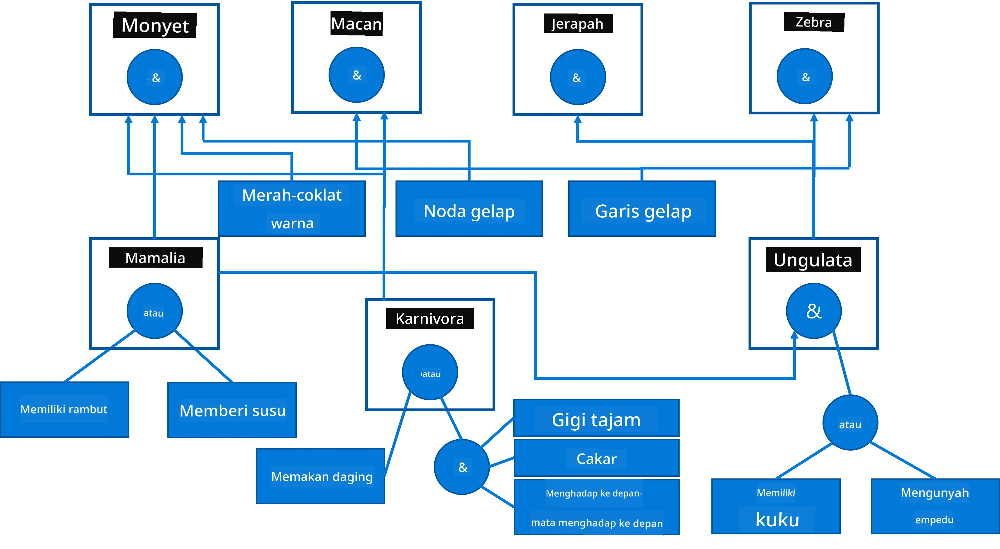
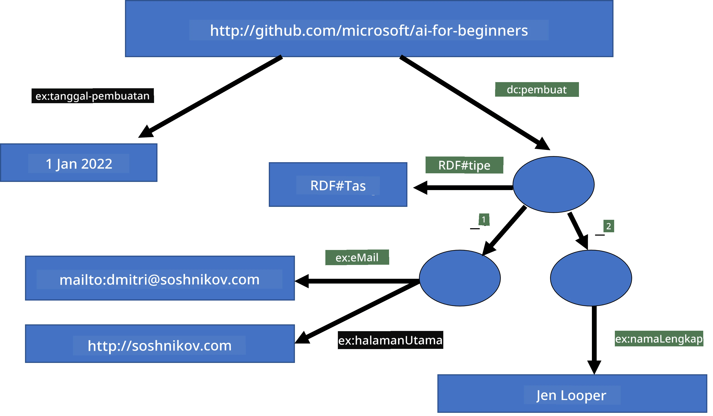
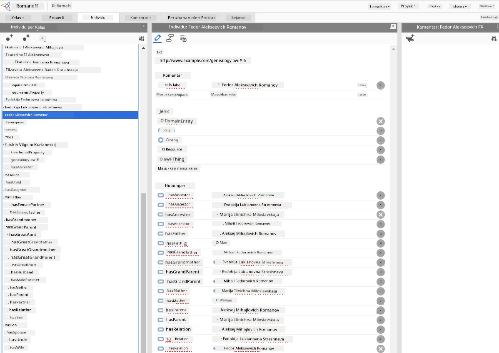

# Representasi Pengetahuan dan Sistem Pakar



> Sketchnote oleh [Tomomi Imura](https://twitter.com/girlie_mac)

Pencarian kecerdasan buatan didasarkan pada pencarian pengetahuan, untuk memahami dunia serupa dengan bagaimana manusia melakukannya. Tetapi bagaimana Anda bisa melakukannya?

## [Kuis pra-ceramah](https://ff-quizzes.netlify.app/en/ai/quiz/3)

Pada masa awal AI, pendekatan top-down untuk membuat sistem cerdas (dibahas pada pelajaran sebelumnya) sangat populer. Idenya adalah mengekstrak pengetahuan dari manusia ke dalam bentuk yang dapat dibaca mesin, dan kemudian menggunakannya untuk menyelesaikan masalah secara otomatis. Pendekatan ini didasarkan pada dua ide besar:

* Representasi Pengetahuan
* Penalaran

## Representasi Pengetahuan

Salah satu konsep penting dalam AI Simbolik adalah **pengetahuan**. Penting untuk membedakan pengetahuan dari *informasi* atau *data*. Misalnya, seseorang bisa mengatakan bahwa buku berisi pengetahuan, karena seseorang bisa mempelajari buku dan menjadi seorang ahli. Namun, yang sebenarnya terkandung dalam buku disebut *data*, dan dengan membaca buku dan mengintegrasikan data ini ke dalam model dunia kita, kita mengubah data ini menjadi pengetahuan.

> ✅ **Pengetahuan** adalah sesuatu yang ada di dalam kepala kita dan mewakili pemahaman kita tentang dunia. Ini diperoleh melalui proses **pembelajaran** aktif, yang mengintegrasikan potongan-potongan informasi yang kita terima ke dalam model dunia aktif kita.

Sering kali, kita tidak mendefinisikan pengetahuan secara ketat, tetapi menyelaraskannya dengan konsep terkait lainnya menggunakan [Piramida DIKW](https://en.wikipedia.org/wiki/DIKW_pyramid). Ini berisi konsep-konsep berikut:

* **Data** adalah sesuatu yang direpresentasikan dalam media fisik, seperti teks tertulis atau kata-kata yang diucapkan. Data ada secara independen dari manusia dan dapat dipindahkan antar orang.
* **Informasi** adalah bagaimana kita menginterpretasikan data di kepala kita. Misalnya, saat kita mendengar kata *komputer*, kita memiliki pemahaman tentang apa itu.
* **Pengetahuan** adalah informasi yang diintegrasikan ke dalam model dunia kita. Misalnya, setelah kita belajar apa itu komputer, kita mulai memiliki beberapa gagasan tentang cara kerjanya, berapa harganya, dan untuk apa dapat digunakan. Jaringan konsep terkait ini membentuk pengetahuan kita.
* **Kebijaksanaan** adalah tingkat pemahaman kita tentang dunia yang lebih tinggi lagi, dan mewakili *meta-pengetahuan*, misalnya gagasan tentang bagaimana dan kapan pengetahuan itu harus digunakan.



*Gambar [dari Wikipedia](https://commons.wikimedia.org/w/index.php?curid=37705247), Oleh Longlivetheux - Karya sendiri, CC BY-SA 4.0*

Dengan demikian, masalah **representasi pengetahuan** adalah menemukan cara efektif untuk merepresentasikan pengetahuan di dalam komputer dalam bentuk data, agar dapat digunakan secara otomatis. Ini dapat dilihat sebagai spektrum:



> Gambar oleh [Dmitry Soshnikov](http://soshnikov.com)

* Di sisi kiri, terdapat jenis representasi pengetahuan yang sangat sederhana yang dapat digunakan secara efektif oleh komputer. Yang paling sederhana adalah algoritmik, ketika pengetahuan direpresentasikan oleh program komputer. Namun, ini bukan cara terbaik untuk merepresentasikan pengetahuan, karena tidak fleksibel. Pengetahuan di kepala kita sering kali tidak algoritmik.
* Di sisi kanan, ada representasi seperti teks alami. Ini yang paling kuat, tetapi tidak dapat digunakan untuk penalaran otomatis.

> ✅ Pikirkan sejenak tentang bagaimana Anda merepresentasikan pengetahuan di kepala Anda dan mengubahnya menjadi catatan. Apakah ada format tertentu yang bekerja dengan baik untuk membantu pengingatan?

## Mengklasifikasikan Representasi Pengetahuan Komputer

Kita dapat mengklasifikasikan metode representasi pengetahuan komputer ke dalam kategori berikut:

* **Representasi jaringan** didasarkan pada fakta bahwa kita memiliki jaringan konsep yang saling terkait di kepala kita. Kita dapat mencoba mereproduksi jaringan yang sama sebagai graf di dalam komputer—yang disebut **jaringan semantik**.

1. **Triplet Objek-Atribut-Nilai** atau **pasangan atribut-nilai**. Karena graf bisa direpresentasikan di dalam komputer sebagai daftar simpul dan sisi, kita dapat merepresentasikan jaringan semantik dengan daftar triplet, yang berisi objek, atribut, dan nilai. Misalnya, kita membangun triplet berikut tentang bahasa pemrograman:

Objek | Atribut | Nilai  
-------|-----------|------  
Python | adalah | Bahasa-Tanpa-Tipe  
Python | diciptakan-oleh | Guido van Rossum  
Python | sintaks-blok | indentasi  
Bahasa-Tanpa-Tipe | tidak memiliki | definisi tipe  

> ✅ Pikirkan bagaimana triplet dapat digunakan untuk merepresentasikan jenis pengetahuan lainnya.

2. **Representasi hierarki** menekankan fakta bahwa kita sering membuat hierarki objek di kepala kita. Misalnya, kita tahu bahwa burung kenari adalah burung, dan semua burung memiliki sayap. Kita juga memiliki beberapa gagasan tentang warna biasanya kenari, dan kecepatan terbangnya.

   - **Representasi bingkai** didasarkan pada merepresentasikan setiap objek atau kelas objek sebagai **bingkai** yang berisi **slot**. Slot memiliki nilai default yang mungkin, batasan nilai, atau prosedur tersimpan yang dapat dipanggil untuk mendapatkan nilai sebuah slot. Semua bingkai membentuk hierarki mirip dengan hierarki objek dalam bahasa pemrograman berorientasi objek.
   - **Skenario** adalah jenis bingkai khusus yang merepresentasikan situasi kompleks yang dapat berkembang dalam waktu.

**Python**

Slot | Nilai | Nilai default | Interval |  
-----|-------|---------------|----------|  
Nama | Python | | |  
Adalah | Bahasa-Tanpa-Tipe | | |  
Penulisan Variabel | | CamelCase | |  
Panjang Program | | | 5-5000 baris |  
Sintaks Blok | Inden | | |  

3. **Representasi prosedural** didasarkan pada merepresentasikan pengetahuan dengan daftar aksi yang dapat dijalankan ketika kondisi tertentu terjadi.  
   - Aturan produksi adalah pernyataan jika-maka yang memungkinkan kita menarik kesimpulan. Misalnya, seorang dokter dapat memiliki aturan yang mengatakan bahwa **JIKA** seorang pasien demam tinggi **ATAU** kadar protein C-reaktif tinggi dalam tes darah **MAKA** ia mengalami peradangan. Setelah kita menemui salah satu kondisi tersebut, kita dapat menarik kesimpulan tentang peradangan, dan kemudian menggunakannya dalam penalaran lebih lanjut.  
   - Algoritma dapat dianggap sebagai bentuk lain dari representasi prosedural, meskipun hampir tidak pernah digunakan langsung dalam sistem berbasis pengetahuan.

4. **Logika** awalnya diusulkan oleh Aristoteles sebagai cara untuk merepresentasikan pengetahuan manusia secara universal.  
   - Logika Predikat sebagai teori matematika terlalu kaya untuk dapat dihitung, oleh karena itu biasanya digunakan subset tertentu, seperti klausa Horn yang digunakan dalam Prolog.  
   - Logika Deskriptif adalah keluarga sistem logika yang digunakan untuk merepresentasikan dan melakukan penalaran tentang hierarki objek serta representasi pengetahuan terdistribusi seperti *semantic web*.

## Sistem Pakar

Salah satu keberhasilan awal AI simbolik adalah yang disebut **sistem pakar**—sistem komputer yang dirancang untuk bertindak sebagai ahli dalam domain masalah terbatas. Sistem ini didasarkan pada **basis pengetahuan** yang diambil dari satu atau lebih ahli manusia, dan mereka memiliki **mesin inferensi** yang melakukan penalaran di atasnya.

 | 
---------------------------------------------|------------------------------------------------
Struktur sederhana sistem saraf manusia | Arsitektur sistem berbasis pengetahuan

Sistem pakar dibangun seperti sistem penalaran manusia, yang berisi **memori jangka pendek** dan **memori jangka panjang**. Demikian pula, dalam sistem berbasis pengetahuan kita membedakan komponen berikut:

* **Memori masalah**: berisi pengetahuan tentang masalah yang sedang diselesaikan, misalnya suhu atau tekanan darah pasien, apakah ia mengalami peradangan atau tidak, dll. Pengetahuan ini juga disebut **pengetahuan statis**, karena berisi snapshot dari apa yang kita ketahui saat ini tentang masalah—disebut *status masalah*.
* **Basis pengetahuan**: merepresentasikan pengetahuan jangka panjang tentang domain masalah. Ini diekstrak secara manual dari para ahli manusia, dan tidak berubah dari konsultasi ke konsultasi. Karena memungkinkan kita untuk bernavigasi dari satu status masalah ke yang lain, ia juga disebut **pengetahuan dinamis**.
* **Mesin inferensi**: mengatur seluruh proses pencarian di ruang status masalah, mengajukan pertanyaan kepada pengguna bila perlu. Mesin ini juga bertanggung jawab untuk menemukan aturan yang tepat untuk diterapkan pada setiap status.

Sebagai contoh, mari kita lihat sistem pakar berikut untuk menentukan hewan berdasarkan karakteristik fisiknya:



> Gambar oleh [Dmitry Soshnikov](http://soshnikov.com)

Diagram ini disebut **pohon AND-OR**, dan ini adalah representasi grafis dari sekumpulan aturan produksi. Menggambar pohon berguna pada awal pengambilan pengetahuan dari ahli. Untuk merepresentasikan pengetahuan di dalam komputer, lebih praktis menggunakan aturan:

```
IF the animal eats meat
OR (animal has sharp teeth
    AND animal has claws
    AND animal has forward-looking eyes
) 
THEN the animal is a carnivore
```
  
Anda dapat melihat bahwa setiap kondisi di sisi kiri aturan dan aksi merupakan triplet objek-atribut-nilai (OAV). **Memori kerja** berisi set triplet OAV yang sesuai dengan masalah yang sedang diselesaikan. **Mesin aturan** mencari aturan yang kondisinya terpenuhi dan menerapkannya, menambahkan triplet lain ke memori kerja.

> ✅ Tulislah pohon AND-OR Anda sendiri tentang topik yang Anda sukai!

### Inferensi Maju vs. Mundur

Proses yang dijelaskan di atas disebut **inferensi maju**. Ini dimulai dengan beberapa data awal tentang masalah yang tersedia di memori kerja, dan kemudian mengeksekusi loop penalaran berikut:

1. Jika atribut target ada di memori kerja—berhenti dan berikan hasilnya  
2. Cari semua aturan yang kondisinya saat ini terpenuhi—dapatkan **set konflik** aturan.  
3. Lakukan **resolusi konflik**—pilih satu aturan yang akan dijalankan pada langkah ini. Bisa ada berbagai strategi resolusi konflik:  
   - Pilih aturan pertama yang berlaku dalam basis pengetahuan  
   - Pilih aturan secara acak  
   - Pilih aturan yang *lebih spesifik*, yaitu yang memenuhi kondisi paling banyak di sisi kiri (LHS)  
4. Terapkan aturan yang dipilih dan masukkan potongan pengetahuan baru ke status masalah  
5. Ulangi dari langkah 1.

Namun, dalam beberapa kasus kita mungkin ingin memulai dengan pengetahuan kosong tentang masalah, dan mengajukan pertanyaan yang akan membantu kita sampai pada kesimpulan. Misalnya, saat melakukan diagnosis medis, biasanya kita tidak melakukan semua analisis medis terlebih dahulu sebelum mulai mendiagnosis pasien. Kita lebih ingin melakukan analisis saat keputusan perlu dibuat.

Proses ini dapat dimodelkan menggunakan **inferensi mundur**. Ini digerakkan oleh **tujuan**—nilai atribut yang ingin kita temukan:

1. Pilih semua aturan yang dapat memberikan nilai tujuan (yaitu dengan tujuan di sisi kanan ("right-hand-side"))—set konflik  
2. Jika tidak ada aturan untuk atribut ini, atau ada aturan yang mengatakan bahwa kita harus menanyakan nilai kepada pengguna—tanyakan, jika tidak:  
3. Gunakan strategi resolusi konflik untuk memilih satu aturan yang akan kita gunakan sebagai *hipotesis*—kita akan mencoba membuktikannya  
4. Ulangi proses secara rekursif untuk semua atribut di sisi kiri aturan, mencoba membuktikan mereka sebagai tujuan  
5. Jika suatu saat proses gagal—gunakan aturan lain pada langkah 3.

> ✅ Dalam situasi apa inferensi maju lebih tepat? Bagaimana dengan inferensi mundur?

### Mengimplementasikan Sistem Pakar

Sistem pakar dapat diimplementasikan menggunakan berbagai alat:

* Memprogramnya langsung dalam bahasa pemrograman tingkat tinggi. Ini bukan ide terbaik, karena keunggulan utama sistem berbasis pengetahuan adalah bahwa pengetahuan dipisahkan dari inferensi, dan seharusnya seorang ahli domain masalah berpotensi dapat menulis aturan tanpa memahami detail proses inferensi  
* Menggunakan **kerangka sistem pakar**, yakni sistem yang dirancang khusus untuk diisi dengan pengetahuan menggunakan beberapa bahasa representasi pengetahuan.

## ✍️ Latihan: Inferensi Hewan

Lihat [Animals.ipynb](https://github.com/microsoft/AI-For-Beginners/blob/main/lessons/2-Symbolic/Animals.ipynb) untuk contoh implementasi sistem pakar inferensi maju dan mundur.

> **Catatan**: Contoh ini cukup sederhana, dan hanya memberikan gambaran bagaimana sistem pakar terlihat. Setelah Anda mulai membuat sistem seperti ini, Anda hanya akan menyadari perilaku *cerdas* dari sistem tersebut setelah Anda mencapai sejumlah aturan tertentu, sekitar 200+. Pada titik tertentu, aturan menjadi terlalu rumit untuk diingat semuanya, dan pada saat itu Anda mungkin mulai bertanya-tanya mengapa sistem mengambil keputusan tertentu. Namun, karakteristik penting dari sistem berbasis pengetahuan adalah Anda selalu dapat *menjelaskan* secara tepat bagaimana keputusan apapun dibuat.

## Ontologi dan Semantic Web

Pada akhir abad ke-20 terdapat inisiatif untuk menggunakan representasi pengetahuan guna memberi anotasi pada sumber daya Internet, sehingga memungkinkan untuk menemukan sumber daya yang sesuai dengan kueri yang sangat spesifik. Gerakan ini disebut **Semantic Web**, dan bergantung pada beberapa konsep:

- Representasi pengetahuan khusus yang didasarkan pada **[logika deskriptif](https://en.wikipedia.org/wiki/Description_logic)** (DL). Ini mirip dengan representasi pengetahuan bingkai, karena membangun hierarki objek dengan properti, tetapi memiliki semantik logis formal dan inferensi. Ada keluarga DL yang menyeimbangkan antara ekspresivitas dan kompleksitas algoritmik inferensi.  
- Representasi pengetahuan terdistribusi, di mana semua konsep direpresentasikan oleh pengenal URI global, memungkinkan pembuatan hierarki pengetahuan yang melintas internet.
- Keluarga bahasa berbasis XML untuk deskripsi pengetahuan: RDF (Resource Description Framework), RDFS (RDF Schema), OWL (Ontology Web Language).

Konsep inti dalam Semantic Web adalah konsep **Ontologi**. Ini merujuk pada spesifikasi eksplisit dari domain masalah menggunakan beberapa representasi pengetahuan formal. Ontologi yang paling sederhana bisa hanya berupa hierarki objek dalam domain masalah, tetapi ontologi yang lebih kompleks akan mencakup aturan yang dapat digunakan untuk inferensi.

Dalam semantic web, semua representasi didasarkan pada triplet. Setiap objek dan setiap relasi diidentifikasi secara unik oleh URI. Misalnya, jika kita ingin menyatakan fakta bahwa Kurikulum AI ini telah dikembangkan oleh Dmitry Soshnikov pada 1 Januari 2022 - berikut adalah triplet yang bisa kita gunakan:


```
http://github.com/microsoft/ai-for-beginners http://www.example.com/terms/creation-date “Jan 1, 2022”
http://github.com/microsoft/ai-for-beginners http://purl.org/dc/elements/1.1/creator http://soshnikov.com
```

> ✅ Di sini `http://www.example.com/terms/creation-date` dan `http://purl.org/dc/elements/1.1/creator` adalah beberapa URI yang dikenal luas dan diterima secara universal untuk mengekspresikan konsep *pencipta* dan *tanggal pembuatan*.

Dalam kasus yang lebih kompleks, jika kita ingin mendefinisikan daftar pencipta, kita dapat menggunakan beberapa struktur data yang didefinisikan dalam RDF.



> Diagram di atas oleh [Dmitry Soshnikov](http://soshnikov.com)

Kemajuan pembangunan Semantic Web agak melambat karena keberhasilan mesin pencari dan teknik pemrosesan bahasa alami, yang memungkinkan ekstraksi data terstruktur dari teks. Namun, di beberapa bidang masih ada upaya signifikan untuk memelihara ontologi dan basis pengetahuan. Beberapa proyek yang patut dicatat:

* [WikiData](https://wikidata.org/) adalah kumpulan basis pengetahuan yang dapat dibaca mesin yang terkait dengan Wikipedia. Sebagian besar data ditambang dari *InfoBoxes* Wikipedia, potongan konten terstruktur di dalam halaman Wikipedia. Anda dapat [menjalankan kueri](https://query.wikidata.org/) wikidata dalam SPARQL, bahasa kueri khusus untuk Semantic Web. Berikut contoh kueri yang menampilkan warna mata paling populer di antara manusia:

```sparql
#defaultView:BubbleChart
SELECT ?eyeColorLabel (COUNT(?human) AS ?count)
WHERE
{
  ?human wdt:P31 wd:Q5.       # human instance-of homo sapiens
  ?human wdt:P1340 ?eyeColor. # human eye-color ?eyeColor
  SERVICE wikibase:label { bd:serviceParam wikibase:language "en". }
}
GROUP BY ?eyeColorLabel
```

* [DBpedia](https://www.dbpedia.org/) adalah upaya lain yang mirip dengan WikiData.

> ✅ Jika Anda ingin bereksperimen dengan membangun ontologi Anda sendiri, atau membuka ontologi yang sudah ada, ada editor ontologi visual yang hebat bernama [Protégé](https://protege.stanford.edu/). Unduh, atau gunakan secara online.



*Editor Web Protégé terbuka dengan ontologi Keluarga Romanov. Tangkapan layar oleh Dmitry Soshnikov*

## ✍️ Latihan: Ontologi Keluarga


Lihat [FamilyOntology.ipynb](https://github.com/Ezana135/AI-For-Beginners/blob/main/lessons/2-Symbolic/FamilyOntology.ipynb) untuk contoh penggunaan teknik Semantic Web untuk menalar hubungan keluarga. Kita akan mengambil pohon keluarga yang direpresentasikan dalam format GEDCOM umum dan ontologi hubungan keluarga dan membangun grafik semua hubungan keluarga untuk sekumpulan individu tertentu.

## Microsoft Concept Graph

Dalam kebanyakan kasus, ontologi dibuat dengan hati-hati secara manual. Namun, juga memungkinkan untuk **menggali** ontologi dari data tidak terstruktur, misalnya dari teks bahasa alami.

Salah satu upaya itu dilakukan oleh Microsoft Research, dan menghasilkan [Microsoft Concept Graph](https://blogs.microsoft.com/ai/microsoft-researchers-release-graph-that-helps-machines-conceptualize/?WT.mc_id=academic-77998-cacaste).

Ini adalah kumpulan besar entitas yang dikelompokkan bersama menggunakan hubungan pewarisan `is-a`. Ini memungkinkan menjawab pertanyaan seperti "Apa itu Microsoft?" - jawaban berupa sesuatu seperti "sebuah perusahaan dengan probabilitas 0.87, dan sebuah merek dengan probabilitas 0.75".

Grafik tersedia baik sebagai REST API, atau sebagai file teks besar yang dapat diunduh yang mencantumkan semua pasangan entitas.

## ✍️ Latihan: Grafik Konsep

Coba notebook [MSConceptGraph.ipynb](https://github.com/microsoft/AI-For-Beginners/blob/main/lessons/2-Symbolic/MSConceptGraph.ipynb) untuk melihat bagaimana kita dapat menggunakan Microsoft Concept Graph untuk mengelompokkan artikel berita ke dalam beberapa kategori.

## Kesimpulan

Saat ini, AI sering dianggap sebagai sinonim dari *Machine Learning* atau *Neural Networks*. Namun, manusia juga menunjukkan penalaran eksplisit, yang saat ini tidak dapat ditangani oleh jaringan saraf. Dalam proyek dunia nyata, penalaran eksplisit masih digunakan untuk melakukan tugas yang memerlukan penjelasan, atau mampu memodifikasi perilaku sistem secara terkontrol.

## 🚀 Tantangan

Dalam notebook Ontologi Keluarga yang terkait dengan pelajaran ini, ada kesempatan untuk bereksperimen dengan hubungan keluarga lain. Cobalah untuk menemukan koneksi baru antara orang-orang dalam pohon keluarga.

## [Kuis pasca kuliah](https://ff-quizzes.netlify.app/en/ai/quiz/4)

## Ulasan & Studi Mandiri

Lakukan penelitian di internet untuk menemukan bidang di mana manusia telah berusaha mengkuantifikasi dan mengkodekan pengetahuan. Lihatlah Taksonomi Bloom, dan kembali ke sejarah untuk mempelajari bagaimana manusia mencoba memahami dunia mereka. Jelajahi karya Linnaeus untuk membuat taksonomi organisme, dan amati cara Dmitri Mendeleev menciptakan cara untuk mendeskripsikan dan mengelompokkan unsur kimia. Contoh menarik apa lagi yang bisa Anda temukan?

**Tugas**: [Membangun Ontologi](assignment.md)

---

<!-- CO-OP TRANSLATOR DISCLAIMER START -->
**Penafian**:  
Dokumen ini telah diterjemahkan menggunakan layanan terjemahan AI [Co-op Translator](https://github.com/Azure/co-op-translator). Meskipun kami berusaha untuk akurasi, harap diketahui bahwa terjemahan otomatis mungkin mengandung kesalahan atau ketidakakuratan. Dokumen asli dalam bahasa aslinya harus dianggap sebagai sumber yang otoritatif. Untuk informasi penting, disarankan menggunakan terjemahan profesional oleh manusia. Kami tidak bertanggung jawab atas kesalahpahaman atau penafsiran yang timbul dari penggunaan terjemahan ini.
<!-- CO-OP TRANSLATOR DISCLAIMER END -->