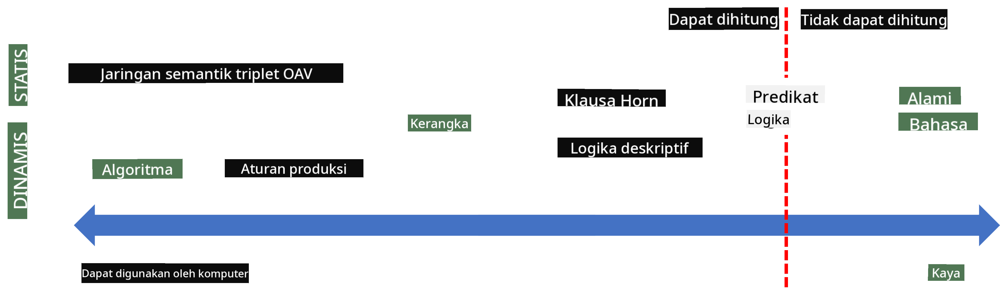

<!--
CO_OP_TRANSLATOR_METADATA:
{
  "original_hash": "98c5222ff9556b55223fed2337145e18",
  "translation_date": "2025-08-29T12:30:28+00:00",
  "source_file": "lessons/2-Symbolic/README.md",
  "language_code": "id"
}
-->
*Gambar [dari Wikipedia](https://commons.wikimedia.org/w/index.php?curid=37705247), Oleh Longlivetheux - Karya sendiri, CC BY-SA 4.0*

Dengan demikian, masalah **representasi pengetahuan** adalah menemukan cara yang efektif untuk merepresentasikan pengetahuan di dalam komputer dalam bentuk data, agar dapat digunakan secara otomatis. Hal ini dapat dilihat sebagai sebuah spektrum:



> Gambar oleh [Dmitry Soshnikov](http://soshnikov.com)

* Di sisi kiri, terdapat jenis representasi pengetahuan yang sangat sederhana yang dapat digunakan secara efektif oleh komputer. Yang paling sederhana adalah algoritmik, di mana pengetahuan direpresentasikan oleh program komputer. Namun, ini bukan cara terbaik untuk merepresentasikan pengetahuan, karena tidak fleksibel. Pengetahuan di dalam kepala kita sering kali tidak bersifat algoritmik.
* Di sisi kanan, terdapat representasi seperti teks alami. Ini adalah yang paling kuat, tetapi tidak dapat digunakan untuk penalaran otomatis.

> ✅ Pikirkan sejenak bagaimana Anda merepresentasikan pengetahuan di kepala Anda dan mengubahnya menjadi catatan. Apakah ada format tertentu yang bekerja dengan baik untuk membantu Anda mengingat?

## Mengklasifikasikan Representasi Pengetahuan Komputer

Kita dapat mengklasifikasikan berbagai metode representasi pengetahuan komputer ke dalam kategori berikut:

* **Representasi jaringan** didasarkan pada fakta bahwa kita memiliki jaringan konsep yang saling terkait di dalam kepala kita. Kita dapat mencoba mereproduksi jaringan yang sama sebagai grafik di dalam komputer - yang disebut **jaringan semantik**.

1. **Triplet Objek-Atribut-Nilai** atau **pasangan atribut-nilai**. Karena grafik dapat direpresentasikan di dalam komputer sebagai daftar node dan edge, kita dapat merepresentasikan jaringan semantik dengan daftar triplet, yang berisi objek, atribut, dan nilai. Sebagai contoh, kita membangun triplet berikut tentang bahasa pemrograman:

Objek | Atribut | Nilai
------|---------|------
Python | adalah | Bahasa-Tanpa-Tipe
Python | ditemukan-oleh | Guido van Rossum
Python | sintaks-blok | indentasi
Bahasa-Tanpa-Tipe | tidak memiliki | definisi tipe

> ✅ Pikirkan bagaimana triplet dapat digunakan untuk merepresentasikan jenis pengetahuan lainnya.

2. **Representasi hierarkis** menekankan fakta bahwa kita sering membuat hierarki objek di dalam kepala kita. Sebagai contoh, kita tahu bahwa kenari adalah burung, dan semua burung memiliki sayap. Kita juga memiliki gambaran tentang warna kenari biasanya, dan seberapa cepat mereka terbang.

   - **Representasi bingkai** didasarkan pada merepresentasikan setiap objek atau kelas objek sebagai **bingkai** yang berisi **slot**. Slot memiliki nilai default yang mungkin, batasan nilai, atau prosedur yang dapat dipanggil untuk mendapatkan nilai slot. Semua bingkai membentuk hierarki yang mirip dengan hierarki objek dalam bahasa pemrograman berorientasi objek.
   - **Skenario** adalah jenis bingkai khusus yang merepresentasikan situasi kompleks yang dapat berkembang seiring waktu.

**Python**

Slot | Nilai | Nilai Default | Interval |
-----|-------|---------------|----------|
Nama | Python | | |
Adalah | Bahasa-Tanpa-Tipe | | |
Penulisan Variabel | | CamelCase | |
Panjang Program | | | 5-5000 baris |
Sintaks Blok | Indentasi | | |

3. **Representasi prosedural** didasarkan pada merepresentasikan pengetahuan dengan daftar tindakan yang dapat dieksekusi ketika kondisi tertentu terjadi.
   - Aturan produksi adalah pernyataan if-then yang memungkinkan kita menarik kesimpulan. Sebagai contoh, seorang dokter dapat memiliki aturan yang mengatakan bahwa **JIKA** pasien memiliki demam tinggi **ATAU** tingkat protein C-reaktif yang tinggi dalam tes darah **MAKA** ia mengalami peradangan. Begitu kita menemukan salah satu kondisi, kita dapat membuat kesimpulan tentang peradangan, dan kemudian menggunakannya dalam penalaran lebih lanjut.
   - Algoritma dapat dianggap sebagai bentuk lain dari representasi prosedural, meskipun hampir tidak pernah digunakan secara langsung dalam sistem berbasis pengetahuan.

4. **Logika** awalnya diusulkan oleh Aristoteles sebagai cara untuk merepresentasikan pengetahuan universal manusia.
   - Logika Predikat sebagai teori matematika terlalu kaya untuk dapat dihitung, oleh karena itu beberapa subsetnya biasanya digunakan, seperti klausa Horn yang digunakan dalam Prolog.
   - Logika Deskriptif adalah keluarga sistem logika yang digunakan untuk merepresentasikan dan menalar tentang hierarki objek dalam representasi pengetahuan terdistribusi seperti *web semantik*.

## Sistem Pakar

Salah satu keberhasilan awal AI simbolik adalah **sistem pakar** - sistem komputer yang dirancang untuk bertindak sebagai pakar dalam domain masalah yang terbatas. Sistem ini didasarkan pada **basis pengetahuan** yang diekstraksi dari satu atau lebih pakar manusia, dan mereka memiliki **mesin inferensi** yang melakukan penalaran di atasnya.

 | 
---------------------------------------------|------------------------------------------------
Struktur sederhana sistem saraf manusia       | Arsitektur sistem berbasis pengetahuan

Sistem pakar dibangun seperti sistem penalaran manusia, yang mengandung **memori jangka pendek** dan **memori jangka panjang**. Demikian pula, dalam sistem berbasis pengetahuan kita membedakan komponen-komponen berikut:

* **Memori masalah**: berisi pengetahuan tentang masalah yang sedang diselesaikan, misalnya suhu atau tekanan darah pasien, apakah ia mengalami peradangan atau tidak, dll. Pengetahuan ini juga disebut **pengetahuan statis**, karena berisi snapshot dari apa yang kita ketahui saat ini tentang masalah - yang disebut *keadaan masalah*.
* **Basis pengetahuan**: merepresentasikan pengetahuan jangka panjang tentang domain masalah. Ini diekstraksi secara manual dari pakar manusia, dan tidak berubah dari satu konsultasi ke konsultasi lainnya. Karena memungkinkan kita untuk menavigasi dari satu keadaan masalah ke keadaan lainnya, ini juga disebut **pengetahuan dinamis**.
* **Mesin inferensi**: mengatur seluruh proses pencarian dalam ruang keadaan masalah, mengajukan pertanyaan kepada pengguna jika diperlukan. Mesin ini juga bertanggung jawab untuk menemukan aturan yang tepat untuk diterapkan pada setiap keadaan.

Sebagai contoh, mari kita pertimbangkan sistem pakar berikut untuk menentukan hewan berdasarkan karakteristik fisiknya:


> Gambar oleh [Dmitry Soshnikov](http://soshnikov.com)

Diagram ini disebut **pohon AND-OR**, dan ini adalah representasi grafis dari sekumpulan aturan produksi. Menggambar pohon berguna pada awal proses ekstraksi pengetahuan dari pakar. Untuk merepresentasikan pengetahuan di dalam komputer, lebih nyaman menggunakan aturan:

```
IF the animal eats meat
OR (animal has sharp teeth
    AND animal has claws
    AND animal has forward-looking eyes
) 
THEN the animal is a carnivore
```

Anda dapat melihat bahwa setiap kondisi di sisi kiri aturan dan tindakan pada dasarnya adalah triplet objek-atribut-nilai (OAV). **Memori kerja** berisi sekumpulan triplet OAV yang sesuai dengan masalah yang sedang diselesaikan. **Mesin aturan** mencari aturan yang kondisinya terpenuhi dan menerapkannya, menambahkan triplet lain ke memori kerja.

> ✅ Buat pohon AND-OR Anda sendiri tentang topik yang Anda sukai!

### Inferensi Maju vs. Inferensi Mundur

Proses yang dijelaskan di atas disebut **inferensi maju**. Proses ini dimulai dengan beberapa data awal tentang masalah yang tersedia di memori kerja, dan kemudian menjalankan loop penalaran berikut:

1. Jika atribut target ada di memori kerja - berhenti dan berikan hasil
2. Cari semua aturan yang kondisinya saat ini terpenuhi - dapatkan **set konflik** aturan.
3. Lakukan **resolusi konflik** - pilih satu aturan yang akan dieksekusi pada langkah ini. Ada berbagai strategi resolusi konflik:
   - Pilih aturan pertama yang berlaku dalam basis pengetahuan
   - Pilih aturan secara acak
   - Pilih aturan yang *lebih spesifik*, yaitu yang memenuhi sebagian besar kondisi di sisi kiri ("left-hand-side" atau LHS)
4. Terapkan aturan yang dipilih dan masukkan potongan pengetahuan baru ke dalam keadaan masalah
5. Ulangi dari langkah 1.

Namun, dalam beberapa kasus kita mungkin ingin memulai dengan pengetahuan kosong tentang masalah, dan mengajukan pertanyaan yang akan membantu kita mencapai kesimpulan. Sebagai contoh, saat melakukan diagnosis medis, kita biasanya tidak melakukan semua analisis medis sebelumnya sebelum mulai mendiagnosis pasien. Sebaliknya, kita ingin melakukan analisis ketika keputusan perlu dibuat.

Proses ini dapat dimodelkan menggunakan **inferensi mundur**. Proses ini didorong oleh **tujuan** - nilai atribut yang ingin kita temukan:

1. Pilih semua aturan yang dapat memberikan nilai tujuan (yaitu dengan tujuan di sisi kanan ("right-hand-side" atau RHS)) - set konflik
1. Jika tidak ada aturan untuk atribut ini, atau ada aturan yang mengatakan bahwa kita harus menanyakan nilainya kepada pengguna - tanyakan, jika tidak:
1. Gunakan strategi resolusi konflik untuk memilih satu aturan yang akan kita gunakan sebagai *hipotesis* - kita akan mencoba membuktikannya
1. Ulangi proses ini secara rekursif untuk semua atribut di LHS aturan, mencoba membuktikan mereka sebagai tujuan
1. Jika pada titik mana pun proses gagal - gunakan aturan lain pada langkah 3.

> ✅ Dalam situasi apa inferensi maju lebih tepat? Bagaimana dengan inferensi mundur?

### Mengimplementasikan Sistem Pakar

Sistem pakar dapat diimplementasikan menggunakan berbagai alat:

* Memprogramnya langsung dalam beberapa bahasa pemrograman tingkat tinggi. Ini bukan ide terbaik, karena keuntungan utama dari sistem berbasis pengetahuan adalah bahwa pengetahuan dipisahkan dari inferensi, dan seorang pakar domain masalah seharusnya dapat menulis aturan tanpa memahami detail proses inferensi.
* Menggunakan **kerangka sistem pakar**, yaitu sistem yang dirancang khusus untuk diisi dengan pengetahuan menggunakan beberapa bahasa representasi pengetahuan.

## ✍️ Latihan: Inferensi Hewan

Lihat [Animals.ipynb](https://github.com/microsoft/AI-For-Beginners/blob/main/lessons/2-Symbolic/Animals.ipynb) untuk contoh implementasi sistem pakar inferensi maju dan mundur.
> **Catatan**: Contoh ini cukup sederhana, dan hanya memberikan gambaran tentang bagaimana sistem pakar terlihat. Setelah Anda mulai membuat sistem seperti ini, Anda hanya akan melihat beberapa perilaku *cerdas* darinya setelah mencapai jumlah aturan tertentu, sekitar 200+. Pada titik tertentu, aturan menjadi terlalu kompleks untuk diingat semuanya, dan pada saat ini Anda mungkin mulai bertanya-tanya mengapa sistem membuat keputusan tertentu. Namun, karakteristik penting dari sistem berbasis pengetahuan adalah bahwa Anda selalu dapat *menjelaskan* secara tepat bagaimana setiap keputusan dibuat.
## Ontologi dan Web Semantik

Pada akhir abad ke-20, ada inisiatif untuk menggunakan representasi pengetahuan guna memberi anotasi pada sumber daya Internet, sehingga memungkinkan untuk menemukan sumber daya yang sesuai dengan kueri yang sangat spesifik. Inisiatif ini disebut **Web Semantik**, dan bergantung pada beberapa konsep:

- Representasi pengetahuan khusus yang berbasis pada **[description logics](https://en.wikipedia.org/wiki/Description_logic)** (DL). Ini mirip dengan representasi pengetahuan berbasis kerangka, karena membangun hierarki objek dengan properti, tetapi memiliki semantik logis formal dan inferensi. Ada seluruh keluarga DL yang menyeimbangkan antara daya ekspresif dan kompleksitas algoritmik inferensi.
- Representasi pengetahuan terdistribusi, di mana semua konsep diwakili oleh pengidentifikasi URI global, memungkinkan pembuatan hierarki pengetahuan yang mencakup internet.
- Keluarga bahasa berbasis XML untuk deskripsi pengetahuan: RDF (Resource Description Framework), RDFS (RDF Schema), OWL (Ontology Web Language).

Konsep inti dalam Web Semantik adalah konsep **Ontologi**. Ini merujuk pada spesifikasi eksplisit dari domain masalah menggunakan representasi pengetahuan formal. Ontologi paling sederhana bisa berupa hierarki objek dalam domain masalah, tetapi ontologi yang lebih kompleks akan mencakup aturan yang dapat digunakan untuk inferensi.

Dalam web semantik, semua representasi didasarkan pada triplet. Setiap objek dan setiap relasi diidentifikasi secara unik oleh URI. Sebagai contoh, jika kita ingin menyatakan fakta bahwa Kurikulum AI ini dikembangkan oleh Dmitry Soshnikov pada 1 Januari 2022 - berikut adalah triplet yang dapat kita gunakan:


```
http://github.com/microsoft/ai-for-beginners http://www.example.com/terms/creation-date “Jan 13, 2007”
http://github.com/microsoft/ai-for-beginners http://purl.org/dc/elements/1.1/creator http://soshnikov.com
```

> ✅ Di sini `http://www.example.com/terms/creation-date` dan `http://purl.org/dc/elements/1.1/creator` adalah beberapa URI yang dikenal luas dan diterima secara universal untuk mengekspresikan konsep *pencipta* dan *tanggal pembuatan*.

Dalam kasus yang lebih kompleks, jika kita ingin mendefinisikan daftar pencipta, kita dapat menggunakan beberapa struktur data yang didefinisikan dalam RDF.


> Diagram di atas oleh [Dmitry Soshnikov](http://soshnikov.com)

Kemajuan dalam membangun Web Semantik agak terhambat oleh keberhasilan mesin pencari dan teknik pemrosesan bahasa alami, yang memungkinkan ekstraksi data terstruktur dari teks. Namun, di beberapa bidang masih ada upaya signifikan untuk mempertahankan ontologi dan basis pengetahuan. Beberapa proyek yang patut diperhatikan:

* [WikiData](https://wikidata.org/) adalah kumpulan basis pengetahuan yang dapat dibaca mesin yang terkait dengan Wikipedia. Sebagian besar data ditambang dari *InfoBox* Wikipedia, yaitu potongan konten terstruktur di dalam halaman Wikipedia. Anda dapat [melakukan kueri](https://query.wikidata.org/) pada WikiData menggunakan SPARQL, bahasa kueri khusus untuk Web Semantik. Berikut adalah contoh kueri yang menampilkan warna mata paling populer di antara manusia:

```sparql
#defaultView:BubbleChart
SELECT ?eyeColorLabel (COUNT(?human) AS ?count)
WHERE
{
  ?human wdt:P31 wd:Q5.       # human instance-of homo sapiens
  ?human wdt:P1340 ?eyeColor. # human eye-color ?eyeColor
  SERVICE wikibase:label { bd:serviceParam wikibase:language "en". }
}
GROUP BY ?eyeColorLabel
```

* [DBpedia](https://www.dbpedia.org/) adalah upaya lain yang mirip dengan WikiData.

> ✅ Jika Anda ingin bereksperimen dengan membangun ontologi Anda sendiri, atau membuka ontologi yang sudah ada, ada editor ontologi visual yang hebat bernama [Protégé](https://protege.stanford.edu/). Unduh, atau gunakan secara daring.


*Editor Web Protégé terbuka dengan ontologi Keluarga Romanov. Tangkapan layar oleh Dmitry Soshnikov*

## ✍️ Latihan: Ontologi Keluarga

Lihat [FamilyOntology.ipynb](https://github.com/Ezana135/AI-For-Beginners/blob/main/lessons/2-Symbolic/FamilyOntology.ipynb) untuk contoh penggunaan teknik Web Semantik untuk menalar hubungan keluarga. Kita akan mengambil pohon keluarga yang direpresentasikan dalam format GEDCOM umum dan ontologi hubungan keluarga, lalu membangun grafik dari semua hubungan keluarga untuk kumpulan individu tertentu.

## Microsoft Concept Graph

Dalam banyak kasus, ontologi dibuat dengan hati-hati secara manual. Namun, juga memungkinkan untuk **menambang** ontologi dari data tidak terstruktur, misalnya dari teks bahasa alami.

Salah satu upaya tersebut dilakukan oleh Microsoft Research, yang menghasilkan [Microsoft Concept Graph](https://blogs.microsoft.com/ai/microsoft-researchers-release-graph-that-helps-machines-conceptualize/?WT.mc_id=academic-77998-cacaste).

Ini adalah kumpulan besar entitas yang dikelompokkan bersama menggunakan hubungan pewarisan `is-a`. Ini memungkinkan menjawab pertanyaan seperti "Apa itu Microsoft?" - jawabannya bisa berupa "sebuah perusahaan dengan probabilitas 0,87, dan sebuah merek dengan probabilitas 0,75".

Grafik ini tersedia baik sebagai REST API, atau sebagai file teks besar yang dapat diunduh yang mencantumkan semua pasangan entitas.

## ✍️ Latihan: Grafik Konsep

Coba notebook [MSConceptGraph.ipynb](https://github.com/microsoft/AI-For-Beginners/blob/main/lessons/2-Symbolic/MSConceptGraph.ipynb) untuk melihat bagaimana kita dapat menggunakan Microsoft Concept Graph untuk mengelompokkan artikel berita ke dalam beberapa kategori.

## Kesimpulan

Saat ini, AI sering dianggap sebagai sinonim untuk *Machine Learning* atau *Neural Networks*. Namun, manusia juga menunjukkan penalaran eksplisit, yang saat ini belum dapat ditangani oleh jaringan saraf. Dalam proyek dunia nyata, penalaran eksplisit masih digunakan untuk melakukan tugas-tugas yang memerlukan penjelasan, atau kemampuan untuk mengubah perilaku sistem dengan cara yang terkontrol.

## 🚀 Tantangan

Dalam notebook Ontologi Keluarga yang terkait dengan pelajaran ini, ada kesempatan untuk bereksperimen dengan hubungan keluarga lainnya. Cobalah untuk menemukan koneksi baru antara orang-orang dalam pohon keluarga.

## [Kuis setelah kuliah](https://red-field-0a6ddfd03.1.azurestaticapps.net/quiz/202)

## Tinjauan & Studi Mandiri

Lakukan penelitian di internet untuk menemukan area di mana manusia telah mencoba mengukur dan mengkodekan pengetahuan. Lihatlah Taksonomi Bloom, dan telusuri kembali sejarah untuk mempelajari bagaimana manusia mencoba memahami dunia mereka. Jelajahi karya Linnaeus dalam menciptakan taksonomi organisme, dan amati cara Dmitri Mendeleev menciptakan cara untuk mendeskripsikan dan mengelompokkan elemen kimia. Contoh menarik apa lagi yang dapat Anda temukan?

**Tugas**: [Bangun sebuah Ontologi](assignment.md)

---

**Penafian**:  
Dokumen ini telah diterjemahkan menggunakan layanan penerjemahan AI [Co-op Translator](https://github.com/Azure/co-op-translator). Meskipun kami berusaha untuk memberikan hasil yang akurat, harap diingat bahwa terjemahan otomatis mungkin mengandung kesalahan atau ketidakakuratan. Dokumen asli dalam bahasa aslinya harus dianggap sebagai sumber yang otoritatif. Untuk informasi yang bersifat kritis, disarankan menggunakan jasa penerjemahan profesional oleh manusia. Kami tidak bertanggung jawab atas kesalahpahaman atau penafsiran yang keliru yang timbul dari penggunaan terjemahan ini.