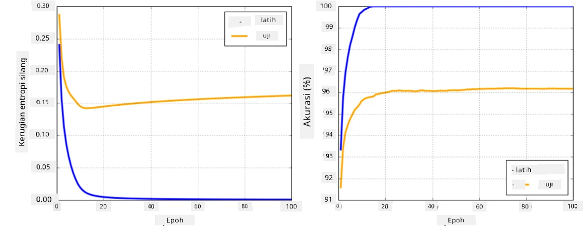

# Kerangka Jaringan Neural

Seperti yang telah kita pelajari sebelumnya, untuk dapat melatih jaringan neural secara efisien, kita perlu melakukan dua hal:

* Mengoperasikan tensor, misalnya untuk mengalikan, menambahkan, dan menghitung beberapa fungsi seperti sigmoid atau softmax
* Menghitung gradien dari semua ekspresi, untuk melakukan optimasi dengan metode penurunan gradien

## [Kuis sebelum pelajaran](https://ff-quizzes.netlify.app/en/ai/quiz/9)

Meskipun pustaka `numpy` dapat melakukan bagian pertama, kita memerlukan mekanisme untuk menghitung gradien. Dalam [kerangka kerja kita](../04-OwnFramework/OwnFramework.ipynb) yang telah kita kembangkan di bagian sebelumnya, kita harus secara manual memprogram semua fungsi turunan di dalam metode `backward`, yang melakukan backpropagation. Idealnya, sebuah kerangka kerja harus memberikan kita kemampuan untuk menghitung gradien dari *setiap ekspresi* yang dapat kita definisikan.

Hal penting lainnya adalah kemampuan untuk melakukan komputasi di GPU, atau unit komputasi khusus lainnya, seperti [TPU](https://en.wikipedia.org/wiki/Tensor_Processing_Unit). Pelatihan jaringan neural yang mendalam membutuhkan *banyak* komputasi, dan kemampuan untuk melakukan paralelisasi komputasi tersebut di GPU sangatlah penting.

> ✅ Istilah 'paralelisasi' berarti mendistribusikan komputasi ke beberapa perangkat.

Saat ini, dua kerangka kerja neural yang paling populer adalah: [TensorFlow](http://TensorFlow.org) dan [PyTorch](https://pytorch.org/). Keduanya menyediakan API tingkat rendah untuk mengoperasikan tensor baik di CPU maupun GPU. Di atas API tingkat rendah, terdapat juga API tingkat tinggi, yang disebut [Keras](https://keras.io/) dan [PyTorch Lightning](https://pytorchlightning.ai/) masing-masing.

API Tingkat Rendah | [TensorFlow](http://TensorFlow.org) | [PyTorch](https://pytorch.org/)
--------------------|-------------------------------------|--------------------------------
API Tingkat Tinggi  | [Keras](https://keras.io/)         | [PyTorch Lightning](https://pytorchlightning.ai/)

**API tingkat rendah** dalam kedua kerangka kerja memungkinkan Anda untuk membangun **grafik komputasi**. Grafik ini mendefinisikan cara menghitung output (biasanya fungsi loss) dengan parameter input yang diberikan, dan dapat didorong untuk komputasi di GPU, jika tersedia. Terdapat fungsi untuk membedakan grafik komputasi ini dan menghitung gradien, yang kemudian dapat digunakan untuk mengoptimalkan parameter model.

**API tingkat tinggi** menganggap jaringan neural sebagai **urutan lapisan**, dan membuat konstruksi sebagian besar jaringan neural menjadi lebih mudah. Melatih model biasanya membutuhkan persiapan data dan kemudian memanggil fungsi `fit` untuk menyelesaikan pekerjaan.

API tingkat tinggi memungkinkan Anda untuk membangun jaringan neural khas dengan sangat cepat tanpa harus khawatir tentang banyak detail. Di sisi lain, API tingkat rendah menawarkan kontrol yang jauh lebih besar atas proses pelatihan, sehingga sering digunakan dalam penelitian, terutama ketika Anda bekerja dengan arsitektur jaringan neural yang baru.

Penting juga untuk memahami bahwa Anda dapat menggunakan kedua API secara bersamaan, misalnya Anda dapat mengembangkan arsitektur lapisan jaringan Anda sendiri menggunakan API tingkat rendah, dan kemudian menggunakannya di dalam jaringan yang lebih besar yang dibangun dan dilatih dengan API tingkat tinggi. Atau Anda dapat mendefinisikan jaringan menggunakan API tingkat tinggi sebagai urutan lapisan, dan kemudian menggunakan loop pelatihan tingkat rendah Anda sendiri untuk melakukan optimasi. Kedua API menggunakan konsep dasar yang sama, dan dirancang untuk bekerja dengan baik bersama-sama.

## Pembelajaran

Dalam kursus ini, kami menawarkan sebagian besar konten baik untuk PyTorch maupun TensorFlow. Anda dapat memilih kerangka kerja yang Anda sukai dan hanya mempelajari notebook yang sesuai. Jika Anda tidak yakin kerangka kerja mana yang harus dipilih, bacalah beberapa diskusi di internet mengenai **PyTorch vs. TensorFlow**. Anda juga dapat melihat kedua kerangka kerja untuk mendapatkan pemahaman yang lebih baik.

Di mana memungkinkan, kami akan menggunakan API tingkat tinggi untuk kesederhanaan. Namun, kami percaya bahwa penting untuk memahami cara kerja jaringan neural dari dasar, sehingga pada awalnya kami mulai bekerja dengan API tingkat rendah dan tensor. Namun, jika Anda ingin segera memulai dan tidak ingin menghabiskan banyak waktu mempelajari detail ini, Anda dapat melewati bagian tersebut dan langsung ke notebook API tingkat tinggi.

## ✍️ Latihan: Kerangka Kerja

Lanjutkan pembelajaran Anda di notebook berikut:

API Tingkat Rendah | [Notebook TensorFlow+Keras](IntroKerasTF.ipynb) | [PyTorch](IntroPyTorch.ipynb)
--------------------|-------------------------------------|--------------------------------
API Tingkat Tinggi  | [Keras](IntroKeras.ipynb)         | *PyTorch Lightning*

Setelah menguasai kerangka kerja, mari kita ulas kembali konsep overfitting.

# Overfitting

Overfitting adalah konsep yang sangat penting dalam pembelajaran mesin, dan sangat penting untuk memahaminya dengan benar!

Pertimbangkan masalah berikut dalam mendekati 5 titik (diwakili oleh `x` pada grafik di bawah):

 | 
-------------------------|--------------------------
**Model linear, 2 parameter** | **Model non-linear, 7 parameter**
Error pelatihan = 5.3 | Error pelatihan = 0
Error validasi = 5.1 | Error validasi = 20

* Di sebelah kiri, kita melihat pendekatan garis lurus yang baik. Karena jumlah parameter memadai, model memahami pola distribusi titik dengan benar.
* Di sebelah kanan, model terlalu kuat. Karena kita hanya memiliki 5 titik dan model memiliki 7 parameter, model dapat menyesuaikan sedemikian rupa sehingga melewati semua titik, membuat error pelatihan menjadi 0. Namun, ini mencegah model memahami pola yang benar di balik data, sehingga error validasi sangat tinggi.

Sangat penting untuk menemukan keseimbangan yang tepat antara kompleksitas model (jumlah parameter) dan jumlah sampel pelatihan.

## Mengapa overfitting terjadi

  * Data pelatihan tidak cukup
  * Model terlalu kuat
  * Terlalu banyak noise dalam data input

## Cara mendeteksi overfitting

Seperti yang dapat Anda lihat dari grafik di atas, overfitting dapat dideteksi dengan error pelatihan yang sangat rendah, dan error validasi yang tinggi. Biasanya selama pelatihan kita akan melihat error pelatihan dan validasi mulai menurun, dan kemudian pada suatu titik error validasi mungkin berhenti menurun dan mulai meningkat. Ini akan menjadi tanda overfitting, dan indikator bahwa kita mungkin harus menghentikan pelatihan pada titik ini (atau setidaknya membuat snapshot model).

## Cara mencegah overfitting

Jika Anda melihat bahwa overfitting terjadi, Anda dapat melakukan salah satu dari hal berikut:

 * Menambah jumlah data pelatihan
 * Mengurangi kompleksitas model
 * Menggunakan beberapa [teknik regularisasi](../../4-ComputerVision/08-TransferLearning/TrainingTricks.md), seperti [Dropout](../../4-ComputerVision/08-TransferLearning/TrainingTricks.md#Dropout), yang akan kita bahas nanti.

## Overfitting dan Bias-Variance Tradeoff

Overfitting sebenarnya adalah kasus dari masalah yang lebih umum dalam statistik yang disebut [Bias-Variance Tradeoff](https://en.wikipedia.org/wiki/Bias%E2%80%93variance_tradeoff). Jika kita mempertimbangkan sumber error yang mungkin dalam model kita, kita dapat melihat dua jenis error:

* **Error bias** disebabkan oleh algoritma kita yang tidak mampu menangkap hubungan antara data pelatihan dengan benar. Ini dapat terjadi karena model kita tidak cukup kuat (**underfitting**).
* **Error varians**, yang disebabkan oleh model yang mendekati noise dalam data input daripada hubungan yang bermakna (**overfitting**).

Selama pelatihan, error bias menurun (karena model kita belajar untuk mendekati data), dan error varians meningkat. Penting untuk menghentikan pelatihan - baik secara manual (ketika kita mendeteksi overfitting) atau secara otomatis (dengan memperkenalkan regularisasi) - untuk mencegah overfitting.

## Kesimpulan

Dalam pelajaran ini, Anda telah mempelajari perbedaan antara berbagai API untuk dua kerangka kerja AI yang paling populer, TensorFlow dan PyTorch. Selain itu, Anda telah mempelajari topik yang sangat penting, yaitu overfitting.

## 🚀 Tantangan

Di notebook yang menyertai, Anda akan menemukan 'tugas' di bagian bawah; kerjakan notebook tersebut dan selesaikan tugasnya.

## [Kuis setelah pelajaran](https://ff-quizzes.netlify.app/en/ai/quiz/10)

## Tinjauan & Studi Mandiri

Lakukan penelitian tentang topik berikut:

- TensorFlow
- PyTorch
- Overfitting

Tanyakan pada diri Anda pertanyaan berikut:

- Apa perbedaan antara TensorFlow dan PyTorch?
- Apa perbedaan antara overfitting dan underfitting?

## [Tugas](lab/README.md)

Dalam lab ini, Anda diminta untuk menyelesaikan dua masalah klasifikasi menggunakan jaringan fully-connected berlapis tunggal dan multi-lapis menggunakan PyTorch atau TensorFlow.

* [Instruksi](lab/README.md)
* [Notebook](lab/LabFrameworks.ipynb)

---

