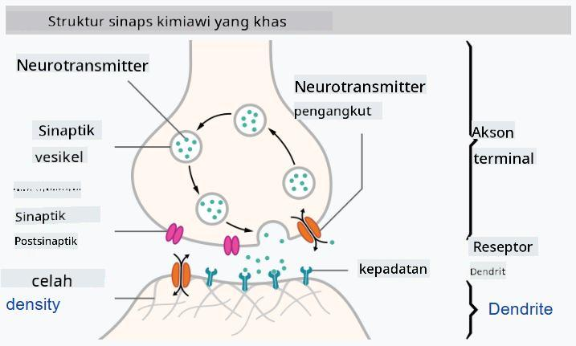

<!--
CO_OP_TRANSLATOR_METADATA:
{
  "original_hash": "f862a99d88088163df12270e2f2ad6c3",
  "translation_date": "2025-10-03T12:51:08+00:00",
  "source_file": "lessons/3-NeuralNetworks/README.md",
  "language_code": "id"
}
-->
# Pengantar Jaringan Neural

Seperti yang telah kita bahas dalam pengantar, salah satu cara untuk mencapai kecerdasan adalah dengan melatih **model komputer** atau **otak buatan**. Sejak pertengahan abad ke-20, para peneliti mencoba berbagai model matematika, hingga beberapa tahun terakhir arah ini terbukti sangat berhasil. Model matematika otak ini disebut **jaringan neural**.

> Kadang-kadang jaringan neural disebut *Artificial Neural Networks* atau ANNs, untuk menunjukkan bahwa kita sedang berbicara tentang model, bukan jaringan neuron yang sebenarnya.

## Pembelajaran Mesin

Jaringan Neural adalah bagian dari disiplin yang lebih besar yang disebut **Pembelajaran Mesin** (Machine Learning), yang bertujuan menggunakan data untuk melatih model komputer agar dapat menyelesaikan masalah. Pembelajaran Mesin merupakan bagian besar dari Kecerdasan Buatan, namun, kita tidak akan membahas Pembelajaran Mesin klasik dalam kurikulum ini.

> Kunjungi kurikulum terpisah kami **[Machine Learning for Beginners](http://github.com/microsoft/ml-for-beginners)** untuk mempelajari lebih lanjut tentang Pembelajaran Mesin klasik.

Dalam Pembelajaran Mesin, kita mengasumsikan bahwa kita memiliki beberapa dataset contoh **X**, dan nilai output yang sesuai **Y**. Contoh sering kali berupa vektor N-dimensi yang terdiri dari **fitur**, dan output disebut **label**.

Kita akan mempertimbangkan dua masalah pembelajaran mesin yang paling umum:

* **Klasifikasi**, di mana kita perlu mengklasifikasikan objek input ke dalam dua atau lebih kelas.
* **Regresi**, di mana kita perlu memprediksi angka numerik untuk setiap sampel input.

> Saat merepresentasikan input dan output sebagai tensor, dataset input adalah matriks berukuran M&times;N, di mana M adalah jumlah sampel dan N adalah jumlah fitur. Label output Y adalah vektor berukuran M.

Dalam kurikulum ini, kita hanya akan fokus pada model jaringan neural.

## Model Neuron

Dari biologi, kita tahu bahwa otak kita terdiri dari sel-sel neural (neuron), masing-masing memiliki beberapa "input" (dendrit) dan satu "output" (akson). Baik dendrit maupun akson dapat menghantarkan sinyal listrik, dan koneksi di antara mereka — yang dikenal sebagai sinaps — dapat menunjukkan tingkat konduktivitas yang bervariasi, yang diatur oleh neurotransmiter.

 | 
----|----
Neuron Asli *([Gambar](https://en.wikipedia.org/wiki/Synapse#/media/File:SynapseSchematic_lines.svg) dari Wikipedia)* | Neuron Buatan *(Gambar oleh Penulis)*

Dengan demikian, model matematika paling sederhana dari neuron memiliki beberapa input X1, ..., XN dan satu output Y, serta serangkaian bobot W1, ..., WN. Output dihitung sebagai:

di mana f adalah beberapa **fungsi aktivasi** non-linear.

> Model awal neuron dijelaskan dalam makalah klasik [A logical calculus of the ideas immanent in nervous activity](https://www.cs.cmu.edu/~./epxing/Class/10715/reading/McCulloch.and.Pitts.pdf) oleh Warren McCullock dan Walter Pitts pada tahun 1943. Donald Hebb dalam bukunya "[The Organization of Behavior: A Neuropsychological Theory](https://books.google.com/books?id=VNetYrB8EBoC)" mengusulkan cara jaringan tersebut dapat dilatih.

## Dalam Bagian Ini

Dalam bagian ini kita akan mempelajari tentang:
* [Perceptron](03-Perceptron/README.md), salah satu model jaringan neural paling awal untuk klasifikasi dua kelas
* [Jaringan berlapis-lapis](04-OwnFramework/README.md) dengan notebook pendamping [cara membangun kerangka kerja kita sendiri](04-OwnFramework/OwnFramework.ipynb)
* [Kerangka Kerja Jaringan Neural](05-Frameworks/README.md), dengan notebook berikut: [PyTorch](05-Frameworks/IntroPyTorch.ipynb) dan [Keras/Tensorflow](05-Frameworks/IntroKerasTF.ipynb)
* [Overfitting](../../../../lessons/3-NeuralNetworks/05-Frameworks)

---

**Penafian**:  
Dokumen ini telah diterjemahkan menggunakan layanan penerjemahan AI [Co-op Translator](https://github.com/Azure/co-op-translator). Meskipun kami berusaha untuk memberikan hasil yang akurat, harap diketahui bahwa terjemahan otomatis mungkin mengandung kesalahan atau ketidakakuratan. Dokumen asli dalam bahasa aslinya harus dianggap sebagai sumber yang otoritatif. Untuk informasi yang bersifat kritis, disarankan menggunakan jasa penerjemahan manusia profesional. Kami tidak bertanggung jawab atas kesalahpahaman atau interpretasi yang keliru yang timbul dari penggunaan terjemahan ini.