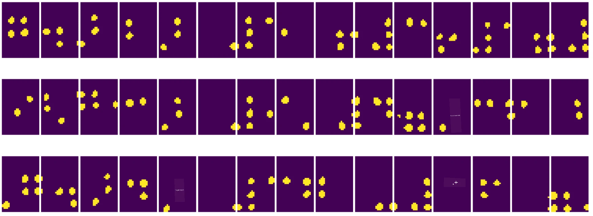
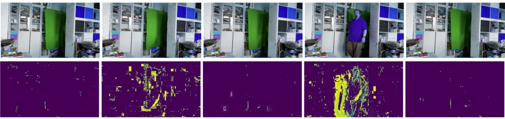

# Pengantar Computer Vision

[Computer Vision](https://wikipedia.org/wiki/Computer_vision) adalah disiplin ilmu yang bertujuan untuk memungkinkan komputer memahami gambar digital pada tingkat tinggi. Definisi ini cukup luas, karena *pemahaman* dapat berarti banyak hal, termasuk menemukan objek dalam gambar (**deteksi objek**), memahami apa yang sedang terjadi (**deteksi peristiwa**), mendeskripsikan gambar dalam teks, atau merekonstruksi sebuah adegan dalam 3D. Ada juga tugas-tugas khusus terkait gambar manusia: estimasi usia dan emosi, deteksi dan identifikasi wajah, serta estimasi pose 3D, untuk menyebut beberapa contoh.

## [Kuis Pra-Pelajaran](https://ff-quizzes.netlify.app/en/ai/quiz/11)

Salah satu tugas paling sederhana dalam computer vision adalah **klasifikasi gambar**.

Computer vision sering dianggap sebagai cabang dari AI. Saat ini, sebagian besar tugas computer vision diselesaikan menggunakan jaringan saraf. Kita akan mempelajari lebih lanjut tentang jenis jaringan saraf khusus yang digunakan untuk computer vision, [convolutional neural networks](../07-ConvNets/README.md), sepanjang bagian ini.

Namun, sebelum Anda memberikan gambar ke jaringan saraf, dalam banyak kasus masuk akal untuk menggunakan beberapa teknik algoritmik untuk meningkatkan kualitas gambar.

Ada beberapa pustaka Python yang tersedia untuk pemrosesan gambar:

* **[imageio](https://imageio.readthedocs.io/en/stable/)** dapat digunakan untuk membaca/menulis berbagai format gambar. Pustaka ini juga mendukung ffmpeg, alat yang berguna untuk mengonversi frame video menjadi gambar.
* **[Pillow](https://pillow.readthedocs.io/en/stable/index.html)** (juga dikenal sebagai PIL) lebih kuat, dan juga mendukung beberapa manipulasi gambar seperti morphing, penyesuaian palet, dan lainnya.
* **[OpenCV](https://opencv.org/)** adalah pustaka pemrosesan gambar yang kuat yang ditulis dalam C++, yang telah menjadi standar *de facto* untuk pemrosesan gambar. Pustaka ini memiliki antarmuka Python yang nyaman.
* **[dlib](http://dlib.net/)** adalah pustaka C++ yang mengimplementasikan banyak algoritma pembelajaran mesin, termasuk beberapa algoritma Computer Vision. Pustaka ini juga memiliki antarmuka Python, dan dapat digunakan untuk tugas-tugas menantang seperti deteksi wajah dan landmark wajah.

## OpenCV

[OpenCV](https://opencv.org/) dianggap sebagai standar *de facto* untuk pemrosesan gambar. Pustaka ini berisi banyak algoritma berguna yang diimplementasikan dalam C++. Anda juga dapat memanggil OpenCV dari Python.

Tempat yang baik untuk mempelajari OpenCV adalah [kursus Learn OpenCV](https://learnopencv.com/getting-started-with-opencv/). Dalam kurikulum ini, tujuan kita bukan untuk mempelajari OpenCV, tetapi untuk menunjukkan beberapa contoh kapan pustaka ini dapat digunakan, dan bagaimana cara menggunakannya.

### Memuat Gambar

Gambar dalam Python dapat dengan mudah direpresentasikan oleh array NumPy. Sebagai contoh, gambar grayscale dengan ukuran 320x200 piksel akan disimpan dalam array 200x320, dan gambar berwarna dengan dimensi yang sama akan memiliki bentuk 200x320x3 (untuk 3 saluran warna). Untuk memuat gambar, Anda dapat menggunakan kode berikut:

```python
import cv2
import matplotlib.pyplot as plt

im = cv2.imread('image.jpeg')
plt.imshow(im)
```

Secara tradisional, OpenCV menggunakan pengkodean BGR (Blue-Green-Red) untuk gambar berwarna, sementara alat Python lainnya menggunakan pengkodean RGB (Red-Green-Blue) yang lebih umum. Agar gambar terlihat benar, Anda perlu mengonversinya ke ruang warna RGB, baik dengan menukar dimensi dalam array NumPy, atau dengan memanggil fungsi OpenCV:

```python
im = cv2.cvtColor(im,cv2.COLOR_BGR2RGB)
```

Fungsi `cvtColor` yang sama juga dapat digunakan untuk melakukan transformasi ruang warna lainnya seperti mengonversi gambar ke grayscale atau ke ruang warna HSV (Hue-Saturation-Value).

Anda juga dapat menggunakan OpenCV untuk memuat video frame-by-frame - contohnya diberikan dalam latihan [OpenCV Notebook](OpenCV.ipynb).

### Pemrosesan Gambar

Sebelum memberikan gambar ke jaringan saraf, Anda mungkin ingin menerapkan beberapa langkah pra-pemrosesan. OpenCV dapat melakukan banyak hal, termasuk:

* **Mengubah ukuran** gambar menggunakan `im = cv2.resize(im, (320,200),interpolation=cv2.INTER_LANCZOS)`
* **Memburamkan** gambar menggunakan `im = cv2.medianBlur(im,3)` atau `im = cv2.GaussianBlur(im, (3,3), 0)`
* Mengubah **kecerahan dan kontras** gambar dapat dilakukan dengan manipulasi array NumPy, seperti dijelaskan [dalam catatan Stackoverflow ini](https://stackoverflow.com/questions/39308030/how-do-i-increase-the-contrast-of-an-image-in-python-opencv).
* Menggunakan [thresholding](https://docs.opencv.org/4.x/d7/d4d/tutorial_py_thresholding.html) dengan memanggil fungsi `cv2.threshold`/`cv2.adaptiveThreshold`, yang sering lebih disukai daripada menyesuaikan kecerahan atau kontras.
* Menerapkan berbagai [transformasi](https://docs.opencv.org/4.5.5/da/d6e/tutorial_py_geometric_transformations.html) pada gambar:
    - **[Transformasi Afine](https://docs.opencv.org/4.5.5/d4/d61/tutorial_warp_affine.html)** berguna jika Anda perlu menggabungkan rotasi, perubahan ukuran, dan kemiringan pada gambar dan Anda mengetahui lokasi sumber dan tujuan dari tiga titik dalam gambar. Transformasi afine menjaga garis paralel tetap paralel.
    - **[Transformasi Perspektif](https://medium.com/analytics-vidhya/opencv-perspective-transformation-9edffefb2143)** berguna ketika Anda mengetahui posisi sumber dan tujuan dari 4 titik dalam gambar. Misalnya, jika Anda mengambil gambar dokumen persegi panjang melalui kamera smartphone dari sudut tertentu, dan Anda ingin membuat gambar persegi panjang dari dokumen itu sendiri.
* Memahami pergerakan dalam gambar menggunakan **[optical flow](https://docs.opencv.org/4.5.5/d4/dee/tutorial_optical_flow.html)**.

## Contoh Penggunaan Computer Vision

Dalam [OpenCV Notebook](OpenCV.ipynb), kami memberikan beberapa contoh kapan computer vision dapat digunakan untuk melakukan tugas tertentu:

* **Pra-pemrosesan foto buku Braille**. Kami fokus pada bagaimana kami dapat menggunakan thresholding, deteksi fitur, transformasi perspektif, dan manipulasi NumPy untuk memisahkan simbol Braille individu untuk klasifikasi lebih lanjut oleh jaringan saraf.

 |  | 
----|-----|-----

> Gambar dari [OpenCV.ipynb](OpenCV.ipynb)

* **Mendeteksi gerakan dalam video menggunakan perbedaan frame**. Jika kamera tetap, maka frame dari umpan kamera seharusnya cukup mirip satu sama lain. Karena frame direpresentasikan sebagai array, hanya dengan mengurangi array untuk dua frame berturut-turut kita akan mendapatkan perbedaan piksel, yang seharusnya rendah untuk frame statis, dan menjadi lebih tinggi ketika ada gerakan yang signifikan dalam gambar.



> Gambar dari [OpenCV.ipynb](OpenCV.ipynb)

* **Mendeteksi gerakan menggunakan Optical Flow**. [Optical flow](https://docs.opencv.org/3.4/d4/dee/tutorial_optical_flow.html) memungkinkan kita memahami bagaimana piksel individu pada frame video bergerak. Ada dua jenis optical flow:

   - **Dense Optical Flow** menghitung medan vektor yang menunjukkan untuk setiap piksel ke mana ia bergerak.
   - **Sparse Optical Flow** didasarkan pada mengambil beberapa fitur khas dalam gambar (misalnya, tepi), dan membangun trajektorinya dari frame ke frame.


> Gambar dari [OpenCV.ipynb](OpenCV.ipynb)

## ✍️ Contoh Notebook: OpenCV [coba OpenCV dalam Aksi](OpenCV.ipynb)

Mari kita lakukan beberapa eksperimen dengan OpenCV dengan menjelajahi [OpenCV Notebook](OpenCV.ipynb)

## Kesimpulan

Kadang-kadang, tugas yang relatif kompleks seperti deteksi gerakan atau deteksi ujung jari dapat diselesaikan murni dengan computer vision. Oleh karena itu, sangat membantu untuk mengetahui teknik dasar computer vision, dan apa yang dapat dilakukan pustaka seperti OpenCV.

## 🚀 Tantangan

Tonton [video ini](https://docs.microsoft.com/shows/ai-show/ai-show--2021-opencv-ai-competition--grand-prize-winners--cortic-tigers--episode-32?WT.mc_id=academic-77998-cacaste) dari AI show untuk mempelajari tentang proyek Cortic Tigers dan bagaimana mereka membangun solusi berbasis blok untuk mendemokratisasi tugas computer vision melalui robot. Lakukan penelitian tentang proyek lain seperti ini yang membantu pemula masuk ke bidang ini.

## [Kuis Pasca-Pelajaran](https://ff-quizzes.netlify.app/en/ai/quiz/12)

## Tinjauan & Studi Mandiri

Baca lebih lanjut tentang optical flow [dalam tutorial hebat ini](https://learnopencv.com/optical-flow-in-opencv/).

## [Tugas](lab/README.md)

Dalam lab ini, Anda akan merekam video dengan gerakan sederhana, dan tujuan Anda adalah mengekstrak gerakan atas/bawah/kiri/kanan menggunakan optical flow.


---

