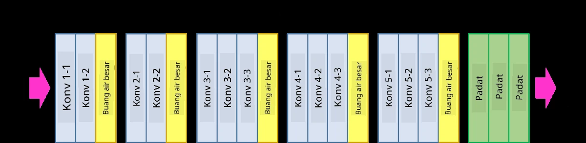
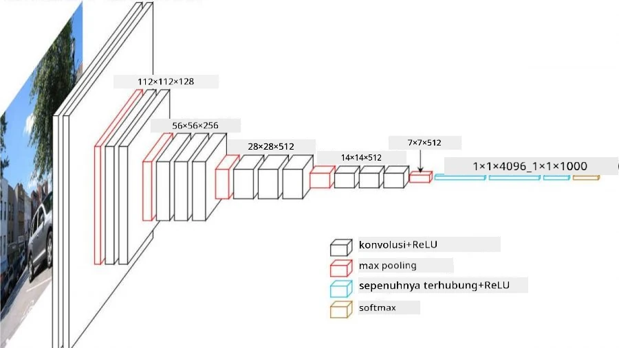
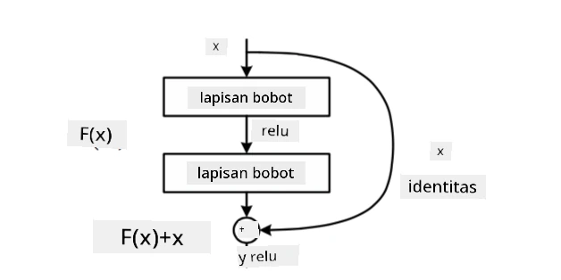
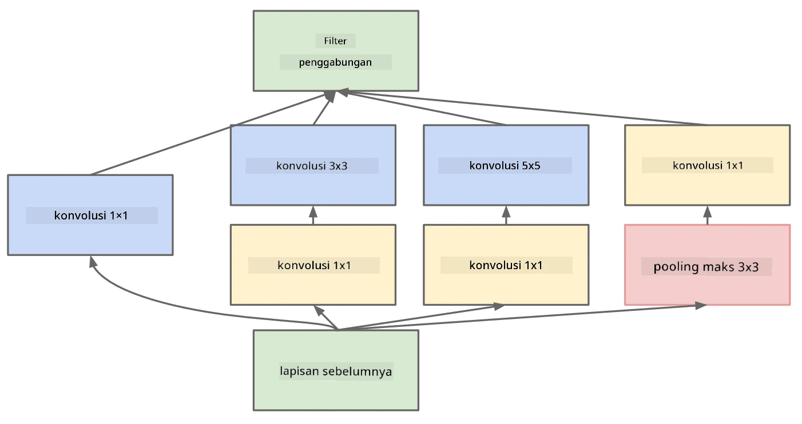

# Arsitektur CNN yang Terkenal

### VGG-16

VGG-16 adalah jaringan yang mencapai akurasi 92,7% dalam klasifikasi top-5 ImageNet pada tahun 2014. Jaringan ini memiliki struktur lapisan sebagai berikut:

Seperti yang dapat Anda lihat, VGG mengikuti arsitektur piramida tradisional, yaitu urutan lapisan konvolusi-pooling.

> Gambar dari [Researchgate](https://www.researchgate.net/figure/Vgg16-model-structure-To-get-the-VGG-NIN-model-we-replace-the-2-nd-4-th-6-th-7-th_fig2_335194493)

### ResNet

ResNet adalah keluarga model yang diusulkan oleh Microsoft Research pada tahun 2015. Ide utama dari ResNet adalah menggunakan **blok residual**:

> Gambar dari [makalah ini](https://arxiv.org/pdf/1512.03385.pdf)

Alasan menggunakan jalur identitas adalah agar lapisan kita memprediksi **perbedaan** antara hasil dari lapisan sebelumnya dan keluaran dari blok residual - itulah mengapa dinamakan *residual*. Blok-blok ini jauh lebih mudah untuk dilatih, dan kita dapat membangun jaringan dengan ratusan blok tersebut (varian yang paling umum adalah ResNet-52, ResNet-101, dan ResNet-152).

Anda juga dapat menganggap jaringan ini mampu menyesuaikan kompleksitasnya dengan dataset. Awalnya, saat Anda mulai melatih jaringan, nilai bobot kecil, dan sebagian besar sinyal melewati lapisan identitas. Seiring pelatihan berlangsung dan bobot menjadi lebih besar, signifikansi parameter jaringan meningkat, dan jaringan menyesuaikan untuk mengakomodasi kekuatan ekspresif yang diperlukan untuk mengklasifikasikan gambar pelatihan dengan benar.

### Google Inception

Arsitektur Google Inception membawa ide ini lebih jauh, dan membangun setiap lapisan jaringan sebagai kombinasi dari beberapa jalur berbeda:

> Gambar dari [Researchgate](https://www.researchgate.net/figure/Inception-module-with-dimension-reductions-left-and-schema-for-Inception-ResNet-v1_fig2_355547454)

Di sini, kita perlu menekankan peran konvolusi 1x1, karena awalnya ini tampak tidak masuk akal. Mengapa kita perlu menjalankan gambar dengan filter 1x1? Namun, Anda perlu ingat bahwa filter konvolusi juga bekerja dengan beberapa saluran kedalaman (awalnya - warna RGB, pada lapisan berikutnya - saluran untuk filter yang berbeda), dan konvolusi 1x1 digunakan untuk mencampur saluran input tersebut menggunakan bobot yang dapat dilatih. Ini juga dapat dilihat sebagai downsampling (pooling) pada dimensi saluran.

Berikut adalah [blog post yang bagus](https://medium.com/analytics-vidhya/talented-mr-1x1-comprehensive-look-at-1x1-convolution-in-deep-learning-f6b355825578) tentang topik ini, dan [makalah aslinya](https://arxiv.org/pdf/1312.4400.pdf).

### MobileNet

MobileNet adalah keluarga model dengan ukuran yang lebih kecil, cocok untuk perangkat seluler. Gunakan model ini jika Anda memiliki keterbatasan sumber daya dan dapat mengorbankan sedikit akurasi. Ide utama di baliknya adalah **konvolusi separable depthwise**, yang memungkinkan representasi filter konvolusi sebagai komposisi konvolusi spasial dan konvolusi 1x1 pada saluran kedalaman. Ini secara signifikan mengurangi jumlah parameter, membuat jaringan lebih kecil dalam ukuran, dan juga lebih mudah dilatih dengan data yang lebih sedikit.

Berikut adalah [blog post yang bagus tentang MobileNet](https://medium.com/analytics-vidhya/image-classification-with-mobilenet-cc6fbb2cd470).

## Kesimpulan

Dalam unit ini, Anda telah mempelajari konsep utama di balik jaringan neural visi komputer - jaringan konvolusi. Arsitektur nyata yang mendukung klasifikasi gambar, deteksi objek, dan bahkan jaringan generasi gambar semuanya berbasis CNN, hanya dengan lebih banyak lapisan dan beberapa trik pelatihan tambahan.

## 🚀 Tantangan

Dalam notebook yang menyertai, terdapat catatan di bagian bawah tentang cara mendapatkan akurasi yang lebih tinggi. Lakukan beberapa eksperimen untuk melihat apakah Anda dapat mencapai akurasi yang lebih tinggi.

## [Kuis setelah kuliah](https://ff-quizzes.netlify.app/en/ai/quiz/14)

## Tinjauan & Studi Mandiri

Meskipun CNN paling sering digunakan untuk tugas Visi Komputer, mereka umumnya baik untuk mengekstraksi pola berukuran tetap. Misalnya, jika kita berurusan dengan suara, kita mungkin juga ingin menggunakan CNN untuk mencari pola tertentu dalam sinyal audio - dalam hal ini filter akan menjadi 1-dimensi (dan CNN ini akan disebut 1D-CNN). Selain itu, kadang-kadang 3D-CNN digunakan untuk mengekstraksi fitur dalam ruang multi-dimensi, seperti peristiwa tertentu yang terjadi dalam video - CNN dapat menangkap pola tertentu dari perubahan fitur seiring waktu. Lakukan tinjauan dan studi mandiri tentang tugas lain yang dapat dilakukan dengan CNN.

## [Tugas](lab/README.md)

Dalam lab ini, Anda ditugaskan untuk mengklasifikasikan berbagai ras kucing dan anjing. Gambar-gambar ini lebih kompleks daripada dataset MNIST dan memiliki dimensi yang lebih tinggi, serta terdapat lebih dari 10 kelas.

---

