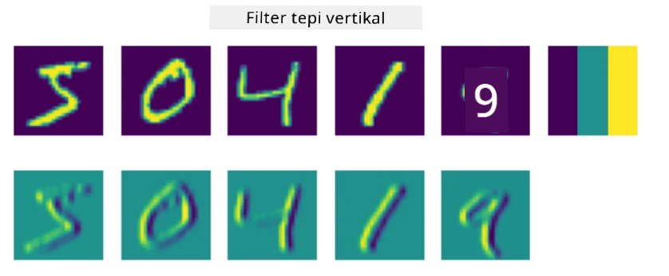
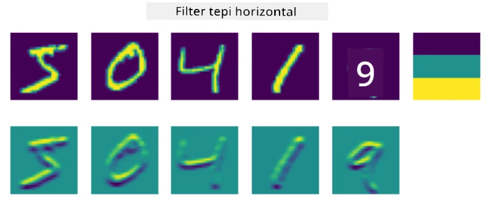

# Convolutional Neural Networks

Kita telah melihat sebelumnya bahwa jaringan neural cukup baik dalam menangani gambar, bahkan perceptron satu lapis mampu mengenali angka tulisan tangan dari dataset MNIST dengan akurasi yang cukup baik. Namun, dataset MNIST sangatlah spesial, di mana semua angka sudah dipusatkan di dalam gambar, sehingga tugas menjadi lebih sederhana.

## [Kuis sebelum kuliah](https://ff-quizzes.netlify.app/en/ai/quiz/13)

Dalam kehidupan nyata, kita ingin dapat mengenali objek dalam gambar tanpa peduli lokasi tepatnya di dalam gambar. Penglihatan komputer berbeda dari klasifikasi umum, karena ketika kita mencoba menemukan objek tertentu dalam gambar, kita memindai gambar untuk mencari **pola** tertentu dan kombinasi mereka. Sebagai contoh, saat mencari kucing, kita mungkin pertama-tama mencari garis horizontal yang dapat membentuk kumis, lalu kombinasi tertentu dari kumis dapat menunjukkan bahwa itu sebenarnya gambar kucing. Posisi relatif dan keberadaan pola tertentu penting, bukan posisi tepatnya di dalam gambar.

Untuk mengekstrak pola, kita akan menggunakan konsep **filter konvolusi**. Seperti yang Anda ketahui, gambar direpresentasikan sebagai matriks 2D, atau tensor 3D dengan kedalaman warna. Menerapkan filter berarti kita mengambil matriks **filter kernel** yang relatif kecil, dan untuk setiap piksel dalam gambar asli kita menghitung rata-rata berbobot dengan titik-titik tetangga. Kita dapat melihat ini seperti jendela kecil yang meluncur di seluruh gambar, dan meratakan semua piksel sesuai dengan bobot dalam matriks filter kernel.

 | 
----|----

> Gambar oleh Dmitry Soshnikov

Sebagai contoh, jika kita menerapkan filter tepi vertikal dan horizontal 3x3 pada angka MNIST, kita dapat memperoleh sorotan (misalnya nilai tinggi) di mana terdapat tepi vertikal dan horizontal dalam gambar asli kita. Jadi, kedua filter tersebut dapat digunakan untuk "mencari" tepi. Demikian pula, kita dapat merancang filter berbeda untuk mencari pola tingkat rendah lainnya:

> Gambar dari [Leung-Malik Filter Bank](https://www.robots.ox.ac.uk/~vgg/research/texclass/filters.html)

Namun, meskipun kita dapat merancang filter untuk mengekstrak beberapa pola secara manual, kita juga dapat merancang jaringan sedemikian rupa sehingga jaringan tersebut akan belajar pola secara otomatis. Ini adalah salah satu ide utama di balik CNN.

## Ide Utama di Balik CNN

Cara kerja CNN didasarkan pada ide-ide penting berikut:

* Filter konvolusi dapat mengekstrak pola
* Kita dapat merancang jaringan sedemikian rupa sehingga filter dilatih secara otomatis
* Kita dapat menggunakan pendekatan yang sama untuk menemukan pola dalam fitur tingkat tinggi, bukan hanya dalam gambar asli. Dengan demikian, ekstraksi fitur CNN bekerja pada hierarki fitur, mulai dari kombinasi piksel tingkat rendah hingga kombinasi tingkat tinggi dari bagian gambar.

> Gambar dari [makalah oleh Hislop-Lynch](https://www.semanticscholar.org/paper/Computer-vision-based-pedestrian-trajectory-Hislop-Lynch/26e6f74853fc9bbb7487b06dc2cf095d36c9021d), berdasarkan [penelitian mereka](https://dl.acm.org/doi/abs/10.1145/1553374.1553453)

## ✍️ Latihan: Convolutional Neural Networks

Mari kita lanjutkan eksplorasi tentang cara kerja convolutional neural networks, dan bagaimana kita dapat mencapai filter yang dapat dilatih, dengan mengerjakan notebook berikut:

* [Convolutional Neural Networks - PyTorch](ConvNetsPyTorch.ipynb)
* [Convolutional Neural Networks - TensorFlow](ConvNetsTF.ipynb)

## Arsitektur Piramida

Sebagian besar CNN yang digunakan untuk pemrosesan gambar mengikuti apa yang disebut arsitektur piramida. Lapisan konvolusi pertama yang diterapkan pada gambar asli biasanya memiliki jumlah filter yang relatif rendah (8-16), yang sesuai dengan kombinasi piksel yang berbeda, seperti garis horizontal/vertikal atau goresan. Pada tingkat berikutnya, kita mengurangi dimensi spasial jaringan, dan meningkatkan jumlah filter, yang sesuai dengan lebih banyak kemungkinan kombinasi fitur sederhana. Dengan setiap lapisan, saat kita bergerak menuju pengklasifikasi akhir, dimensi spasial gambar berkurang, dan jumlah filter bertambah.

Sebagai contoh, mari kita lihat arsitektur VGG-16, sebuah jaringan yang mencapai akurasi 92.7% dalam klasifikasi top-5 ImageNet pada tahun 2014:

> Gambar dari [Researchgate](https://www.researchgate.net/figure/Vgg16-model-structure-To-get-the-VGG-NIN-model-we-replace-the-2-nd-4-th-6-th-7-th_fig2_335194493)

## Arsitektur CNN Terkenal

[Lanjutkan studi Anda tentang arsitektur CNN terkenal](CNN_Architectures.md)

---

