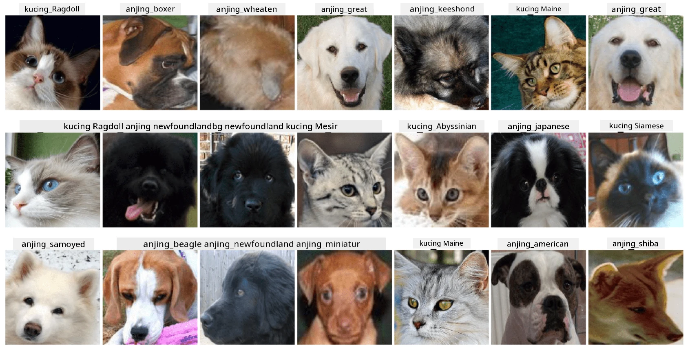

# Klasifikasi Wajah Hewan Peliharaan

Tugas Lab dari [Kurikulum AI untuk Pemula](https://github.com/microsoft/ai-for-beginners).

## Tugas

Bayangkan Anda perlu mengembangkan aplikasi untuk tempat penitipan hewan peliharaan guna mengkatalog semua hewan. Salah satu fitur hebat dari aplikasi semacam itu adalah kemampuan untuk secara otomatis mengenali ras dari sebuah foto. Hal ini dapat dilakukan dengan sukses menggunakan jaringan saraf.

Anda perlu melatih jaringan saraf konvolusi untuk mengklasifikasikan berbagai ras kucing dan anjing menggunakan dataset **Pet Faces**.

## Dataset

Kita akan menggunakan [Oxford-IIIT Pet Dataset](https://www.robots.ox.ac.uk/~vgg/data/pets/), yang berisi gambar dari 37 ras anjing dan kucing yang berbeda.



Untuk mengunduh dataset, gunakan cuplikan kode berikut:

```python
!wget https://thor.robots.ox.ac.uk/~vgg/data/pets/images.tar.gz
!tar xfz images.tar.gz
!rm images.tar.gz
```

**Catatan:** Gambar dalam Oxford-IIIT Pet Dataset diorganisasi berdasarkan nama file (misalnya, `Abyssinian_1.jpg`, `Bengal_2.jpg`). Notebook ini mencakup kode untuk mengorganisasi gambar-gambar tersebut ke dalam subdirektori berdasarkan ras untuk mempermudah klasifikasi.

## Memulai Notebook

Mulailah lab dengan membuka [PetFaces.ipynb](PetFaces.ipynb)

## Kesimpulan

Anda telah menyelesaikan masalah yang cukup kompleks dalam klasifikasi gambar dari awal! Ada cukup banyak kelas, dan Anda masih mampu mendapatkan akurasi yang masuk akal! Selain itu, masuk akal untuk mengukur akurasi top-k, karena mudah untuk membingungkan beberapa kelas yang bahkan tidak jelas berbeda bagi manusia.

---

**Penafian**:  
Dokumen ini telah diterjemahkan menggunakan layanan penerjemahan AI [Co-op Translator](https://github.com/Azure/co-op-translator). Meskipun kami berusaha untuk memberikan hasil yang akurat, harap diketahui bahwa terjemahan otomatis mungkin mengandung kesalahan atau ketidakakuratan. Dokumen asli dalam bahasa aslinya harus dianggap sebagai sumber yang otoritatif. Untuk informasi yang bersifat kritis, disarankan menggunakan jasa penerjemahan manusia profesional. Kami tidak bertanggung jawab atas kesalahpahaman atau interpretasi yang keliru yang timbul dari penggunaan terjemahan ini.