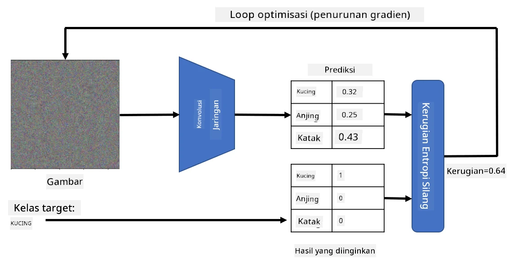

# Jaringan Pra-Latih dan Transfer Learning

Melatih CNN bisa memakan waktu lama, dan membutuhkan banyak data untuk tugas tersebut. Namun, sebagian besar waktu dihabiskan untuk mempelajari filter tingkat rendah terbaik yang dapat digunakan jaringan untuk mengekstrak pola dari gambar. Pertanyaan alami muncul - bisakah kita menggunakan jaringan neural yang telah dilatih pada satu dataset dan mengadaptasinya untuk mengklasifikasikan gambar yang berbeda tanpa memerlukan proses pelatihan penuh?

## [Kuis Pra-Kuliah](https://ff-quizzes.netlify.app/en/ai/quiz/15)

Pendekatan ini disebut **transfer learning**, karena kita mentransfer sebagian pengetahuan dari satu model jaringan neural ke model lainnya. Dalam transfer learning, kita biasanya memulai dengan model pra-latih, yang telah dilatih pada dataset gambar besar, seperti **ImageNet**. Model-model tersebut sudah cukup baik dalam mengekstrak berbagai fitur dari gambar umum, dan dalam banyak kasus, hanya dengan membangun pengklasifikasi di atas fitur-fitur yang diekstrak tersebut dapat menghasilkan hasil yang baik.

> ✅ Transfer Learning adalah istilah yang juga ditemukan di bidang akademik lainnya, seperti Pendidikan. Istilah ini merujuk pada proses mengambil pengetahuan dari satu domain dan menerapkannya ke domain lain.

## Model Pra-Latih sebagai Ekstraktor Fitur

Jaringan konvolusi yang telah kita bahas di bagian sebelumnya terdiri dari sejumlah lapisan, masing-masing dirancang untuk mengekstrak beberapa fitur dari gambar, mulai dari kombinasi piksel tingkat rendah (seperti garis horizontal/vertikal atau goresan), hingga kombinasi fitur tingkat tinggi, yang sesuai dengan hal-hal seperti mata atau nyala api. Jika kita melatih CNN pada dataset gambar yang cukup besar dan beragam, jaringan tersebut seharusnya dapat belajar mengekstrak fitur-fitur umum tersebut.

Baik Keras maupun PyTorch memiliki fungsi untuk dengan mudah memuat bobot jaringan neural pra-latih untuk beberapa arsitektur umum, sebagian besar dilatih pada gambar ImageNet. Model yang paling sering digunakan dijelaskan pada halaman [Arsitektur CNN](../07-ConvNets/CNN_Architectures.md) dari pelajaran sebelumnya. Secara khusus, Anda mungkin ingin mempertimbangkan menggunakan salah satu dari berikut ini:

* **VGG-16/VGG-19** adalah model yang relatif sederhana tetapi tetap memberikan akurasi yang baik. Sering kali menggunakan VGG sebagai percobaan pertama adalah pilihan yang baik untuk melihat bagaimana transfer learning bekerja.
* **ResNet** adalah keluarga model yang diusulkan oleh Microsoft Research pada tahun 2015. Model ini memiliki lebih banyak lapisan, sehingga membutuhkan lebih banyak sumber daya.
* **MobileNet** adalah keluarga model dengan ukuran yang lebih kecil, cocok untuk perangkat seluler. Gunakan jika Anda kekurangan sumber daya dan dapat mengorbankan sedikit akurasi.

Berikut adalah contoh fitur yang diekstrak dari gambar kucing oleh jaringan VGG-16:

## Dataset Kucing vs. Anjing

Dalam contoh ini, kita akan menggunakan dataset [Kucing dan Anjing](https://www.microsoft.com/download/details.aspx?id=54765&WT.mc_id=academic-77998-cacaste), yang sangat mirip dengan skenario klasifikasi gambar di kehidupan nyata.

## ✍️ Latihan: Transfer Learning

Mari kita lihat transfer learning dalam aksi di notebook terkait:

* [Transfer Learning - PyTorch](TransferLearningPyTorch.ipynb)
* [Transfer Learning - TensorFlow](TransferLearningTF.ipynb)

## Visualisasi Kucing Adversarial

Jaringan neural pra-latih mengandung berbagai pola di dalam "otaknya", termasuk konsep tentang **kucing ideal** (serta anjing ideal, zebra ideal, dll.). Akan menarik untuk mencoba **memvisualisasikan gambar ini**. Namun, ini tidak sederhana, karena pola-pola tersebut tersebar di seluruh bobot jaringan, dan juga diorganisasi dalam struktur hierarkis.

Salah satu pendekatan yang bisa kita ambil adalah memulai dengan gambar acak, lalu mencoba menggunakan teknik **optimisasi penurunan gradien** untuk menyesuaikan gambar tersebut sedemikian rupa sehingga jaringan mulai berpikir bahwa itu adalah kucing.

Namun, jika kita melakukan ini, kita akan mendapatkan sesuatu yang sangat mirip dengan noise acak. Hal ini terjadi karena *ada banyak cara untuk membuat jaringan berpikir bahwa gambar input adalah kucing*, termasuk beberapa yang tidak masuk akal secara visual. Meskipun gambar-gambar tersebut mengandung banyak pola khas untuk kucing, tidak ada yang membatasi mereka untuk menjadi visual yang jelas.

Untuk meningkatkan hasil, kita dapat menambahkan istilah lain ke dalam fungsi loss, yang disebut **variation loss**. Ini adalah metrik yang menunjukkan seberapa mirip piksel-piksel yang berdekatan dalam gambar. Meminimalkan variation loss membuat gambar lebih halus, dan menghilangkan noise - sehingga mengungkapkan pola yang lebih menarik secara visual. Berikut adalah contoh gambar "ideal" yang diklasifikasikan sebagai kucing dan zebra dengan probabilitas tinggi:

 | 
-----|-----
 *Kucing Ideal* | *Zebra Ideal*

Pendekatan serupa dapat digunakan untuk melakukan apa yang disebut **serangan adversarial** pada jaringan neural. Misalkan kita ingin mengelabui jaringan neural dan membuat gambar anjing terlihat seperti kucing. Jika kita mengambil gambar anjing, yang dikenali oleh jaringan sebagai anjing, kita kemudian dapat sedikit menyesuaikannya menggunakan optimisasi penurunan gradien, hingga jaringan mulai mengklasifikasikannya sebagai kucing:

 | 
-----|-----
*Gambar asli anjing* | *Gambar anjing yang diklasifikasikan sebagai kucing*

Lihat kode untuk mereproduksi hasil di atas dalam notebook berikut:

* [Kucing Ideal dan Adversarial - TensorFlow](AdversarialCat_TF.ipynb)

## Kesimpulan

Dengan menggunakan transfer learning, Anda dapat dengan cepat membuat pengklasifikasi untuk tugas klasifikasi objek khusus dan mencapai akurasi tinggi. Anda dapat melihat bahwa tugas yang lebih kompleks yang kita selesaikan sekarang membutuhkan daya komputasi yang lebih tinggi, dan tidak dapat dengan mudah diselesaikan di CPU. Pada unit berikutnya, kita akan mencoba menggunakan implementasi yang lebih ringan untuk melatih model yang sama dengan sumber daya komputasi yang lebih rendah, yang menghasilkan akurasi yang hanya sedikit lebih rendah.

## 🚀 Tantangan

Dalam notebook yang menyertai, terdapat catatan di bagian bawah tentang bagaimana transfer knowledge bekerja paling baik dengan data pelatihan yang agak mirip (mungkin jenis hewan baru). Lakukan eksperimen dengan jenis gambar yang benar-benar baru untuk melihat seberapa baik atau buruk model transfer knowledge Anda bekerja.

## [Kuis Pasca-Kuliah](https://ff-quizzes.netlify.app/en/ai/quiz/16)

## Tinjauan & Studi Mandiri

Baca [TrainingTricks.md](TrainingTricks.md) untuk memperdalam pengetahuan Anda tentang beberapa cara lain untuk melatih model Anda.

## [Tugas](lab/README.md)

Dalam lab ini, kita akan menggunakan dataset hewan peliharaan [Oxford-IIIT](https://www.robots.ox.ac.uk/~vgg/data/pets/) yang nyata dengan 35 ras kucing dan anjing, dan kita akan membangun pengklasifikasi transfer learning.

---

