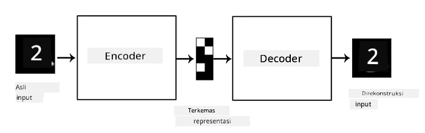

# Autoencoder

Saat melatih CNN, salah satu masalah yang dihadapi adalah kebutuhan akan banyak data berlabel. Dalam kasus klasifikasi gambar, kita perlu memisahkan gambar ke dalam berbagai kelas, yang memerlukan upaya manual.

## [Kuis sebelum pelajaran](https://ff-quizzes.netlify.app/en/ai/quiz/17)

Namun, kita mungkin ingin menggunakan data mentah (tidak berlabel) untuk melatih ekstraktor fitur CNN, yang disebut sebagai **pembelajaran mandiri (self-supervised learning)**. Alih-alih menggunakan label, kita akan menggunakan gambar pelatihan sebagai input dan output jaringan. Ide utama dari **autoencoder** adalah kita akan memiliki **jaringan encoder** yang mengubah gambar input menjadi **ruang laten** (biasanya berupa vektor dengan ukuran lebih kecil), kemudian **jaringan decoder**, yang bertujuan merekonstruksi gambar asli.

> ✅ Sebuah [autoencoder](https://wikipedia.org/wiki/Autoencoder) adalah "jenis jaringan saraf buatan yang digunakan untuk mempelajari pengkodean efisien dari data yang tidak berlabel."

Karena kita melatih autoencoder untuk menangkap sebanyak mungkin informasi dari gambar asli agar dapat merekonstruksi dengan akurat, jaringan ini mencoba menemukan **embedding** terbaik dari gambar input untuk menangkap maknanya.

> Gambar dari [blog Keras](https://blog.keras.io/building-autoencoders-in-keras.html)

## Skenario Penggunaan Autoencoder

Meskipun merekonstruksi gambar asli mungkin tampak kurang berguna dengan sendirinya, ada beberapa skenario di mana autoencoder sangat bermanfaat:

* **Menurunkan dimensi gambar untuk visualisasi** atau **melatih embedding gambar**. Biasanya autoencoder memberikan hasil yang lebih baik dibandingkan PCA, karena mempertimbangkan sifat spasial gambar dan fitur hierarkis.
* **Denoising**, yaitu menghilangkan noise dari gambar. Karena noise membawa banyak informasi yang tidak berguna, autoencoder tidak dapat memasukkan semuanya ke dalam ruang laten yang relatif kecil, sehingga hanya menangkap bagian penting dari gambar. Saat melatih denoiser, kita memulai dengan gambar asli, dan menggunakan gambar dengan noise buatan sebagai input untuk autoencoder.
* **Super-resolution**, meningkatkan resolusi gambar. Kita memulai dengan gambar resolusi tinggi, dan menggunakan gambar dengan resolusi lebih rendah sebagai input autoencoder.
* **Model generatif**. Setelah kita melatih autoencoder, bagian decoder dapat digunakan untuk membuat objek baru dengan memulai dari vektor laten acak.

## Variational Autoencoders (VAE)

Autoencoder tradisional mengurangi dimensi data input dengan cara tertentu, menemukan fitur penting dari gambar input. Namun, vektor laten sering kali tidak memiliki makna yang jelas. Dengan kata lain, jika kita mengambil dataset MNIST sebagai contoh, menentukan digit mana yang sesuai dengan vektor laten tertentu bukanlah tugas yang mudah, karena vektor laten yang berdekatan tidak selalu sesuai dengan digit yang sama.

Di sisi lain, untuk melatih model *generatif*, lebih baik memiliki pemahaman tentang ruang laten. Ide ini membawa kita pada **variational auto-encoder** (VAE).

VAE adalah autoencoder yang belajar memprediksi *distribusi statistik* dari parameter laten, yang disebut sebagai **distribusi laten**. Sebagai contoh, kita mungkin ingin vektor laten terdistribusi secara normal dengan rata-rata zmean dan standar deviasi zsigma (baik rata-rata maupun standar deviasi adalah vektor dengan dimensi tertentu d). Encoder dalam VAE belajar memprediksi parameter tersebut, dan kemudian decoder mengambil vektor acak dari distribusi ini untuk merekonstruksi objek.

Ringkasnya:

* Dari vektor input, kita memprediksi `z_mean` dan `z_log_sigma` (alih-alih memprediksi standar deviasi secara langsung, kita memprediksi logaritmanya)
* Kita mengambil sampel vektor `sample` dari distribusi N(zmean,exp(zlog\_sigma))
* Decoder mencoba mendekode gambar asli menggunakan `sample` sebagai vektor input

> Gambar dari [blog post ini](https://ijdykeman.github.io/ml/2016/12/21/cvae.html) oleh Isaak Dykeman

Variational auto-encoder menggunakan fungsi loss yang kompleks yang terdiri dari dua bagian:

* **Reconstruction loss** adalah fungsi loss yang menunjukkan seberapa dekat gambar yang direkonstruksi dengan target (bisa berupa Mean Squared Error, atau MSE). Ini adalah fungsi loss yang sama seperti pada autoencoder biasa.
* **KL loss**, yang memastikan distribusi variabel laten tetap dekat dengan distribusi normal. Ini didasarkan pada konsep [Kullback-Leibler divergence](https://www.countbayesie.com/blog/2017/5/9/kullback-leibler-divergence-explained) - metrik untuk memperkirakan seberapa mirip dua distribusi statistik.

Salah satu keuntungan penting dari VAE adalah memungkinkan kita untuk menghasilkan gambar baru dengan relatif mudah, karena kita tahu distribusi mana yang harus digunakan untuk mengambil sampel vektor laten. Sebagai contoh, jika kita melatih VAE dengan vektor laten 2D pada MNIST, kita kemudian dapat memvariasikan komponen vektor laten untuk mendapatkan digit yang berbeda:

> Gambar oleh [Dmitry Soshnikov](http://soshnikov.com)

Perhatikan bagaimana gambar-gambar saling menyatu, saat kita mulai mendapatkan vektor laten dari bagian yang berbeda dari ruang parameter laten. Kita juga dapat memvisualisasikan ruang ini dalam 2D:

 

> Gambar oleh [Dmitry Soshnikov](http://soshnikov.com)

## ✍️ Latihan: Autoencoder

Pelajari lebih lanjut tentang autoencoder di notebook berikut:

* [Autoencoder di TensorFlow](AutoencodersTF.ipynb)
* [Autoencoder di PyTorch](AutoEncodersPyTorch.ipynb)

## Properti Autoencoder

* **Spesifik pada Data** - autoencoder hanya bekerja dengan baik pada jenis gambar yang telah dilatih. Sebagai contoh, jika kita melatih jaringan super-resolution pada gambar bunga, jaringan tersebut tidak akan bekerja dengan baik pada potret. Hal ini karena jaringan dapat menghasilkan gambar resolusi tinggi dengan mengambil detail halus dari fitur yang dipelajari dari dataset pelatihan.
* **Lossy** - gambar yang direkonstruksi tidak sama dengan gambar asli. Sifat loss ini ditentukan oleh *fungsi loss* yang digunakan selama pelatihan.
* Bekerja pada **data tidak berlabel**

## [Kuis setelah pelajaran](https://ff-quizzes.netlify.app/en/ai/quiz/18)

## Kesimpulan

Dalam pelajaran ini, Anda telah mempelajari berbagai jenis autoencoder yang tersedia untuk ilmuwan AI. Anda mempelajari cara membangunnya, dan cara menggunakannya untuk merekonstruksi gambar. Anda juga mempelajari tentang VAE dan cara menggunakannya untuk menghasilkan gambar baru.

## 🚀 Tantangan

Dalam pelajaran ini, Anda mempelajari penggunaan autoencoder untuk gambar. Namun, autoencoder juga dapat digunakan untuk musik! Lihat proyek Magenta [MusicVAE](https://magenta.tensorflow.org/music-vae), yang menggunakan autoencoder untuk mempelajari cara merekonstruksi musik. Lakukan beberapa [eksperimen](https://colab.research.google.com/github/magenta/magenta-demos/blob/master/colab-notebooks/Multitrack_MusicVAE.ipynb) dengan pustaka ini untuk melihat apa yang dapat Anda ciptakan.

## [Kuis setelah pelajaran](https://ff-quizzes.netlify.app/en/ai/quiz/16)

## Tinjauan & Studi Mandiri

Sebagai referensi, baca lebih lanjut tentang autoencoder di sumber berikut:

* [Membangun Autoencoder di Keras](https://blog.keras.io/building-autoencoders-in-keras.html)
* [Blog post di NeuroHive](https://neurohive.io/ru/osnovy-data-science/variacionnyj-avtojenkoder-vae/)
* [Penjelasan Variational Autoencoders](https://kvfrans.com/variational-autoencoders-explained/)
* [Conditional Variational Autoencoders](https://ijdykeman.github.io/ml/2016/12/21/cvae.html)

## Tugas

Di akhir [notebook ini menggunakan TensorFlow](AutoencodersTF.ipynb), Anda akan menemukan 'tugas' - gunakan ini sebagai tugas Anda.

---

