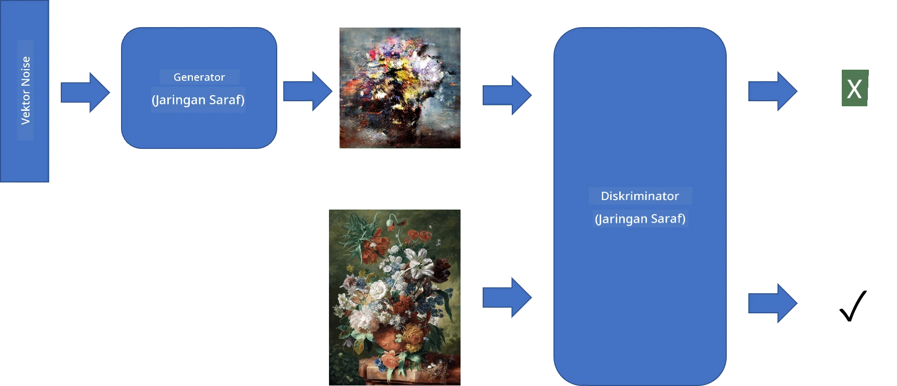
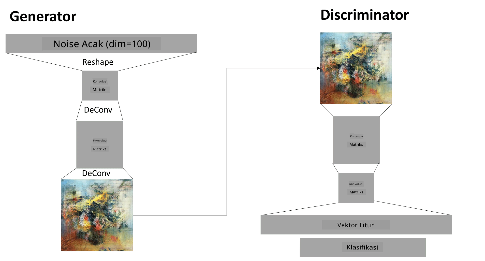

# Generative Adversarial Networks

Di bagian sebelumnya, kita telah mempelajari tentang **model generatif**: model yang dapat menghasilkan gambar baru yang mirip dengan gambar dalam dataset pelatihan. VAE adalah contoh yang baik dari model generatif.

## [Pre-lecture quiz](https://ff-quizzes.netlify.app/en/ai/quiz/19)

Namun, jika kita mencoba menghasilkan sesuatu yang benar-benar bermakna, seperti lukisan dengan resolusi yang wajar, menggunakan VAE, kita akan melihat bahwa pelatihan tidak berjalan dengan baik. Untuk kasus ini, kita perlu mempelajari arsitektur lain yang secara khusus ditargetkan untuk model generatif - **Generative Adversarial Networks**, atau GAN.

Ide utama dari GAN adalah memiliki dua jaringan neural yang dilatih saling berlawanan:

> Gambar oleh [Dmitry Soshnikov](http://soshnikov.com)

> ✅ Sedikit kosakata:
> * **Generator** adalah jaringan yang mengambil vektor acak dan menghasilkan gambar sebagai hasilnya.
> * **Discriminator** adalah jaringan yang mengambil gambar dan menentukan apakah itu gambar asli (dari dataset pelatihan) atau gambar yang dihasilkan oleh generator. Pada dasarnya, ini adalah pengklasifikasi gambar.

### Discriminator

Arsitektur discriminator tidak berbeda dari jaringan klasifikasi gambar biasa. Dalam kasus paling sederhana, ini bisa berupa pengklasifikasi fully-connected, tetapi kemungkinan besar akan berupa [jaringan konvolusi](../07-ConvNets/README.md).

> ✅ GAN yang berbasis jaringan konvolusi disebut [DCGAN](https://arxiv.org/pdf/1511.06434.pdf)

Discriminator CNN terdiri dari lapisan-lapisan berikut: beberapa konvolusi+pooling (dengan ukuran spasial yang semakin kecil) dan satu atau lebih lapisan fully-connected untuk mendapatkan "feature vector", serta pengklasifikasi biner akhir.

> ✅ 'Pooling' dalam konteks ini adalah teknik yang mengurangi ukuran gambar. "Pooling layers mengurangi dimensi data dengan menggabungkan output dari kluster neuron pada satu lapisan menjadi satu neuron di lapisan berikutnya." - [sumber](https://wikipedia.org/wiki/Convolutional_neural_network#Pooling_layers)

### Generator

Generator sedikit lebih rumit. Anda dapat menganggapnya sebagai kebalikan dari discriminator. Dimulai dari vektor laten (sebagai pengganti feature vector), generator memiliki lapisan fully-connected untuk mengubahnya menjadi ukuran/bentuk yang diinginkan, diikuti oleh dekonvolusi+upscaling. Ini mirip dengan bagian *decoder* dari [autoencoder](../09-Autoencoders/README.md).

> ✅ Karena lapisan konvolusi diimplementasikan sebagai filter linier yang melintasi gambar, dekonvolusi pada dasarnya mirip dengan konvolusi dan dapat diimplementasikan menggunakan logika lapisan yang sama.

> Gambar oleh [Dmitry Soshnikov](http://soshnikov.com)

### Melatih GAN

GAN disebut **adversarial** karena ada kompetisi terus-menerus antara generator dan discriminator. Selama kompetisi ini, baik generator maupun discriminator meningkat, sehingga jaringan belajar menghasilkan gambar yang semakin baik.

Pelatihan terjadi dalam dua tahap:

* **Melatih discriminator**. Tugas ini cukup sederhana: kita menghasilkan batch gambar menggunakan generator, memberi label 0, yang berarti gambar palsu, dan mengambil batch gambar dari dataset input (dengan label 1, gambar asli). Kita mendapatkan *discriminator loss*, dan melakukan backprop.
* **Melatih generator**. Ini sedikit lebih rumit karena kita tidak tahu output yang diharapkan untuk generator secara langsung. Kita mengambil seluruh jaringan GAN yang terdiri dari generator diikuti oleh discriminator, memberinya vektor acak, dan mengharapkan hasilnya menjadi 1 (sesuai dengan gambar asli). Kemudian kita membekukan parameter discriminator (kita tidak ingin melatihnya pada langkah ini), dan melakukan backprop.

Selama proses ini, baik generator maupun discriminator loss tidak turun secara signifikan. Dalam situasi ideal, mereka harus berosilasi, yang menunjukkan bahwa kedua jaringan meningkatkan kinerjanya.

## ✍️ Latihan: GANs

* [Notebook GAN di TensorFlow/Keras](GANTF.ipynb)
* [Notebook GAN di PyTorch](GANPyTorch.ipynb)

### Masalah dalam Pelatihan GAN

GAN dikenal sangat sulit untuk dilatih. Berikut beberapa masalahnya:

* **Mode Collapse**. Istilah ini berarti generator belajar menghasilkan satu gambar sukses yang dapat menipu discriminator, tetapi tidak menghasilkan berbagai gambar yang berbeda.
* **Sensitivitas terhadap hyperparameter**. Sering kali Anda dapat melihat bahwa GAN tidak konvergen sama sekali, dan kemudian tiba-tiba konvergen setelah penurunan learning rate.
* Menjaga **keseimbangan** antara generator dan discriminator. Dalam banyak kasus, discriminator loss dapat turun ke nol dengan cepat, yang menyebabkan generator tidak dapat dilatih lebih lanjut. Untuk mengatasi ini, kita dapat mencoba menetapkan learning rate yang berbeda untuk generator dan discriminator, atau melewati pelatihan discriminator jika loss sudah terlalu rendah.
* Pelatihan untuk **resolusi tinggi**. Masalah ini mirip dengan autoencoder, di mana merekonstruksi terlalu banyak lapisan jaringan konvolusi menyebabkan artefak. Masalah ini biasanya diselesaikan dengan **progressive growing**, di mana beberapa lapisan pertama dilatih pada gambar beresolusi rendah, lalu lapisan "dibuka" atau ditambahkan. Solusi lain adalah menambahkan koneksi ekstra antar lapisan dan melatih beberapa resolusi sekaligus - lihat [Multi-Scale Gradient GANs paper](https://arxiv.org/abs/1903.06048) untuk detailnya.

## Style Transfer

GAN adalah cara yang hebat untuk menghasilkan gambar artistik. Teknik menarik lainnya adalah **style transfer**, yang mengambil satu **content image** dan menggambar ulang dalam gaya yang berbeda, menerapkan filter dari **style image**.

Cara kerjanya adalah sebagai berikut:
* Kita mulai dengan gambar noise acak (atau dengan content image, tetapi untuk pemahaman lebih mudah dimulai dari noise acak).
* Tujuan kita adalah membuat gambar yang mendekati content image dan style image. Ini ditentukan oleh dua fungsi loss:
   - **Content loss** dihitung berdasarkan fitur yang diekstraksi oleh CNN pada beberapa lapisan dari gambar saat ini dan content image.
   - **Style loss** dihitung antara gambar saat ini dan style image dengan cara cerdas menggunakan matriks Gram (detail lebih lanjut ada di [notebook contoh](StyleTransfer.ipynb)).
* Untuk membuat gambar lebih halus dan menghilangkan noise, kita juga memperkenalkan **Variation loss**, yang menghitung jarak rata-rata antara piksel yang berdekatan.
* Loop optimasi utama menyesuaikan gambar saat ini menggunakan gradient descent (atau algoritma optimasi lainnya) untuk meminimalkan total loss, yang merupakan jumlah berbobot dari semua loss.

## ✍️ Contoh: [Style Transfer](StyleTransfer.ipynb)

## [Post-lecture quiz](https://ff-quizzes.netlify.app/en/ai/quiz/20)

## Kesimpulan

Dalam pelajaran ini, Anda telah mempelajari tentang GAN dan cara melatihnya. Anda juga mempelajari tantangan khusus yang dihadapi jenis Neural Network ini, serta beberapa strategi untuk mengatasinya.

## 🚀 Tantangan

Jalankan [notebook Style Transfer](StyleTransfer.ipynb) menggunakan gambar Anda sendiri.

## Review & Self Study

Sebagai referensi, baca lebih lanjut tentang GAN di sumber berikut:

* Marco Pasini, [10 Lessons I Learned Training GANs for one Year](https://towardsdatascience.com/10-lessons-i-learned-training-generative-adversarial-networks-gans-for-a-year-c9071159628)
* [StyleGAN](https://en.wikipedia.org/wiki/StyleGAN), arsitektur GAN yang *de facto* untuk dipertimbangkan.
* [Creating Generative Art using GANs on Azure ML](https://soshnikov.com/scienceart/creating-generative-art-using-gan-on-azureml/)

## Tugas

Kunjungi kembali salah satu dari dua notebook yang terkait dengan pelajaran ini dan latih ulang GAN menggunakan gambar Anda sendiri. Apa yang bisa Anda ciptakan?

---

