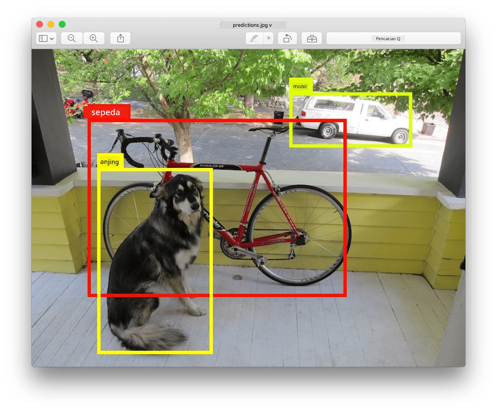
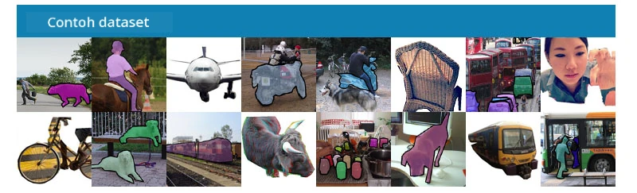
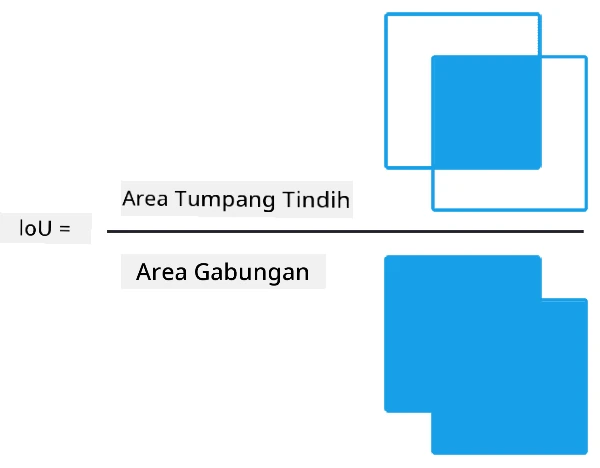
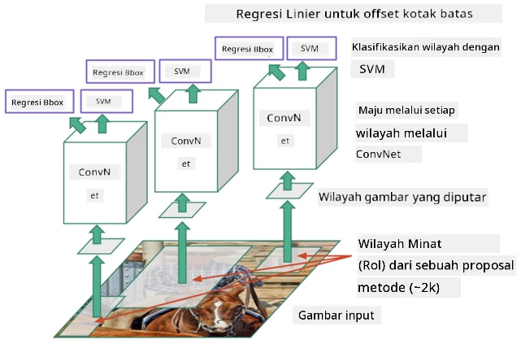
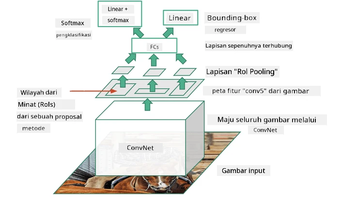
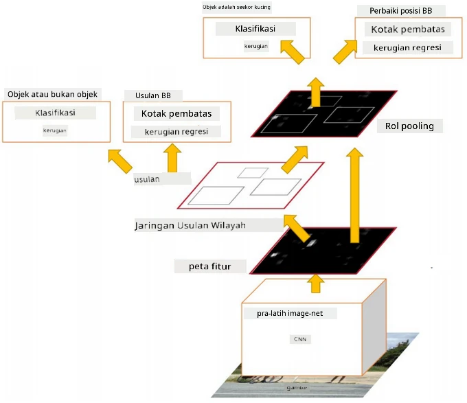
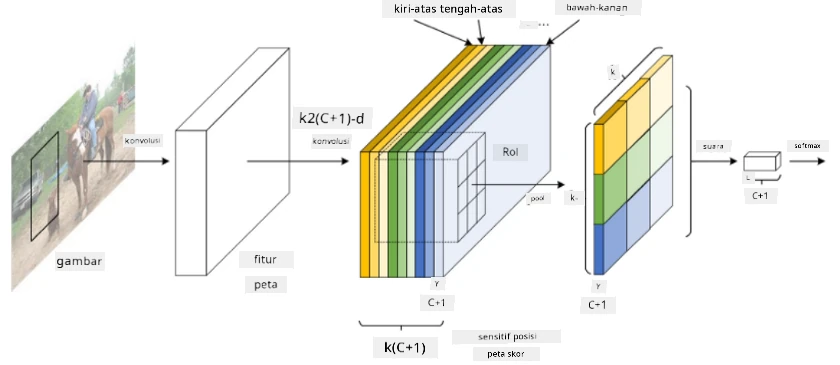
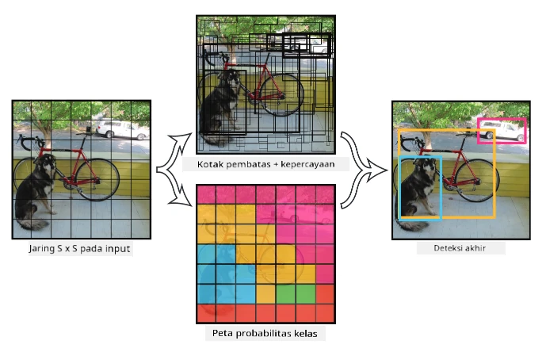

# Deteksi Objek

Model klasifikasi gambar yang telah kita bahas sejauh ini mengambil gambar dan menghasilkan hasil kategoris, seperti kelas 'angka' dalam masalah MNIST. Namun, dalam banyak kasus, kita tidak hanya ingin mengetahui bahwa sebuah gambar menggambarkan objek - kita ingin menentukan lokasi mereka secara tepat. Inilah tujuan dari **deteksi objek**.

## [Kuis sebelum pelajaran](https://ff-quizzes.netlify.app/en/ai/quiz/21)

> Gambar dari [situs web YOLO v2](https://pjreddie.com/darknet/yolov2/)

## Pendekatan Naif untuk Deteksi Objek

Misalkan kita ingin menemukan seekor kucing dalam sebuah gambar, pendekatan yang sangat naif untuk deteksi objek adalah sebagai berikut:

1. Memecah gambar menjadi sejumlah ubin.
2. Melakukan klasifikasi gambar pada setiap ubin.
3. Ubin yang menghasilkan aktivasi yang cukup tinggi dapat dianggap mengandung objek yang dimaksud.

> *Gambar dari [Notebook Latihan](ObjectDetection-TF.ipynb)*

Namun, pendekatan ini jauh dari ideal, karena hanya memungkinkan algoritma untuk menentukan kotak pembatas objek dengan sangat tidak akurat. Untuk lokasi yang lebih tepat, kita perlu menjalankan semacam **regresi** untuk memprediksi koordinat kotak pembatas - dan untuk itu, kita memerlukan dataset khusus.

## Regresi untuk Deteksi Objek

[Postingan blog ini](https://towardsdatascience.com/object-detection-with-neural-networks-a4e2c46b4491) memberikan pengantar yang bagus tentang mendeteksi bentuk.

## Dataset untuk Deteksi Objek

Anda mungkin menemukan dataset berikut untuk tugas ini:

* [PASCAL VOC](http://host.robots.ox.ac.uk/pascal/VOC/) - 20 kelas
* [COCO](http://cocodataset.org/#home) - Common Objects in Context. 80 kelas, kotak pembatas, dan masker segmentasi

## Metrik Deteksi Objek

### Intersection over Union

Sementara untuk klasifikasi gambar mudah untuk mengukur seberapa baik algoritma bekerja, untuk deteksi objek kita perlu mengukur baik kebenaran kelas maupun ketepatan lokasi kotak pembatas yang dihasilkan. Untuk yang terakhir, kita menggunakan **Intersection over Union** (IoU), yang mengukur seberapa baik dua kotak (atau dua area arbitrer) saling tumpang tindih.

> *Gambar 2 dari [blog yang sangat bagus tentang IoU](https://pyimagesearch.com/2016/11/07/intersection-over-union-iou-for-object-detection/)*

Idenya sederhana - kita membagi area perpotongan antara dua bentuk dengan area gabungan mereka. Untuk dua area yang identik, IoU akan menjadi 1, sementara untuk area yang sepenuhnya terpisah akan menjadi 0. Selain itu, nilainya akan bervariasi dari 0 hingga 1. Kita biasanya hanya mempertimbangkan kotak pembatas yang memiliki IoU di atas nilai tertentu.

### Average Precision

Misalkan kita ingin mengukur seberapa baik suatu kelas objek $C$ dikenali. Untuk mengukurnya, kita menggunakan metrik **Average Precision**, yang dihitung sebagai berikut:

1. Pertimbangkan kurva Precision-Recall yang menunjukkan akurasi tergantung pada nilai ambang deteksi (dari 0 hingga 1).
2. Bergantung pada ambang batas, kita akan mendapatkan lebih banyak atau lebih sedikit objek yang terdeteksi dalam gambar, dan nilai presisi serta recall yang berbeda.
3. Kurva akan terlihat seperti ini:

> *Gambar dari [NeuroWorkshop](http://github.com/shwars/NeuroWorkshop)*

Average Precision untuk kelas tertentu $C$ adalah area di bawah kurva ini. Lebih tepatnya, sumbu Recall biasanya dibagi menjadi 10 bagian, dan Precision dirata-rata di semua titik tersebut:

$$
AP = {1\over11}\sum_{i=0}^{10}\mbox{Precision}(\mbox{Recall}={i\over10})
$$

### AP dan IoU

Kita hanya akan mempertimbangkan deteksi yang memiliki IoU di atas nilai tertentu. Misalnya, dalam dataset PASCAL VOC biasanya $\mbox{IoU Threshold} = 0.5$, sedangkan dalam COCO AP diukur untuk berbagai nilai $\mbox{IoU Threshold}$.

> *Gambar dari [NeuroWorkshop](http://github.com/shwars/NeuroWorkshop)*

### Mean Average Precision - mAP

Metrik utama untuk Deteksi Objek disebut **Mean Average Precision**, atau **mAP**. Ini adalah nilai Average Precision, rata-rata di semua kelas objek, dan kadang-kadang juga di atas $\mbox{IoU Threshold}$. Proses perhitungan **mAP** dijelaskan secara lebih rinci
[dalam blog ini](https://medium.com/@timothycarlen/understanding-the-map-evaluation-metric-for-object-detection-a07fe6962cf3)), dan juga [di sini dengan contoh kode](https://gist.github.com/tarlen5/008809c3decf19313de216b9208f3734).

## Pendekatan Deteksi Objek yang Berbeda

Ada dua kelas besar algoritma deteksi objek:

* **Region Proposal Networks** (R-CNN, Fast R-CNN, Faster R-CNN). Ide utamanya adalah menghasilkan **Regions of Interests** (ROI) dan menjalankan CNN di atasnya, mencari aktivasi maksimum. Ini agak mirip dengan pendekatan naif, dengan pengecualian bahwa ROI dihasilkan dengan cara yang lebih cerdas. Salah satu kelemahan utama metode ini adalah lambat, karena kita memerlukan banyak pengulangan klasifikasi CNN di atas gambar.
* Metode **One-pass** (YOLO, SSD, RetinaNet). Dalam arsitektur ini, kita merancang jaringan untuk memprediksi baik kelas maupun ROI dalam satu kali pengolahan.

### R-CNN: Region-Based CNN

[R-CNN](http://islab.ulsan.ac.kr/files/announcement/513/rcnn_pami.pdf) menggunakan [Selective Search](http://www.huppelen.nl/publications/selectiveSearchDraft.pdf) untuk menghasilkan struktur hierarkis dari wilayah ROI, yang kemudian diteruskan melalui ekstraktor fitur CNN dan pengklasifikasi SVM untuk menentukan kelas objek, serta regresi linier untuk menentukan koordinat *bounding box*. [Makalah Resmi](https://arxiv.org/pdf/1506.01497v1.pdf)

> *Gambar dari van de Sande et al. ICCV’11*

> *Gambar dari [blog ini](https://towardsdatascience.com/r-cnn-fast-r-cnn-faster-r-cnn-yolo-object-detection-algorithms-36d53571365e)

### F-RCNN - Fast R-CNN

Pendekatan ini mirip dengan R-CNN, tetapi wilayah didefinisikan setelah lapisan konvolusi diterapkan.

> Gambar dari [Makalah Resmi](https://www.cv-foundation.org/openaccess/content_iccv_2015/papers/Girshick_Fast_R-CNN_ICCV_2015_paper.pdf), [arXiv](https://arxiv.org/pdf/1504.08083.pdf), 2015

### Faster R-CNN

Ide utama pendekatan ini adalah menggunakan jaringan saraf untuk memprediksi ROI - yang disebut *Region Proposal Network*. [Makalah](https://arxiv.org/pdf/1506.01497.pdf), 2016

> Gambar dari [makalah resmi](https://arxiv.org/pdf/1506.01497.pdf)

### R-FCN: Region-Based Fully Convolutional Network

Algoritma ini bahkan lebih cepat daripada Faster R-CNN. Ide utamanya adalah sebagai berikut:

1. Kita mengekstrak fitur menggunakan ResNet-101.
2. Fitur diproses oleh **Position-Sensitive Score Map**. Setiap objek dari $C$ kelas dibagi menjadi $k\times k$ wilayah, dan kita melatih untuk memprediksi bagian-bagian objek.
3. Untuk setiap bagian dari wilayah $k\times k$, semua jaringan memberikan suara untuk kelas objek, dan kelas objek dengan suara maksimum dipilih.

> Gambar dari [makalah resmi](https://arxiv.org/abs/1605.06409)

### YOLO - You Only Look Once

YOLO adalah algoritma satu kali pengolahan secara real-time. Ide utamanya adalah sebagai berikut:

 * Gambar dibagi menjadi $S\times S$ wilayah.
 * Untuk setiap wilayah, **CNN** memprediksi $n$ objek yang mungkin, koordinat *bounding box*, dan *confidence*=*probabilitas* * IoU.

 

> Gambar dari [makalah resmi](https://arxiv.org/abs/1506.02640)

### Algoritma Lain

* RetinaNet: [makalah resmi](https://arxiv.org/abs/1708.02002)
   - [Implementasi PyTorch di Torchvision](https://pytorch.org/vision/stable/_modules/torchvision/models/detection/retinanet.html)
   - [Implementasi Keras](https://github.com/fizyr/keras-retinanet)
   - [Deteksi Objek dengan RetinaNet](https://keras.io/examples/vision/retinanet/) di Contoh Keras
* SSD (Single Shot Detector): [makalah resmi](https://arxiv.org/abs/1512.02325)

## ✍️ Latihan: Deteksi Objek

Lanjutkan pembelajaran Anda dalam notebook berikut:

[ObjectDetection.ipynb](ObjectDetection.ipynb)

## Kesimpulan

Dalam pelajaran ini, Anda telah menjelajahi berbagai cara untuk melakukan deteksi objek!

## 🚀 Tantangan

Baca artikel dan notebook tentang YOLO ini dan coba sendiri:

* [Postingan blog yang bagus](https://www.analyticsvidhya.com/blog/2018/12/practical-guide-object-detection-yolo-framewor-python/) yang menjelaskan YOLO
 * [Situs resmi](https://pjreddie.com/darknet/yolo/)
 * Yolo: [Implementasi Keras](https://github.com/experiencor/keras-yolo2), [notebook langkah-demi-langkah](https://github.com/experiencor/basic-yolo-keras/blob/master/Yolo%20Step-by-Step.ipynb)
 * Yolo v2: [Implementasi Keras](https://github.com/experiencor/keras-yolo2), [notebook langkah-demi-langkah](https://github.com/experiencor/keras-yolo2/blob/master/Yolo%20Step-by-Step.ipynb)

## [Kuis setelah pelajaran](https://ff-quizzes.netlify.app/en/ai/quiz/22)

## Tinjauan & Studi Mandiri

* [Deteksi Objek](https://tjmachinelearning.com/lectures/1718/obj/) oleh Nikhil Sardana
* [Perbandingan yang bagus tentang algoritma deteksi objek](https://lilianweng.github.io/lil-log/2018/12/27/object-detection-part-4.html)
* [Tinjauan Algoritma Deep Learning untuk Deteksi Objek](https://medium.com/comet-app/review-of-deep-learning-algorithms-for-object-detection-c1f3d437b852)
* [Pengantar Langkah-demi-Langkah ke Algoritma Deteksi Objek Dasar](https://www.analyticsvidhya.com/blog/2018/10/a-step-by-step-introduction-to-the-basic-object-detection-algorithms-part-1/)
* [Implementasi Faster R-CNN dalam Python untuk Deteksi Objek](https://www.analyticsvidhya.com/blog/2018/11/implementation-faster-r-cnn-python-object-detection/)

## [Tugas: Deteksi Objek](lab/README.md)

---

