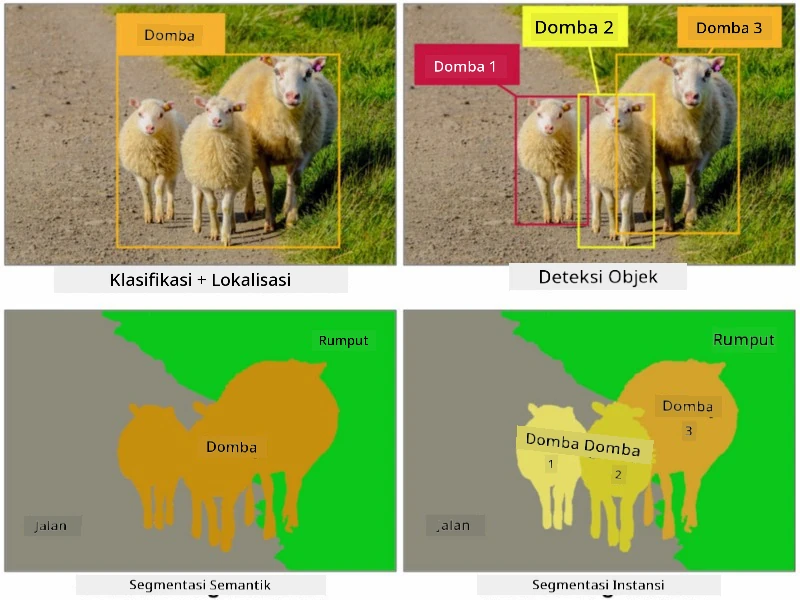
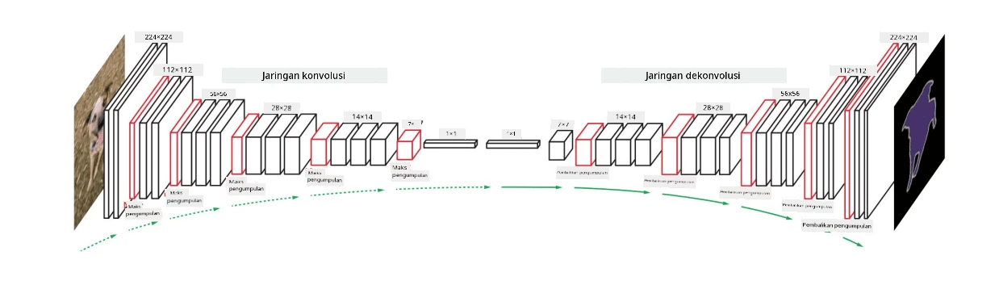
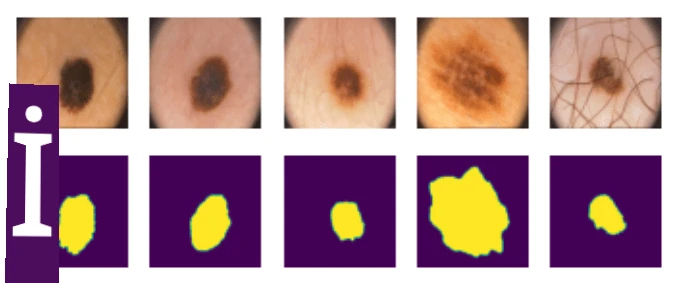

# Segmentasi

Kita sebelumnya telah mempelajari tentang Deteksi Objek, yang memungkinkan kita untuk menemukan objek dalam gambar dengan memprediksi *bounding boxes*-nya. Namun, untuk beberapa tugas, kita tidak hanya membutuhkan bounding boxes, tetapi juga pelokalan objek yang lebih presisi. Tugas ini disebut **segmentasi**.

## [Kuis sebelum pelajaran](https://ff-quizzes.netlify.app/en/ai/quiz/23)

Segmentasi dapat dilihat sebagai **klasifikasi piksel**, di mana untuk **setiap** piksel dalam gambar kita harus memprediksi kelasnya (*background* menjadi salah satu kelas). Ada dua algoritma segmentasi utama:

* **Segmentasi semantik** hanya menentukan kelas piksel, tanpa membedakan antara objek yang berbeda dalam kelas yang sama.
* **Segmentasi instance** membagi kelas menjadi berbagai instance.

Dalam segmentasi instance, domba-domba ini adalah objek yang berbeda, tetapi dalam segmentasi semantik semua domba direpresentasikan sebagai satu kelas.

> Gambar dari [blog ini](https://nirmalamurali.medium.com/image-classification-vs-semantic-segmentation-vs-instance-segmentation-625c33a08d50)

Ada berbagai arsitektur neural untuk segmentasi, tetapi semuanya memiliki struktur yang sama. Dalam beberapa hal, ini mirip dengan autoencoder yang telah Anda pelajari sebelumnya, tetapi alih-alih mendekonstruksi gambar asli, tujuan kita adalah mendekonstruksi **mask**. Jadi, jaringan segmentasi memiliki bagian-bagian berikut:

* **Encoder** mengekstrak fitur dari gambar input.
* **Decoder** mengubah fitur tersebut menjadi **gambar mask**, dengan ukuran dan jumlah saluran yang sesuai dengan jumlah kelas.

> Gambar dari [publikasi ini](https://arxiv.org/pdf/2001.05566.pdf)

Kita harus secara khusus menyebutkan fungsi loss yang digunakan untuk segmentasi. Saat menggunakan autoencoder klasik, kita perlu mengukur kesamaan antara dua gambar, dan kita dapat menggunakan mean square error (MSE) untuk melakukannya. Dalam segmentasi, setiap piksel dalam gambar mask target mewakili nomor kelas (one-hot-encoded di sepanjang dimensi ketiga), sehingga kita perlu menggunakan fungsi loss khusus untuk klasifikasi - cross-entropy loss, yang dirata-rata di semua piksel. Jika mask bersifat biner - **binary cross-entropy loss** (BCE) digunakan.

> ✅ One-hot encoding adalah cara untuk mengkodekan label kelas ke dalam vektor dengan panjang yang sama dengan jumlah kelas. Lihat [artikel ini](https://datagy.io/sklearn-one-hot-encode/) untuk mempelajari teknik ini.

## Segmentasi untuk Pencitraan Medis

Dalam pelajaran ini, kita akan melihat segmentasi dalam aksi dengan melatih jaringan untuk mengenali nevi manusia (juga dikenal sebagai tahi lalat) pada gambar medis. Kita akan menggunakan <a href="https://www.fc.up.pt/addi/ph2%20database.html">Database PH2</a> dari gambar dermoskopi sebagai sumber gambar. Dataset ini berisi 200 gambar dari tiga kelas: nevus tipikal, nevus atipikal, dan melanoma. Semua gambar juga memiliki **mask** yang sesuai yang menguraikan nevus.

> ✅ Teknik ini sangat cocok untuk jenis pencitraan medis ini, tetapi aplikasi dunia nyata apa lagi yang dapat Anda bayangkan?

> Gambar dari Database PH2

Kita akan melatih model untuk melakukan segmentasi nevus dari latar belakangnya.

## ✍️ Latihan: Segmentasi Semantik

Buka notebook di bawah ini untuk mempelajari lebih lanjut tentang berbagai arsitektur segmentasi semantik, berlatih menggunakannya, dan melihatnya dalam aksi.

* [Segmentasi Semantik Pytorch](SemanticSegmentationPytorch.ipynb)
* [Segmentasi Semantik TensorFlow](SemanticSegmentationTF.ipynb)

## [Kuis setelah pelajaran](https://ff-quizzes.netlify.app/en/ai/quiz/24)

## Kesimpulan

Segmentasi adalah teknik yang sangat kuat untuk klasifikasi gambar, melampaui bounding boxes hingga klasifikasi tingkat piksel. Ini adalah teknik yang digunakan dalam pencitraan medis, di antara aplikasi lainnya.

## 🚀 Tantangan

Segmentasi tubuh hanyalah salah satu tugas umum yang dapat kita lakukan dengan gambar manusia. Tugas penting lainnya termasuk **deteksi kerangka** dan **deteksi pose**. Coba gunakan pustaka [OpenPose](https://github.com/CMU-Perceptual-Computing-Lab/openpose) untuk melihat bagaimana deteksi pose dapat digunakan.

## Tinjauan & Studi Mandiri

Artikel [Wikipedia ini](https://wikipedia.org/wiki/Image_segmentation) menawarkan gambaran yang baik tentang berbagai aplikasi teknik ini. Pelajari lebih lanjut secara mandiri tentang subdomain Segmentasi Instance dan Segmentasi Panoptik dalam bidang ini.

## [Tugas](lab/README.md)

Dalam lab ini, coba **segmentasi tubuh manusia** menggunakan [Segmentation Full Body MADS Dataset](https://www.kaggle.com/datasets/tapakah68/segmentation-full-body-mads-dataset) dari Kaggle.

---

