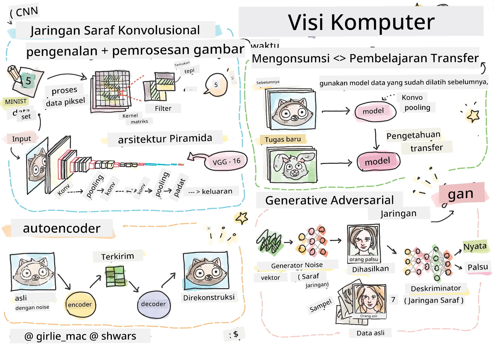

# Penglihatan Komputer

Di bagian ini kita akan mempelajari tentang:

* [Pengantar Penglihatan Komputer dan OpenCV](06-IntroCV/README.md)
* [Jaringan Saraf Konvolusi](07-ConvNets/README.md)
* [Jaringan yang Sudah Dilatih dan Transfer Learning](08-TransferLearning/README.md) 
* [Autoencoder](09-Autoencoders/README.md)
* [Jaringan Adversarial Generatif](10-GANs/README.md)
* [Deteksi Objek](11-ObjectDetection/README.md)
* [Segmentasi Semantik](12-Segmentation/README.md)

---

**Penafian**:  
Dokumen ini telah diterjemahkan menggunakan layanan penerjemahan AI [Co-op Translator](https://github.com/Azure/co-op-translator). Meskipun kami berupaya untuk memberikan hasil yang akurat, harap diperhatikan bahwa terjemahan otomatis mungkin mengandung kesalahan atau ketidakakuratan. Dokumen asli dalam bahasa aslinya harus dianggap sebagai sumber yang otoritatif. Untuk informasi yang bersifat kritis, disarankan menggunakan jasa penerjemahan profesional oleh manusia. Kami tidak bertanggung jawab atas kesalahpahaman atau penafsiran yang keliru yang timbul dari penggunaan terjemahan ini.