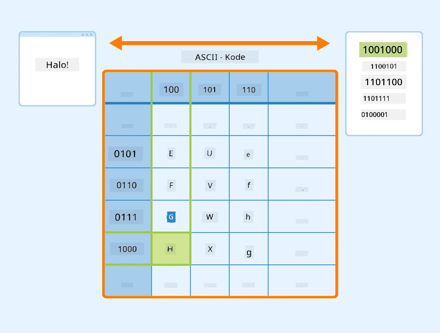

# Representasi Teks sebagai Tensor

## [Kuis Pra-Kuliah](https://ff-quizzes.netlify.app/en/ai/quiz/25)

## Klasifikasi Teks

Sepanjang bagian pertama dari sesi ini, kita akan fokus pada tugas **klasifikasi teks**. Kita akan menggunakan Dataset [AG News](https://www.kaggle.com/amananandrai/ag-news-classification-dataset), yang berisi artikel berita seperti berikut:

* Kategori: Sci/Tech
* Judul: Ky. Company Wins Grant to Study Peptides (AP)
* Isi: AP - Sebuah perusahaan yang didirikan oleh peneliti kimia di Universitas Louisville memenangkan hibah untuk mengembangkan...

Tujuan kita adalah mengklasifikasikan berita tersebut ke dalam salah satu kategori berdasarkan teksnya.

## Representasi Teks

Jika kita ingin menyelesaikan tugas Pemrosesan Bahasa Alami (NLP) dengan jaringan saraf, kita memerlukan cara untuk merepresentasikan teks sebagai tensor. Komputer sudah merepresentasikan karakter teks sebagai angka yang dipetakan ke font di layar Anda menggunakan encoding seperti ASCII atau UTF-8.

> [Sumber gambar](https://www.seobility.net/en/wiki/ASCII)

Sebagai manusia, kita memahami apa yang setiap huruf **wakili**, dan bagaimana semua karakter bergabung membentuk kata-kata dalam sebuah kalimat. Namun, komputer sendiri tidak memiliki pemahaman seperti itu, dan jaringan saraf harus mempelajari maknanya selama pelatihan.

Oleh karena itu, kita dapat menggunakan pendekatan yang berbeda saat merepresentasikan teks:

* **Representasi tingkat karakter**, di mana kita merepresentasikan teks dengan memperlakukan setiap karakter sebagai angka. Mengingat kita memiliki *C* karakter berbeda dalam korpus teks kita, kata *Hello* akan direpresentasikan oleh tensor 5x*C*. Setiap huruf akan sesuai dengan kolom tensor dalam one-hot encoding.
* **Representasi tingkat kata**, di mana kita membuat **kosakata** dari semua kata dalam teks kita, dan kemudian merepresentasikan kata-kata menggunakan one-hot encoding. Pendekatan ini agak lebih baik, karena setiap huruf sendiri tidak memiliki banyak makna, sehingga dengan menggunakan konsep semantik tingkat tinggi - kata-kata - kita menyederhanakan tugas untuk jaringan saraf. Namun, mengingat ukuran kamus yang besar, kita perlu menangani tensor jarang berdimensi tinggi.

Terlepas dari representasinya, kita pertama-tama perlu mengubah teks menjadi urutan **token**, satu token bisa berupa karakter, kata, atau kadang-kadang bahkan bagian dari kata. Kemudian, kita mengubah token menjadi angka, biasanya menggunakan **kosakata**, dan angka ini dapat dimasukkan ke dalam jaringan saraf menggunakan one-hot encoding.

## N-Gram

Dalam bahasa alami, makna pasti dari kata-kata hanya dapat ditentukan dalam konteks. Misalnya, makna *jaringan saraf* dan *jaringan memancing* sangat berbeda. Salah satu cara untuk mempertimbangkan hal ini adalah dengan membangun model kita berdasarkan pasangan kata, dan menganggap pasangan kata sebagai token kosakata terpisah. Dengan cara ini, kalimat *Saya suka pergi memancing* akan direpresentasikan oleh urutan token berikut: *Saya suka*, *suka pergi*, *pergi memancing*. Masalah dengan pendekatan ini adalah ukuran kamus tumbuh secara signifikan, dan kombinasi seperti *pergi memancing* dan *pergi berbelanja* diwakili oleh token yang berbeda, yang tidak berbagi kesamaan semantik meskipun menggunakan kata kerja yang sama.

Dalam beberapa kasus, kita mungkin mempertimbangkan menggunakan tri-gram -- kombinasi tiga kata -- juga. Oleh karena itu, pendekatan ini sering disebut **n-gram**. Selain itu, masuk akal untuk menggunakan n-gram dengan representasi tingkat karakter, di mana n-gram akan kurang lebih sesuai dengan berbagai suku kata.

## Bag-of-Words dan TF/IDF

Saat menyelesaikan tugas seperti klasifikasi teks, kita perlu dapat merepresentasikan teks dengan satu vektor berukuran tetap, yang akan kita gunakan sebagai input untuk pengklasifikasi padat akhir. Salah satu cara termudah untuk melakukannya adalah dengan menggabungkan semua representasi kata individu, misalnya dengan menambahkannya. Jika kita menambahkan one-hot encoding dari setiap kata, kita akan mendapatkan vektor frekuensi, yang menunjukkan berapa kali setiap kata muncul dalam teks. Representasi teks semacam ini disebut **bag of words** (BoW).

> Gambar oleh penulis

BoW pada dasarnya merepresentasikan kata-kata apa yang muncul dalam teks dan dalam jumlah berapa, yang memang bisa menjadi indikasi yang baik tentang apa teks tersebut. Misalnya, artikel berita tentang politik kemungkinan mengandung kata-kata seperti *presiden* dan *negara*, sementara publikasi ilmiah mungkin memiliki sesuatu seperti *collider*, *ditemukan*, dll. Oleh karena itu, frekuensi kata dalam banyak kasus dapat menjadi indikator yang baik tentang isi teks.

Masalah dengan BoW adalah bahwa kata-kata umum tertentu, seperti *dan*, *adalah*, dll. muncul di sebagian besar teks, dan memiliki frekuensi tertinggi, sehingga menutupi kata-kata yang benar-benar penting. Kita dapat menurunkan pentingnya kata-kata tersebut dengan mempertimbangkan frekuensi kemunculan kata-kata dalam seluruh koleksi dokumen. Ini adalah ide utama di balik pendekatan TF/IDF, yang dibahas lebih rinci dalam notebook yang dilampirkan pada pelajaran ini.

Namun, tidak ada pendekatan tersebut yang dapat sepenuhnya mempertimbangkan **semantik** teks. Kita memerlukan model jaringan saraf yang lebih kuat untuk melakukan ini, yang akan kita bahas nanti dalam sesi ini.

## ✍️ Latihan: Representasi Teks

Lanjutkan pembelajaran Anda di notebook berikut:

* [Representasi Teks dengan PyTorch](TextRepresentationPyTorch.ipynb)
* [Representasi Teks dengan TensorFlow](TextRepresentationTF.ipynb)

## Kesimpulan

Sejauh ini, kita telah mempelajari teknik-teknik yang dapat menambahkan bobot frekuensi pada berbagai kata. Namun, teknik-teknik tersebut tidak mampu merepresentasikan makna atau urutan. Seperti yang dikatakan oleh ahli linguistik terkenal J. R. Firth pada tahun 1935, "Makna lengkap dari sebuah kata selalu bersifat kontekstual, dan tidak ada studi tentang makna yang terpisah dari konteks yang dapat dianggap serius." Kita akan belajar nanti dalam kursus ini bagaimana menangkap informasi kontekstual dari teks menggunakan pemodelan bahasa.

## 🚀 Tantangan

Coba beberapa latihan lain menggunakan bag-of-words dan model data yang berbeda. Anda mungkin terinspirasi oleh [kompetisi ini di Kaggle](https://www.kaggle.com/competitions/word2vec-nlp-tutorial/overview/part-1-for-beginners-bag-of-words)

## [Kuis Pasca-Kuliah](https://ff-quizzes.netlify.app/en/ai/quiz/26)

## Tinjauan & Studi Mandiri

Latih keterampilan Anda dengan teknik embedding teks dan bag-of-words di [Microsoft Learn](https://docs.microsoft.com/learn/modules/intro-natural-language-processing-pytorch/?WT.mc_id=academic-77998-cacaste)

## [Tugas: Notebook](assignment.md)

---

