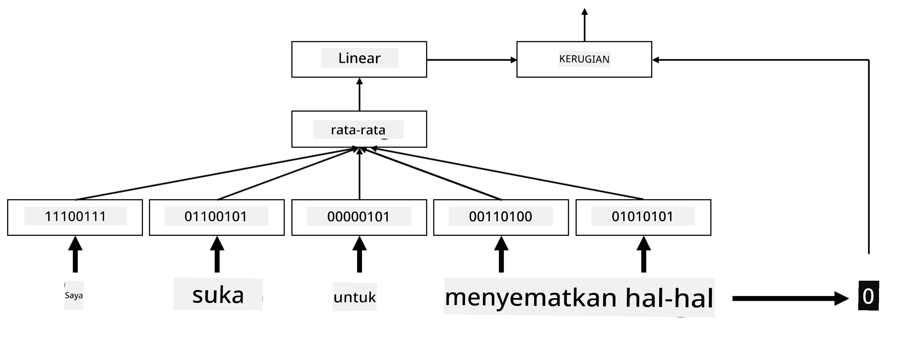

# Embeddings

## [Pre-lecture quiz](https://ff-quizzes.netlify.app/en/ai/quiz/27)

Saat melatih classifier berdasarkan BoW atau TF/IDF, kita bekerja dengan vektor bag-of-words berdimensi tinggi dengan panjang `vocab_size`, dan secara eksplisit mengonversi dari vektor representasi posisi berdimensi rendah ke representasi one-hot yang jarang. Namun, representasi one-hot ini tidak efisien dalam penggunaan memori. Selain itu, setiap kata diperlakukan secara independen satu sama lain, yaitu vektor one-hot encoded tidak menunjukkan kesamaan semantik antara kata-kata.

Ide dari **embedding** adalah untuk merepresentasikan kata-kata dengan vektor berdimensi rendah yang padat, yang mencerminkan makna semantik dari sebuah kata. Kita akan membahas lebih lanjut bagaimana membangun embedding kata yang bermakna, tetapi untuk saat ini mari kita anggap embedding sebagai cara untuk menurunkan dimensi vektor kata.

Jadi, lapisan embedding akan mengambil sebuah kata sebagai input, dan menghasilkan vektor output dengan ukuran `embedding_size` yang ditentukan. Dalam beberapa hal, ini sangat mirip dengan lapisan `Linear`, tetapi alih-alih mengambil vektor one-hot encoded, lapisan ini dapat mengambil nomor kata sebagai input, memungkinkan kita untuk menghindari pembuatan vektor one-hot encoded yang besar.

Dengan menggunakan lapisan embedding sebagai lapisan pertama dalam jaringan classifier kita, kita dapat beralih dari model bag-of-words ke model **embedding bag**, di mana kita pertama-tama mengonversi setiap kata dalam teks kita ke embedding yang sesuai, dan kemudian menghitung beberapa fungsi agregat dari semua embedding tersebut, seperti `sum`, `average`, atau `max`.  

> Gambar oleh penulis

## ✍️ Latihan: Embeddings

Lanjutkan pembelajaran Anda di notebook berikut:
* [Embeddings dengan PyTorch](EmbeddingsPyTorch.ipynb)
* [Embeddings TensorFlow](EmbeddingsTF.ipynb)

## Semantic Embeddings: Word2Vec

Meskipun lapisan embedding belajar memetakan kata-kata ke representasi vektor, representasi ini belum tentu memiliki makna semantik yang mendalam. Akan lebih baik jika kita dapat belajar representasi vektor di mana kata-kata yang mirip atau sinonim memiliki vektor yang dekat satu sama lain berdasarkan jarak vektor tertentu (misalnya, jarak Euclidean).

Untuk mencapai itu, kita perlu melatih model embedding kita terlebih dahulu pada koleksi teks yang besar dengan cara tertentu. Salah satu cara untuk melatih semantic embeddings disebut [Word2Vec](https://en.wikipedia.org/wiki/Word2vec). Word2Vec didasarkan pada dua arsitektur utama yang digunakan untuk menghasilkan representasi terdistribusi dari kata-kata:

 - **Continuous bag-of-words** (CBoW) — dalam arsitektur ini, kita melatih model untuk memprediksi sebuah kata dari konteks sekitarnya. Diberikan ngram $(W_{-2},W_{-1},W_0,W_1,W_2)$, tujuan model adalah memprediksi $W_0$ dari $(W_{-2},W_{-1},W_1,W_2)$.
 - **Continuous skip-gram** adalah kebalikan dari CBoW. Model menggunakan jendela kata konteks di sekitar untuk memprediksi kata saat ini.

CBoW lebih cepat, sedangkan skip-gram lebih lambat, tetapi lebih baik dalam merepresentasikan kata-kata yang jarang muncul.

> Gambar dari [makalah ini](https://arxiv.org/pdf/1301.3781.pdf)

Embedding Word2Vec yang telah dilatih sebelumnya (serta model serupa lainnya, seperti GloVe) juga dapat digunakan sebagai pengganti lapisan embedding dalam jaringan neural. Namun, kita perlu menangani kosakata, karena kosakata yang digunakan untuk melatih Word2Vec/GloVe kemungkinan berbeda dari kosakata dalam korpus teks kita. Lihat notebook di atas untuk melihat bagaimana masalah ini dapat diselesaikan.

## Contextual Embeddings

Salah satu keterbatasan utama dari representasi embedding yang telah dilatih sebelumnya seperti Word2Vec adalah masalah disambiguasi makna kata. Meskipun embedding yang telah dilatih sebelumnya dapat menangkap sebagian makna kata dalam konteks, semua kemungkinan makna dari sebuah kata dikodekan ke dalam embedding yang sama. Hal ini dapat menyebabkan masalah dalam model lanjutan, karena banyak kata seperti 'play' memiliki makna yang berbeda tergantung pada konteks penggunaannya.

Sebagai contoh, kata 'play' dalam dua kalimat berikut memiliki makna yang sangat berbeda:

- Saya pergi ke sebuah **play** di teater.
- John ingin **play** dengan teman-temannya.

Embedding yang telah dilatih sebelumnya merepresentasikan kedua makna kata 'play' ini dalam embedding yang sama. Untuk mengatasi keterbatasan ini, kita perlu membangun embedding berdasarkan **model bahasa**, yang dilatih pada korpus teks yang besar, dan *memahami* bagaimana kata-kata dapat disusun dalam berbagai konteks. Membahas contextual embeddings berada di luar cakupan tutorial ini, tetapi kita akan kembali ke topik ini saat membahas model bahasa nanti dalam kursus.

## Kesimpulan

Dalam pelajaran ini, Anda mempelajari cara membangun dan menggunakan lapisan embedding di TensorFlow dan Pytorch untuk lebih mencerminkan makna semantik dari kata-kata.

## 🚀 Tantangan

Word2Vec telah digunakan untuk beberapa aplikasi menarik, termasuk menghasilkan lirik lagu dan puisi. Lihat [artikel ini](https://www.politetype.com/blog/word2vec-color-poems) yang menjelaskan bagaimana penulis menggunakan Word2Vec untuk menghasilkan puisi. Tonton juga [video ini oleh Dan Shiffmann](https://www.youtube.com/watch?v=LSS_bos_TPI&ab_channel=TheCodingTrain) untuk penjelasan berbeda tentang teknik ini. Kemudian coba terapkan teknik ini pada korpus teks Anda sendiri, mungkin yang bersumber dari Kaggle.

## [Post-lecture quiz](https://ff-quizzes.netlify.app/en/ai/quiz/28)

## Review & Self Study

Baca makalah ini tentang Word2Vec: [Efficient Estimation of Word Representations in Vector Space](https://arxiv.org/pdf/1301.3781.pdf)

## [Assignment: Notebooks](assignment.md)

---

