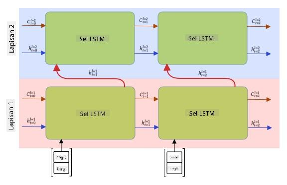

<!--
CO_OP_TRANSLATOR_METADATA:
{
  "original_hash": "58bf4adb210aab53e8f78c8082040e7c",
  "translation_date": "2025-08-29T12:48:00+00:00",
  "source_file": "lessons/5-NLP/16-RNN/README.md",
  "language_code": "id"
}
-->
# Jaringan Syaraf Rekuren

## [Kuis Pra-Kuliah](https://red-field-0a6ddfd03.1.azurestaticapps.net/quiz/116)

Pada bagian sebelumnya, kita telah menggunakan representasi semantik teks yang kaya dan pengklasifikasi linear sederhana di atas embedding. Arsitektur ini menangkap makna agregat dari kata-kata dalam sebuah kalimat, tetapi tidak memperhitungkan **urutan** kata, karena operasi agregasi pada embedding menghilangkan informasi ini dari teks asli. Karena model ini tidak mampu memodelkan urutan kata, mereka tidak dapat menyelesaikan tugas yang lebih kompleks atau ambigu seperti pembuatan teks atau menjawab pertanyaan.

Untuk menangkap makna dari urutan teks, kita perlu menggunakan arsitektur jaringan syaraf lain yang disebut **jaringan syaraf rekuren**, atau RNN. Dalam RNN, kita melewatkan kalimat kita melalui jaringan satu simbol pada satu waktu, dan jaringan menghasilkan beberapa **state**, yang kemudian kita lewati kembali ke jaringan bersama simbol berikutnya.

> Gambar oleh penulis

Diberikan urutan input token X0,...,Xn, RNN menciptakan urutan blok jaringan syaraf, dan melatih urutan ini secara end-to-end menggunakan backpropagation. Setiap blok jaringan menerima pasangan (Xi,Si) sebagai input, dan menghasilkan Si+1 sebagai hasil. State akhir Sn atau (output Yn) masuk ke pengklasifikasi linear untuk menghasilkan hasil. Semua blok jaringan berbagi bobot yang sama, dan dilatih secara end-to-end menggunakan satu proses backpropagation.

Karena vektor state S0,...,Sn dilewatkan melalui jaringan, jaringan ini mampu mempelajari ketergantungan berurutan antara kata-kata. Sebagai contoh, ketika kata *tidak* muncul di suatu tempat dalam urutan, jaringan dapat belajar untuk meniadakan elemen tertentu dalam vektor state, menghasilkan negasi.

> ✅ Karena bobot semua blok RNN pada gambar di atas dibagi, gambar yang sama dapat direpresentasikan sebagai satu blok (di sebelah kanan) dengan loop umpan balik rekuren, yang melewatkan state output jaringan kembali ke input.

## Anatomi Sel RNN

Mari kita lihat bagaimana sebuah sel RNN sederhana diorganisasi. Sel ini menerima state sebelumnya Si-1 dan simbol saat ini Xi sebagai input, dan harus menghasilkan state output Si (dan, terkadang, kita juga tertarik pada output lain Yi, seperti pada jaringan generatif).

Sebuah sel RNN sederhana memiliki dua matriks bobot di dalamnya: satu untuk mentransformasi simbol input (kita sebut W), dan satu lagi untuk mentransformasi state input (H). Dalam kasus ini, output jaringan dihitung sebagai σ(W×Xi+H×Si-1+b), di mana σ adalah fungsi aktivasi dan b adalah bias tambahan.

> Gambar oleh penulis

Dalam banyak kasus, token input dilewatkan melalui lapisan embedding sebelum masuk ke RNN untuk menurunkan dimensi. Dalam kasus ini, jika dimensi vektor input adalah *emb_size*, dan vektor state adalah *hid_size* - ukuran W adalah *emb_size*×*hid_size*, dan ukuran H adalah *hid_size*×*hid_size*.

## Long Short Term Memory (LSTM)

Salah satu masalah utama dari RNN klasik adalah masalah yang disebut **vanishing gradients**. Karena RNN dilatih secara end-to-end dalam satu proses backpropagation, jaringan ini kesulitan untuk menyebarkan error ke lapisan pertama jaringan, sehingga jaringan tidak dapat mempelajari hubungan antara token yang berjauhan. Salah satu cara untuk menghindari masalah ini adalah dengan memperkenalkan **manajemen state eksplisit** menggunakan apa yang disebut **gates**. Ada dua arsitektur terkenal dari jenis ini: **Long Short Term Memory** (LSTM) dan **Gated Relay Unit** (GRU).

> Sumber gambar TBD

Jaringan LSTM diorganisasi dengan cara yang mirip dengan RNN, tetapi ada dua state yang diteruskan dari lapisan ke lapisan: state aktual C, dan vektor tersembunyi H. Pada setiap unit, vektor tersembunyi Hi digabungkan dengan input Xi, dan mereka mengontrol apa yang terjadi pada state C melalui **gates**. Setiap gate adalah jaringan syaraf dengan aktivasi sigmoid (output dalam rentang [0,1]), yang dapat dianggap sebagai masker bitwise ketika dikalikan dengan vektor state. Berikut adalah gates yang ada (dari kiri ke kanan pada gambar di atas):

* **Forget gate** mengambil vektor tersembunyi dan menentukan komponen mana dari vektor C yang perlu dilupakan, dan mana yang diteruskan.
* **Input gate** mengambil beberapa informasi dari input dan vektor tersembunyi dan memasukkannya ke dalam state.
* **Output gate** mentransformasi state melalui lapisan linear dengan aktivasi *tanh*, lalu memilih beberapa komponennya menggunakan vektor tersembunyi Hi untuk menghasilkan state baru Ci+1.

Komponen dari state C dapat dianggap sebagai beberapa flag yang dapat dihidupkan dan dimatikan. Sebagai contoh, ketika kita menemukan nama *Alice* dalam urutan, kita mungkin ingin mengasumsikan bahwa itu merujuk pada karakter perempuan, dan menaikkan flag dalam state bahwa kita memiliki kata benda perempuan dalam kalimat. Ketika kita kemudian menemukan frasa *dan Tom*, kita akan menaikkan flag bahwa kita memiliki kata benda jamak. Dengan demikian, dengan memanipulasi state, kita dapat melacak sifat gramatikal dari bagian-bagian kalimat.

> ✅ Sumber yang sangat baik untuk memahami internal LSTM adalah artikel hebat ini [Understanding LSTM Networks](https://colah.github.io/posts/2015-08-Understanding-LSTMs/) oleh Christopher Olah.

## RNN Bidirectional dan Multilayer

Kita telah membahas jaringan rekuren yang beroperasi dalam satu arah, dari awal urutan hingga akhir. Ini terlihat alami, karena menyerupai cara kita membaca dan mendengarkan ucapan. Namun, karena dalam banyak kasus praktis kita memiliki akses acak ke urutan input, masuk akal untuk menjalankan komputasi rekuren dalam kedua arah. Jaringan semacam ini disebut **bidirectional** RNN. Ketika berurusan dengan jaringan bidirectional, kita memerlukan dua vektor state tersembunyi, satu untuk setiap arah.

Jaringan rekuren, baik satu arah maupun dua arah, menangkap pola tertentu dalam urutan, dan dapat menyimpannya ke dalam vektor state atau meneruskannya ke output. Seperti pada jaringan konvolusi, kita dapat membangun lapisan rekuren lain di atas yang pertama untuk menangkap pola tingkat lebih tinggi dan membangun dari pola tingkat rendah yang diekstraksi oleh lapisan pertama. Ini membawa kita pada konsep **multi-layer RNN** yang terdiri dari dua atau lebih jaringan rekuren, di mana output dari lapisan sebelumnya diteruskan ke lapisan berikutnya sebagai input.

*Gambar dari [postingan luar biasa ini](https://towardsdatascience.com/from-a-lstm-cell-to-a-multilayer-lstm-network-with-pytorch-2899eb5696f3) oleh Fernando López*

## ✍️ Latihan: Embedding

Lanjutkan pembelajaran Anda di notebook berikut:

* [RNNs dengan PyTorch](RNNPyTorch.ipynb)
* [RNNs dengan TensorFlow](RNNTF.ipynb)

## Kesimpulan

Dalam unit ini, kita telah melihat bahwa RNN dapat digunakan untuk klasifikasi urutan, tetapi sebenarnya, mereka dapat menangani banyak tugas lainnya, seperti pembuatan teks, terjemahan mesin, dan lainnya. Kita akan membahas tugas-tugas tersebut di unit berikutnya.

## 🚀 Tantangan

Baca beberapa literatur tentang LSTM dan pertimbangkan aplikasinya:

- [Grid Long Short-Term Memory](https://arxiv.org/pdf/1507.01526v1.pdf)
- [Show, Attend and Tell: Neural Image Caption
Generation with Visual Attention](https://arxiv.org/pdf/1502.03044v2.pdf)

## [Kuis Pasca-Kuliah](https://red-field-0a6ddfd03.1.azurestaticapps.net/quiz/216)

## Tinjauan & Studi Mandiri

- [Understanding LSTM Networks](https://colah.github.io/posts/2015-08-Understanding-LSTMs/) oleh Christopher Olah.

## [Tugas: Notebook](assignment.md)

---

**Penafian**:  
Dokumen ini telah diterjemahkan menggunakan layanan penerjemahan AI [Co-op Translator](https://github.com/Azure/co-op-translator). Meskipun kami berusaha untuk memberikan hasil yang akurat, harap diperhatikan bahwa terjemahan otomatis mungkin mengandung kesalahan atau ketidakakuratan. Dokumen asli dalam bahasa aslinya harus dianggap sebagai sumber yang otoritatif. Untuk informasi yang bersifat kritis, disarankan menggunakan jasa penerjemahan profesional oleh manusia. Kami tidak bertanggung jawab atas kesalahpahaman atau penafsiran yang keliru yang timbul dari penggunaan terjemahan ini.