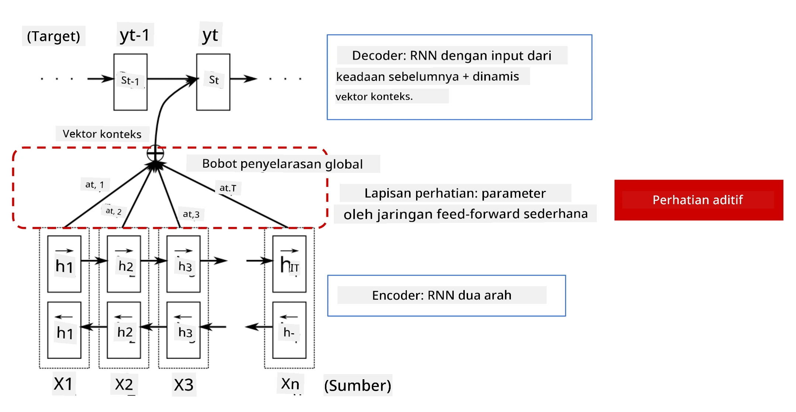
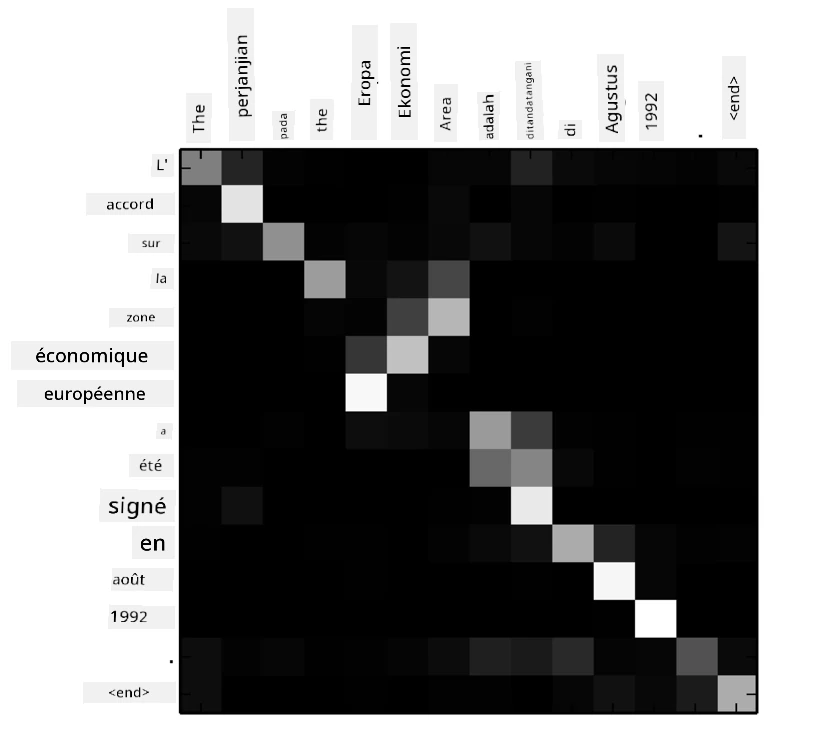
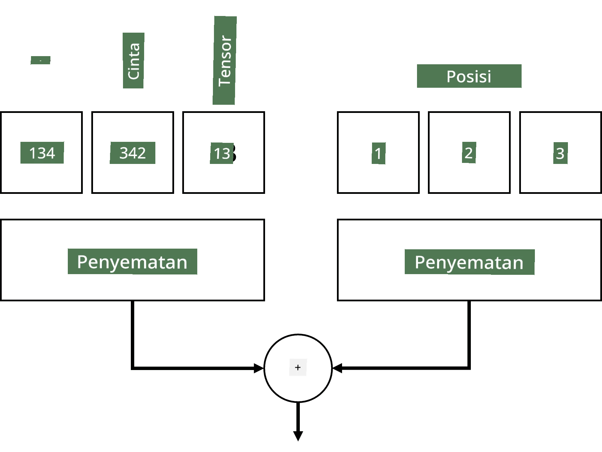
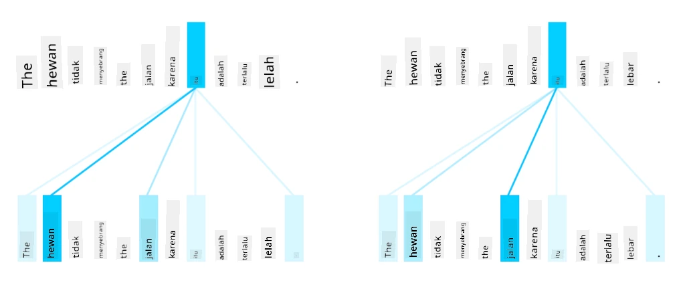
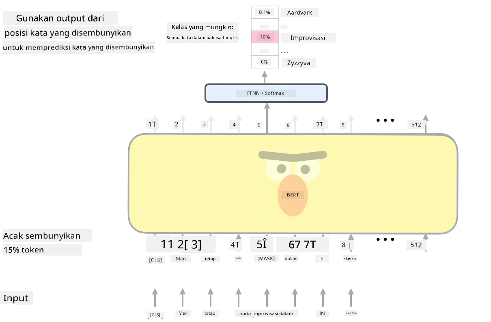

# Mekanisme Perhatian dan Transformer

## [Kuis sebelum pelajaran](https://ff-quizzes.netlify.app/en/ai/quiz/35)

Salah satu masalah paling penting dalam domain NLP adalah **penerjemahan mesin**, sebuah tugas esensial yang mendasari alat seperti Google Translate. Dalam bagian ini, kita akan fokus pada penerjemahan mesin, atau lebih umum lagi, pada tugas *sequence-to-sequence* (yang juga disebut **transduksi kalimat**).

Dengan RNN, sequence-to-sequence diimplementasikan oleh dua jaringan berulang, di mana satu jaringan, yaitu **encoder**, merangkum urutan input ke dalam keadaan tersembunyi, sementara jaringan lainnya, yaitu **decoder**, menguraikan keadaan tersembunyi ini menjadi hasil terjemahan. Ada beberapa masalah dengan pendekatan ini:

* Keadaan akhir dari jaringan encoder sulit mengingat awal kalimat, sehingga menyebabkan kualitas model yang buruk untuk kalimat panjang.
* Semua kata dalam urutan memiliki dampak yang sama pada hasil. Namun, dalam kenyataannya, kata-kata tertentu dalam urutan input sering kali memiliki dampak lebih besar pada output berurutan dibandingkan yang lain.

**Mekanisme Perhatian** memberikan cara untuk memberi bobot pada dampak kontekstual dari setiap vektor input terhadap setiap prediksi output dari RNN. Cara ini diimplementasikan dengan membuat jalur pintas antara keadaan menengah dari RNN input dan RNN output. Dengan cara ini, saat menghasilkan simbol output yt, kita akan mempertimbangkan semua keadaan tersembunyi input hi, dengan koefisien bobot yang berbeda &alpha;t,i.

> Model encoder-decoder dengan mekanisme perhatian aditif dalam [Bahdanau et al., 2015](https://arxiv.org/pdf/1409.0473.pdf), dikutip dari [blog ini](https://lilianweng.github.io/lil-log/2018/06/24/attention-attention.html)

Matriks perhatian {&alpha;i,j} akan mewakili tingkat di mana kata-kata tertentu dalam input berperan dalam menghasilkan kata tertentu dalam urutan output. Di bawah ini adalah contoh matriks semacam itu:

> Gambar dari [Bahdanau et al., 2015](https://arxiv.org/pdf/1409.0473.pdf) (Fig.3)

Mekanisme perhatian bertanggung jawab atas sebagian besar pencapaian terkini atau mendekati terkini dalam NLP. Namun, menambahkan perhatian secara signifikan meningkatkan jumlah parameter model yang menyebabkan masalah skalabilitas dengan RNN. Kendala utama dalam penskalaan RNN adalah sifat berulang dari model yang membuatnya sulit untuk melakukan pelatihan secara batch dan paralel. Dalam RNN, setiap elemen dari urutan harus diproses secara berurutan, yang berarti tidak dapat dengan mudah diparalelkan.

> Gambar dari [Blog Google](https://research.googleblog.com/2016/09/a-neural-network-for-machine.html)

Adopsi mekanisme perhatian yang dikombinasikan dengan kendala ini menghasilkan penciptaan Model Transformer yang kini menjadi State of the Art, seperti BERT hingga Open-GPT3.

## Model Transformer

Salah satu ide utama di balik transformer adalah menghindari sifat berurutan dari RNN dan menciptakan model yang dapat diparalelkan selama pelatihan. Hal ini dicapai dengan menerapkan dua ide:

* encoding posisi
* menggunakan mekanisme perhatian diri untuk menangkap pola alih-alih RNN (atau CNN) (itulah sebabnya makalah yang memperkenalkan transformer berjudul *[Attention is all you need](https://arxiv.org/abs/1706.03762)*)

### Encoding/Embedding Posisi

Ide dari encoding posisi adalah sebagai berikut. 
1. Saat menggunakan RNN, posisi relatif token direpresentasikan oleh jumlah langkah, sehingga tidak perlu direpresentasikan secara eksplisit. 
2. Namun, setelah kita beralih ke perhatian, kita perlu mengetahui posisi relatif token dalam urutan. 
3. Untuk mendapatkan encoding posisi, kita menambahkan urutan token dengan urutan posisi token dalam urutan (misalnya, urutan angka 0,1, ...).
4. Kemudian kita mencampurkan posisi token dengan vektor embedding token. Untuk mengubah posisi (integer) menjadi vektor, kita dapat menggunakan pendekatan yang berbeda:

* Embedding yang dapat dilatih, mirip dengan embedding token. Ini adalah pendekatan yang kita pertimbangkan di sini. Kita menerapkan lapisan embedding di atas token dan posisinya, menghasilkan vektor embedding dengan dimensi yang sama, yang kemudian kita tambahkan bersama.
* Fungsi encoding posisi tetap, seperti yang diusulkan dalam makalah asli.

> Gambar oleh penulis

Hasil yang kita dapatkan dengan embedding posisi menggabungkan token asli dan posisinya dalam urutan.

### Perhatian Diri Multi-Kepala

Selanjutnya, kita perlu menangkap beberapa pola dalam urutan kita. Untuk melakukan ini, transformer menggunakan mekanisme **perhatian diri**, yang pada dasarnya adalah perhatian yang diterapkan pada urutan yang sama sebagai input dan output. Menerapkan perhatian diri memungkinkan kita mempertimbangkan **konteks** dalam kalimat, dan melihat kata-kata mana yang saling terkait. Misalnya, ini memungkinkan kita melihat kata-kata yang dirujuk oleh coreferensi, seperti *itu*, dan juga mempertimbangkan konteks:

> Gambar dari [Blog Google](https://research.googleblog.com/2017/08/transformer-novel-neural-network.html)

Dalam transformer, kita menggunakan **Perhatian Multi-Kepala** untuk memberikan kekuatan pada jaringan dalam menangkap beberapa jenis ketergantungan yang berbeda, misalnya hubungan kata jangka panjang vs. jangka pendek, coreferensi vs. hal lain, dll.

[Notebook TensorFlow](TransformersTF.ipynb) berisi lebih banyak detail tentang implementasi lapisan transformer.

### Perhatian Encoder-Decoder

Dalam transformer, perhatian digunakan di dua tempat:

* Untuk menangkap pola dalam teks input menggunakan perhatian diri
* Untuk melakukan penerjemahan urutan - ini adalah lapisan perhatian antara encoder dan decoder.

Perhatian encoder-decoder sangat mirip dengan mekanisme perhatian yang digunakan dalam RNN, seperti yang dijelaskan di awal bagian ini. Diagram animasi ini menjelaskan peran perhatian encoder-decoder.

Karena setiap posisi input dipetakan secara independen ke setiap posisi output, transformer dapat diparalelkan lebih baik daripada RNN, yang memungkinkan model bahasa yang jauh lebih besar dan lebih ekspresif. Setiap kepala perhatian dapat digunakan untuk mempelajari hubungan yang berbeda antara kata-kata yang meningkatkan tugas Pemrosesan Bahasa Alami di hilir.

## BERT

**BERT** (Bidirectional Encoder Representations from Transformers) adalah jaringan transformer multi-layer yang sangat besar dengan 12 lapisan untuk *BERT-base*, dan 24 untuk *BERT-large*. Model ini pertama kali dilatih pada korpus teks besar (WikiPedia + buku) menggunakan pelatihan tanpa pengawasan (memprediksi kata yang disembunyikan dalam sebuah kalimat). Selama pelatihan awal, model menyerap tingkat pemahaman bahasa yang signifikan yang kemudian dapat dimanfaatkan dengan dataset lain menggunakan fine tuning. Proses ini disebut **transfer learning**.

> Gambar [sumber](http://jalammar.github.io/illustrated-bert/)

## ✍️ Latihan: Transformer

Lanjutkan pembelajaran Anda dalam notebook berikut:

* [Transformer dalam PyTorch](TransformersPyTorch.ipynb)
* [Transformer dalam TensorFlow](TransformersTF.ipynb)

## Kesimpulan

Dalam pelajaran ini Anda telah mempelajari tentang Transformer dan Mekanisme Perhatian, semua alat penting dalam kotak alat NLP. Ada banyak variasi arsitektur Transformer termasuk BERT, DistilBERT, BigBird, OpenGPT3, dan lainnya yang dapat disesuaikan. Paket [HuggingFace](https://github.com/huggingface/) menyediakan repositori untuk melatih banyak arsitektur ini dengan PyTorch dan TensorFlow.

## 🚀 Tantangan

## [Kuis setelah pelajaran](https://ff-quizzes.netlify.app/en/ai/quiz/36)

## Tinjauan & Studi Mandiri

* [Blog post](https://mchromiak.github.io/articles/2017/Sep/12/Transformer-Attention-is-all-you-need/), menjelaskan makalah klasik [Attention is all you need](https://arxiv.org/abs/1706.03762) tentang transformer.
* [Seri blog post](https://towardsdatascience.com/transformers-explained-visually-part-1-overview-of-functionality-95a6dd460452) tentang transformer, menjelaskan arsitektur secara detail.

## [Tugas](assignment.md)

---

