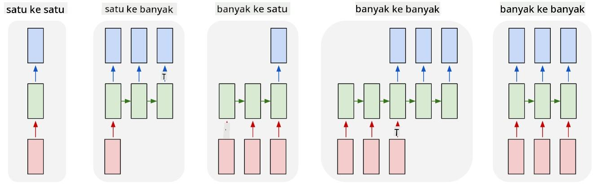

<!--
CO_OP_TRANSLATOR_METADATA:
{
  "original_hash": "bd10f434e444bce61b7f97eeb1ff6a55",
  "translation_date": "2025-08-29T12:46:45+00:00",
  "source_file": "lessons/5-NLP/19-NER/README.md",
  "language_code": "id"
}
-->
# Named Entity Recognition

Hingga saat ini, kita sebagian besar telah berfokus pada satu tugas NLP - klasifikasi. Namun, ada juga tugas-tugas NLP lainnya yang dapat diselesaikan dengan jaringan saraf. Salah satu tugas tersebut adalah **[Named Entity Recognition](https://wikipedia.org/wiki/Named-entity_recognition)** (NER), yang bertujuan mengenali entitas tertentu dalam teks, seperti lokasi, nama orang, rentang waktu, rumus kimia, dan sebagainya.

## [Kuis sebelum kuliah](https://ff-quizzes.netlify.app/en/ai/quiz/37)

## Contoh Penggunaan NER

Misalkan Anda ingin mengembangkan chatbot berbasis bahasa alami, seperti Amazon Alexa atau Google Assistant. Cara kerja chatbot cerdas adalah dengan *memahami* apa yang diinginkan pengguna melalui klasifikasi teks pada kalimat masukan. Hasil dari klasifikasi ini disebut **intent**, yang menentukan apa yang harus dilakukan oleh chatbot.

> Gambar oleh penulis

Namun, pengguna mungkin memberikan beberapa parameter sebagai bagian dari frasa. Misalnya, saat meminta informasi cuaca, pengguna mungkin menyebutkan lokasi atau tanggal. Bot harus mampu memahami entitas tersebut dan mengisi slot parameter dengan benar sebelum melakukan tindakan. Inilah peran NER.

> ✅ Contoh lainnya adalah [menganalisis makalah ilmiah medis](https://soshnikov.com/science/analyzing-medical-papers-with-azure-and-text-analytics-for-health/). Salah satu hal utama yang perlu dicari adalah istilah medis tertentu, seperti penyakit dan zat medis. Meskipun sejumlah kecil penyakit mungkin dapat diekstraksi menggunakan pencarian substring, entitas yang lebih kompleks, seperti senyawa kimia dan nama obat, memerlukan pendekatan yang lebih kompleks.

## NER sebagai Klasifikasi Token

Model NER pada dasarnya adalah **model klasifikasi token**, karena untuk setiap token masukan kita perlu memutuskan apakah token tersebut termasuk dalam suatu entitas atau tidak, dan jika iya - ke kelas entitas mana.

Perhatikan judul makalah berikut:

**Tricuspid valve regurgitation** dan **lithium carbonate** **toxicity** pada bayi baru lahir.

Entitas di sini adalah:

* Tricuspid valve regurgitation adalah penyakit (`DIS`)
* Lithium carbonate adalah zat kimia (`CHEM`)
* Toxicity juga merupakan penyakit (`DIS`)

Perhatikan bahwa satu entitas dapat mencakup beberapa token. Dan, seperti dalam kasus ini, kita perlu membedakan antara dua entitas yang berurutan. Oleh karena itu, biasanya digunakan dua kelas untuk setiap entitas - satu untuk token pertama entitas (sering menggunakan awalan `B-` untuk **b**eginning), dan satu lagi untuk kelanjutan entitas (`I-`, untuk token **i**nner). Kita juga menggunakan `O` sebagai kelas untuk mewakili semua token **o**ther. Penandaan token semacam ini disebut [BIO tagging](https://en.wikipedia.org/wiki/Inside%E2%80%93outside%E2%80%93beginning_(tagging)) (atau IOB). Setelah ditandai, judul kita akan terlihat seperti ini:

Token | Tag
------|-----
Tricuspid | B-DIS
valve | I-DIS
regurgitation | I-DIS
and | O
lithium | B-CHEM
carbonate | I-CHEM
toxicity | B-DIS
in | O
a | O
newborn | O
infant | O
. | O

Karena kita perlu membangun korespondensi satu-ke-satu antara token dan kelas, kita dapat melatih model jaringan saraf **many-to-many** paling kanan dari gambar ini:

> *Gambar dari [blog ini](http://karpathy.github.io/2015/05/21/rnn-effectiveness/) oleh [Andrej Karpathy](http://karpathy.github.io/). Model klasifikasi token NER sesuai dengan arsitektur jaringan paling kanan pada gambar ini.*

## Melatih Model NER

Karena model NER pada dasarnya adalah model klasifikasi token, kita dapat menggunakan RNN yang sudah kita kenal untuk tugas ini. Dalam hal ini, setiap blok jaringan berulang akan mengembalikan ID token. Notebook contoh berikut menunjukkan cara melatih LSTM untuk klasifikasi token.

## ✍️ Notebook Contoh: NER

Lanjutkan pembelajaran Anda di notebook berikut:

* [NER dengan TensorFlow](NER-TF.ipynb)

## Kesimpulan

Model NER adalah **model klasifikasi token**, yang berarti dapat digunakan untuk melakukan klasifikasi token. Ini adalah tugas yang sangat umum dalam NLP, membantu mengenali entitas tertentu dalam teks termasuk lokasi, nama, tanggal, dan lainnya.

## 🚀 Tantangan

Selesaikan tugas yang ditautkan di bawah ini untuk melatih model pengenalan entitas bernama untuk istilah medis, lalu coba pada dataset yang berbeda.

## [Kuis setelah kuliah](https://ff-quizzes.netlify.app/en/ai/quiz/38)

## Tinjauan & Studi Mandiri

Baca blog [The Unreasonable Effectiveness of Recurrent Neural Networks](http://karpathy.github.io/2015/05/21/rnn-effectiveness/) dan ikuti bagian Bacaan Lanjutan dalam artikel tersebut untuk memperdalam pengetahuan Anda.

## [Tugas](lab/README.md)

Dalam tugas untuk pelajaran ini, Anda akan melatih model pengenalan entitas medis. Anda dapat memulai dengan melatih model LSTM seperti yang dijelaskan dalam pelajaran ini, dan melanjutkan dengan menggunakan model transformer BERT. Baca [instruksi](lab/README.md) untuk mendapatkan semua detailnya.

---

**Penafian**:  
Dokumen ini telah diterjemahkan menggunakan layanan penerjemahan AI [Co-op Translator](https://github.com/Azure/co-op-translator). Meskipun kami berusaha untuk memberikan hasil yang akurat, harap diingat bahwa terjemahan otomatis mungkin mengandung kesalahan atau ketidakakuratan. Dokumen asli dalam bahasa aslinya harus dianggap sebagai sumber yang otoritatif. Untuk informasi yang bersifat kritis, disarankan menggunakan jasa penerjemahan profesional oleh manusia. Kami tidak bertanggung jawab atas kesalahpahaman atau penafsiran yang keliru yang timbul dari penggunaan terjemahan ini.